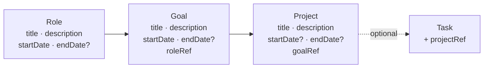

# Compass: roles, goals, and projects

Compass is the strategy layer above tasks. It adds a deliberate ladder — **Role → Goal →
Project → Task** — so you can tell whether the work you are scheduling is the work you
meant to be doing.

This file is the whole manual: the idea, the model, the API, the page, and what is planned
next. Phase 1 has shipped; see [UPCOMING WORK](#upcoming-work) for the rest.

---

## The idea

Before Compass the app had exactly one noun: the task. It answered *"what do I do next?"*
very well and *"is any of this the right thing to do?"* not at all. A week of well-scheduled
tasks could be a week spent entirely on one role while three others quietly starved, and
nothing in the product would tell you.

Two rules keep the ladder from becoming overbearing:

**1. Tasks attach to projects only.** Never to a goal, never to a role. One optional
dropdown on the task modal is the entire daily cost. Everything above is derived by walking
the chain. If you want a task under a bare goal, make a one-line project — they are free.

**2. Nothing is ever required.** A task with no project behaves exactly as tasks always
have. The unaligned count is a place to bulk-assign from, not a nag.

### Status is derived from dates, never stored

There is no `status` field anywhere, so there is nothing to keep in sync:

| | no `endDate` | no `startDate` |
| --- | --- | --- |
| **Role** | Active | — (required) |
| **Goal** | Active | — (required) |
| **Project** | In flight | **Someday** — parked, not started |

Giving a parked project a start date is what "starting" it means. Setting an end date is
what "finishing" it means. That is the whole state machine.

This table describes how the **client** reads the dates. The API stores and returns dates
and nothing else.

---

## The data model



All three schemas live in `models/index.js` alongside the others. Children carry the parent
ref, and parents expose their children through a **virtual** — the same pattern
`UserDetail.virtual('taskList')` already used. That is what makes the nested read one
`populate()` call instead of hand-rolled assembly.

```js
RoleDetail.virtual('goalList',    { ref: 'goalInfo',    localField: '_id', foreignField: 'roleRef' });
GoalDetail.virtual('projectList', { ref: 'projectInfo', localField: '_id', foreignField: 'goalRef' });
```

> **Gotcha.** Both schemas are declared with `{ toJSON: { virtuals: true } }`. Without it the
> populated children exist on the document but vanish when Express serialises the response.
> `UserDetail`'s virtuals are only ever read server-side, so the repo never needed this
> before.

Tasks gained one optional field, and nothing else about them changed:

```js
projectRef: { type: Schema.Types.ObjectId, ref: 'projectInfo', default: null },
```

### Why `userRef` is on all three levels

Every ownership check in this codebase is `findOne({ _id, userRef: user._id })`. Carrying
`userRef` on goals and projects too keeps that pattern intact — one query, no joins, and no
way to accidentally authorise a goal by forgetting to check its role's owner.

### Migration

None was needed. Every new field is optional or lives in a new collection, so existing task
documents read back with `projectRef` undefined and behave exactly as before.

---

## The API

**Design rule: return the records as they are, and nothing more.** The hierarchy is returned
nested, because that is the shape of the data. But there are no derived status flags, no
buckets, no rollups, and no opinions about what "active" or "stalled" or "someday" means.
Those are view concerns and they live in the client, where they can change without a
backend deploy.

Handlers are in `routes/compass.js`; the logic is in `controllers/compassController.js`.
House conventions apply: mounted under `/api`, `authenticateToken`, failures are HTTP 200
with `{ success: false, log }` via `returnFailure()`.

| Method | Endpoint | Notes |
| --- | --- | --- |
| GET | `/api/getCompass` | The **live** hierarchy. The page's main read. |
| GET | `/api/getCompassArchive` | Paged detail about ended items. |
| POST | `/api/createRole` · `/api/editRole` · `/api/deleteRole` | |
| POST | `/api/createGoal` · `/api/editGoal` · `/api/deleteGoal` | |
| POST | `/api/createProject` · `/api/editProject` · `/api/deleteProject` | |
| POST | `/api/setTaskProject` | `{ taskId, projectId }`; a null `projectId` unlinks. |

**Every mutation returns the same payload as `getCompass`**, mirroring how the task
endpoints return the refreshed `taskList`. The UI never has to re-fetch by hand.

### `GET /api/getCompass`

Roles contain their goals, goals contain their projects — each record exactly as stored:

```jsonc
{
  "success": true,
  "roles": [{
    "_id": "...", "title": "Engineer", "description": "...",
    "startDate": "...", "endDate": null, "sortOrder": 0,
    "goalList": [{
      "_id": "...", "title": "Ship v2 by June", "description": "...",
      "startDate": "...", "endDate": "...", "sortOrder": 0, "roleRef": "...",
      "projectList": [{
        "_id": "...", "title": "Migration plan", "description": "...",
        "startDate": "...", "endDate": null, "sortOrder": 0, "goalRef": "..."
      }]
    }]
  }],
  "completedCounts": { "roles": 2, "goals": 3, "projects": 5 },
  "unalignedTaskCount": 14
}
```

One query builds the tree:

```js
RoleDetails.find({ userRef: user._id, ...liveFilter() })
    .sort({ sortOrder: 1, startDate: 1 })
    .populate({
        path: 'goalList',
        match: { userRef: user._id, ...liveFilter() },
        options: { sort },
        populate: { path: 'projectList', match: { ... }, options: { sort } },
    });
```

#### Only live items come back in detail

This endpoint returns a **bounded** payload. A role, goal, or project whose `endDate` has
passed is excluded from the tree and represented only by `completedCounts`; its detail is
paged through via `/api/getCompassArchive`.

That matters because the payload would otherwise grow forever as work is finished, and
**every mutation returns this same payload**, so a user with years of history would pay for
all of it on every create, edit, and delete.

Two consequences worth knowing:

- **Ending a role archives its whole branch.** Its goals and projects come from the archive
  endpoint, not from here. This keeps the rule simple: the tree is reachable-and-live.
- **Parked ("someday") projects are still live.** They have no `startDate` but no `endDate`
  either, so they always come back, and the client decides how to present them.

- **`completedCounts`** — how many roles / goals / projects are finished, where finished
  means `endDate` is set and already past.
- **`unalignedTaskCount`** — incomplete tasks with no `projectRef`.

#### Query parameters

| Param | Effect |
| --- | --- |
| `completedFrom` (ISO date) | Scopes `completedCounts` to items whose `endDate` is on or after this. |
| `completedTo` (ISO date) | Scopes `completedCounts` to items whose `endDate` is on or before this. |

Omit both for all-time totals. *"How many goals did I finish last quarter?"* is
`?completedFrom=2024-01-01&completedTo=2024-03-31`.

These affect **`completedCounts` only**. The live tree is never narrowed by them.
An unparseable date is ignored rather than erroring.

### `GET /api/getCompassArchive`

Detail about finished work, behind pagination, so the live hierarchy stays a fixed size.

| Param | Effect |
| --- | --- |
| `level` | **Required.** `role`, `goal`, or `project`. |
| `limit` | Page size; defaults to 20, capped at 100. |
| `skip` | Offset for paging. |
| `completedFrom` / `completedTo` | Optional window on `endDate`. |

```jsonc
{
  "success": true,
  "level": "goal",
  "items": [ /* records as stored, most recently ended first */ ],
  "totalCount": 37,
  "hasMore": true
}
```

The pagination shape deliberately matches `getCompletedTasks`, so the front end pages
through finished goals the same way it pages through finished tasks.

### What the API deliberately does not do

- No `someday` bucket, no `stalled` flag, no "is active" booleans. Dates go out; meaning is
  assigned by the client. The one thing the server *does* decide is live-versus-ended, and
  only because that is what bounds the payload.
- **No per-project task rollups.** The client already loads `/api/getUserTasks`, which
  carries `projectRef` on every task, so per-project active counts are a `reduce` over data
  the page holds anyway. Weekly Plan gets its previous-week completion detail from the
  separate, bounded `/api/getProjectCompletions` endpoint; do not extend `getCompass`.

### Validation

- `title` is required everywhere. `startDate` is required on roles and goals, optional on
  projects.
- `endDate`, when present, must be on or after `startDate`.
- Dates are strict inclusive civil dates (`YYYY-MM-DD`), not instants. See
  `docs/DATE_AND_TIME.md`; an item remains live through its selected end day.
- `roleRef` / `goalRef` / `projectRef` must exist **and belong to the caller**. This is the
  cross-tenant boundary; `findOwned()` in the controller is the single chokepoint, and it
  has explicit test coverage.
- Child date ranges are **not** forced inside their parent's. Real plans are messy; the UI
  can hint, the API does not police.
- On edit, only fields present in the body are touched, so a partial update cannot silently
  blank a date.

Date parsing uses strict civil-date helpers from `utils/temporal.js`. Compass treats invalid
body fields as fatal and silently ignores invalid optional query filters.

### Delete semantics

Deleting something with children **fails** by default:

```
Role still has goals. End it instead, or delete with cascade.
```

Pass `{ cascade: true }` to delete the subtree. **Cascading never deletes a task** —
affected tasks have `projectRef` set to null and otherwise survive untouched. This is
non-negotiable and is covered by a test.

The page surfaces the refusal in a confirm dialog and only retries with `cascade` if you
agree.

---

## The page

`/compass`, linked from the nav bar between Calendar and Completed Tasks.
`webinterface/src/views/Compass.vue` renders the tree; `components/CompassEditorDrawer.vue`
is a single editor shared by all three levels.

```
Compass                                                                 [ + Role ]
▌ Engineer                          since Jan 2024   ✎        [+ Goal]
    Ship v2 by June                 Jan – Jun 2024   ✎     [+ Project]
        Migration plan              since Feb 2024   ✎        3 active
        Perf pass                   since Apr 2024   ✎        1 active
    Grow the team                   since Mar 2024   ✎     [+ Project]
        Hiring loop                 since Mar 2024   ✎        2 active

▸ Someday · 1 parked projects
▸ Archive · 1 ended roles, 1 ended goals, 1 ended projects
   Unaligned tasks: 30
```

Finished counts live on the Archive drawer rather than the header, so the top of the page
stays about what you are doing now.

All of the interpretation happens in the page:

| Shown as | Rule |
| --- | --- |
| On the board | everything in the payload — the server already excluded ended items |
| **Someday** drawer | project with no `startDate` (client-side) |
| **Archive** drawer | fetched on demand from `/api/getCompassArchive`, one level at a time |
| `N active` | count of incomplete tasks whose `projectRef` matches (client-side) |

The archive drawer only calls the API when you actually open it, and pages 20 at a time, so
a long history costs nothing until you go looking for it.

### Ending a parent is blocked in the UI, not in the API

The API lets you end a role that still has live goals — doing so archives the whole branch
in one call, which is the right primitive and stays available to scripts and future
features. But it is rarely what someone means when they click a button, and the effect is
invisible: the goals simply disappear from the board.

So the drawer disables **End role** while the role has live goals, and **End goal** while
the goal has live projects, with a hint saying what would happen and what to do first. The
"Still active" checkbox is disabled alongside it, since clearing it is the same action by
another route. Projects are leaves, so ending one is always allowed.

This is a client-side guard over data the page already holds — `getCompass` only returns
live items, so anything populated under a role or goal is by definition still active. No
extra request, and **no API change**: `POST /api/editRole` with an `endDate` still archives
a branch for any caller that genuinely wants that.

### On the Calendar page

The shared task editor carries a **Project (optional)** select, grouped by the ladder above
each project. Calendar and Weekly Plan use this same modern editor for both task creation and
editing:

```
Project (optional)     [ ─ none ─                  ▾ ]
  Engineer → Ship v2      ▸ Migration plan
                          ▸ Perf pass
  Father   → Be present   ▸ Weekend adventures
```

`projectRef` is sent on both create and edit. Compass data is loaded alongside tasks and
events, and a failure there is logged but never blocks the calendar.

### On the Weekly Plan page

`/weekly-plan` is the Monday–Sunday creation lens over Compass. It renders the same live
Role → Goal → Project hierarchy with descriptions, groups existing incomplete tasks by
`projectRef` and `dueDate`, and puts a compact normal-task form under every started project.
When a project has matching history, a collapsed **Completed last week** disclosure uses the
bounded `/api/getProjectCompletions` read to show task titles completed during the previous
Monday–Sunday in the user's saved timezone. Clicking any active task opens the full task editor
in place, so its details can be changed, completed, or deleted without leaving the review.

Weekly Plan does not add a planning model or selection field. Creating a task is the planning
action, and the task's existing dates are the record of which week it was intended for. See
[WEEKLY_PLAN.md](WEEKLY_PLAN.md) for the full workflow and date rules.

---

## Working on Compass

**Seeded data.** `seed/dataset.js` builds 3 active roles plus 1 ended one, 6 goals (1 ended,
1 deliberately with no active tasks beneath it), and 8 projects including one parked and one
ended. End dates are spread across quarters so the `completedFrom`/`completedTo` window has
something to slice. `otheruser` owns an `OTHER USER SECRET ROLE` for leak assertions. Handles
are returned under `named` — `data.named.engineerRole`, `data.named.migrationProject`, and so
on. See `docs/SEEDING.md`.

**Tests.** `tests/api/compass.spec.js` covers CRUD, validation, cross-tenant isolation,
cascade behaviour, the completed window, and task alignment. `tests/ui/compass.spec.js`
covers the page and the project picker. `npm test` rebuilds the front end automatically
when it is stale, so the UI specs always run against your changes.

**Adding a field.** Add it to the schema in `models/index.js`, allow it through
`buildFields()` in `controllers/compassController.js`, add it to the drawer, and add a
factory default in `seed/factories.js`. The route layer is generic and usually needs no
change.

**A note on scope.** If you find yourself wanting to add a computed field to `getCompass`,
stop and check whether the client can derive it from what it already has. It usually can,
and keeping this endpoint dumb is what makes the upcoming phases cheap.

---

## UPCOMING WORK

Phase 1 shipped the whole data model and API surface, so the phases below are almost
entirely front-end work against an API that already returns what they need.

Each phase below is written to be turned straight into a task file. When one ships, move its
description up into the body of this document and delete it from here.

### Phase 2 — The Focus lens, and colour on the screens you already use

**Goal.** Turn the plain list into a board, and make the hierarchy visible where the work
actually happens.

**Scope.**
- `Compass.vue`: role cards with colour swatch, goal cards nested inside, project rows with
  a `●N active · next: <task> · <day>` rollup line, derived client-side from
  `/api/getUserTasks`.
- Stalled styling: an active goal whose projects have zero active tasks renders muted with a
  quiet "nothing active" note. Client-side condition, no API change. The seeded goal *"Fix my
  sleep schedule"* exists precisely to render this.
- Collapsed **Someday** / **Unaligned** sections styled as real drawers, and the same for
  the **Archive** drawer (which already pages against `/api/getCompassArchive`).
- `Calendar.vue`: tint sidebar task entries and DayPilot blocks with the owning role's colour
  (walk `projectRef → goalRef → roleRef` client-side, then `buildRoleColorMap()` from
  `utils/roleColors.js`); add a role filter control.
- Soft guardrail hints (>5 active roles, >3 goals per role) — never blocking.
- If completed-per-project counts are wanted on the cards, add a **separate** small endpoint.
  Do not extend `getCompass`.

**Done when.** A week on the calendar is legible by role at a glance, and a stalled goal is
visibly stalled without anyone maintaining a status field.

Target layout:

```
▌ ENGINEER              since Jan 2024      2 goals · 4 projects   ⋯
  ┌ Ship v2 by June ──────────────────────────── ends Jun 30 ─┐
  │   Migration plan      ●3 active   next: Draft plan · Thu   │
  │   Perf pass           ●1 active   next: —                  │
  └────────────────────────────────────────────────────────┘
```

### Phase 3 — Horizon timeline, Balance strip, bulk align

**Goal.** Make the quarterly review possible in one screen, and answer *am I living the
roles I chose?*

**Scope.**
- **Horizon lens**, a second view behind a `[ Focus | Horizon ]` toggle: an SVG/CSS roadmap
  built from the `startDate`/`endDate` pairs already in the payload. Open-ended (active) bars
  fade off the right edge instead of ending — that is the visual grammar for "no end date
  means active". A Someday rail sits alongside; giving a parked project a start date drops it
  onto the timeline. Include a today marker.
- `GET /api/getRoleBalance?from=&to=` — sums `duration` of completed tasks grouped by role
  over a window. One aggregate. This is a genuinely new fact rather than a re-shaping of
  existing data, which is why it earns its own endpoint.
- **Balance strip** on the Focus lens, fed by that endpoint: minutes completed per role over
  the last 7 days.
- **Bulk-align drawer**: list unaligned tasks and assign many at once via
  `/api/setTaskProject`.
- Historical review: use `completedFrom`/`completedTo` on `getCompass` to show "you finished
  N goals and M projects last quarter" next to the Balance strip.

**Done when.** You can open Compass on the last day of a quarter and see what you set out to
do, what you finished, and where the hours actually went.

```
        │ 2024 Q1 │ Q2 │ Q3 │ Q4 │ 2025 Q1 │      ┌ Someday ──┐
ENGINEER│▓▓▓▓▓▓▓▓▓▓▓▓▓▓▓▓▓▓▓▓▓▓▓▓▓▓▓▓▓▓▓▓▓▒▒▒░░→  │ Rewrite   │
  Ship v2         ▓▓▓▓▓▓▓▓▓▓▓▓▓│                   │ the CLI   │
    Migration     ▓▓▓▓▓▓│                          └───────────┘
                                    ↑today
```

### Phase 4 — Scheduling influence (unscheduled; needs its own design pass)

**Goal.** Let the ladder affect what gets scheduled, not just what gets displayed.

The existing Weekly Plan workflow only creates ordinary project-linked tasks and does not
change scheduler behavior. This future phase remains distinct.

**Sketch.** Role time budgets ("at least 4h/week on Health"), goal-weighted task priority,
deprioritising tasks that sit under an ended goal.

**Why it is last.** `controllers/scheduling.js` is the highest-risk code in the repo. This
should only be designed once the hierarchy has proven itself against real data, and it ships
with heavy `tests/api/scheduling.spec.js` coverage.
