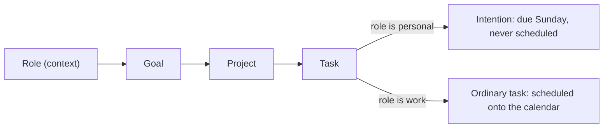

# Intentions

An **intention** is personal work you want to do *this week* without putting it on your
work calendar. "Call Mum", "one evening with no laptop", "run three times". It is an
ordinary task in every respect but one: **the scheduler never gives it a slot.**

It answers one question, once a week: *at the end of this week, did I do that or not?*

---

## The rule, in one line

> A task is an intention when its project ladders up to a role with `context: 'personal'`.

That is the whole definition. There is **no `isIntention` field in the database** and
nothing to tick in the UI. It is derived on every read from the role, so flipping a role
between work and personal immediately and correctly changes what its tasks are, with no
migration, no backfill, and nothing that can drift out of step.



Why derived and not stored: a stored flag is a second copy of a fact the role already
owns. The day someone flips a role to `work`, every task beneath it would still claim to
be an intention and would silently stay unschedulable forever. Deriving makes that class
of bug impossible rather than merely unlikely.

The whole rule lives in **`controllers/intentions.js`** and nowhere else.

### What is *not* an intention

Even under a personal role, these are excluded, because neither can carry "due this
Sunday":

| Excluded | Why |
| --- | --- |
| A **backlog** task | Deliberately undated — that is what backlog means |
| A **repeating** series or occurrence | Its dates come from the recurrence rule |

"Repeating" means a `recurrence.freq` rule **or** a legacy `repeat` string (`daily`,
`weekly`, `monthly`, `yearly`). Both are series in this codebase — see
`controllers/recurrence.js` — so `isRepeating()` checks both, and every place the rule is
expressed must too.

Because nothing is stored, these can never be a *conflict* to reject at write time — they
are simply not intentions. `createTask` and `editTask` therefore never error about this;
they just do not apply the intention treatment.

---

## What it means for the task

| Field | On an intention |
| --- | --- |
| `dueDate` | Forced to the **Sunday** of the week containing `startDate`, in your timezone |
| `duration` | Defaults to **30** minutes; set your own freely |
| `completed` | Unchanged — this is the "did I do it?" answer |
| `scheduledDate` | **Always null.** It is never placed |
| `eventInfo` | **None is ever created.** It cannot occupy a working-hours slot |

The Sunday due date is the trick that makes everything else free. Because the week is
already the unit everywhere in this codebase — `withinWeek`, `mondayWeekBounds`,
`carryTasksForward` — an intention lands in exactly one week with no new machinery.

The Sunday rule is applied **when the task is authored**, by `createTask` and `editTask`.
It is a default, not an invariant: a task whose due date was set some other way still
reads as an intention, it simply sits in whichever week its due date falls in.

### Becoming an intention later

Being an intention is derived, but `scheduledDate` and the task's `eventInfo` rows are
**stored**. So a task that was scheduled as ordinary work and *then* becomes an intention
would keep the slot it was already given — an intention sitting on the real calendar —
until the next full "Schedule Tasks" run happened to clear it.

`clearIntentionPlacements(userId)` in `controllers/intentions.js` closes that gap. It
nulls `scheduledDate` and `slipForecast` and deletes the `task`/`task-chunk` events of
every intention still holding a placement. It sweeps the whole user rather than named
tasks, because re-parenting a goal or flipping a role reclassifies a whole branch at once.

Three write paths call it — these are every way a task can become an intention:

| Path | What changed |
| --- | --- |
| `editTask` (`routes/tasks.js`) | The task moved into a personal project |
| `editItem` (`controllers/compassController.js`) | A role flipped to `personal`, or a goal/project was re-parented under one |
| `setTaskProject` (`controllers/compassController.js`) | Compass assigned the task to a personal project |

The reverse needs nothing: a role flipped back to `work` leaves the task simply unplaced,
and the next schedule run places it like any other.

---

## Where you meet one

### 1. Weekly Plan — creating one

A project under a personal role is an **intention project**, and Weekly Plan's quick-add says
so: the trigger reads *Add an intention*, the Mon–Sun day chips are replaced by a static
`Due Sunday, 11 Oct · never scheduled`, and the button reads *Add intention*. The client sends
no `dueDate` at all for these — `createTask` owns the Sunday — so the form cannot offer a day
the server is about to discard.

An intention in the week is **never selected for the commitment** and is given no selection
checkbox, because `selectCommittableTasks` refuses one. The week's header count, the selected
minutes, and the capacity strip therefore all describe work only. This matters more than it
looks: when the page did sweep intentions into the commit payload, a single personal task made
the *entire week* fail to commit, with an error naming a task the user never chose.

A project card's summary counts them separately (`3 tasks · 2h · 1 intention`) rather than
adding minutes that will never occupy a slot.

### 2. Weekly Plan — this week's band

Appears **only after you have committed the week**, or as soon as the week contains an
intention. Before either, Weekly Plan is about building the work week, and the band's absence
is itself the signal that you are not done planning.

```text
  Committed week · Oct 6 – Oct 12              1 of 3 done · 45m of 1h 35m

    ▸ Beyond work this week              2 of 4 · 50m left
```

It is **collapsed Monday to Thursday** and **expands by itself from Friday**, driven by the
weekday in your saved timezone. That is the entire reminder mechanism: no notification, no
email, no badge, no red. It gets your attention when the week is running out, on a page you
already open, and otherwise stays out of the way.

It also appears **before** the week is committed if there is already an intention in it, so
something you just created is visible where it belongs rather than only as a row in a project
card. With no intentions, its absence still reads as "you are not done planning".

One click on a checkbox is the whole check-in.

The band is shown **regardless of the Work/Personal context filter**. Hiding your personal
life because you are "in work mode" would defeat the purpose of the feature.

### 3. Weekly Plan — last week's review

The last-week panel carries a second band with the same component in `review` mode: what
you kept, what you missed, and a **Carry →** on each miss that moves it to *this* week's
Sunday via the existing `carryTasksForward`.

Missed intentions render in muted grey, never red, and the band never says "failed".

### 4. Calendar — the sidebar, never the grid

**An intention never appears as a block on the calendar grid.** Since the scheduler skips
them, no `eventInfo` exists, so this is true by construction rather than by a rendering
rule that someone could later forget.

They do appear in a **collapsed group at the bottom of the task sidebar**, after the dated
groups and Backlog, scoped to the current week and counted as `N to do`:

```text
  ▸ This week, beyond work                     2 to do
```

Expanded, each row is an ordinary task row with an `INTENTION` badge and the usual two-step
quick-complete button. They deliberately get **no deadline day-count**, **no late/on-track
colouring**, and **no `NEEDS TIME` badge** — there is no schedule for them to be late
against, so all three would be lies.

Counted as "to do" rather than "N of M" on purpose: the Calendar's task list omits
completed work, so a done/total ratio there would always understate what you finished.

---

## Intentions and the weekly commitment

**Intentions are never part of the commitment.** They are excluded from
`selectCommittableTasks`, and committing one explicitly fails with *"X is an intention, not
committed work"*.

This is deliberate. `You kept 4 of 7 promises` is about work. If a missed personal
intention dragged that number down, a good working week would be reported as a bad one
because you did not call your mother. The two get separate verdicts, side by side.

---

## The API

| Endpoint | Purpose |
| --- | --- |
| `GET /api/getIntentions?from=&to=` | Every intention due in a civil date range, **including completed ones** |
| `GET /api/getUserTasks` | Ordinary task list; every task carries a derived `isIntention` |

`getIntentions` exists because the ordinary task list omits completed work, but the band
must show what you ticked — that *is* the answer to "did I do it?". Weekly Plan asks for
two weeks in one call and feeds both bands from the result.

Creating and completing an intention uses `createTask` and `completeTask` exactly like any
other task. There is no intention-specific write path.

---

## Working on this code

Everything derived lives in two files, one per side:

- **`controllers/intentions.js`** — `personalProjectIds`, `isPersonalProject`,
  `taskIsIntention`, `attachIntentionFlags`, `getIntentions`, and
  `intentionExclusionClausesFor`, which takes an already-resolved personal-project id set so
  a caller that also filters in memory walks role -> goal -> project only once.
- **`webinterface/src/utils/intentions.js`** — `isIntention`, `intentionsForWeek`,
  `intentionSummary`, `intentionUrgency`, `intentionHeadline`.

Two things to keep in step if you change the rule:

1. `taskIsIntention` (in memory) and `intentionExclusionClausesFor` (as a Mongo query) are the
   same predicate written twice, and `getIntentions` writes it a third time as its own
   query. Change one, change all three.
2. `intentionExclusionClausesFor` returns **`$and` clauses, not a whole filter**, because the
   scheduler's query already uses `$or`/`$and` and merging by spread would silently clobber
   them.

`simulateBlockedSlots` and the slip forecast both read through `loadSchedulingTasks`, so they
inherit the exclusion for free.

### The scheduler's guard

`loadSchedulingTasks` in `controllers/scheduling.js` resolves the personal-project set **once**
and uses it twice: to build the query clauses that keep the read small, and then to filter
every loaded task through `taskIsIntention` — plainly, *is this an intention? then don't
schedule it*.

The filter is redundant while the two forms agree, and that is deliberate: the query is the
hand-maintained mirror, while the in-memory check is the rule everything else derives from, so
putting the authoritative one last means a drift can only make the read wider, never the
placement wrong.

**What removal from the list does mean.** An intention is simply absent from the scheduler's
task list, and `areDependenciesMet` (`controllers/schedulePlanner.js`) treats an absent
dependency as **met** — so a work task that `dependsOn` an intention schedules immediately
rather than waiting. That is the behaviour you want (an intention is never scheduled, so
blocking on one would block forever) but it is worth knowing it is silent: nothing warns that a
prerequisite was dropped. For the same reason `validateNoCycles` cannot see a cycle that runs
through an intention. Both have been true since intentions were excluded by query; the
in-memory filter does not change them.

### Dates: anchor on civil dates, never stored markers

When `editTask` re-applies the Sunday rule it anchors on the **civil date string**, taking
`dateOnlyFromMarker(existing.startDate)` rather than the stored `Date`. Passing the UTC
marker to `mondayWeekBounds` converts it back into the user's zone, which west of UTC lands
on the previous day — and therefore on the *previous week's* Sunday, before the task's own
start date. There is a spec for this.

### A note on roles with no context

Roles saved before `context` existed have **no stored value**. The schema default makes a
hydrated read say `personal`, but a raw query or `.lean()` read sees `undefined`. So:

- Server: match personal roles with `PERSONAL_ROLE_FILTER` (`{ context: { $ne: 'work' } }`),
  never `{ context: 'personal' }`, and go through `personalProjectIds()` rather than reading a
  role's `context` yourself. `isPersonalProject()` is just a lookup in that set.
- Client: use `roleContextOf()` / `isPersonalRole()` from `utils/roleContext.js`.

When these disagreed, Weekly Plan showed a legacy role as personal and sent no due date,
while `createTask` read it as work and failed with "Due date is required for non-backlog
tasks"; its tasks were also still scheduled. The `no stored context` specs in
`tests/api/intentions.spec.js` and `tests/ui/weeklyPlan-intentions.spec.js` cover this by
`$unset`-ing the field on a seeded role.

The personal default also means a role created without a context makes its tasks
unschedulable. That is the right default for humans but a trap for fixtures: seed roles
whose tasks must schedule need `context: 'work'` set explicitly. The slip-forecast and
other-user fixtures in `seed/dataset.js` do exactly this, with a comment saying why.

### Why not a Mongoose virtual?

The obvious way to express "derived" in this codebase would be a schema `virtual` on
`TaskDetail`. It cannot work: a virtual's getter is synchronous and sees only its own
document, but this rule has to walk `projectRef → goalRef → roleRef` across two other
collections. `attachIntentionFlags` is the asynchronous equivalent, resolving the personal
project set once per request and stamping the field on the way out.

---

## Tests

`tests/api/intentions.spec.js` covers the derivation from every direction, including the
two that matter most:

- **The scheduler never gives an intention a slot** — no `eventInfo`, `scheduledDate` stays
  null, and ordinary work around it still schedules, so the exclusion is not over-broad.
- **Flipping a role to `work` makes its tasks schedulable with no write to the task** —
  this is the no-drift property, asserted rather than assumed.
