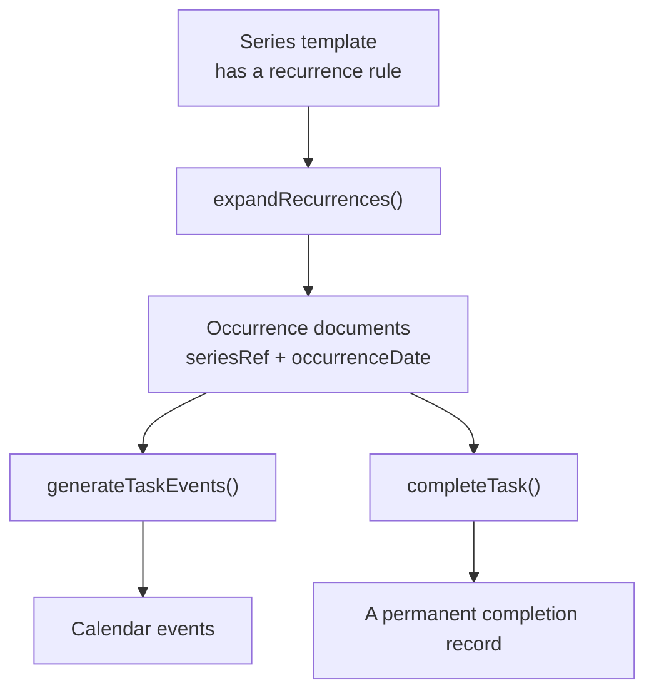

# Recurring tasks

How a repeating task works end to end: the rule you author, the occurrences the scheduler
materialises from it, and what happens when you complete, edit, or delete one.

## The model in one sentence

A repeating task is a **series**: one *template* document that owns the recurrence rule,
plus concrete *occurrence* documents generated from it over a rolling 60-day window.

A task **is** a template exactly when it has a `recurrence` rule — there is no separate
flag. That is deliberate: a boolean duplicating "has a rule" can drift out of sync with the
rule itself, and a stale copy is how a template gets mistaken for work.

The payoff: by the time the scheduler queries tasks, occurrences are **ordinary task
documents**. `controllers/scheduling.js` needed one extra line, not a rewrite.

## The rule

Stored in `recurrence` on the template (`models/index.js`):

| Field | Meaning | Example |
|---|---|---|
| `freq` | `daily` \| `weekly` \| `monthly` \| `yearly` | `'weekly'` |
| `interval` | Every N periods | `2` = fortnightly |
| `byWeekday` | Days of the week, `0`=Sunday..`6`=Saturday (weekly). Empty = the day the series starts on | `[1,2]` = Mon **and** Tue |
| `byMonthDay` | Days of the month, `1`-`31`, or `-1` for the last day (monthly) | `[1,-1]` |
| `endsOn` | Stop after this date. `null` = never | |
| `endsAfter` | Stop after N occurrences ever. `null` = never | |
| `whenUnschedulableBehavior` | `'skip'` \| `'next-available'`; what to do when the occurrence day has no slot | `'skip'` |

The shape deliberately mirrors iCalendar RRULE, so a future `.ics` import/export or Google
Calendar recurring-event mapping is mechanical. There is no RRULE dependency.

**An empty `byWeekday` means "the start day", not "every day".** A weekly rule that names no
day falls back to the weekday its series starts on, exactly as RRULE defaults BYDAY to the
DTSTART weekday. Treating "no days chosen" as "all days" is what once turned a single
weekly task into 60 daily ones: a legacy `repeat: 'weekly'` string carries no `byWeekday`
at all.

**`byMonthDay: [31]` does not roll over.** In a 30-day month the rule simply does not fire.
`-1` is the way to say "end of the month", and it handles a leap February correctly.

**`endsAfter` counts from the series start**, not from the current window, so it means
"N occurrences ever".

**Missing `whenUnschedulableBehavior` means `skip`.** This is the default for new rules, older rule
documents, and promoted legacy `repeat` strings, so no data migration is required.

## The lifecycle

`expandRecurrences(user, horizonDays)` runs at the top of `generateTaskEvents`, and also
directly after `createTask`/`editTask` so a new or changed series appears immediately
rather than waiting for the next "Schedule Tasks".

On each run, per series:

1. Generate the dates the rule produces between today and the horizon.
2. Delete **future incomplete** occurrences the rule no longer produces (e.g. after an edit).
3. Create occurrences for dates that have none. Existing documents keep their identity.
4. Delete **past incomplete** occurrences for skip-policy series. Next-available occurrences
   remain pending across runs until they can be placed or completed.

Each occurrence inherits title, notes, duration, chunking, priority, dependencies, and
`projectRef` from its template, and gets `dueDate` = its canonical civil-date marker. The
scheduler orders eligible work by civil due date first, then uses priority to break ties between
tasks due on the same day. Comparing civil dates keeps older timestamps and canonical recurrence
markers equivalent when they represent the same deadline day.

Editing an occurrence writes these authored fields to the template, then refreshes every
pending occurrence in that series immediately. Their identity and scheduler placement stay
intact. Completed occurrences are history, so later series edits never rewrite their saved
fields or project. Normal expansion does not refresh existing occurrences, preserving
per-occurrence progress such as duration remaining after a chunk is completed.

### Why the two extra fields

`seriesRef` and `occurrenceDate` are the only bookkeeping an occurrence carries.

- **`seriesRef`** points at the template. It is what makes "edit/delete the series" and
  "prune this series' occurrences" possible at all.
- **`occurrenceDate`** is the occurrence's *identity* within its series: the dedup key
  `(seriesRef, occurrenceDate)` is what makes expansion idempotent.

### `occurrenceDate` vs `scheduledDate`

These sound alike but sit at opposite ends of the scheduler.

| | `occurrenceDate` | `scheduledDate` |
|---|---|---|
| Means | *Which* occurrence this is | *Where the scheduler put it* |
| Direction | Scheduler **input** | Scheduler **output** |
| Written by | `expandRecurrences` | `generateTaskEvents` |
| Lifetime | Stable for the life of the occurrence | Recomputed from scratch every run |
| Before the first run | Already set | `null` |
| Time part | Local midnight | The real start time, e.g. 11:45 |

With `whenUnschedulableBehavior: 'next-available'`, the scheduler is best-effort on the occurrence
day: a daily check-in *for* Mon 10 Aug can be *placed* Tue 11 Aug 11:00. With the default
`'skip'` policy it is only eligible during Monday and remains unscheduled if no Monday slot
exists. In both cases `occurrenceDate` remains Monday; only `scheduledDate` can move.

Collapsing them would break expansion outright, not subtly:

- Before the first scheduling run every `scheduledDate` is `null`, so every occurrence in a
  series would share one dedup key.
- Every run rewrites `scheduledDate`, so identity would change each run and expansion would
  recreate the whole series every time.

`occurrenceDate` is kept distinct from `startDate` for a related reason. It currently always
equals it, but `startDate` is user-editable in the task modal, and identity keyed on a
mutable field means editing a start date silently re-identifies the occurrence, so the next
expansion recreates it as a duplicate.

### Invariants

- **Idempotent.** Keyed on `(seriesRef, occurrenceDate)`. Running the scheduler twice does
  not duplicate or churn occurrences.
- **Completed occurrences are immutable.** Never pruned (however old), never regenerated,
  never removed by a rule edit or a series delete. They are the user's history.
- **The template is never scheduled and never listed.** `'recurrence.freq': {$exists: false}`
  guards the task-list query and both scheduler queries. It is a rule, not work.
- **A completed task is not a template.** Expansion skips any task marked complete, and
  deletes the pending occurrences of a series whose template was completed. Without this a
  ticked-off repeating task keeps generating work forever, and the calendar fills with
  copies of something the user already finished.

## Behaviour you should know about

| Situation | What happens |
|---|---|
| You complete an occurrence | That document is marked complete. The next one already exists. Two ticks = two records, each with its own date |
| You miss a skip-policy occurrence | The past incomplete occurrence is deleted, so chores do not pile up |
| You miss a next-available occurrence | It remains pending and can be scheduled on a later run |
| You edit anything on an occurrence | The edit applies to the **whole series** (v1). Pending occurrences refresh immediately; completed history stays unchanged. The modal says so |
| You delete an occurrence | The whole series goes: template + incomplete occurrences. Completed ones stay |
| You pick a non-working day | The occurrence is still created. Skip leaves it unscheduled; next-available moves it to a later working slot |
| The day is already full | Skip leaves it unscheduled; next-available carries it forward, but never earlier than its occurrence date |
| A breakable skip occurrence partly fits | Valid chunks stay on the occurrence day; remaining work does not spill overnight |

`byWeekday` controls which civil date the task belongs to. `whenUnschedulableBehavior` controls
whether placement may continue after that date.

Priority is independent of recurrence policy. A skip occurrence competes at the priority inherited
from its template when another task has the same civil due date; if that task wins their available
slot, the occurrence remains unscheduled instead of moving later.

## Horizon

`SCHEDULING_HORIZON_DAYS = 60` (`controllers/scheduling.js`) bounds **both** how far
occurrences are materialised and how far ahead existing calendar events are loaded.

**Keep these equal.** The scheduling loop stops at the same boundary through which existing
events were loaded. A next-available occurrence that still has no slot remains pending for
a later run as the rolling horizon advances; the scheduler never claims a slot beyond its
known calendar window.

The sidebar in `Calendar.vue` shows a shorter 21-day window (`SIDEBAR_WINDOW_DAYS`), since
60 days of daily occurrences would bury the list. Backlog and unscheduled tasks are always
shown regardless.

## Timezones

Recurrence uses canonical UTC markers for civil dates. `occurrenceDate` is a date identity,
not a timeline instant, and API responses serialize it as `YYYY-MM-DD`.

The user's persisted IANA timezone determines today's date and when an occurrence becomes
eligible to schedule. The generator itself walks UTC calendar fields so identity cannot shift
when the server timezone or DST changes.

Never advance calendar days with fixed milliseconds. Use the helpers in `utils/temporal.js`.

## Legacy `repeat` strings

The old `repeat: 'weekly'` string still works. There is no migration script: the first
expansion promotes such a task in place (writes its `recurrence`) and it
behaves as a series from then on. Until promotion, completing one still clones it forward,
so nothing breaks mid-migration.

A promoted legacy string has an **empty `byWeekday`**, which is why the "empty means the
start day" rule above matters: without it, every legacy weekly task silently became a daily
one the first time the scheduler ran.
It also receives the default `whenUnschedulableBehavior: 'skip'`.

## Adding a new frequency

1. Add it to `FREQUENCIES` in `controllers/recurrence.js`.
2. Handle it in `isOnInterval` (period arithmetic) and, if it needs one, `matchesDayFilter`.
3. Add the unit noun in `describeRecurrence`, and mirror it in
   `webinterface/src/utils/recurrence.js`.
4. Add the option to `RepeatEditor.vue`.
5. Add generator cases to `tests/api/recurrence.spec.js`.

`describeRecurrence` exists in **both** `controllers/recurrence.js` and
`webinterface/src/utils/recurrence.js` so the summary line the user reads always matches
what the API stores. If you change one, change the other; the backend wording is pinned by
a spec.

## Where things live

| File | Role |
|---|---|
| `controllers/recurrence.js` | Validation, normalisation, the date generator, expansion |
| `controllers/scheduling.js` | Calls `expandRecurrences`, owns the horizon |
| `controllers/taskController.js` | Completion semantics; attaches `seriesRecurrence` for display |
| `routes/tasks.js` | Rule validation, series-aware edit and delete |
| `webinterface/src/components/RepeatEditor.vue` | The rule editor |
| `webinterface/src/utils/recurrence.js` | Shared `describeRecurrence` for the UI |
| `tests/api/recurrence.spec.js` | Generator (exact dates) + expansion (invariants) |
