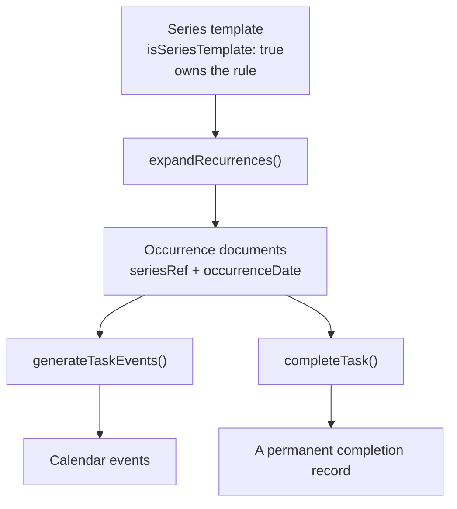

# Recurring tasks

How a repeating task works end to end: the rule you author, the occurrences the scheduler
materialises from it, and what happens when you complete, edit, or delete one.

## The model in one sentence

A repeating task is a **series**: one *template* document that owns the recurrence rule,
plus concrete *occurrence* documents generated from it over a rolling 60-day window.

The payoff: by the time the scheduler queries tasks, occurrences are **ordinary task
documents**. `controllers/scheduling.js` needed one extra line, not a rewrite.

## The rule

Stored in `recurrence` on the template (`models/index.js`):

| Field | Meaning | Example |
|---|---|---|
| `freq` | `daily` \| `weekly` \| `monthly` \| `yearly` | `'weekly'` |
| `interval` | Every N periods | `2` = fortnightly |
| `byWeekday` | Days of the week, `0`=Sunday..`6`=Saturday (weekly) | `[1,2]` = Mon **and** Tue |
| `byMonthDay` | Days of the month, `1`-`31`, or `-1` for the last day (monthly) | `[1,-1]` |
| `endsOn` | Stop after this date. `null` = never | |
| `endsAfter` | Stop after N occurrences ever. `null` = never | |

The shape deliberately mirrors iCalendar RRULE, so a future `.ics` import/export or Google
Calendar recurring-event mapping is mechanical. There is no RRULE dependency.

**`byMonthDay: [31]` does not roll over.** In a 30-day month the rule simply does not fire.
`-1` is the way to say "end of the month", and it handles a leap February correctly.

**`endsAfter` counts from the series start**, not from the current window, so it means
"N occurrences ever".

## The lifecycle

`expandRecurrences(user, horizonDays)` runs at the top of `generateTaskEvents`, and also
directly after `createTask`/`editTask` so a new or changed series appears immediately
rather than waiting for the next "Schedule Tasks".

On each run, per series:

1. Generate the dates the rule produces between today and the horizon.
2. Delete **future incomplete** occurrences the rule no longer produces (e.g. after an edit).
3. Create occurrences for dates that have none. Existing documents keep their identity.
4. Delete **past incomplete** occurrences across all series.

Each occurrence inherits title, notes, duration, chunking, priority and dependencies from
its template, and gets `dueDate` = end of its own day, which is what drives the scheduler's
deadline ordering.

### Invariants

- **Idempotent.** Keyed on `(seriesRef, occurrenceDate)`. Running the scheduler twice does
  not duplicate or churn occurrences.
- **Completed occurrences are immutable.** Never pruned (however old), never regenerated,
  never removed by a rule edit or a series delete. They are the user's history.
- **The template is never scheduled and never listed.** `isSeriesTemplate: {$ne: true}`
  guards the task-list query and both scheduler queries. It is a rule holder, not work.

## Behaviour you should know about

| Situation | What happens |
|---|---|
| You complete an occurrence | That document is marked complete. The next one already exists. Two ticks = two records, each with its own date |
| You miss an occurrence | Past incomplete occurrences are deleted, so chores never pile up |
| You edit anything on an occurrence | The edit applies to the **whole series** (v1). The modal says so |
| You delete an occurrence | The whole series goes: template + incomplete occurrences. Completed ones stay |
| You pick a non-working day | The occurrences are still created, and the UI warns you they will not be scheduled |
| The day is already full | The block slips later, exactly like any overdue task. An occurrence is never scheduled **before** its date, but it is not pinned to it either |

That last row is the one that surprises people: `byWeekday` controls **when the task is
due**, not a hard constraint on when the scheduler may place it.

## Horizon

`SCHEDULING_HORIZON_DAYS = 60` (`controllers/scheduling.js`) bounds **both** how far
occurrences are materialised and how far ahead existing calendar events are loaded.

**Keep these equal.** The scheduling loop itself has no time bound, so a shorter event
window means anything placed past it is scheduled with no knowledge of the user's real
calendar and will book straight over it. There is a spec pinning this
(`never overlaps a calendar event beyond the old 14 day horizon`).

The sidebar in `Calendar.vue` shows a shorter 14-day window (`SIDEBAR_WINDOW_DAYS`), since
60 days of daily occurrences would bury the list. Backlog and unscheduled tasks are always
shown regardless.

## Timezones

All recurrence maths is **server-local**, matching the scheduler's working-hours logic and
the seed factories. `occurrenceDate` is stored at local midnight.

Two rules when touching this code:

- **Never use UTC getters** (`getUTCDay`) or `moment.utc()` for weekday logic. "Every
  Monday" silently becomes Sunday for users behind UTC.
- **Never advance days with `+ MS_PER_DAY`.** It drifts an hour across a DST boundary and
  eventually skips or repeats a date. Use `moment().add(n, 'days')`.

**Known limitation:** there is no per-user timezone. `UserDetail` has no such field and the
scheduler builds working hours from server-local time, so recurrence follows the same
convention rather than inventing a parallel one. A user in a different timezone from the
server gets the server's idea of "Monday". Fixing that is a separate piece of work that
would need to move the scheduler too.

## Legacy `repeat` strings

The old `repeat: 'weekly'` string still works. There is no migration script: the first
expansion promotes such a task in place (sets `recurrence` and `isSeriesTemplate`) and it
behaves as a series from then on. Until promotion, completing one still clones it forward,
so nothing breaks mid-migration.

## Adding a new frequency

1. Add it to `FREQUENCIES` in `controllers/recurrence.js`.
2. Handle it in `isOnInterval` (period arithmetic) and, if it needs one, `matchesDayFilter`.
3. Add the unit noun in `describeRecurrence`, and mirror it in
   `webinterface/src/utils/recurrence.js`.
4. Add the option to `RepeatEditor.vue`.
5. Add generator cases to `tests/api/recurrence.spec.js`.

`describeRecurrence` exists in **both** `controllers/recurrence.js` and
`webinterface/src/utils/recurrence.js` so the summary line the user reads always matches
what the API stores. If you change one, change the other; the backend wording is pinned by
a spec.

## Where things live

| File | Role |
|---|---|
| `controllers/recurrence.js` | Validation, normalisation, the date generator, expansion |
| `controllers/scheduling.js` | Calls `expandRecurrences`, owns the horizon |
| `controllers/taskController.js` | Completion semantics; attaches `seriesRecurrence` for display |
| `routes/tasks.js` | Rule validation, series-aware edit and delete |
| `webinterface/src/components/RepeatEditor.vue` | The rule editor |
| `webinterface/src/utils/recurrence.js` | Shared `describeRecurrence` for the UI |
| `tests/api/recurrence.spec.js` | Generator (exact dates) + expansion (invariants) |
