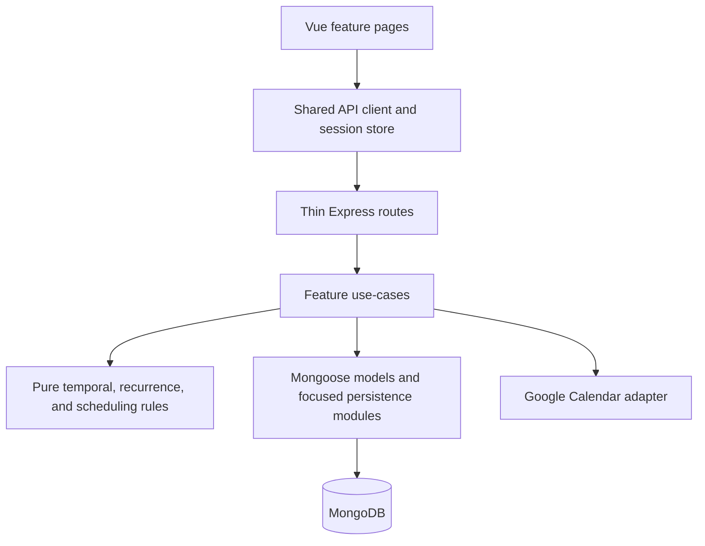

# Refactor program overview

> **Status: approved future program — no implementation shipped.**
>
> Phase 0 records the audit, target, fixed decisions, sequencing, and regression baseline. It approves
> the direction of the five plans, not their implementation. No security, data, backend, frontend,
> delivery, API, schema, authentication, scheduling, recurrence, dependency, or CI behavior described
> by those plans has shipped merely because these documents exist.

## Audit verdict

AutoTaskCalendar should remain a **single-deployable modular monolith**. A rewrite, microservice split,
or immediate database migration would add more risk than value. The problem is boundary leakage and
insufficient enforcement: routes own workflows, schemas enforce few invariants, multi-document
projections are non-atomic, browser HTTP/auth ownership is split, large Vue pages mix concerns, and
production gates are weaker than the local workflow.

Preserve these strengths:

- per-instance ports and databases make local, test, and agent work reproducible;
- Playwright covers tenant isolation, task lifecycle, recurrence identity/history, scheduler
  invariants, timezone/DST behavior, Compass, Calendar, and Weekly Plan;
- `utils/temporal.js` deliberately distinguishes civil dates, instants, wall times, and IANA zones;
- recurrence has explicit template/occurrence identity and completed-history semantics;
- Compass is already close to a thin-route/application boundary; and
- the focused domain manuals are practical operating guides.

## Target modular monolith

This is an internal dependency target, not a service split: one Vue application, one Express process,
one primary database, one artifact, and in-process calls remain.

## Fixed decisions

1. **Modular monolith:** do not add microservices, an event bus, or a distributed scheduler.
2. **Incremental delivery:** implement, verify, deploy, and approve each later phase separately; do
   not combine the program into a rewrite.
3. **MongoDB now, with the Phase 2 gate:** harden MongoDB first. Phase 2 must measure transaction
   support, query behavior, reporting needs, and integrity complexity. A failed gate stops rollout and
   creates a separately approved PostgreSQL ADR/task; it does not authorize a weak fallback or ship a
   database migration.
4. **Total `repeat` removal in Phase 2:** safely migrate remaining legacy recurrence data, then remove
   the field and its request aliases, schema paths, runtime fallback, seed data, active tests, and
   active documentation. No permanent compatibility path remains.
5. **Preserve temporal behavior:** do not replace date/time libraries during structural work. Existing
   civil-date, instant, wall-time, timezone, DST, and all-day semantics remain protected by current
   tests and focused feature manuals. Phase 0 removes links to the nonexistent temporal manual without
   replacing it.
6. **One authentication lifecycle:** Phase 1 converges on one server-side secure-cookie session, not
   browser-readable JWT plus Passport session.
7. **No framework rewrite:** wholesale TypeScript, Composition API, Pinia, Vite, or visual redesign is
   not a prerequisite for better boundaries. Any Vite evaluation is a separate later decision.
8. **CI triggers unchanged:** retain only push to `main` and manual dispatch. Do **not** add a
   `pull_request` or `pull_request_target` trigger; any trigger-policy change needs a separate user
   request.

## Program order and approval gates

The approved order is **Phase 0 → 1 → 2 → 3 → 4 → 5**. A plan is not implementation approval, and a
later phase cannot inherit approval from an earlier one.

| Order | Plan | Owns | Dependency | Approval and exit gate |
| ---: | --- | --- | --- | --- |
| 0 | This overview | Audit, decisions, routing, plans, coverage inventory | Approved task 00052 | Documentation review; no runtime change |
| 1 | [Phase 1 — secure application boundary](./REFACTOR_PHASE_1.md) | Session/actor, CSRF, OAuth/token security, truthful HTTP errors, startup/readiness, redacted logging | Phase 0 accepted; production origin/proxy/secret/deployment facts resolved | Separate implementation approval; security tests, migration proof, rollout and acceptance evidence before Phase 2 |
| 2 | [Phase 2 — data integrity and atomic projections](./REFACTOR_PHASE_2.md) | Validation, indexes, migrations, total `repeat` removal, transactions, recurrence/schedule/cascade/sync atomicity | Phase 1 accepted; restorable backup; production Mongo topology and transaction capability proven | Separate implementation approval; expand/migrate/contract gates and MongoDB-versus-PostgreSQL decision recorded before Phase 3 |
| 3 | [Phase 3 — backend feature modules](./REFACTOR_PHASE_3.md) | Feature use cases, pure domain modules, focused persistence, thin routes | Phases 1-2 deployed and accepted; primary-store decision stable | Separate implementation approval; each vertical slice contract-compatible and reversible; all controller callers removed before exit |
| 4 | [Phase 4 — frontend boundaries](./REFACTOR_PHASE_4.md) | One client/session boundary, endpoint services, page/view-model decomposition, accessibility/head/style foundations | Phases 1-3 accepted; exact deployed API captured | Separate implementation approval; page slices observed and artifact rollback proven without server/data changes |
| 5 | [Phase 5 — reproducible delivery](./REFACTOR_PHASE_5.md) | Static gates, dependency proof, pinned installs, immutable artifact, smoke and diagnostics | Phases 1-4 deployed and accepted; Azure/runtime facts resolved | Separate implementation approval; unchanged trigger policy machine-checked, artifact and rollback drills accepted |

Every implementation phase starts from its accepted predecessor, refreshes cited evidence, writes the
slice's tests first, resolves its listed deployment questions, and supplies acceptance and rollback
evidence. A phase may stop or be declined without forcing the rest of the program to ship.

## Confirmed finding routing

Each numbered finding from the approved Phase 0 audit appears exactly once below. “Owner” is the one
phase accountable for closing it; prerequisites supplied by another phase do not split ownership.

| Finding | Confirmed issue | Owner and disposition |
| --- | --- | --- |
| S-01 | Raw user ObjectId is trusted as OAuth `state` | Phase 1 — nonce, session/actor binding, expiry, one-time use, PKCE |
| S-02 | Google credentials are plaintext and provider details are logged ad hoc | Phase 1 — versioned encryption, migration, redaction |
| S-03 | Passport/JWT auth is duplicated; the interceptor can hang; logout leaves stale state | Phase 1 — one session/actor lifecycle and atomic minimal SPA cutover |
| S-04 | `/api/user/:username` can select a different authenticated account | Phase 1 — actor-owned lookup and non-enumerating rejection |
| S-05 | Login/register lack rate limits and strong server validation | Phase 1 — bounded validation and shared abuse controls |
| S-06 | Recurrence and schedule projections are non-atomic; occurrence identity is not unique | Phase 2 — transactions, planning lease, unique identity, atomic projection |
| S-07 | Task/chunk/priority/completion values are weakly validated | Phase 2 — request, domain, Mongoose, and MongoDB validation |
| S-08 | Task/series deletion leaves generated events and dependency references | Phase 2 — transactional cascade and orphan audit |
| S-09 | Google sync can claim success after failure and retry 401 recursively | Phase 1 — truthful typed failure and one bounded refresh/retry |
| S-10 | Express listens before Mongo is ready and lacks readiness/central async errors | Phase 1 — awaited startup, health, shutdown, central error boundary |
| I-01 | `routes/tasks.js` is a 500+ line application service | Phase 3 — task application use cases and thin routes |
| I-02 | Recurrence and task controllers combine domain, presentation, compatibility, persistence, and re-exports | Phase 3 — feature-first domain/application/persistence split |
| I-03 | Schema, update, reference, and cascade constraints are sparse or path-dependent | Phase 2 — layered invariants and same-user reference checks |
| I-04 | Event hot paths and common task/scheduler/archive queries lack evidenced indexes | Phase 2 — named query-owned index manifest and plan evidence |
| I-05 | Google event identity omits its source calendar | Phase 2 — source-aware identity and all-or-nothing cache application |
| I-06 | Legacy `repeat` remains a live runtime fallback | Phase 2 — migrate, verify zero paths, then remove all compatibility support |
| I-07 | Scheduler selection relies on incidental order/null coercion and weak progress detection | Phase 2 — total comparator, monotonic progress guard, atomic publish |
| I-08 | Compass, follow-up, completion, and series writes span collections non-atomically | Phase 2 — lease/transaction boundaries and failure injection |
| I-09 | There is no general versioned migration/index deployment mechanism | Phase 2 — checksummed resumable runner, readiness compatibility gate |
| F-01 | HTTP/auth ownership is split across Axios defaults, Vuex, `App.vue`, and guards | Phase 4 — one composition root, client, and session controller over Phase 1 transport |
| F-02 | Views own endpoint strings and interpret inconsistent response paths | Phase 4 — one endpoint service catalog and normalized client errors |
| F-03 | `Calendar.vue` owns transport, DayPilot, derivation, DOM, unawaited loads, and an uncleared interval | Phase 4 — coordinator/model/components/adapter split and lifecycle cleanup |
| F-04 | Weekly Plan and Compass are page mini-apps despite useful Weekly Plan load/race patterns | Phase 4 — preserve patterns in pure view models and focused components |
| F-05 | Head management is duplicated and contains incorrect GitHub copy | Phase 4 — one managed head path and safe route metadata |
| F-06 | Login/Register lack semantic forms, labels, busy state, and announced errors | Phase 4 — accessible forms/status/focus behavior |
| F-07 | Global Bootstrap overrides and repeated feature CSS obscure style ownership | Phase 4 — semantic tokens and explicit global/feature/vendor ownership |
| D-01 | Current push/manual CI trigger policy is intentional | Phase 5 — preserve and machine-check it; no PR CI trigger |
| D-02 | No root static gate exists and frontend unused checks are disabled | Phase 5 — non-mutating root check, lint, format, architecture gates |
| D-03 | CI installs mutably, Node/npm are unpinned, and `nodemon` is runtime-classified | Phase 5 — exact toolchain, two `npm ci` installs, dependency reclassification |
| D-04 | Artifact contents are broad, smoke is absent, and logs are unstructured | Phase 5 — slim verified artifact and smoke; consume Phase 1 structured logging |
| D-05 | Several direct dependencies appear unused but are not proven safe to remove | Phase 5 — owner/classification and proof-based removal only |
| D-06 | Active guidance links to a missing temporal manual | Phase 0 — remove broken references; creation of a replacement manual is explicitly declined |

## Preserved coverage inventory

The inventory found one narrow Phase 0 gap: local event reads were explicitly tenant-tested, but
update/delete denial for another user's event was only implicit in production queries. That assertion
was added to the existing event lifecycle spec; no other characterization tests were needed. These are
exact current Playwright spec paths and full `describe › test` names. They preserve intended behavior, not
known defects: JWT/local-storage transport, raw OAuth state, HTTP-200 failures, recursive refresh,
non-atomic writes, and legacy `repeat` compatibility are not regression requirements.

| High-risk behavior to preserve | Exact current Playwright coverage |
| --- | --- |
| Per-instance database isolation and concurrent startup | `tests/api/dev-database.spec.js` — `dev environment › instance naming stays isolated, stable, bounded, and accepts pinned ports`; `dev environment › concurrent port resolution and ensureDatabase avoid shared-container collisions`; `dev environment › one instance database does not leak into another` |
| Login/registration outcomes, access rejection, and browser navigation outcomes | `tests/api/auth.spec.js` — `auth › login and registration handle success and duplicate credentials`; `auth › protected endpoints reject missing and invalid tokens`; `tests/ui/login.spec.js` — `login page › logs in and out through the real auth flow`; `login page › redirects anonymous visitors away from protected pages` |
| Tenant ownership across tasks, events, Compass, and completion history | `tests/api/tasks.spec.js` — `tasks › lists only the logged-in user's active tasks`; `tasks › creates, edits, and deletes owned tasks without shifting civil dates`; `tasks › returns authenticated, owned project completions from the local completion window`; `tests/api/events.spec.js` — `events › event listing is week-scoped, user-scoped, and rejects bad dates`; `tests/api/compass.spec.js` — `compass › keeps hierarchy and mutating endpoints tenant-scoped` |
| Task lifecycle, dependency, generated-event cleanup, chunking, and server-owned fields | `tests/api/tasks.spec.js` — `tasks › rejects circular dependencies`; `tasks › completes a task and removes only its generated task events`; `tasks › completes chunked tasks incrementally until the final chunk removes them from the active list`; `tasks › ignores server-owned identity fields when editing a task` |
| Recurrence dates, stable identity, immediate visibility, completed history, and series lifecycle | `tests/api/recurrence.spec.js` — `recurrence rules › generator covers daily, weekly, monthly, and DST boundaries`; `recurrence expansion › expansion is idempotent and hides templates from task lists`; `recurrence expansion › completion history survives re-expansion and series cleanup`; `recurrence expansion › editing and deleting a series prune incomplete occurrences but keep history`; `recurrence expansion › a new series is visible immediately in the create response`; `scheduling a recurring series › scheduler places a weekly Monday series once per Monday` |
| Scheduler windows, overlap, eligibility, dependencies, chunks, idempotence, horizon, recurrence, and DST | `tests/api/scheduling.spec.js` — `scheduling › keeps scheduled work inside working windows without overlapping calendar events or other tasks`; `scheduling › respects task eligibility, dependencies, and chunk duration limits`; `scheduling › is idempotent, preserves calendar events, and never schedules completed tasks`; `scheduling › survives hostile and dense recurring scenarios without breaking scheduling invariants`; `scheduling › avoids far-future calendar conflicts beyond the old 14 day horizon`; `scheduling › materialises recurring work on its chosen weekdays and handles DST-shaped work windows` |
| Civil dates, instants, week bounds, timezone/DST, and temporal migration | `tests/api/temporal.spec.js` — `temporal primitives and migration › strictly separates civil dates from instants and builds week bounds across DST`; `temporal primitives and migration › recovers legacy local dates and migrates a legacy account through login`; `temporal primitives and migration › migrates legacy users idempotently without touching completion instants`; `tests/api/tasks.spec.js` — `tasks › creates, edits, and deletes owned tasks without shifting civil dates` |
| Local event mutation ownership/semantics and timed/all-day Google transformation | `tests/api/events.spec.js` — `events › update, delete, and Google event transforms preserve intended event semantics`; `tests/ui/calendar.spec.js` — `calendar page › keeps civil dates stable and renders all-day events in a non-UTC browser` |
| Compass hierarchy, archive, cascade, tenant boundary, and task alignment | `tests/api/compass.spec.js` — `compass › returns the live hierarchy with nested refs and parked projects`; `compass › requires cascade for a populated role and unlinks tasks when deleting the subtree`; `compass › reports completed counts and a representative archive window without changing the live tree`; `compass › tracks task alignment when linking, unlinking, and editing project refs`; `tests/ui/compass.spec.js` — `compass page › renders the hierarchy, Someday, and Archive`; `compass page › creates a role and links a new task to a project` |
| Calendar shared editor, recurrence, failure retention, scheduling, and all-day UI | `tests/ui/calendar.spec.js` — `calendar page › creates and completes tasks through the shared editor`; `calendar page › keeps a recurring occurrence when quick completion fails`; `calendar page › creates weekly recurring tasks through the shared editor`; `calendar page › keeps civil dates stable and renders all-day events in a non-UTC browser` |
| Weekly Plan hierarchy/history, in-place task lifecycle, saved timezone, and narrow layout | `tests/ui/weeklyPlan.spec.js` — `weekly plan page › reviews the weekly hierarchy and last-week completions`; `weekly plan page › quick-adds and edits a task without leaving Weekly Plan`; `weekly plan page › uses the saved timezone and stays usable on a narrow screen` |
| Working-hour and timezone persistence through API and UI | `tests/api/auth.spec.js` — `auth › updateuserinfo validates and persists working hours and timezone`; `tests/ui/user.spec.js` — `user working preferences › round-trips minute-precision working hours and timezone` |

Future phases add target tests before correcting defects; they must not rewrite the current defect into a
preservation assertion or delete the coverage above merely because code moves.

## Risk register

| Risk | Failure mode | Required mitigation and gate | Owner |
| --- | --- | --- | --- |
| Security cutover | account crossover, stolen bearer/session, OAuth replay, plaintext credential exposure, unsafe rollback | One session/actor, CSRF, state/PKCE, encrypted-token expand/migrate/cleanup, redaction tests, atomic backend/SPA release and deployment drill | Phase 1 |
| Data migration | irreversible loss, invalid legacy conversion, unsupported transactions, old writers recreating fields | Read-only audit, restorable backup, topology smoke, checksummed resumable migrations, expand/migrate/contract rollout, zero-count verification, Mongo decision gate | Phase 2 |
| Scheduling | empty/partial projection, overlap, stale commit, nondeterministic ordering, infinite/no-progress loop | Per-user lease/fence/revision, pure full calculation, total comparator/progress guard, one transaction, injected-abort and concurrency tests | Phase 2 |
| Recurrence | duplicate occurrences, changed completed history, partial series edit/delete, bad legacy conversion | Unique occurrence identity, transactional upserts/pruning, completed-history invariants, classified `repeat` migration and zero-path contract gate | Phase 2 |
| Frontend transport | pending promises, duplicate mutations, stale responses, false empty state, unknown mutation outcome | Consume Phase 1 session/client contract; one Phase 4 client/service path, cancellation/request IDs, duplicate suppression, visible errors, authoritative reconciliation | Phase 4 |

## Non-goals

Phase 0 ships documentation only. It does not:

- change authentication, OAuth, HTTP behavior, logging, startup, or readiness;
- change schemas, indexes, data, transactions, migrations, or MongoDB topology;
- remove `repeat` yet—total migration and removal belong to Phase 2;
- change scheduler, recurrence, task, event, Compass, or temporal implementation;
- move routes/controllers, Vue components, styles, or frontend transport;
- remove dependencies, pin tools, migrate build systems, or change CI triggers;
- add microservices, queues, an event bus, a distributed scheduler, or migrate databases;
- create a replacement temporal manual; or
- broadly expand tests or preserve a known defect as desired behavior.

## How future work is approved

1. Open a separate task/PR for one phase and link its plan; plan approval alone is insufficient.
2. Refresh source locations and the accepted API/data/runtime baseline after prior phases.
3. Resolve only the plan's real deployment/user questions and record named rollout/rollback owners.
4. Implement one test-first slice at a time; no skipped target tests, dual-running mutations, or
   cross-phase cleanup.
5. Present requirement-to-test/commit evidence, compatibility results, migration/backup evidence where
   applicable, observability, stop thresholds, and a rehearsed rollback.
6. Deploy and observe the phase, then obtain acceptance before approving the next phase.
7. If the Phase 2 Mongo gate fails, stop and seek separate PostgreSQL-program approval. If a CI trigger,
   Vite, framework, or product-policy change is desired, seek separate approval rather than attaching it
   to this program.

## Phase 0 requirement traceability

| Requirement | Phase 0 evidence |
| --- | --- |
| REQ-RF0-001 | [Target modular monolith](#target-modular-monolith), fixed decision 1, and every linked phase retain one artifact/process/database boundary. |
| REQ-RF0-002 | [Confirmed finding routing](#confirmed-finding-routing) assigns S-01–S-10, I-01–I-09, F-01–F-07, and D-01–D-06 exactly once; only the replacement temporal manual is declined. |
| REQ-RF0-003 | [Program order and approval gates](#program-order-and-approval-gates) and each linked plan define separate deployment, verification, and rollback gates. |
| REQ-RF0-004 | Each linked plan defines stable requirements, test-first slices, compatibility, and measurable acceptance before implementation. |
| REQ-RF0-005 | [Preserved coverage inventory](#preserved-coverage-inventory) maps high-risk behavior to current exact spec/test names and records the one focused ownership assertion added before future target tests. |
| REQ-RF0-006 | The coverage note and [non-goals](#non-goals) exclude known defects from preservation evidence. |
| REQ-RF0-007 | Fixed decision 4 and [Phase 2](./REFACTOR_PHASE_2.md) require migration followed by complete schema/request/runtime/seed/test/manual removal. |
| REQ-RF0-008 | Fixed decision 5 and D-06 prohibit creating the missing temporal manual and assign active-reference cleanup to Phase 0. |
| REQ-RF0-009 | Fixed decision 8 and [Phase 5](./REFACTOR_PHASE_5.md) preserve push-main/manual triggers and explicitly forbid PR triggers. |

## Phase 0 acceptance checklist

The checked items are verified by this index and the existing plans. Repository-wide/finalization items
remain gates for the Phase 0 owner; they do not imply that any future implementation shipped.

- [x] The overview states the verdict, target, fixed decisions, order, gates, risks, non-goals, and future approval path.
- [x] All five future plans exist, are linked above, and identify themselves as not shipped.
- [x] Every confirmed numbered finding is routed exactly once.
- [x] Phase 2 requires safe migration and total `repeat` removal across data and every active contract surface.
- [x] Active guidance/manuals contain no broken temporal-manual link; no replacement manual is created.
- [x] No pull-request CI trigger is proposed; Phase 5 forbids one without separate approval.
- [x] Coverage inventory added one focused event-mutation ownership assertion and found no other Phase 0 gap.
- [x] Phase 0 documentation proposes no production behavior, API, data, auth, scheduler, recurrence, frontend, dependency, or trigger change.
- [x] The Phase 0 owner ran the existing full suite at finalization: 53 tests passed.

Until every repository-wide Phase 0 gate is closed, these documents remain planning artifacts. Even
after Phase 0 acceptance, Phases 1-5 remain future work and **no implementation has shipped**.
