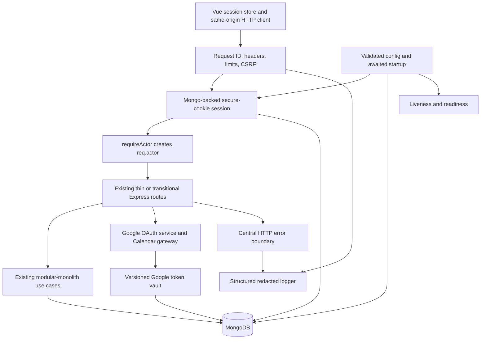

# Refactor Phase 1: secure application boundary

> **Status: future implementation manual — not shipped.**
>
> Phase 0 approved this plan's direction, not the implementation described here.
> Implement Phase 1 only after separate approval and in the test-first slices below.
> No security, authentication, OAuth, HTTP error, startup, readiness, or logging change
> described in this document is present merely because this manual exists.

## Purpose and user value

Phase 1 hardens the boundary of the existing modular monolith. It replaces two competing browser authentication mechanisms with one server-side session, creates one authoritative actor context for every protected use case, secures Google OAuth, makes HTTP failures honest and predictable, refuses traffic until dependencies are ready, and emits useful logs without emitting credentials or personal data.

The user value is concrete:
- a script that steals browser storage cannot steal a 28-day bearer token;
- an OAuth callback cannot connect an attacker's authorization result to another account;
- an account can read and mutate only data owned by its authenticated actor;
- logout invalidates the credential on the server rather than only clearing browser state;
- calendar-provider failures are reported instead of being presented as successful syncs;
- malformed, abusive, or cross-site requests are rejected consistently;
- deploys stop serving before MongoDB is usable and expose an honest readiness signal; and
- support can correlate a failure without logs containing passwords, cookies, tokens, or OAuth data.
This phase preserves one Vue application, one Express API process, one MongoDB database, and one deployment artifact. It introduces internal boundaries only; it does not introduce microservices, an identity service, an event bus, or a second persistence system.

## How to use this manual
1. Resolve only the deployment facts listed under [Unresolved deployment and user questions](#unresolved-deployment-and-user-questions).
2. Record the answers in the implementation pull request and deployment runbook.
3. Implement the slices in order; add each slice's tests before changing behavior.
4. Keep each slice green and reviewable. Do not hide known failures behind skipped tests.
5. Treat the authentication cutover as one backend/frontend artifact and one operational event.
6. Finish the plaintext-token cleanup and legacy-JWT removal before declaring Phase 1 complete.
7. Use the acceptance checklist as evidence; do not replace it with a statement that tests passed.
## Prerequisites and fixed decisions

### Prerequisites
Before implementation begins:
1. Phase 0 and this manual must be approved.
2. Record the production MongoDB version/topology and whether all app instances share it.
3. Record the Azure proxy chain, TLS termination point, public origin, and health-probe behavior.
4. Inventory active app instances and determine whether deployment is slot-swap, rolling, or in-place.
5. Inventory clients other than the shipped Vue application that call `/api`.
6. Count users with either plaintext Google token field, without reading or exporting token values.
7. Confirm every registered Google OAuth redirect URI for development, test, staging, and production.
8. Confirm a production secret source can supply session, rate-key, and encryption key material.
9. Take a database backup and prove restoration into an isolated database.
10. Capture baseline login failures, 401s, 5xx responses, restarts, and Google sync outcomes if the current logging platform can derive them safely.
### Fixed decisions
The following decisions are not implementation questions:
- Keep the single-deployable modular monolith and the existing Express, Vue, Mongoose, and MongoDB stack.
- Use exactly one authenticated browser credential: an opaque ID in an `HttpOnly` server-side session cookie.
- Do not issue, accept, refresh, or store a JWT after the cutover is complete.
- Use exactly one request identity, `req.actor`, derived from the server-side session.
- Passport Local may verify a password; Passport shall not create a second session identity. The
  implementation shall not call `req.logIn`, populate `req.user` or `req.session.passport`, install
  `passport.session()`, or register Passport serialization/deserialization.
- Keep password hashes managed by `passport-local-mongoose`; do not rehash all users in this phase.
- Protect cookie-authenticated mutations with a server-side synchronizer CSRF token.
- Keep the API same-origin. Do not enable broad credentialed CORS.
- Keep the existing 14-day user expectation as a 14-day idle session lifetime.
- Add a 28-day absolute session lifetime so activity cannot extend one session forever.
- Regenerate the session at login and registration; destroy it at logout.
- Keep current usernames case-sensitive and do not rename or normalize existing accounts.
- Encrypt Google credentials in MongoDB with versioned AES-256-GCM envelopes and external keys.
- Use semantic HTTP status codes while retaining the legacy `success` and `log` fields for Phase 1.
- Use JSON structured logs on stdout/stderr; the hosting platform owns transport and retention.
- Keep push/manual CI triggers unchanged.
- Preserve temporal, recurrence, scheduling, Compass, and calendar-event behavior unless this plan explicitly identifies a security or truthful-error correction.
## Scope

### In scope
- Runtime validation of security-sensitive production configuration.
- Proxy-aware HTTPS and secure-cookie behavior.
- Baseline security headers, request size/type limits, and sensitive-response cache controls.
- One MongoDB-backed Express session and deliberate session secret rotation.
- Session bootstrap, regeneration, idle/absolute expiry, logout destruction, and cookie clearing.
- One `req.actor` context containing the immutable user ID and current username.
- Removal of JWT creation, JWT verification, Authorization defaults, and browser auth storage.
- Minimal frontend session bootstrap and CSRF transport required for the auth cutover.
- Synchronizer-token CSRF protection and same-origin checks for every mutating browser route.
- Conversion of mutation-over-GET endpoints to appropriate POST endpoints.
- Server-side login and registration validation, generic auth failures, and distributed rate limits.
- Ownership correction for `GET /api/user/:username` and actor-ID use in protected routes.
- OAuth state nonce, session/actor binding, expiry, one-time consumption, and PKCE.
- Encrypted Google credential storage, migration, verification, cleanup, and key rotation.
- Bounded Google access-token refresh and truthful provider/sync failures.
- Stable application error types, centralized async handling, semantic status codes, and safe envelopes.
- Request correlation IDs and structured, recursively redacted server logs.
- Awaited startup, liveness/readiness endpoints, dependency-state transitions, and graceful shutdown.
- Focused API, UI, module, startup-process, redaction, OAuth-adapter, and migration tests.
- Deployment preflight, staged rollout, telemetry, backup, rollback, and failure drills.
### Out of scope
- Microservices, a separate auth service, an event bus, or a distributed scheduler.
- Social login; Google remains a Calendar authorization, not an AutoTaskCalendar login method.
- Password reset, email verification, MFA, passkeys, account deletion, or session-management UI.
- Changing existing password hashes solely to adopt another password algorithm.
- Broad route/use-case decomposition, which belongs to Phase 3.
- Broad frontend endpoint wrappers or page decomposition, which belongs to Phase 4.
- General schema validation, indexes, transactions, recurrence atomicity, and projection repair, which belong to Phase 2; the security collections and encrypted credential envelope are exceptions.
- Making Google sync atomic or adding source-calendar identity; Phase 2 owns those corrections.
- New calendar features, write access to Google Calendar, or additional OAuth scopes.
- A general API versioning program or removal of `{ success, log }` compatibility fields.
- A visual redesign or unrelated accessibility work.
- Replacing the deployment pipeline, changing CI triggers, or broad dependency cleanup.
- Logging request/response bodies, query strings, user content, usernames, emails, or provider bodies.
## Target boundary



The browser never sees an authentication bearer token. The session stores `userId`, `createdAt`, `lastSeenAt`, and a CSRF secret; it does not store a user document. `requireActor` loads the account by immutable `_id` and creates a frozen value:

```js
req.actor = Object.freeze({
    userId: user._id.toString(),
    username: user.username,
});
```

Routes pass `actor.userId` into use cases and ownership queries. They do not infer identity from path usernames, request bodies, JWT claims, OAuth state, or cached frontend data. No route may populate a second identity into `req.user`.

## Requirements

### Architecture and configuration
- **REQ-RF1-001:** The Phase 1 implementation shall remain one deployable Vue/Express modular monolith backed by the existing primary MongoDB database.
- **REQ-RF1-002:** Where the process runs in production, it shall reject startup unless the Mongo URI, public origin, session secrets, proxy policy, and logging mode pass explicit validation.
- **REQ-RF1-003:** If Google Calendar is enabled, startup shall require a client ID, client secret, exact HTTPS callback origin, active encryption key ID, and a valid 32-byte active encryption key.
- **REQ-RF1-004:** If only part of an optional integration is configured, startup shall fail rather than expose a partially usable OAuth flow.
- **REQ-RF1-005:** When production traffic is expected through a proxy, Express shall trust only the configured proxy hop count or addresses so `req.secure`, client IP, and secure cookies are reliable.
- **REQ-RF1-006:** When a request reaches Express, the system shall apply reviewed security headers, JSON content-type rules, and bounded body/query/header sizes before feature routes run.
- **REQ-RF1-007:** Where a response contains session or user data, it shall use `Cache-Control: no-store`.
- **REQ-RF1-008:** The system shall not enable credentialed cross-origin API access in this phase.
### Session and actor
- **REQ-RF1-009:** When credentials are valid, the server shall establish one MongoDB-backed session and shall not return a JWT or any other browser-readable bearer credential.
- **REQ-RF1-010:** The session cookie shall be `HttpOnly`, `SameSite=Lax`, `Path=/`, host-only, `Secure` in production, and named per local instance outside production.
- **REQ-RF1-011:** The session store TTL and cookie expiry shall implement a 14-day idle lifetime; server metadata shall enforce a 28-day absolute lifetime even if the store is touched.
- **REQ-RF1-012:** When login or registration succeeds, the server shall regenerate the pre-auth session, set the immutable user ID, rotate the CSRF secret, and persist the session before responding.
- **REQ-RF1-013:** When logout succeeds, the server shall destroy the store record, clear the cookie with exactly matching attributes, clear browser session state, and return a response before redirecting.
- **REQ-RF1-014:** If a session is expired, malformed, missing its account, or references a disabled/deleted account, the server shall destroy it and return the same unauthenticated response used for no session.
- **REQ-RF1-015:** When a protected route runs, `requireActor` shall derive one frozen `req.actor` from the session's immutable user ID and shall not accept an identity from request-controlled fields.
- **REQ-RF1-016:** Where a persistence query is tenant-scoped, it shall use `req.actor.userId` as the owner constraint in the query that reads or mutates the resource.
- **REQ-RF1-017:** When `/api/user/:username` is requested, the route shall return only the actor's account; a different path username shall return a non-enumerating not-found response.
- **REQ-RF1-018:** If no actor exists, protected endpoints shall return HTTP 401 with the standard safe error envelope and shall not perform feature database reads or writes.
- **REQ-RF1-019:** While the session secret is rotated, the server may verify with old secrets but shall sign only with the current secret; retired secrets shall be removed after all possible sessions expire.
### CSRF and browser session state
- **REQ-RF1-020:** When the SPA starts or reloads, it shall call `GET /api/session` and derive auth state from that response rather than from `localStorage`, a timestamp, or a route parameter.
- **REQ-RF1-021:** `GET /api/session` shall create or reuse an anonymous session, return a CSRF token, and return either the current basic user object or `authenticated: false` without disclosing why.
- **REQ-RF1-022:** When a browser sends POST, PUT, PATCH, or DELETE, CSRF middleware shall require a timing-safe match between `X-CSRF-Token` and the synchronizer secret held in its server session.
- **REQ-RF1-023:** If `Origin` or Fetch Metadata headers are present on a mutating request, middleware shall also reject origins/sites other than the configured application origin.
- **REQ-RF1-024:** When CSRF validation fails, the system shall return HTTP 403, shall not invoke the route, and shall log only a reason code and request ID, never either compared token.
- **REQ-RF1-025:** Except for the state-protected Google callback, GET and HEAD routes shall be read-only; logout, schedule generation, calendar sync, and OAuth initiation shall use CSRF-protected POST routes.
- **REQ-RF1-026:** The browser shall keep CSRF and current-user state in memory, shall send cookies through the same-origin client, and shall remove legacy token/user/last-login values from `localStorage`.
- **REQ-RF1-027:** When a response is 401, the shared client shall settle the original promise, clear all in-memory actor state, and send the user to login without installing duplicate interceptors.
- **REQ-RF1-028:** If the session-check request is pending, route guards shall remain in an explicit `unknown` state and shall not assume authenticated or anonymous state.
### Credentials, abuse prevention, and account responses
- **REQ-RF1-029:** When a registration request arrives, the server shall enforce a username of 4-20 allowed characters, a syntactically valid email no longer than 254 characters, a valid IANA timezone, and a password of 12-128 characters before invoking password hashing.
- **REQ-RF1-030:** When a login request arrives, the server shall bound username and password lengths before database or password-hash work and shall preserve existing case-sensitive username behavior.
- **REQ-RF1-031:** If username or password authentication fails, the public response and observable timing class shall not reveal whether the username exists.
- **REQ-RF1-032:** When repeated login failures exceed 10 per hashed IP-and-username key in 15 minutes, or registrations exceed 5 per hashed IP key in one hour, every app instance shall return HTTP 429 with `Retry-After` using a shared MongoDB-backed limiter.
- **REQ-RF1-033:** Rate-limit keys shall be keyed-HMAC pseudonyms, expire automatically, and never persist raw IP addresses, usernames, passwords, cookies, or submitted bodies.
- **REQ-RF1-034:** When login succeeds, only the matching username bucket shall reset; broad IP protection shall remain effective against distributed username attempts.
- **REQ-RF1-035:** Registration shall establish the same session lifecycle as login so the existing register-then-enter-product workflow remains available without issuing a token.
### Google OAuth and provider credentials
- **REQ-RF1-036:** When an actor starts Google connection, the server shall generate at least 256 bits of cryptographically random opaque state and a PKCE verifier and shall store only the transaction data required for one callback in that actor's session.
- **REQ-RF1-037:** An OAuth transaction shall bind the state digest, PKCE verifier, actor user ID, exact redirect URI, creation time, and ten-minute expiry; a new transaction shall replace the old one.
- **REQ-RF1-038:** When the Google callback arrives, the server shall require the initiating session, compare state in constant time, verify actor/redirect/expiry, and consume the transaction before processing either a provider error or an authorization code.
- **REQ-RF1-039:** If OAuth state is absent, malformed, mismatched, expired, or replayed, the system shall perform no token exchange or user write and shall redirect with one allowlisted `oauth_invalid_state` code.
- **REQ-RF1-040:** When exchanging an authorization code, the Google adapter shall supply the stored PKCE verifier and exact registered redirect URI and shall bind returned credentials only to `req.actor.userId`.
- **REQ-RF1-041:** OAuth state, authorization codes, PKCE verifiers, auth URLs, client secrets, access tokens, refresh tokens, provider bodies, and provider error descriptions shall never enter logs or client errors.
- **REQ-RF1-042:** When Google returns credentials without a new refresh token, reconnection shall preserve the actor's existing refresh token rather than overwrite it with null.
- **REQ-RF1-043:** Before Google credentials are persisted, the token vault shall encrypt one versioned JSON payload with AES-256-GCM, a random 96-bit IV, and AAD containing envelope version and user ID.
- **REQ-RF1-044:** The stored credential envelope shall contain only version, key ID, IV, authentication tag, ciphertext, and non-secret migration timestamps; encryption keys shall remain outside MongoDB and artifacts.
- **REQ-RF1-045:** During key rotation, reads shall accept explicitly configured old key IDs, all new writes shall use the active key, and a resumable rewrap job shall replace old envelopes without plaintext output.
- **REQ-RF1-046:** Once migration verification passes, no user document shall retain `googleAccessToken` or `googleRefreshToken`, and runtime code shall have no plaintext-field fallback.
- **REQ-RF1-047:** If a Google request receives one access-token 401, the adapter shall refresh at most once and retry the original operation at most once; it shall never recurse.
- **REQ-RF1-048:** If refresh returns `invalid_grant`, the system shall erase the unusable encrypted credential, return `GOOGLE_RECONNECT_REQUIRED`, and leave non-Google account/session data intact.
- **REQ-RF1-049:** If calendar list or sync fails, the API shall return a typed provider failure and shall never return `{ success: true }`; Phase 1 shall not claim the local sync projection is atomic.
- **REQ-RF1-050:** OAuth scopes shall remain Calendar read-only and callback redirects shall use only a fixed configured application destination and an allowlisted public result code.
### HTTP errors
- **REQ-RF1-051:** When a route rejects a request, it shall return `{ success: false, error: { code, message, requestId }, log: message }` and no raw error object.
- **REQ-RF1-052:** Public error codes shall be stable machine identifiers; public messages shall be actionable for expected user errors and generic for authentication, provider, and server details.
- **REQ-RF1-053:** The error boundary shall map validation to 400, unauthenticated to 401, forbidden/CSRF to 403, hidden/not found to 404, conflict to 409, rate limit to 429, provider failure to 502, temporary dependency failure to 503, and unexpected failure to 500.
- **REQ-RF1-054:** When an async route rejects or calls `next(error)`, one centralized final middleware shall log it once and send one response; feature routes shall not log and then expose `err.message`.
- **REQ-RF1-055:** If headers were already sent, the error middleware shall delegate to Express rather than attempt a second response.
- **REQ-RF1-056:** Existing successful endpoint payloads shall remain stable, except login/register omit `token`, session-aware responses add CSRF/auth metadata, and truthful sync errors replace false success.
- **REQ-RF1-057:** During Phase 1 the `log` alias shall equal the safe public message so existing views can render expected failures; its eventual removal requires a separately approved compatibility change.
- **REQ-RF1-058:** Unknown `/api` routes and malformed JSON shall use the same envelope and request ID.
### Startup, health, and shutdown
- **REQ-RF1-059:** When the process starts, it shall validate configuration, initialize logging, await MongoDB connection and ping, create the session store, build the app, and only then call `listen`.
- **REQ-RF1-060:** If any required startup step fails, the process shall emit one redacted fatal event, shall not bind the HTTP port, and shall exit non-zero.
- **REQ-RF1-061:** `GET /health/live` shall report process liveness without querying MongoDB and shall not expose versions, configuration, hostnames, database names, or secrets.
- **REQ-RF1-062:** `GET /health/ready` shall return 200 only after startup completes, while the process is accepting traffic, and while a bounded recent Mongo ping and session-store dependency are healthy.
- **REQ-RF1-063:** If readiness dependencies fail after startup, readiness shall transition to 503 and database/session-dependent API operations shall fail promptly rather than buffer indefinitely.
- **REQ-RF1-064:** When SIGTERM or SIGINT arrives, the process shall mark unready first, stop accepting new connections, drain for at most 30 seconds, close HTTP and Mongo resources, and exit with a truthful code.
- **REQ-RF1-065:** On an uncaught exception or unhandled rejection, the process shall emit one redacted fatal event, mark unready, attempt bounded shutdown, and exit rather than continue in unknown state.
- **REQ-RF1-066:** Health response bodies shall be limited to status and request ID, and routine successful probe requests shall be omitted or sampled so they do not dominate logs.
### Structured redacted logging
- **REQ-RF1-067:** In production, every application log line shall be one JSON object with timestamp, level, event name, service, environment, instance, and request ID where a request exists.
- **REQ-RF1-068:** Request-complete events shall include method, matched route template, status, duration, response-byte count, and a keyed actor pseudonym when authenticated, but no raw URL or query string.
- **REQ-RF1-069:** The logger shall recursively redact case-insensitive keys for authorization, cookie, set-cookie, password, secret, token, access token, refresh token, code, state, verifier, session ID, email, and username before serialization.
- **REQ-RF1-070:** Error serialization shall allowlist application code, error class, safe message, provider operation/status, retry count, and stack for server diagnostics; it shall exclude provider request/response/config objects and user input.
- **REQ-RF1-071:** Authentication events shall record generic outcome/reason codes, limiter decisions, request ID, and actor pseudonym only after success; they shall not distinguish unknown user publicly.
- **REQ-RF1-072:** OAuth events shall record initiated, callback accepted/rejected, exchange outcome, refresh outcome, reconnect required, and sync outcome without credential-shaped values.
- **REQ-RF1-073:** Readiness transitions, startup duration, shutdown duration, uncaught failures, and dependency failures shall have stable event names and reason codes suitable for alerts.
- **REQ-RF1-074:** If logging transport fails, stdout/stderr failure shall not cause a request to retry a mutation or include sensitive fallback output.
## HTTP and session contract

### Session bootstrap
`GET /api/session` is public and always uses `Cache-Control: no-store`. It deliberately creates an anonymous server-side session so the browser can obtain a synchronizer token.

Authenticated response:

```json
{
  "success": true,
  "authenticated": true,
  "csrfToken": "opaque-csrf-value",
  "user": { "username": "testuser", "email": "test@example.com" }
}
```

Anonymous response:

```json
{
  "success": true,
  "authenticated": false,
  "csrfToken": "opaque-csrf-value"
}
```

The full existing basic-user shape remains when authenticated; the abbreviated example is not a schema change. The CSRF value is not authentication and must never be copied to local storage or logs.

### Endpoint compatibility table
| Current endpoint | Phase 1 contract | Compatibility action |
| --- | --- | --- |
| `POST /api/login` | Same request; session cookie; `{success, auth:true, user, csrfToken}`; no `token` | Update SPA and fixtures atomically |
| `POST /api/register` | Same fields plus server validation; establishes session; no `token` | Keep immediate authenticated workflow |
| `GET /api/logout` | Removed as a mutation | SPA uses CSRF-protected `POST /api/logout`; old GET returns 405 with `Allow: POST` |
| `GET /api/session` | New bootstrap/current-actor endpoint | Router waits for it before guards |
| `GET /api/user/:username` | Existing own-user response only | Mismatched username is hidden with 404 |
| Protected reads | Same paths and success payloads; cookie auth | Remove Authorization header |
| Protected writes | Same paths/payloads plus CSRF header | Shared client supplies header |
| `GET /api/scheduletasks` | No longer mutates via GET | Replace with `POST /api/scheduletasks` |
| `GET /api/synccalendar` | No longer mutates via GET | Replace with `POST /api/synccalendar` |
| `GET /api/connectGoogle` | No longer creates OAuth state via GET | Replace with `POST /api/connectGoogle` |
| `GET /api/connectGoogleCallback` | Same registered callback path | State/session/PKCE protected exception |
| Existing expected failures | Safe envelope with semantic 4xx | Retain `success:false` and `log` during Phase 1 |
| Unexpected failures | Safe envelope with HTTP 500 | Never return raw `Error` or provider text |
| `/health/live`, `/health/ready` | New unauthenticated operational endpoints | Exclude from SPA and normal API contract |

All methods that are not GET/HEAD require `Content-Type: application/json`, except the provider callback, which accepts its fixed query parameters and performs no generic body parsing. Malformed JSON is HTTP 400; unsupported media type is HTTP 415 with the standard envelope.

### Frontend compatibility bridge
Phase 1 makes only the frontend changes necessary to consume the new boundary:
- create one Axios instance with same-origin credentials and an in-memory CSRF header injector;
- configure expected 4xx responses to remain inspectable by transitional views;
- handle 401 once by clearing session state and rejecting, never by returning a pending Promise;
- bootstrap `unknown -> authenticated|anonymous` before router decisions;
- have Login and Register pass returned user/CSRF data to the session store;
- have Logout call the server before clearing state;
- change the four unsafe GET callers listed above to POST;
- remove default Authorization headers and direct Axios imports that bypass the instance; and
- remove legacy auth/user/timestamp local-storage values on first startup after deployment.
Phase 4 may later wrap feature endpoints and normalize all client errors. Phase 1 shall not decompose Calendar, Weekly Plan, Compass, User, or task-editor components.

## Session, CSRF, and actor lifecycle
1. The browser loads the SPA with no assumed identity.
2. It calls `GET /api/session`; Express explicitly stores an anonymous session and CSRF secret.
3. The browser keeps the returned CSRF token only in the session store's memory.
4. Login or registration sends that value in `X-CSRF-Token`.
5. The server validates CSRF before expensive password work.
6. On success it regenerates the session to prevent fixation.
7. It writes `userId`, `createdAt`, `lastSeenAt`, and a new CSRF secret.
8. It awaits session persistence, then returns user data and the replacement CSRF token.
9. Protected requests load the account by `session.userId` and construct only `req.actor`.
10. Routes and use cases scope all owned resources with `actor.userId`.
11. Store touch extends idle expiry but never moves `createdAt`; absolute expiry destroys the session.
12. Logout validates CSRF, destroys the server record, clears the cookie, and returns HTTP 204 or a stable success envelope chosen once in tests; the SPA then becomes anonymous.
13. A 401 clears memory and starts a fresh anonymous-session bootstrap before another mutation.
Use `saveUninitialized: false`, `resave: false`, and native Mongo TTL cleanup. `GET /api/session` is the explicit exception that initializes an anonymous session. Configure TTL in the units expected by `connect-mongo`; do not copy the current millisecond value into an option documented in seconds. Reuse the awaited Mongo client where supported so readiness reflects the actual session dependency.

## OAuth transaction and credential design

### Transaction record
Keep one pending transaction in the initiating session:

```text
oauth.google = {
  stateDigest,
  pkceVerifier,
  actorUserId,
  redirectUri,
  createdAt,
  expiresAt
}
```

Generate raw state and verifier with `crypto.randomBytes`, encode base64url, and send only raw state to Google. Store a SHA-256 digest of state, not the raw state. Use S256 PKCE. Consume the record before token exchange so a concurrent replay loses even if exchange later fails. A denied-consent callback must validate and consume state before redirecting. The callback derives the actor from the initiating session and never looks up a user ID from `state`.

### Credential envelope
Add one target field to the user schema and remove it only through the migration sequence:

```text
googleCredentialEnvelope = {
  version: 1,
  keyId,
  iv,
  tag,
  ciphertext,
  encryptedAt
}
```

The encrypted JSON may contain access token, refresh token, expiry, granted scopes, and provider token type. Use a unique random IV per write and AAD `autotaskcalendar:google:v1:<userId>`. Reject unknown versions, unknown key IDs, short IV/tag values, and authentication failure as typed vault errors. Never return the envelope through `returnBasicUserInfo`, Mongoose JSON, logs, or API errors.

Supply keys as a keyring from the production secret source. A concrete environment representation may be `GOOGLE_TOKEN_KEYS=<kid>:<base64-32-bytes>,...` and `GOOGLE_TOKEN_ACTIVE_KEY_ID=<kid>` if Azure Key Vault references inject environment values. Parse once at startup, copy into private buffers, and never include the raw environment in diagnostics.

### Credential migration
1. Add the envelope field and vault with encrypted-first reads and a temporary plaintext fallback.
2. Make every OAuth write persist only the envelope.
3. Back up the database and key material through separate protected mechanisms.
4. Run a resumable batch job over users that have either legacy token field and no envelope.
5. For each user, encrypt both fields together, write the envelope conditionally, then verify decryption in memory.
6. Record only user-ID pseudonym, migration version, and outcome; never record values or envelopes.
7. Re-run until the plaintext-without-envelope count is zero.
8. Verify every envelope can authenticate and decrypt with a configured key on a restored snapshot.
9. Unset both plaintext fields in bounded batches, conditional on a verified envelope.
10. Remove plaintext schema paths, fallback reads, fallback writes, and migration-only code.
11. Query MongoDB to prove both plaintext field counts are zero.
12. Retain old decryption keys until the maximum rollback and backup-retention window closes.
Do not unset a sole legacy refresh token if encryption or verification fails. Do not export decrypted credentials for migration, testing, backup, or troubleshooting.

## HTTP error taxonomy

| Code | Status | Public message policy | Example source |
| --- | ---: | --- | --- |
| `VALIDATION_FAILED` | 400 | Specific safe field/rule message | Invalid registration or event input |
| `AUTHENTICATION_REQUIRED` | 401 | Generic | Missing/expired session |
| `LOGIN_FAILED` | 401 | Identical for user/password failure | Local authentication |
| `CSRF_REJECTED` | 403 | Generic retry/reload guidance | Missing or mismatched CSRF |
| `RESOURCE_NOT_FOUND` | 404 | Does not reveal other owner | User/task/event ownership |
| `CONFLICT` | 409 | Specific safe conflict | Duplicate username |
| `GOOGLE_RECONNECT_REQUIRED` | 409 | Ask user to reconnect | Refresh `invalid_grant` |
| `RATE_LIMITED` | 429 | Retry guidance plus header | Login/registration limiter |
| `GOOGLE_UNAVAILABLE` | 502 | Generic provider failure | Calendar list/sync/exchange |
| `DEPENDENCY_UNAVAILABLE` | 503 | Generic temporary failure | Mongo/session store |
| `INTERNAL_ERROR` | 500 | Generic and request ID | Unexpected exception |

Implement typed application errors with a public code/message, status, operational flag, and safe log fields. The central middleware owns conversion to HTTP and logs unexpected errors at error level. Expected validation/auth failures are not stack-trace noise. Provider adapters translate Google errors before route code sees them. Feature code must not send `err.message`, stringify provider responses, or return Mongoose errors.

## Security headers and request boundary

Adopt a reviewed header middleware rather than hand-maintained duplicate headers. The initial policy shall include:
- `X-Content-Type-Options: nosniff`;
- framing disabled through CSP `frame-ancestors 'none'` and the compatible frame header;
- `Referrer-Policy: strict-origin-when-cross-origin`;
- a restrictive Permissions Policy for camera, microphone, geolocation, and payment;
- no server technology disclosure;
- HSTS only where the application or edge can prove all public traffic is HTTPS; and
- CSP deployed report-only first, then enforced before Phase 1 acceptance.
Start CSP from `default-src 'self'`. Allow only exact script/connect origins demonstrated by the built SPA and configured analytics. Do not add wildcard sources or `unsafe-eval` to silence reports. Document any unavoidable `style-src 'unsafe-inline'` requirement from Vue/Bootstrap and retest each build. OAuth uses top-level navigation to Google and does not justify broad script or connect access.

Set a conservative global JSON limit such as 64 KiB and a smaller 8 KiB limit on auth routes. Reject unsupported methods and content types before feature work. Do not put CSP reports into normal application logs until their payload has its own size limit and redaction.

## Affected current files and target boundaries

### Current files expected to change during future implementation
| Current file | Why it is affected |
| --- | --- |
| `app.js` | Awaited bootstrap, app factory, middleware order, session config, health, shutdown |
| `defaultconfig.js` | Remove JWT meaning; document non-secret local defaults and new runtime keys |
| `instance.js` | Preserve per-instance cookie naming and expose no production secret |
| `middleware/auth.js` | Replace JWT verification with session-derived `requireActor` |
| `routes/auth.js` | Session lifecycle, registration validation, own-user endpoint, POST logout |
| `routes/events.js` | Actor ownership, POST OAuth start/sync, protected callback, typed errors |
| `routes/tasks.js` | Actor identity, POST scheduler, centralized async errors |
| `routes/compass.js` | Actor identity and centralized async errors |
| `controllers/eventController.js` | Vault-backed credentials, provider adapter errors, one bounded refresh |
| `utils/helpers.js` | Safe response compatibility; never stringify `Error` objects |
| `models/index.js` | Encrypted credential envelope; remove plaintext token fields after migration |
| `package.json`, lockfiles | Focused security, rate-store, and structured-logger dependencies if chosen |
| `scripts/dev.js` | Preserve startup output while consuming structured child failures |
| `scripts/test.js` | Supply deterministic test secrets and readiness-based server expectations |
| `playwright.config.js` | Wait on readiness rather than an arbitrary listening response |
| `tests/fixtures/index.js` | Cookie jar, session bootstrap, CSRF header, no JWT Authorization fixture |
| `tests/api/auth.spec.js` | Replace JWT characterization with session, CSRF, rate, ownership contracts |
| `tests/api/events.spec.js` | OAuth/provider/vault behavior and truthful sync responses |
| `tests/ui/login.spec.js` | Reload persistence, server logout, no browser token, expiry handling |
| `webinterface/src/main.js` | Install one HTTP client rather than global default Axios behavior |
| `webinterface/src/store.js` | Unknown/authenticated/anonymous server-session state; no local token |
| `webinterface/src/App.vue` | Remove broken interceptor and duplicate auth transport ownership |
| `webinterface/src/router/index.js` | Await server session bootstrap rather than local expiry math |
| `webinterface/src/views/Login.vue` | Consume session response and safe HTTP failures |
| `webinterface/src/views/Register.vue` | Same client and server-side validation response |
| `webinterface/src/views/Logout.vue` | POST server logout before local transition |
| `webinterface/src/views/User.vue` | POST OAuth initiation and consume fixed result codes |
| `webinterface/src/views/Calendar.vue` | POST sync and schedule operations |
| `.github/workflows/main_autotaskcalendar.yml` | Package new modules and use readiness for smoke/deploy health; triggers unchanged |

Other route/view files should change only if needed to consume semantic status codes through the shared client. Do not move business rules while touching them for actor/error plumbing.

### Proposed focused modules
| Target boundary | Responsibility | Must not own |
| --- | --- | --- |
| `config/runtimeConfig.js` | Parse, validate, freeze environment/config | Express app or mutable global config |
| `bootstrap/createApplication.js` | Construct middleware/routes with dependencies | Listening or process exit |
| `bootstrap/startServer.js` | Connect, ping, listen, signals, shutdown | Feature behavior |
| `bootstrap/readiness.js` | Dependency state and bounded health checks | Authentication or feature queries |
| `auth/session.js` | Store/cookie/lifetime configuration | Password verification |
| `auth/actor.js` | `requireActor` and one `req.actor` | Route-specific ownership logic |
| `auth/csrf.js` | Secret creation, rotation, validation, origin checks | User authentication |
| `auth/authService.js` | Login/register/session transitions | HTTP response formatting |
| `auth/rateLimiter.js` | Shared hashed abuse counters and Retry-After | Raw credentials or logs |
| `oauth/googleOAuthService.js` | Transaction lifecycle and callback orchestration | Express globals or raw logging |
| `oauth/googleCalendarGateway.js` | Google calls, typed errors, one refresh retry | Mongo projections |
| `security/googleTokenVault.js` | Seal/open/rewrap credential envelopes | OAuth redirects or provider calls |
| `http/errors.js` | Stable typed error taxonomy | Logging side effects |
| `http/asyncHandler.js` | Forward rejected promises | Error policy |
| `http/errorMiddleware.js` | One safe response and one log decision | Feature recovery |
| `http/requestContext.js` | Request ID and request-complete timing | Request body logging |
| `http/security.js` | Headers, limits, media/origin policy | Feature validation |
| `observability/logger.js` | Structured events and child context | Direct provider/Mongoose objects |
| `observability/redaction.js` | Recursive key/value redaction tests | Feature semantics |
| `scripts/migrate-google-credentials.js` | Resumable seal/verify/unset phases | Printing plaintext or keys |

Names may adapt to local conventions, but responsibilities and forbidden dependencies shall remain. Route factories receive these boundaries explicitly; they shall not import a second configured singleton.

## Ordered test-first implementation slices

### Slice 1 — lock the boundary contracts
Add failing tests before behavior changes:
- extend `tests/api/auth.spec.js` for cookie attributes, session bootstrap, reload survival, missing/invalid CSRF, no JWT field, no Authorization acceptance, and server-side logout invalidation;
- add an own-user test proving actor A cannot fetch actor B through `/api/user/:username`;
- add tests that unsafe legacy GET endpoints return 405 and corresponding POSTs require CSRF;
- update the fixture design on the test branch to retain one cookie jar from bootstrap through login;
- characterize successful task/event/Compass payloads that must not change; and
- record current UI selectors before removing local-storage waits.
These tests initially describe the target and are allowed to fail only on the implementation branch while the slice is actively being completed; do not commit permanently skipped tests.

### Slice 2 — validated startup and health
1. Add process-level tests that spawn the server against an unreachable Mongo URI.
2. Assert the candidate port never accepts connections and the process exits non-zero.
3. Add tests for missing/default production session secret, malformed origin, partial OAuth config, invalid proxy config, and malformed token-encryption key.
4. Add `/health/live` and `/health/ready` tests for healthy startup and safe minimal bodies.
5. Inject a bounded failing ping and assert liveness stays 200 while readiness becomes 503.
6. Send SIGTERM, assert readiness changes first, and assert bounded clean exit.
7. Split app construction from process startup, await Mongo ping/store initialization, then listen.
8. Change Playwright web-server readiness to `/health/ready`.
Do not add feature middleware before configuration and dependency initialization have succeeded.

### Slice 3 — request context, redaction, and central errors
1. Add pure tests that place unique sentinel secrets at nested keys, arrays, headers, URLs, Google error shapes, Mongoose errors, and cyclic objects; assert no sentinel reaches serialized output.
2. Test accepted and attacker-supplied request IDs, generated fallback IDs, and response headers.
3. Test the status/code table, malformed JSON, unknown API route, async rejection, and headers-sent path.
4. Test that one unexpected rejection creates one error event and one response.
5. Introduce the logger, request context, typed errors, async wrapper, and final error middleware.
6. Convert auth/events first, then tasks/Compass catches without moving feature rules.
7. Retain safe `success:false`/`log` fields while changing statuses.
8. Add transitional Axios behavior so expected 4xx bodies remain visible and 401 always settles.
Run all API specs after each route family because status handling is cross-cutting.

### Slice 4 — one session, CSRF token, and actor
1. Make the Slice 1 session/CSRF/ownership tests pass with a Mongo session store.
2. Use Passport Local only as a password verifier with session creation disabled in Passport; do not
   call `req.logIn` or populate `req.user`/`req.session.passport`.
3. Remove Passport serialization/deserialization and `passport.session()`.
4. Implement anonymous session bootstrap and timing-safe CSRF middleware.
5. Regenerate on login/register; persist `userId`; rotate CSRF; enforce idle/absolute expiry.
6. Replace JWT middleware with `requireActor` and update all route owner lookups to actor ID.
7. Implement POST logout, scheduler, sync, and OAuth start; make old unsafe GETs return 405.
8. Change fixtures from Authorization contexts to one cookie context carrying CSRF.
9. Change the Vue store/client/router/views in one artifact and remove local auth persistence.
10. Delete JWT signing/verifying imports, configuration, and runtime dependency only after search proves there are no callers; dependency cleanup itself may be committed here because it closes the auth defect.
Run `tests/api/auth.spec.js`, all tenant-scoping API specs, and `tests/ui/login.spec.js` first, then every API and UI spec because all protected requests cross this boundary.

### Slice 5 — registration and abuse controls
1. Add table-driven target tests for field types, whitespace, lengths, email, timezone, duplicate account, oversized JSON, unsupported content type, and generic wrong-user/wrong-password output.
2. Add deterministic-clock tests for limiter thresholds, shared-store behavior, expiry, reset, `Retry-After`, proxy-derived IP, and HMAC-only stored keys.
3. Add concurrency tests proving parallel attempts cannot all pass an atomic threshold.
4. Implement cheap boundary validation before password hashing and database-heavy work.
5. Implement the shared Mongo-backed limiter with a TTL expiry and fail-closed auth policy if its dependency is unavailable.
6. Ensure server logs and analytics use fixed auth event labels, not usernames or emails.
Do not change validation for existing login credentials beyond bounded request shape. The stronger password rule applies to new registrations only.

### Slice 6 — OAuth state, PKCE, and safe redirects
1. Inject a fake Google authorization adapter; tests must make no network calls.
2. Test random non-identity state, digest-only session storage, PKCE S256 parameters, exact scopes, exact callback URI, and replacement of an older transaction.
3. Test missing session/state/code, malformed state, mismatched state, expired state, wrong actor, denial, replay, and two concurrent callback attempts.
4. Assert all invalid cases perform zero token exchanges and zero user writes.
5. Test successful exchange is bound to the session actor and fixed redirect destination.
6. Test malicious provider descriptions and query values never appear in redirect URLs, responses, or logs.
7. Implement the OAuth service and change `User.vue` initiation to CSRF-protected POST.
Keep the callback GET because Google redirects to it; its consumed, session-bound transaction is its specific cross-site request defense.

### Slice 7 — encrypted credential migration and key rotation
1. Add token-vault known-answer/round-trip tests, random-IV tests, AAD user-swap rejection, tampered ciphertext/tag rejection, unknown key/version rejection, and recursive-redaction tests.
2. Add model/API serialization tests proving envelopes and legacy token fields never leave the server.
3. Add migration tests for access-only, refresh-only, both fields, existing envelope, interrupted batch, compare-and-set race, rerun, verify failure, cleanup, and old-to-new key rewrap.
4. Add startup tests for missing active keys and duplicate/invalid key IDs.
5. Implement encrypted writes and encrypted-first/legacy-fallback reads.
6. Deploy that compatible code before running the seal migration.
7. Run seal, verify, backup/restore verification, and plaintext cleanup as separate commands.
8. Remove fallback/schema fields only after production counts and decrypt sampling pass.
A failed row remains untouched and is reported by pseudonym for operator action. The migration must be resumable and must never print an envelope or plaintext.

### Slice 8 — bounded Google adapter and truthful outcomes
1. Fake Google responses for success, initial 401 then success, repeated 401, `invalid_grant`, 403, 429, timeout, malformed response, and generic 5xx.
2. Assert exactly one refresh and one retry maximum, with no recursive call path.
3. Assert refresh-token preservation when an exchange/refresh omits it.
4. Assert `invalid_grant` removes only the unusable credential and requests reconnect.
5. Assert list/sync route success appears only when the controller reports success.
6. Assert provider body/error description never reaches clients or logs.
7. Make controller functions throw typed outcomes instead of logging and returning `false`.
8. Preserve existing Google event temporal transformation tests unchanged.
Document that Phase 2 still owns all-or-nothing projection application and source-calendar identity.

### Slice 9 — headers and full browser behavior
1. Build the production SPA and add response tests for each required security/cache header.
2. Deploy CSP in report-only mode to staging with analytics both enabled and disabled.
3. Exercise login, registration, Calendar, Weekly Plan, Compass, User, Google redirect, and static assets.
4. Reduce directives to exact required origins and record justified exceptions.
5. Enforce CSP and rerun UI tests; no console CSP violation may block a tested workflow.
6. Test secure cookies through the real proxy/TLS path and non-secure per-instance cookies locally.
7. Test browser reload, expiry, logout/back navigation, two tabs, network failure, and a 401 during a request.
8. Assert no auth/user/timestamp keys remain in local storage and no username is sent as an analytics label.
Do not infer production secure-cookie behavior from direct localhost tests.

### Slice 10 — migration cleanup and final operational drill
1. Search source, built assets, lockfiles, docs, and tests for JWT signing/verifying, bearer defaults, raw OAuth state identity, plaintext token fields, and sensitive `console.*` calls.
2. Query production-like data for legacy token fields, old envelope key IDs, and stale migration failures.
3. Exercise readiness failure, Mongo recovery, limiter-store failure, log sink disruption, session-secret rotation, encryption-key rotation, SIGTERM drain, and OAuth replay.
4. Run focused security tests, the full API project, the full UI project, then `npm test` once at finalization.
5. Capture acceptance evidence and rollback checkpoints in the pull request/deployment record.
6. Remove temporary compatibility code and migration permissions before marking Phase 1 complete.
## API, session, and data compatibility

### API compatibility
- Existing feature paths, request fields, successful payloads, and temporal serialization remain unchanged.
- `success:false` and safe `log` remain during Phase 1 even though status codes become semantic.
- Auth transport intentionally breaks: JWT/Authorization is replaced by cookie/session/CSRF.
- Unsafe GET endpoints intentionally become POST and old methods return 405 rather than mutate.
- `/api/user/:username` intentionally stops returning another authenticated user's basic account data.
- Google sync intentionally stops claiming success after a provider/controller failure.
- API clients must retain cookies, bootstrap CSRF, and send the CSRF header for unsafe methods.
- If any non-browser client exists, give its owner a tested migration example before cutover; do not retain permanent bearer-token support to avoid updating it.
### Session compatibility
Existing Passport session records and JWTs are disposable authentication state, not durable user data. The cutover may require every user to sign in once. Use a new production cookie name if necessary to prevent old session interpretation; clear the old cookie too. Do not copy identity claims from old sessions into new sessions. Do not restore session documents during database rollback unless their signing secret and schema match. Session-secret rotation uses an ordered verify key list, but there is only one session mechanism.

The authentication release must never put a session-only SPA in front of a mixed fleet containing
JWT-only workers. Use a slot swap with old workers drained or a brief announced maintenance window. If
rolling replacement is the only option, first deploy one bridge artifact to 100% of workers while the
old SPA still sends its legacy credential. That bridge must derive exactly one canonical `req.actor`
regardless of accepted transport. Only after every worker runs it may a second whole-fleet release
switch the SPA to cookies; remove JWT acceptance and issuance in the immediately following whole-fleet
release. If complete bridge-fleet convergence cannot be proved, do not use a bridge. It is migration
scaffolding, not Phase 1 completion.

### Durable data compatibility
- User `_id`, username, email, password hash/salt, preferences, selected calendars, and login date remain.
- Tasks, events, Compass records, recurrence data, and temporal representations remain untouched.
- The encrypted Google envelope is additive before plaintext cleanup.
- Legacy and encrypted credentials must never diverge: once an envelope exists, all writes target it only.
- Plaintext fields are removed only after backup, complete seal, decrypt verification, and rollback checkpoint.
- Rate-limit and session collections contain expiring operational state and are not business backups.
- OAuth transaction state lives only in an expiring session and is safe to abandon on deploy/logout.
## Deployment rollout

### Preflight
1. Answer the deployment questions below and name the operator for rollback authority.
2. Verify the production origin, proxy trust rule, cookie domain behavior, and exact Google callback URI.
3. Provision separate high-entropy values for session signing, rate-key HMAC, actor-log HMAC, and Google encryption; never reuse one secret for multiple purposes.
4. Verify the active encryption key and prior keys are recoverable from the secret source by key ID.
5. Restore the latest database backup to isolation and run the credential inventory/migration dry run.
6. Confirm dashboards/queries can parse the new JSON events before replacing ad hoc logs.
7. Confirm the health probe targets `/health/ready`, not `/health/live` or `/`.
8. Build one immutable artifact containing backend, frontend, migration code, and exact lockfiles.
### Release A — additive operational foundation
Deploy validated startup, health, request IDs, redacted logging, safe envelope compatibility, central error handling, and report-only CSP. Keep current auth behavior only for the duration of this release. Observe at least one normal traffic window and fix redaction/readiness false positives before proceeding. This release creates the rollback-capable operational foundation; it is not Phase 1 completion.

### Release B — encrypted Google credentials
Deploy the vault with encrypted writes and temporary legacy reads. Run seal batches at a bounded rate, inspect only counts/outcomes, then verify a restored backup. Run cleanup batches and remove plaintext fallback in a subsequent artifact. Do not combine first encryption, mass cleanup, and auth cutover in one deployment.

### Release C — session and actor cutover
1. Put the tested artifact in a staging slot using the same proxy shape and a non-production database.
2. Smoke-test readiness, anonymous bootstrap, login, registration, reload, protected read/write, logout, Google initiation/callback fake or dedicated test account, and structured redaction.
3. Ensure no old and new app versions will receive alternating production requests.
4. Swap atomically or enter the approved maintenance window.
5. Drain old workers; mark them unable to receive new traffic before removing the window.
6. Expect users to sign in once; do not transform old bearer tokens into sessions.
7. Monitor the cutover signals below continuously for the agreed observation window.
8. Revoke/remove the JWT signing secret and remove old browser auth values through the shipped SPA.
### Release D — enforcement and cleanup
Enforce the validated CSP, retire old session verify secrets after 28 days plus clock skew, remove any bounded JWT bridge, remove migration-only plaintext permissions/code, and prove zero legacy fields. Only after Release D evidence passes may Phase 1 be reported as shipped.

## Observability and alerting

Emit stable event names at minimum:
- `app.starting`, `app.ready`, `app.start_failed`, `app.readiness_changed`, `app.stopping`, `app.stopped`;
- `http.request_completed`, `http.request_failed`, `http.csrf_rejected`;
- `auth.login_succeeded`, `auth.login_failed`, `auth.rate_limited`, `auth.logged_out`, `auth.session_expired`;
- `oauth.started`, `oauth.callback_rejected`, `oauth.exchange_failed`, `oauth.connected`;
- `google.refresh_succeeded`, `google.refresh_failed`, `google.reconnect_required`, `google.sync_failed`;
- `credential_migration.row_succeeded`, `.row_failed`, `.batch_completed`, `.verification_completed`; and
- `dependency.mongo_unavailable`, `dependency.session_store_unavailable`.
Dashboard or query by deployment version and compare with the preflight baseline:
- readiness state and transition count;
- startup duration and startup-failure count;
- request count, duration p50/p95/p99, and status/code by route template;
- 401, 403 CSRF, 429, 5xx, and provider-failure rates;
- login success/failure/limited counts without account identity;
- session bootstrap and expiry counts;
- OAuth initiation/accepted/rejected/replay counts;
- refresh attempts, retry count, reconnect-required count, and sync outcome;
- encrypted/plaintext credential counts and envelopes by key ID; and
- graceful versus forced shutdown count and duration.
Alert on sustained readiness 503, any startup-failure loop, 500-rate regression, a sudden CSRF rejection spike after deployment, limiter-store failure, OAuth invalid-state spike, repeated provider retry count greater than one, credential decrypt/authentication failure, plaintext-token count increasing, or any redaction canary appearing in captured logs. Thresholds should use measured baseline traffic; the invariant alerts above do not wait for volume tuning.

## Backup, rollback, and failure handling

### Backup rules
- Take a consistent database backup before credential migration and before plaintext cleanup.
- Prove restore in isolation; a backup file existing is not restore evidence.
- Back up encryption keys separately from the database and map every envelope key ID to retained key material.
- Never place decrypted tokens, session secrets, or keyring values in a backup report or migration artifact.
- Session and rate-limit collections may be discarded; user credential envelopes may not.
- Record RPO/RTO, backup identifier, artifact version, key IDs, and restore-test result in the change record.
### Rollback checkpoints
| Checkpoint | Safe rollback |
| --- | --- |
| Before any envelope write | Restore prior artifact; database unchanged |
| Envelopes added, plaintext retained but no envelope-only credential write occurred | Restore prior artifact; preserve database and keys |
| Any envelope-only credential write occurred | Roll back only to an envelope-capable artifact; a plaintext-only artifact can read stale credentials and is forbidden |
| Plaintext cleanup started | Roll back only to an envelope-capable artifact, or restore backup plus matching keys |
| Session cutover before JWT secret retirement | Slot rollback may force login; old auth is a time-bounded emergency risk |
| JWT secret retired/browser storage cleared | Roll back only to a prepared session-capable artifact |
| CSP enforced | Revert to last tested report-only policy without reverting auth/data changes |

Never roll back by re-enabling raw OAuth state, plaintext credential logging, recursive provider retries, or indefinite JWT acceptance. Rollback the smallest artifact/config boundary that addresses the incident. If database restore would discard user changes after the backup, obtain rollback authority based on recorded RPO; do not silently restore production.

### Failure handling
- **Mongo unavailable at startup:** do not listen; emit `app.start_failed`; let the platform retry with backoff.
- **Mongo lost after startup:** mark unready, fail session/data requests with 503, and recover readiness after bounded pings.
- **Session store unavailable:** fail authentication closed; never treat the request as anonymous and run a mutation.
- **Limiter store unavailable:** fail login/registration closed with 503; normal established sessions may continue.
- **Session secret wrong/missing:** fail startup; a deliberate rotation may log users out but never accept unsigned state.
- **Encryption key missing:** fail OAuth credential operations closed; fail startup when Google is configured without active key.
- **Envelope authentication failure:** do not overwrite it; return reconnect/support-safe failure and page an operator.
- **OAuth invalid state/replay:** consume nothing else, write no credentials, redirect with safe code, increment rejection signal.
- **Google timeout/429/5xx:** return typed provider failure; do not loop; leave credentials unless provider says invalid grant.
- **Migration row failure:** leave plaintext row intact during seal phase, continue bounded batch, and report pseudonymous outcome.
- **Shutdown deadline exceeded:** emit forced-shutdown event and exit non-zero so orchestration does not assume clean drain.
- **Logger serialization failure:** emit a constant minimal fallback line without the offending object; never retry a mutation.
## Measurable acceptance

Phase 1 is accepted only when all items have evidence:
1. Production-like startup with unavailable Mongo never opens the application port.
2. `/health/live` and `/health/ready` pass healthy, dependency-failure, recovery, and shutdown-transition tests.
3. Every protected route test authenticates by one cookie session and reaches code through one `req.actor`.
4. Source and built SPA contain no JWT sign/verify call, Authorization default, or auth bearer in browser storage.
5. Login, registration, page reload, protected navigation, expiry, 401, and logout pass real-browser tests.
6. Successful auth regenerates the session ID; logout makes the captured old cookie unusable.
7. Production cookie inspection proves `HttpOnly`, `Secure`, `SameSite=Lax`, host-only, and correct path/expiry.
8. Every mutating route rejects absent/wrong/replayed CSRF and every GET/HEAD is side-effect free except OAuth callback.
9. Cross-user tests cover own-user, task, event, Compass, completion, scheduling, and Google initiation boundaries.
10. Invalid account credentials are publicly indistinguishable and configured rate thresholds are atomic across instances.
11. OAuth tests prove 256-bit state, digest-only storage, actor/session binding, ten-minute expiry, PKCE, consume-before-exchange, replay rejection, fixed redirects, and zero writes on invalid state.
12. Google adapter tests prove no more than one refresh and one retry for every simulated provider outcome.
13. A failed calendar list/sync never returns `success:true`.
14. Every Google credential in a restored production snapshot decrypts with its declared key and correct user AAD.
15. MongoDB queries return zero documents containing either plaintext Google token field after cleanup.
16. A key-rotation drill rewraps all test envelopes, supports interruption/rerun, and retires no key prematurely.
17. API error conformance tests cover every status/code mapping and verify safe legacy `log` compatibility.
18. Redaction sentinel tests cover nested/cyclic input, headers, provider errors, migration errors, and unexpected exceptions; no sentinel appears in serialized logs, Playwright output, redirects, or client bodies.
19. Every production log line generated by the smoke suite parses as JSON and has the required stable fields.
20. Request IDs correlate one client error, one request-complete event, and one server error without raw identity.
21. Enforced CSP and security headers pass the built-SPA smoke suite with no blocked required workflow.
22. SIGTERM marks the instance unready, drains within 30 seconds, closes Mongo, and exits cleanly under normal load.
23. Focused auth/OAuth/startup/logging tests, all API specs, all UI specs, and final `npm test` pass.
24. The deployment record contains backup/restore proof, key IDs, migration counts, dashboards, alert checks, cutover method, rollback artifact, observation window, and operator sign-off.
25. No temporary plaintext fallback, migration permission, JWT bridge, or report-only CSP remains at completion.
## Unresolved deployment and user questions

These questions require facts unavailable in the repository; they are the only open decisions for implementation:
1. Does production use Azure slot swaps, rolling replacement, or in-place restart, and can old workers be drained atomically?
2. What exact proxy hop/address configuration reaches Express, and does Azure rewrite `X-Forwarded-Proto` reliably?
3. Which public HTTPS origins and Google callback URIs are registered for staging and production?
4. Does the health platform support separate liveness/readiness paths, what timeout/interval does it use, and how long is the termination grace period?
5. Are there non-Vue API users or automations that need the cookie/bootstrap/CSRF migration instructions?
6. Which production secret facility supplies versioned keys, and can it retain old key versions through backup retention?
7. What are the required RPO, RTO, backup retention, and authorization process for a data restore?
8. How many user documents currently contain each plaintext Google field, and are any users access-token-only?
9. Which log platform, retention period, regional boundary, and PII policy apply to JSON stdout events?
10. What measured normal traffic window and baseline rates should set volume-based 401/403/429/5xx alerts?
11. Is Google Analytics enabled in production, and which exact CSP origins does the deployed configuration require?
12. Is a brief forced re-login/maintenance announcement acceptable if atomic auth cutover is unavailable?
Answers may tune deployment mechanics, alert thresholds, and origins. They shall not reopen the fixed one-session, one-actor, no-plaintext-token, or modular-monolith decisions.

## Finding traceability

Finding labels below are local to this manual and trace to the approved Phase 0 task audit. Line numbers describe the Phase 0 snapshot and must be refreshed if implementation moves the source first.

| Finding | Current evidence | Requirements | Test-first slice | Acceptance |
| --- | --- | --- | --- | --- |
| `RF1-F01` Raw user ObjectId is trusted as OAuth state | `routes/events.js:163-220` | RF1-036–041, 050 | Slice 6 | 11 |
| `RF1-F02` Google tokens are plaintext and provider details are logged | `models/index.js:38-39`; `routes/events.js:217-227`; `controllers/eventController.js:149-153` | RF1-041–046, 069–072 | Slices 3, 7 | 14–16, 18 |
| `RF1-F03` Passport session and 28-day local-storage JWT duplicate auth | `app.js:48-71`; `routes/auth.js:31-62`; `middleware/auth.js`; `webinterface/src/store.js:4-74` | RF1-009–019, 026 | Slice 4 | 3–7 |
| `RF1-F04` Axios 401 interceptor can remain pending and assumes a response | `webinterface/src/App.vue:70-93` | RF1-027–028 | Slices 3–4 | 5 |
| `RF1-F05` Logout clears incomplete browser state and not the server lifecycle | `routes/auth.js:96-99`; `store.js:24-28,60-68`; `Logout.vue:8-18` | RF1-012–014, 026 | Slice 4 | 5–6 |
| `RF1-F06` User path can select another authenticated identity | `routes/auth.js:72-94` | RF1-015–018 | Slices 1, 4 | 9 |
| `RF1-F07` Login/register lack rate limits and strong server validation | `routes/auth.js:35-70,101-133` | RF1-029–035 | Slice 5 | 10 |
| `RF1-F08` Cookie auth introduces CSRF and current GET routes mutate | `routes/auth.js:96-99`; `routes/events.js:132-230,268-305`; `routes/tasks.js:520-536` | RF1-020–025 | Slices 1, 4 | 8 |
| `RF1-F09` Google sync can report success after failure and retry recursively | `controllers/eventController.js:157-255`; `routes/events.js:268-305` | RF1-047–049 | Slice 8 | 12–13 |
| `RF1-F10` Express listens without awaiting Mongo and has no readiness/error boundary | `app.js:41-43,84-108` | RF1-054–065 | Slices 2–3 | 1–2, 17, 22 |
| `RF1-F11` API expected failures are mostly HTTP 200 `{success:false}` | `utils/helpers.js:3-5`; all `routes/*.js` return sites | RF1-051–058 | Slice 3 | 17 |
| `RF1-F12` Application/provider logs are ad hoc and may expose details | `routes/events.js:136-264`; `controllers/eventController.js:80,125-153,239-240`; route catches | RF1-067–074 | Slices 3, 6–8 | 18–20 |
| `RF1-F13` Production cookie/proxy/security-header policy is implicit | `app.js:25-63`; `.github/workflows/main_autotaskcalendar.yml` | RF1-002–008, 010 | Slices 2, 9 | 7, 21 |
| `RF1-F14` Tests and UI fixtures are bearer-token coupled | `tests/fixtures/index.js:46-65,129,166-180`; `tests/api/auth.spec.js:12-13,58-71`; `tests/ui/login.spec.js:11-15` | RF1-020, 026–028, 056 | Slices 1, 4 | 3–5, 23 |

### Preserved coverage used as regression evidence
- `tests/api/auth.spec.js` currently protects login/register outcomes, rejection, and working preferences; Phase 1 replaces bearer-specific assertions rather than deleting the behavior coverage.
- `tests/ui/login.spec.js` currently drives the real form, logout view, and anonymous route guard; it becomes the real cookie-session lifecycle test.
- Tenant-scoped task, event, Compass, and completion tests remain regression gates while actor plumbing changes.
- `tests/api/events.spec.js` Google event transformation assertions remain unchanged while provider auth moves.
- Scheduling, recurrence, temporal/DST, Calendar, Weekly Plan, and Compass UI suites remain full regression gates.
No existing test is evidence that raw OAuth state, plaintext tokens, dual auth, HTTP-200 failures, recursive refresh, or pre-Mongo listening is desired behavior. Those are defects corrected by this plan.
