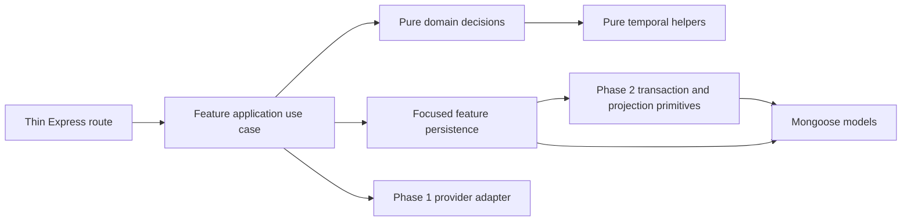

# Refactor Phase 3: backend feature modules and thin routes

> **Status: future implementation manual — not shipped.**
>
> Phase 0 approved this plan's direction, not the implementation described here. Phase 3 starts
> only after Phases 1 and 2 are deployed and accepted. No route, controller, use-case, domain, or
> persistence change described below exists merely because this manual exists.

## Purpose and value

Phase 3 makes the backend easier to change without changing what the product does. It replaces
route-owned workflows and mixed-purpose controllers with explicit feature use cases inside the
existing modular monolith. Express routes become transport adapters; application modules coordinate
one user operation; pure domain modules decide rules from plain values; focused persistence modules
perform named Mongoose queries and invoke the transaction/projection boundaries delivered by Phase
2.

The value is concrete:

- a task lifecycle change has one application entry point instead of logic spread through a 500-line route and several controllers;
- recurrence and scheduling rules can be tested without Express, Mongoose documents, or a database;
- ownership, transaction, and provider boundaries stay visible during review;
- a failure has one use-case name and stage, instead of ad hoc catches across routes;
- feature work can be delivered in small vertical slices without a backend rewrite; and
- routes, successful payloads, stored documents, temporal behavior, and user workflows remain stable.

This is internal modularization, not a new API. It deliberately keeps one Vue application, one
Express process, one primary database, one deployment artifact, and in-process function calls.

## Prerequisites and fixed decisions

### Prerequisites

Before implementation begins:

1. Phase 0 and this manual must have separate approval for implementation.
2. Phase 1 must be deployed and accepted, including `req.actor`, CSRF-safe mutation methods, typed errors, centralized async error handling, structured redacted logging, readiness, and an app composition root.
3. Phase 2 must be deployed and accepted, including request/domain validation, complete legacy `repeat` removal, same-user reference checks, named indexes, transactions, planning leases, recurrence/schedule projection boundaries, atomic cascades, and source-aware Google sync.
4. The Phase 2 MongoDB-versus-PostgreSQL gate must have selected and stabilized the primary store. This manual targets the approved MongoDB/Mongoose path. If that gate starts a PostgreSQL program, pause and revise only the persistence paths after that separately approved migration; do not build generic repositories as a hedge.
5. All existing API and UI specs must pass against the exact artifact used as the Phase 3 baseline.
6. Inventory every repository and external caller that imports `controllers/*` or calls `/api`; assign an owner to any caller not represented by the shipped Vue application.
7. Record per-route request volume, p50/p95/p99 duration, error/code rate, and representative MongoDB operation counts for at least one normal traffic window where production telemetry permits it.
8. Confirm the deployment can route or roll back one immutable artifact without restoring data.
9. Confirm a current database backup satisfies the Phase 2 restore policy. Phase 3 adds no migration, but destructive workflow regressions still require recoverability.

### Fixed decisions

These are not open implementation choices:

- Keep a single-deployable modular monolith. Do not add microservices, an event bus, RPC, queues, or a distributed scheduler.
- Keep Express, Mongoose, the selected Phase 2 primary database, and the existing temporal representation. No framework or database rewrite belongs here.
- Preserve the post-Phase-2 HTTP methods, paths, request fields, statuses, error envelope, successful payloads, serialization, and side effects.
- Preserve Phase 1's single actor/error/logging boundaries and Phase 2's validation, lease, transaction, index, migration, and projection boundaries.
- Organize around product features and named use cases, not technical controller layers.
- Keep domain decisions pure and deterministic. Application orchestration and persistence are separate concerns.
- Use concrete, use-case-named Mongoose functions. Do not create `Repository<T>`, `BaseRepository`, generic CRUD interfaces, unit-of-work facades, or storage-neutral ports for their own sake.
- Do not rename endpoints, pluralize resources, add `/v2`, GraphQL, DTO wrappers, or a cosmetic REST rewrite.
- Do not change Vue endpoint ownership or decompose pages; Phase 4 owns that work.
- Do not change CI triggers, lint/build tooling, or dependencies except for a dependency strictly required to enforce these boundaries; Phase 5 owns broad delivery cleanup.

## Scope

### In scope

- Feature application modules for task queries and lifecycle, recurrence materialization, scheduling, local and Google calendar operations, Compass, and working preferences.
- Pure domain extraction for dependency graphs, task/series decisions, recurrence generation, scheduling placement, event temporal transformation, Compass item rules, and working preferences.
- Focused feature persistence functions over Mongoose and the Phase 2 transaction/projection modules.
- Thin route handlers that authenticate/validate through shared middleware, call one application use case, and translate its result to the established HTTP contract.
- Explicit feature public entry points and enforceable dependency direction.
- Removal of controller re-exports, hidden Mongoose access, duplicated orchestration, and obsolete `controllers/*` files after all callers move.
- Deterministic clocks and plain-value snapshots at domain boundaries.
- Focused architecture, domain, application-failure, API compatibility, and regression tests.
- Per-feature staged rollout, telemetry, artifact rollback, and final documentation path updates.

### Out of scope

- Any new task, recurrence, scheduling, Calendar, Compass, account, or reporting feature.
- Any correction already owned by Phase 1 or 2. Phase 3 moves the corrected implementation; it does not redefine authentication, validation, transactions, recurrence identity, scheduler policy, cascade semantics, or Google sync behavior.
- API path/method/payload redesign or removal of Phase 1 compatibility fields.
- Schema, collection, index, migration, seed-shape, or durable-data changes.
- A PostgreSQL migration, Mongoose replacement, ORM abstraction, or generic repository layer.
- Microservices, separate deployables, network calls between internal features, queues, event buses, CQRS, event sourcing, sagas, or a plugin architecture.
- Broad shared `common`, `helpers`, or `services` dumping grounds.
- Wholesale TypeScript, dependency injection containers, decorators, code generation, or a framework rewrite.
- Vue transport/store/page changes, visual redesign, or duplicated frontend domain logic.
- Performance retuning or query redesign unless measurement shows the move itself caused a regression.
- Unrelated dependency cleanup, formatting churn, file renaming, or comment-only rewrites.

## Requirements

### Architecture and dependency direction

- **REQ-RF3-001:** The implementation shall remain one Vue/Express modular monolith, one API process boundary, one primary database, and one deployable artifact.
- **REQ-RF3-002:** Each protected feature route shall obtain identity only from Phase 1 `req.actor` and shall pass an immutable actor value into one named application use case.
- **REQ-RF3-003:** A migrated route handler shall contain only transport validation/mapping, invocation of one application use case, and response translation; it shall not import Mongoose models, `googleapis`, feature persistence, or pure domain internals.
- **REQ-RF3-004:** Application use cases shall accept plain input, actor, and explicit operational context and shall not accept or return Express `req`, `res`, `next`, Passport users, or mutable Mongoose documents.
- **REQ-RF3-005:** Application use cases shall own orchestration order, transaction/lease scope, calls to domain decisions, persistence, provider gateways, and final feature result assembly.
- **REQ-RF3-006:** Pure domain modules shall have no Express, Mongoose, MongoDB, Google client, logger, process environment, global mutable state, network, filesystem, or wall-clock dependency.
- **REQ-RF3-007:** When a domain decision depends on current time, timezone, horizon, or identifier allocation, its caller shall pass that value explicitly so repeated calls with equal input return equal output.
- **REQ-RF3-008:** Feature persistence modules shall expose concrete intent-named functions such as `loadEditableTask`, `listSchedulingInputs`, or `commitTaskCompletion`; they shall not expose a generic CRUD repository API.
- **REQ-RF3-009:** Every tenant-scoped persistence query or mutation shall include `actor.userId` in the query that reads or writes the resource, even when an upstream use case already checked it.
- **REQ-RF3-010:** Feature `index.js` files shall export only supported application use cases and deliberately shared pure domain functions; callers shall not deep-import another feature's application internals or persistence.
- **REQ-RF3-011:** Dependencies shall flow from routes to application, from application to domain and focused persistence/adapters, and from persistence to models/Phase 2 storage primitives. Domain modules shall not depend outward, and the feature import graph shall be acyclic.
- **REQ-RF3-012:** If two features need one cross-feature operation, the owning feature shall expose a named capability or a small orchestration module shall own that use case; implementation shall not solve the cycle with global helpers or cross-feature deep imports.

### Boundary behavior

- **REQ-RF3-013:** Phase 2 request schemas shall remain the HTTP allowlist, while merged-state and cross-field decisions shall execute in pure domain code before persistence commits.
- **REQ-RF3-014:** Domain failures shall use stable typed application errors and shall be translated once by the Phase 1 HTTP error boundary; routes and domain modules shall not catch, log, or expose raw Mongoose/provider errors.
- **REQ-RF3-015:** Persistence and provider failures shall preserve their cause for safe structured diagnostics, map to the established public code, and never trigger an unbounded or hidden retry.
- **REQ-RF3-016:** A use case spanning documents or projections shall use the exact Phase 2 lease, fencing, transaction, revision, and failure-injection boundary; moving files shall not split or widen that atomic unit accidentally.
- **REQ-RF3-017:** Read and write result DTOs shall preserve ObjectId, civil-date, instant, all-day, virtual/nested Compass, recurrence presentation, sort, null, omitted-field, and pagination behavior from the post-Phase-2 API baseline without leaking Mongoose documents into domain code.
- **REQ-RF3-018:** Task create/edit shall remain one application workflow covering owned references, dependency rules, series redirection, recurrence materialization, and the existing refreshed task result without moving any step back into the route.
- **REQ-RF3-019:** Task completion, chunk completion, deletion, series deletion, and follow-up shall each have one application entry point and shall preserve Phase 2 all-or-nothing cleanup, dependency, history, and projection behavior.
- **REQ-RF3-020:** Recurrence rule validation/normalization/date generation shall be pure domain code; occurrence loading/upsert/prune shall remain persistence; materialization shall be application orchestration.
- **REQ-RF3-021:** Scheduling placement shall consume a plain immutable input snapshot and return a proposed projection without writes; the application use case shall acquire the planning boundary, load input, invoke the planner, and commit through Phase 2 persistence.
- **REQ-RF3-022:** Local event operations and Google event transformation shall be separate from Google authorization/provider calls and local cache persistence; the application use case shall coordinate those existing boundaries.
- **REQ-RF3-023:** Compass shall preserve its bounded live hierarchy, archive, cascade refusal, atomic cascade, and task-alignment contracts while separating item policy, application workflows, and concrete queries.
- **REQ-RF3-024:** Working-preference validation shall be a pure account-domain decision and its save shall be an account application use case; login/session lifecycle shall remain in the Phase 1 auth boundary.

### Compatibility, verification, and operations

- **REQ-RF3-025:** Phase 3 shall introduce no schema, collection, index, migration, or data rewrite, and shall not change any post-Phase-2 API method, path, accepted field, status, or payload.
- **REQ-RF3-026:** Before each legacy route/controller path is replaced, focused tests shall pin its intended domain invariant and public contract without encoding a known Phase 0 defect as desired behavior.
- **REQ-RF3-027:** Automated architecture tests shall reject forbidden route/domain imports, cross-feature persistence deep imports, controller re-exports, cycles among feature public entry points, and new generic repository abstractions.
- **REQ-RF3-028:** During rollout, each use-case execution shall emit bounded duration/outcome/stage telemetry through the Phase 1 logger without task text, notes, titles, raw actor IDs, provider payloads, credentials, or request bodies.
- **REQ-RF3-029:** A failed mutation shall abort through the existing transaction boundary and shall never fall through to a second implementation, dual-write, retry at the route, or report success.
- **REQ-RF3-030:** Each completed feature slice shall be independently deployable and reversible to the immediately preceding post-Phase-2-compatible artifact without a data down-migration.
- **REQ-RF3-031:** A controller file or compatibility re-export shall be deleted only after source, tests, scripts, and production entry points have no caller; no permanent forwarding layer shall remain at Phase 3 completion.
- **REQ-RF3-032:** Final source analysis shall show zero direct model/provider imports in feature routes, zero Express/Mongoose/provider imports in pure domain files, and zero runtime imports from `controllers/`.

## Target directories and responsibilities

Use feature-first directories for behavior. Keep Phase 1 infrastructure and Phase 2 low-level data
primitives where those phases placed them; do not move stable modules merely to make the tree look
uniform.

```text
features/
  account/
    index.js
    domain/workingPreferences.js
    application/updateWorkingPreferences.js
    persistence/accountPreferences.js
  calendar/
    index.js
    domain/eventTime.js
    domain/googleEventTransform.js
    application/userEvents.js
    application/googleCalendar.js
    persistence/userEvents.js
  compass/
    index.js
    domain/itemPolicy.js
    application/hierarchy.js
    application/itemLifecycle.js
    application/taskAlignment.js
    persistence/compassRecords.js
  recurrence/
    index.js
    domain/rules.js
    domain/occurrences.js
    application/materializeOccurrences.js
  scheduling/
    index.js
    domain/planner.js
    application/generateSchedule.js
    persistence/schedulingInputs.js
  tasks/
    index.js
    domain/dependencyGraph.js
    domain/seriesDecisions.js
    domain/taskLifecycle.js
    application/taskQueries.js
    application/saveTask.js
    application/taskLifecycle.js
    application/followUp.js
    persistence/taskRecords.js
routes/
  auth.js
  compass.js
  events.js
  tasks.js
```

The filenames may be split when one cohesive file becomes hard to review, but responsibilities and
import rules are fixed. Do not create one file per trivial function or one giant `taskService.js`.

### Layer contract

| Layer | Owns | Must not own |
|---|---|---|
| `routes/` | Middleware order, validated transport input, one use-case call, established response wrapper | Queries, domain branches, transactions, provider SDK calls, retries |
| `features/*/application` | One user operation, orchestration order, transaction/lease scope, DTO assembly, named telemetry stage | Express objects, raw HTTP statuses, generic CRUD, hidden global dependencies |
| `features/*/domain` | Deterministic rules and decisions over plain objects/values | I/O, Mongoose documents, current time lookup, logging, response formatting |
| `features/*/persistence` | Actor-scoped named queries/writes, mapping documents to plain records, calls to Phase 2 storage primitives | HTTP policy, provider calls, broad business workflows, generic repositories |
| Phase 1 adapters | Auth, error/logging infrastructure, Google OAuth/gateway/token security | Feature persistence or task/Compass policy |
| Phase 2 `validation/` and `persistence/` | Request schemas, transaction/lease/revision/projection primitives | Express route workflows or generic feature services |
| `models/` | Durable Mongoose schema/model definitions | Use-case orchestration or public API DTOs |

Pure helpers from `utils/temporal.js` may be imported by domain code. Domain code must still receive
`now`, actor timezone, and bounds explicitly; importing a pure parser is not permission to read the
clock. Phase 2 `validation/taskState.js`, `eventState.js`, and `compassState.js` may move into the
corresponding domain directory when that feature slice migrates. Keep a temporary re-export only
while repository callers move, then remove it.

### Cross-feature rules

- Task save may call the public Compass capability that resolves an actor-owned `projectRef`.
- Compass owns task alignment and cascade orchestration because those operations cross its hierarchy; its persistence may update task links inside the Phase 2 transaction without importing task application internals.
- Task save and scheduling may call the public recurrence materialization use case. Recurrence must not call task application code.
- Scheduling persistence may read task/event models and call the Phase 2 schedule projection. The pure planner sees only plain snapshots.
- Calendar application code may call the Phase 1 Google gateway/token boundary and Phase 2 sync projection. Neither adapter may call Express routes.
- Auth may call the public account preference use case where needed, but account code must not own login, sessions, CSRF, or OAuth identity.



No arrow points from domain to application/persistence, from persistence to routes, or from models to
feature behavior.

## Affected files

The implementation starts from the post-Phase-2 tree, not today's line numbers. Refresh this table
before coding and preserve any evolved names that already satisfy the boundary.

### Current files expected to change

| File | Phase 3 action |
|---|---|
| `app.js` or `bootstrap/createApplication.js` | Compose route factories with feature public entry points; no feature rules |
| `routes/tasks.js` | Replace validation/orchestration/model access with one use-case call per endpoint |
| `routes/events.js` | Keep OAuth callback transport; delegate local/provider workflows |
| `routes/compass.js` | Keep its useful handler pattern but remove user/model/payload orchestration |
| `routes/auth.js` | Delegate working-preference update only; leave Phase 1 auth lifecycle intact |
| `controllers/taskController.js` | Split queries/lifecycle; remove scheduler re-export; delete file |
| `controllers/recurrence.js` | Split pure rules/generator from materialization; delete file |
| `controllers/scheduling.js` | Consume/produce plain snapshots; move orchestration/persistence; delete file |
| `controllers/eventController.js` | Split transform, local events, provider coordination, persistence; delete file |
| `controllers/compassController.js` | Split policy, use cases, and concrete queries; delete file |
| `validation/taskState.js` | Become or delegate to task/recurrence pure domain validation |
| `validation/eventState.js` | Become or delegate to calendar pure domain validation |
| `validation/compassState.js` | Become or delegate to Compass pure domain validation |
| `persistence/transaction.js` | Consumed unchanged except a narrowly evidenced instrumentation hook |
| `persistence/recurrenceProjection.js` | Consumed by recurrence application/persistence; no generic wrapping |
| `persistence/scheduleProjection.js` | Consumed by scheduling application/persistence; no semantic rewrite |
| `persistence/userPlanningLease.js`, `persistence/planningState.js` | Consumed at the same atomic boundaries |
| `models/index.js` | Model imports move out of routes/controllers; schemas do not change |
| `utils/temporal.js` | Remains the temporal primitive; behavior does not change |

### Tests and manuals expected to change during future implementation

Add `tests/api/architecture.spec.js` and pure specs under `tests/api/modules/`; Playwright remains the
runner. Existing task, recurrence, scheduling, event, Compass, auth, temporal, and related UI specs
remain regression gates. After shipping, update `docs/RECURRING_TASKS.md`, `COMPASS.md`,
`WEEKLY_PLAN.md`, and `AGENTS.md` only to name new paths. Vue source should not change; fix any
accidental backend incompatibility instead.

## Ordered test-first vertical migration slices

Keep all post-Phase-2 characterization specs green. Each slice first adds the smallest failing test
for the target boundary, then moves one complete route-to-storage path. Never commit skipped tests or
run old and new mutation implementations together.

### Slice 1 — freeze contracts and enforce the migration edge

1. Record a route manifest containing the post-Phase-2 method, path, request schema, public use-case name, success shape, expected error codes, and current implementation for every endpoint below.
2. Add `tests/api/architecture.spec.js` with a per-slice migrated-feature list. For migrated features, reject route imports of models/provider SDKs, domain imports of I/O modules, cross-feature deep imports, generic repository class names, and runtime controller imports.
3. Add pure import-smoke tests that load every feature public entry point twice and detect undefined exports/circular initialization.
4. Add only missing contract coverage: owned follow-up all-or-nothing behavior, cross-tenant local event mutation, and successful schedule/sync failure truthfulness if Phases 1-2 did not already add them.
5. Capture JSON responses for representative seeded journeys as local comparison artifacts. Assert meaningful fields/invariants in tests, not brittle whole-payload snapshots.
6. Run all API specs and record route p95, Mongoose operation count, and result cardinality on a scaled fixture for task list, Compass tree/archive, event week, recurrence materialization, scheduling, and Google sync with a fake provider.

### Slice 2 — Compass as the reference feature boundary

1. Keep existing hierarchy, CRUD, archive, validation, tenant, cascade, and task-alignment tests.
2. Add pure `itemPolicy` cases for merged dates/parent decisions only where Phase 2 coverage is not already at that layer.
3. Move live/archive queries into `compass/persistence/compassRecords.js` with actor scope in every query; return plain records while preserving virtual/nested serialization.
4. Move hierarchy reads, item create/edit/delete, cascade, and task alignment into named application functions. Keep Phase 2's cascade transaction intact.
5. Change each Compass route to call one public use case and let the Phase 1 error middleware handle failures.
6. Enable the architecture rule for Compass, remove migrated controller exports, run Compass API/UI specs, then deploy this slice before using it as the pattern for larger features.

### Slice 3 — account preferences and local calendar events

1. Keep auth preference and event create/list/update/delete/temporal tests; add one owned update/delete test if Phase 2 does not already prove same-query tenant scope.
2. Extract working-hours/day/timezone decisions into pure account domain code with explicit inputs.
3. Move preference load/save into the account use case without moving login/session behavior.
4. Extract local event interval decisions and Google event temporal transformation into calendar domain modules; pass timezone explicitly.
5. Move actor-scoped event reads/writes into focused persistence and local event operations into application use cases.
6. Route `updateuserinfo`, local event CRUD, and event-week listing through one use case each; enable architecture rules and run auth, event, temporal, User UI, and Calendar UI specs.

### Slice 4 — recurrence from pure rule to committed projection

1. Move existing exact-date, interval, month-end, count/end, timezone/DST, and description tests to the pure recurrence domain import before changing runtime imports.
2. Keep Phase 2 idempotence, concurrency, stable identity, immediate visibility, pending refresh, completed-history, series edit/delete, and injected-abort tests at API level.
3. Extract rule normalization/validation and occurrence-date generation with no model import or clock read. Pass civil `today`, anchor, and horizon explicitly.
4. Put occurrence/template queries and Phase 2 projection calls behind intent-named recurrence persistence functions.
5. Make `materializeOccurrences` acquire/use the existing planning operation context, load templates, call the generator, and atomically commit wanted/pruned/synchronized occurrences.
6. Switch task/schedule transitional callers to the recurrence public entry point, remove recurrence deep imports, enable its architecture rule, and run recurrence plus scheduling specs.

### Slice 5 — task reads, create, and edit

1. Keep task-list ownership/filter/sort, project-completion timezone window, CRUD civil-date, dependency, project ownership, server-owned field, immediate-series, and series-edit tests.
2. Add pure dependency-graph and series-target decision cases; use plain string IDs and explicit current state.
3. Move active-task/series presentation and project-completion queries to focused task persistence. Preserve response-only `seriesRecurrence` without placing presentation logic in domain code.
4. Implement `listTasks` and `listProjectCompletions` application reads.
5. Implement `createTask` and `editTask` application workflows using Phase 2 validators/transactions, the Compass owned-project capability, task domain decisions, recurrence materialization, and the existing refreshed result.
6. Switch the four routes independently, enable task read/save architecture rules, compare baseline payload/cardinality/query count, and run task, recurrence, Compass, Calendar, and Weekly Plan specs.

### Slice 6 — destructive task lifecycle and follow-up

1. Keep Phase 2 tests for atomic task/series delete, generated-event/dependency cleanup, completed history, chunk races, completion cleanup, and injected failures.
2. Add a focused follow-up test proving an owned source completes and the standard 20-minute follow-up is created on the requested civil date in one transaction; failure leaves both states unchanged.
3. Extract pure completion/chunk/delete/series decisions from stored document mutation. The domain returns commands or a decision, never saves a document.
4. Implement separate application entry points for complete, complete chunk, delete, and follow-up; each owns exactly one Phase 2 atomic boundary and returns the established refreshed task list.
5. Switch one route at a time. Do not catch a commit error and retry through legacy code.
6. Enable lifecycle architecture rules and run task, recurrence, scheduling, Calendar, and Weekly Plan specs plus all Phase 2 failure-injection cases.

### Slice 7 — scheduling planner and application orchestration

1. Keep every Phase 2 comparator, progress, projection-abort, concurrency, revision, and existing scheduler invariant test.
2. Add a pure planner fixture that supplies a frozen actor planning profile, frozen tasks/events, recurrence policies, explicit `now`, and horizon, then asserts the proposed projection and leaves every input deeply unchanged.
3. Move input queries/mapping into scheduling persistence. A Mongoose document must not enter the planner.
4. Make the pure planner return generated event/task-date commands, unscheduled reason counts, iterations, and progress outcome without writing or logging.
5. Make `generateSchedule` acquire the Phase 2 lease/fence, capture revision, materialize recurrence, load a coherent snapshot, invoke the planner, validate, and commit through `scheduleProjection`.
6. Route the post-Phase-1 POST schedule endpoint to this one use case, remove task-controller re-export, enable scheduling architecture rules, and run all scheduling/recurrence/task API specs plus Calendar UI.

### Slice 8 — Google Calendar application boundary

1. Keep Phase 1 OAuth state/token/gateway/retry/error tests and Phase 2 source identity/atomic cache tests; all provider calls use fakes in automated tests.
2. Keep pure timed/all-day/source-timezone transformation tests on the calendar domain import.
3. Implement named application use cases for OAuth start/callback coordination, calendar listing, and sync using the existing Phase 1 OAuth/gateway/vault and Phase 2 sync projection.
4. Keep callback query/redirect mechanics in the route, but pass parsed transport input to one OAuth application use case; no route constructs a Google client.
5. Ensure list/sync use cases return success only after their provider and persistence work succeeds; preserve bounded retry and all-or-nothing cache behavior.
6. Enable calendar-provider architecture rules and run event/auth/temporal API specs plus User and Calendar UI provider flows available in staging.

### Slice 9 — remove transitional architecture and prove the whole system

1. Search runtime, tests, scripts, manuals, and built entry points for imports from `controllers/`, route imports of models/provider SDKs, and deep cross-feature imports.
2. Delete controller files and temporary validation/controller re-exports only after the search and import-smoke tests are clean.
3. Make the architecture test enforce every feature with no migration allowlist and verify the feature dependency graph is acyclic.
4. Update active manuals to shipped paths and preserve their behavior explanations.
5. Build the frontend, run focused module/API/UI groups, then run `npm test` once at finalization.
6. Exercise deployment, telemetry, rollback, and transaction failure drills; remove temporary route comparison labels or rollout switches before declaring Phase 3 complete.

## API and data compatibility

The compatibility baseline is the fully deployed Phase 2 artifact, not the Phase 0 source snapshot.

### Endpoint compatibility matrix

| Feature | Paths retained | Phase 3 rule |
|---|---|---|
| Tasks | `createTask`, `editTask`, `deleteTask`, `completeTask`, `completeTaskChunk`, `getProjectCompletions`, `getUserTasks`, `setFollowUp` | Same methods, request fields, result fields, sort, serialization, and side effects |
| Scheduling | `scheduletasks` | Retain Phase 1's safe POST method and Phase 2 atomic result/error behavior |
| Local events | `createEvent`, `updateEvent`, `deleteEvent`, `getUserEvents/:date` | Same interval, week, ownership, list, and event shapes |
| Google | `connectGoogle`, `connectGoogleCallback`, `getCalendars`, `synccalendar` | Retain Phase 1 methods/security/errors and Phase 2 sync identity/atomicity |
| Compass | `getCompass`, `getCompassArchive`, create/edit/delete Role/Goal/Project, `setTaskProject` | Same bounded hierarchy, pagination, mutation payload, and cascade semantics |
| Account | `updateuserinfo`; Phase 1 auth/session routes | Preferences delegate; auth/session paths and behavior remain untouched |

All paths remain mounted under `/api`. Existing trailing-slash tolerance remains whatever Express and
Phase 1 established. Do not introduce aliases as migration scaffolding because no client migration is
required.

### Response and temporal compatibility

- Keep the Phase 1 success/error envelope, semantic status, safe `log` alias, and request ID exactly as deployed after Phase 2.
- Keep successful task mutation responses that return refreshed `taskList`, Compass mutations that return the refreshed live payload, and event deletion's refreshed `eventList`.
- Keep civil dates as `YYYY-MM-DD`, instants as instants, all-day source dates/timezones, null versus omitted fields, ObjectId string serialization, and Compass populated virtuals.
- Keep completed recurrence history immutable and templates hidden from active task lists.
- Do not expose internal command objects, Mongoose metadata, leases, revisions, provider responses, or domain error details in public output.

### Durable data compatibility

- Phase 3 defines no migration and writes no new field.
- Collection names, model names, indexes, validators, transaction metadata, planning revisions, recurrence identities, event identities, and encrypted credentials remain Phase 2/1 owned.
- Feature persistence must use the existing models and storage primitives; it may map documents to plain snapshots but must preserve exact values and version checks.
- A post-Phase-2 artifact and any partially migrated Phase 3 artifact can read/write the same database. A pre-Phase-2 artifact is never a valid rollback target.
- Do not convert populated Mongoose documents to `lean()` merely for layering if it changes virtuals, defaults, transforms, getters, or serialization. Prove equivalence first or map explicitly.

## Rollout and observability

### Preflight

Answer the unresolved questions; name release/rollback owners; record the baseline artifact, route
manifest, tests, schema range, restore evidence, route metrics, and representative query counts.
Verify dashboards safely accept use-case fields, retain one immutable post-Phase-2 rollback artifact,
and rehearse Compass/task slices against a restored production-like database.

### Release sequence

1. Deploy Slice 1 architecture/telemetry scaffolding with no routed behavior change.
2. Deploy Compass first and observe one normal Compass/Weekly Plan usage window.
3. Deploy account/local events, then recurrence, then task read/save, one completed slice at a time.
4. Deploy destructive task lifecycle only after mutation and injected-failure evidence is green.
5. Deploy scheduling separately and observe scheduling duration, busy outcomes, projection revisions, invariant errors, and calendar results.
6. Deploy Google orchestration separately when a staging provider test and rollback window are available.
7. Delete controllers and rollout scaffolding only after every endpoint uses the feature boundary and the agreed soak passes.

Use normal immutable artifact rollout or a route-family switch if the platform already supports safe
configuration rollout. Do not add a permanent feature-flag framework. Read paths may be shadowed at a
small sampled rate only if the operator approves the extra database load; compare hashes/counts, not
user content. Never shadow, dual-run, or fall back after a mutation.

### Telemetry

Use Phase 1 structured redacted logging and Phase 2 transaction/lease/projection telemetry. Add one
instrumentation wrapper at application composition, not bespoke logging in every route/domain file.

Emit at minimum:

- `use_case.started`, `use_case.completed`, and `use_case.failed` with stable use-case name, feature, implementation version during rollout, request ID, actor pseudonym, outcome code, stage, and duration;
- persistence duration and operation-count buckets by named operation, never raw query/filter values;
- domain rejection counts by stable code;
- transaction attempt/abort/retry, lease wait/busy, revision conflict, recurrence materialization, schedule calculation/commit, cascade, and sync metrics already required by Phase 2; and
- route status/duration from Phase 1, correlated by request ID but not duplicated as a second error log.

Never log task/event/Compass titles, notes/descriptions, emails, usernames, raw IDs, dates supplied by
users, Google calendar IDs, provider payloads, credentials, request bodies, Mongoose documents, or
full result DTOs.

During each slice compare candidate versus baseline:

- success/error/code rate by route template and use case;
- p50/p95/p99 route and use-case duration;
- database operation count and returned/result cardinality for representative reads;
- transaction abort/retry, lock wait/busy, duplicate key, stale revision, and provider failure rates;
- schedule projection invariant/age, recurrence duplicate/history, cascade orphan, and sync partial failure signals; and
- process readiness, startup import failures, uncaught errors, memory, and event-loop delay.

Stop rollout on any response-shape mismatch, cross-tenant result, partial mutation, architecture import
failure, new orphan/duplicate/invariant alert, unexplained result-cardinality change, or sustained 5xx
regression. Unless an operator approves stricter measured thresholds, also stop if candidate p95 is
more than 10% slower for two normal windows or 5xx rate rises by at least 0.5 percentage points.

## Backup, rollback, and failure handling

### Backup rules

Phase 3 has no migration: use the current Phase 2 backup/PITR policy, not ad hoc per-slice dumps.
Record backup ID/cluster time, schema version, artifact, RPO/RTO, and isolated restore proof. Back up
the complete runbook-defined database, not selected feature collections. Roll back code first;
restore data only for proven committed corruption and with explicit RPO authority.

### Rollback checkpoints

| State | Safe rollback |
|---|---|
| Before a route is switched | Redeploy current artifact; no runtime behavior or data changed |
| One feature slice routed | Redeploy the immediately prior post-Phase-2-compatible artifact |
| Multiple slices routed | Roll back the latest artifact/slice; database needs no down-migration |
| Controllers deleted | Redeploy the retained compatible artifact; do not recreate forwarding code live |
| Confirmed committed corruption | Stop writes, preserve evidence, restore the verified full backup only with rollback authority |

Do not roll back to Phase 0/pre-Phase-2 code: it may bypass validators, leases, transactions,
revisions, encrypted credentials, and current schema contracts. Retain rollback artifacts through the
final soak and normal backup-retention window.

### Failure handling

- **Feature import/cycle failure:** readiness must remain false; emit a redacted startup failure and redeploy the previous artifact.
- **Domain rejection:** return the existing typed client error with no write and one outcome metric.
- **Persistence/provider failure before commit:** abort, return the established typed failure, and retain prior state; never retry in the route.
- **Transient/unknown transaction outcome:** use only Phase 2's bounded idempotent resolution. Do not wrap it with an application retry.
- **Lease busy/fence mismatch/revision change:** preserve the Phase 2 retryable outcome and perform no fallback write.
- **DTO/serialization mismatch:** stop that slice; do not change Vue callers to accept an accidental response.
- **Shadow-read mismatch:** record bounded field/count mismatch codes without payload content, disable shadowing, and keep the baseline route active.
- **Candidate performance regression:** stop or roll back; inspect query plans/mapping before changing indexes or product behavior in this phase.
- **Mutation regression:** disable writes/readiness for the affected deployment if possible, roll back the artifact, run Phase 2 integrity audit, and restore only if committed corruption is proven.
- **Logger/telemetry failure:** follow Phase 1 fallback behavior; observability failure must not retry or duplicate a mutation.

## Measurable acceptance

Phase 3 is accepted only when all evidence below exists:

1. REQ-RF3-001 through REQ-RF3-032 map to implementation commits and passing tests.
2. Every endpoint in the compatibility matrix reaches exactly one public feature application use case after shared auth/request validation; the route itself performs no feature query or workflow.
3. Automated analysis reports zero model, provider-SDK, or feature-persistence imports from migrated routes and zero Express/Mongoose/provider/logging imports from pure domain files.
4. The complete feature public-entry dependency graph is acyclic and has zero unauthorized deep cross-feature imports.
5. Source/runtime search reports zero imports from `controllers/`; the five legacy controller files and temporary forwarding exports are absent.
6. No generic repository/base service/unit-of-work abstraction exists; every persistence export has a documented feature intent and actor-scoping test where tenant data is involved.
7. Pure domain tests run recurrence generation, scheduler planning, task dependency/series/lifecycle, event transformation, Compass policy, and preference validation from plain frozen values with an explicit clock/timezone where relevant.
8. Mutation tests prove route/application errors cannot dual-run, fall back, or commit partial task, series, schedule, cascade, follow-up, or sync state.
9. Actor A cannot read or mutate actor B through task, event, Compass, completion, scheduling, account, OAuth, or sync application entry points; ownership is present in the persistence query.
10. Representative API contract comparisons show identical post-Phase-2 methods, statuses, error codes/envelopes, successful fields, null/omission rules, sort order, temporal serialization, and result cardinality.
11. Collection/index/validator manifests and pre/post document counts are unchanged except for intentional test/user operations; Phase 3 has no migration record or schema write.
12. Existing recurrence generator/identity/history, scheduler invariant/concurrency, task lifecycle, event temporal/sync, Compass cascade/tenant, auth/preferences, timezone/DST, Calendar, Weekly Plan, Compass UI, User, and login specs remain green.
13. Scaled-fixture database operation counts do not increase for key reads/writes unless the pull request records an approved, measured correctness reason.
14. Candidate p95 and 5xx rates remain inside the approved rollout thresholds for every feature slice through the agreed soak, with no new critical Phase 1/2 alert.
15. Startup/readiness fails safely for a missing feature export or injected import-cycle fixture, and the previous immutable artifact restores service without a database restore.
16. The rollback drill, Phase 2 integrity audit, backup-reference check, focused suites, and final `npm test` all pass.
17. Active backend manuals name the shipped feature boundaries, and no manual directs new code into deleted controllers.
18. Temporary comparison instrumentation, migration allowlists, route switches, and compatibility re-exports are removed before Phase 3 is reported as shipped.

## Unresolved deployment and user questions

These require facts unavailable in the repository and must be answered before rollout. They do not
reopen the fixed architecture:

1. Does production use slot swap, rolling replacement, canary routing, or in-place restart, and can a single route-family artifact be drained/rolled back without alternating incompatible workers?
2. What normal traffic window and approved p95/p99, 5xx, database-operation, memory, and event-loop thresholds should replace or tighten the default stop thresholds above?
3. Which log/metric platform receives Phase 1 structured events, and can it aggregate stable use-case names/stages while enforcing the required content and retention restrictions?
4. Are there external scripts, jobs, tests, or packages that deep-import controller functions or depend on undocumented Mongoose serialization, and who owns moving each one to a public feature entry point?
5. Are there non-Vue HTTP clients whose contract should be sampled during compatibility verification, even though no API migration is planned?
6. What are the largest production task/event/series/Compass counts per user, and which restored dataset is approved for query-count and planner-memory rehearsal?
7. Is sampled read shadowing permitted in production, at what rate, and can the database absorb the duplicate read load? If not, staging comparison and canary metrics remain the rollout evidence.
8. Is Google Calendar enabled in staging with a dedicated non-personal test account and callback, or must provider-boundary verification occur only with fakes plus a controlled production canary?
9. What are the current backup identifier, RPO/RTO, last isolated restore date, and named authority who may stop writes or approve restore after a destructive workflow regression?
10. How long must each feature family soak to include normal Compass, recurrence horizon, schedule, task completion/follow-up, and Google sync activity before its old artifact can expire?

Until these are answered and acceptance evidence passes, this document remains a future manual and
makes no claim that Phase 3 modularization has shipped.

## Finding traceability

Finding labels are local to this manual. Source locations describe the approved Phase 0 snapshot;
refresh them after Phases 1-2 because those phases intentionally alter the files first.

| Finding | Approved Phase 0 evidence | Phase 3 requirements | Slices | Acceptance |
|---|---|---|---|---|
| `RF3-F01` Routes perform use-case, validation, authorization, and persistence work | Audit verdict; `routes/tasks.js:15-537`, especially create/edit/delete/complete/follow-up/schedule | RF3-002–005, 013–019 | 1, 5–7 | 2–3, 8–10 |
| `RF3-F02` `routes/tasks.js` is a 500+ line application service | Maintainability finding 1; `routes/tasks.js:15-537` | RF3-003, 005, 018–021, 031–032 | 5–7, 9 | 2, 5, 8 |
| `RF3-F03` Recurrence combines validation, normalization, presentation, pure generation, compatibility, and persistence | Maintainability finding 2; `controllers/recurrence.js:40-545` | RF3-006–007, 013, 020 | 4 | 7, 10, 12 |
| `RF3-F04` Task controller combines query shaping, completion, legacy cloning, and scheduler re-export | Maintainability finding 2; `controllers/taskController.js:13-135` | RF3-005, 017–019, 031 | 5–7, 9 | 2, 5, 8, 10 |
| `RF3-F05` Event route/controller mix transport, Google SDK calls, local persistence, transformation, and retry/sync orchestration | Boundary-leakage verdict; `routes/events.js:18-305`; `controllers/eventController.js:11-255` | RF3-003–006, 015, 022 | 3, 8 | 2–4, 8–10 |
| `RF3-F06` Compass is close to the desired thin-route/service boundary and should be preserved as the first pattern | Preserved foundation; `routes/compass.js:21-94`; `controllers/compassController.js:40-389` | RF3-008–012, 023 | 2 | 2–4, 6, 9–10 |
| `RF3-F07` Schema/reference, index, recurrence legacy, scheduler correctness, atomic cascade, sync identity, and migration defects are data-integrity work, not excuses for Phase 3 redesign | Maintainability findings 3–9; Phase 0 task lines 50–56 | RF3-013, 016, 019–023, 025, 029–030 | All consume Phase 2; none reimplement it | 8, 11–16 |

### Preserved coverage used as regression evidence

| Current spec | Preserved contract |
|---|---|
| `tasks.spec.js` | Ownership, civil-date CRUD, dependencies, lifecycle, completion windows, server-owned fields |
| `recurrence.spec.js` | Pure dates, identity/idempotence, visibility, history, series edit/delete |
| `scheduling.spec.js` | Working windows, overlap, eligibility, dependencies, chunks, horizon, DST, idempotence |
| `events.spec.js` | Ownership/week bounds and timed/all-day Google transformation |
| `compass.spec.js` | Bounded hierarchy/archive, validation, tenant, cascade, alignment |
| `auth.spec.js`, `temporal.spec.js` | Preferences and temporal primitives; retain Phase 1 security specs |
| Related UI specs | Calendar, Weekly Plan, Compass, User, and login journeys against the unchanged API |
