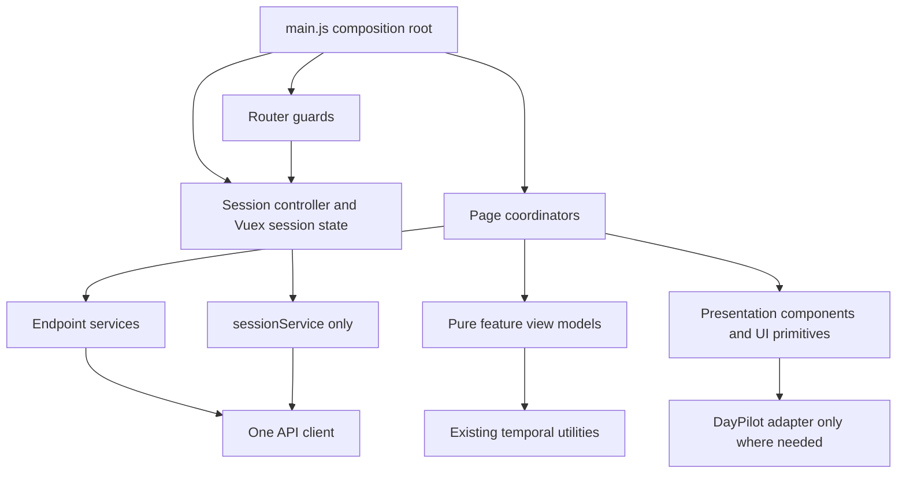

# Refactor Phase 4: frontend boundaries and accessible UI foundations
> **Status: future implementation manual — not shipped.**
>
> Phase 0 approved this plan's direction, not the implementation described here. Phase 4 starts only after the secure cookie/session boundary from
> Phase 1 is deployed and accepted. No API client, endpoint service, view model, component split, accessibility primitive, head change, or style
> cleanup below exists merely because this manual exists.

## Purpose and value
Phase 4 makes the existing Vue application easier and safer to change without rewriting it. It finishes the frontend side of Phase 1's session
boundary, gives every endpoint one typed-by-convention service method, moves derivation out of page templates, and divides large feature pages along
user-visible responsibilities. It also provides a small set of loading/error/dialog primitives, one head-management path, and semantic design tokens.

The user value is concrete:
- expired sessions and failed requests always settle and produce an understandable next step;
- one click causes at most one mutation, even while a request is slow;
- Calendar can report partial load and action failures instead of silently logging them;
- Weekly Plan keeps its timezone, grouping, history, and per-project draft behavior while becoming independently changeable;
- Compass keeps its bounded hierarchy and cascade protections while gaining reliable retry states;
- keyboard and screen-reader users receive labels, focus management, busy state, and live status;
- page titles and descriptions describe AutoTaskCalendar rather than GitHub issues; and
- repeated colors, spacing, Bootstrap overrides, and DayPilot overrides have named ownership.

This phase retains one Vue 3 application in the existing modular-monolith artifact. It is an incremental boundary refactor, not a product redesign or
framework migration.

## How to use this manual
1. Resolve the deployment questions at the end and record the answers in the implementation PR.
2. Capture the exact deployed post-Phase-1 API manifest; if Phases 2 or 3 shipped, they become the compatibility baseline without changing this
   frontend dependency direction.
3. Implement the slices in order. Write or update each slice's focused test before moving code.
4. Keep only one active request path for a user action; never compare implementations by dual-sending a mutation.
5. Deploy and observe completed slices independently where release mechanics permit.
6. Use the acceptance checklist as evidence. Do not call Phase 4 shipped because files moved.

## Prerequisites and fixed decisions
### Prerequisites
Before implementation begins:

1. Phase 0 and this manual must have separate implementation approval.
2. Phase 1 must be deployed and accepted, including the secure `HttpOnly` cookie session, in-memory CSRF token, `unknown -> authenticated|anonymous`
   bootstrap, same-origin Axios instance, semantic status codes, safe error envelope, request IDs, and POST methods for logout, scheduling, sync, and
   Google OAuth initiation.
3. The frontend and API must be deployed as one mutually compatible artifact. Do not start Phase 4 against Phase 1's legacy JWT bridge or an API that
   still accepts bearer tokens.
4. If Phases 2 and 3 have shipped under the approved program order, their accepted artifact and unchanged public API are the baseline. Phase 4 shall
   not depend on backend source paths.
5. All current API/UI specs must pass against the exact baseline artifact. Record any accepted browser console errors before changing code; do not
   silently adopt them as normal.
6. Inventory non-Vue callers and embedded/browser clients. Phase 4 changes no network contract, but rollout evidence must distinguish their traffic
   from the shipped SPA where possible.
7. Record supported browsers, production public origin, CDN/cache behavior, deployment strategy, frontend telemetry facilities, source-map policy, and
   normal frontend/API error rates.
8. Keep the immediately previous post-Phase-1-compatible immutable artifact available and prove it can be redeployed without restoring the database.

### Fixed decisions
These are not open implementation choices:

- Keep Vue 3, Vue Router, Vuex, Vue CLI, Options API components, Axios, Bootstrap Vue Next, Sass, DayPilot, and `@vueuse/head` during this phase.
- Keep one web application, one API process, one primary database, and one deployment artifact.
- Phase 1's server-side session is the only browser authentication lifecycle. Do not reintroduce JWTs, `Authorization` defaults, auth data in
  `localStorage`, or a second session store.
- Keep same-origin requests and Phase 1 CSRF behavior. No service may bypass the shared client.
- Preserve the deployed API's paths, methods, request fields, statuses, successful payloads, error envelope, null/omission rules, sort order, and side
  effects.
- Preserve civil dates, instants, wall times, IANA timezones, DST behavior, all-day event bounds, Monday Weekly Plan bounds, and Sunday Calendar event
  bounds. Keep `webinterface/src/utils/temporal.js`; do not replace date/time libraries or calculate calendar days with offsets or milliseconds.
- Preserve recurrence, scheduler, task history, Compass, Weekly Plan, and Google Calendar product behavior except for explicit client
  failure/accessibility corrections in this manual.
- Keep Weekly Plan a stateless lens over tasks and Compass. Do not add a weekly-plan model or store.
- Keep Compass status interpretation client-side and keep role colors derived from API order.
- Do not require wholesale TypeScript, Composition API, Pinia, Vite, a new component framework, a DayPilot replacement, or a visual redesign.
- Follow the existing risk-based Playwright strategy; do not add a second test runner solely to make extraction convenient.

## Scope
### In scope
- Finalize one frontend composition root for the Phase 1 client and session controller.
- Normalize safe HTTP failures into one frontend `ApiError` shape while retaining request IDs.
- Add endpoint services for session, account, tasks, calendar/Google, and Compass.
- Remove direct Axios, `$http`, endpoint strings, and response-envelope interpretation from views and components.
- Make cancellation, stale-response suppression, duplicate-submit prevention, and mutation-outcome-unknown handling explicit.
- Decompose Calendar into toolbar, task sidebar, all-day row, DayPilot wrapper, follow-up dialog, shared task editor integration, pure derivation, and
  page orchestration.
- Isolate DayPilot conversion and imperative DOM/timer behavior behind one adapter.
- Extract pure Weekly Plan and Compass view models and focused presentation components.
- Preserve and standardize Weekly Plan's required-versus-optional loads and request-race handling.
- Give Compass main/archive reads explicit loading, empty, error, and retry states.
- Add small status, dialog, and form-error primitives used by touched pages.
- Correct Login/Register form semantics and apply busy/error/focus behavior to touched mutations.
- Unify page metadata on `@vueuse/head` and remove inactive `metaInfo` declarations.
- Introduce semantic design tokens; consolidate global, Bootstrap, feature, and DayPilot style ownership while preserving the current visual language
  and responsive behavior.
- Add focused UI, failure-injection, keyboard/focus, lifecycle-cleanup, and architecture tests.
- Roll out feature slices with privacy-safe operation telemetry, smoke checks, and artifact rollback.

### Out of scope
- Any backend route, use-case, schema, collection, index, migration, transaction, or data change.
- API renaming, `/v2`, GraphQL, REST cosmetics, generated API clients, or removal of Phase 1's `{ success, log, error }` compatibility fields.
- Authentication/OAuth protocol changes, session storage changes, or CSRF policy changes.
- New task, recurrence, scheduling, Calendar, Compass, Weekly Plan, profile, or Google features.
- Changing scheduler decisions, recurrence materialization, series edit/delete meaning, completion history, Compass cascade semantics, or provider
  sync policy.
- A global domain cache, offline mode, service worker, optimistic-write framework, or background synchronization layer.
- A new weekly plan or Compass backend endpoint to avoid client derivation.
- SSR, prerendering, a general SEO program, marketing rewrite, or analytics-provider migration.
- A comprehensive design system, theme picker, icon rewrite, illustration rewrite, animation redesign, or pixel-for-pixel recreation in another CSS
  framework.
- Wholesale TypeScript, Composition API, Pinia, Vite, CSS-in-JS, or dependency cleanup. Phase 5 owns build-tool and broad dependency work.
- Replacing DayPilot or promising to remediate inaccessible internals that the installed vendor does not expose; the surrounding controls and authored
  content remain in scope.
- Reformatting unrelated files or moving utilities solely for directory symmetry.

## Requirements
### Application, client, and session boundary
- **REQ-RF4-001:** The implementation shall remain one Vue application in the existing single-deployable modular monolith.
- **REQ-RF4-002:** Phase 4 shall consume Phase 1's cookie session, CSRF token, actor state, and safe error contract and shall not issue, read,
  persist, or send a bearer token.
- **REQ-RF4-003:** The composition root shall create exactly one Axios instance before mounting the app and shall install its session hooks and
  response interceptors exactly once.
- **REQ-RF4-004:** Source outside the API foundation shall not import Axios, mutate Axios defaults, use `$http`, construct an `Authorization` header,
  or persist session/user/CSRF state in browser storage.
- **REQ-RF4-005:** One session controller shall own bootstrap, login, registration, logout, current-user refresh, expiry, and
  `unknown|authenticated|anonymous` state transitions.
- **REQ-RF4-006:** Router guards shall await the same in-flight session bootstrap and shall preserve the requested destination without starting
  duplicate `/api/session` calls.
- **REQ-RF4-007:** On HTTP 401, the client shall reject the original request, coalesce the authenticated-to-anonymous transition, clear actor/CSRF
  state, and navigate through the agreed session path without installing another interceptor or leaving a pending promise.
- **REQ-RF4-008:** A session transition shall not depend on a feature service, and the client shall depend only on injected session hooks rather than
  importing Vuex or Vue Router; the composition root shall prevent a client/store/router cycle.

### Endpoint services and failure contract
- **REQ-RF4-009:** Every `/api` path and method used by Vue source shall be declared in exactly one endpoint service; views, feature components, view
  models, and the Vuex store shall contain no endpoint strings.
- **REQ-RF4-010:** Endpoint services shall depend on the shared client and plain values only; they shall not import Vue, Vuex, Vue Router, components,
  `window`, `document`, or DayPilot.
- **REQ-RF4-011:** Services shall use intent-named methods and return the established payload values, not Axios response objects or invented backend
  DTOs.
- **REQ-RF4-012:** The client shall convert non-2xx responses, Phase 1 `{success:false}` responses, network failures, cancellation, timeout, and
  malformed success payloads into one `ApiError` with `code`, safe `message`, `status`, `requestId`, `operation`, `retryable`, and `outcomeUnknown`.
- **REQ-RF4-013:** If an expected success discriminator or required response field is absent, the client/service shall fail with
  `CLIENT_PROTOCOL_ERROR`; a page shall not render missing data as an empty collection.
- **REQ-RF4-014:** Requests that can become stale shall accept an `AbortSignal` or compare a monotonic request ID. Unmounting, week navigation, retry,
  and archive-level changes shall prevent stale responses from replacing current state.
- **REQ-RF4-015:** The client shall not automatically retry mutations. When transport fails after a mutation may have reached the server, the UI shall
  mark the outcome unknown and refresh the authoritative resource before enabling an unsafe repeat.
- **REQ-RF4-016:** A visible retry shall repeat only the failed read or deliberate user action; it shall not reload unrelated successful data unless
  consistency requires an explicit combined load.
- **REQ-RF4-017:** Each request shall carry a stable allowlisted operation name for local telemetry; telemetry shall contain no username, email,
  task/event/Compass text, IDs, request/response bodies, query values, auth/CSRF data, provider payloads, or raw errors.
- **REQ-RF4-018:** Components shall present safe server messages and request references through UI state rather than `console.log`, `console.error`,
  `alert`, or swallowed catches.

### Calendar decomposition
- **REQ-RF4-019:** `Calendar.vue` shall be a page coordinator that composes focused components and services; it shall not contain DayPilot transport
  callbacks, endpoint strings, direct DOM queries, or feature-wide CSS.
- **REQ-RF4-020:** A pure Calendar model shall derive task groups/order, 14-day sidebar visibility, backlog/unscheduled labels, due-state values,
  project option groups, and all-day labels without Vue, HTTP, DayPilot, DOM, or wall-clock reads; callers shall pass `now` and timezone explicitly.
- **REQ-RF4-021:** A DayPilot adapter/wrapper shall be the only feature module that imports DayPilot or converts API instants to DayPilot wall values.
  It shall emit user intents and shall not call endpoint services itself.
- **REQ-RF4-022:** Calendar temporal conversion shall continue to use `apiDateOnly`, `dateOnlyInTimeZone`, `addCalendarDays`, `calendarDayDifference`,
  `dayPilotWallToIso`, `instantToDayPilotWall`, and `instantPartsInTimeZone` as appropriate.
- **REQ-RF4-023:** Initial task and event reads shall be awaited and expose distinct loading/error/retry state. Compass remains optional task-editor
  context; its failure shall be visible but shall not block tasks or the calendar.
- **REQ-RF4-024:** Week navigation shall cancel or supersede the prior event read and shall never render a late response for another week.
- **REQ-RF4-025:** Create, move, resize, delete, complete, schedule, sync, and follow-up actions shall disable only conflicting controls, announce
  progress/outcome, and reconcile from the server on failure instead of leaving an unconfirmed DayPilot mutation visible.
- **REQ-RF4-026:** Quick completion shall retain a task until success, issue at most one request per task while pending, preserve the current
  partial-refresh message, and refresh task events after a confirmed completion.
- **REQ-RF4-027:** All-day events shall preserve exclusive `allDayEnd`, current API civil markers, non-UTC rendering, delete semantics, and their test
  data attributes.
- **REQ-RF4-028:** Current-time highlighting shall be owned and disposed by the DayPilot wrapper; all intervals, listeners, abort controllers, and
  body classes shall be removed on unmount.
- **REQ-RF4-029:** Calendar and Weekly Plan shall continue to use the same Task Editor behavior, project choices, recurrence warning,
  completion/delete semantics, and refreshed task list.

### Weekly Plan and Compass view models
- **REQ-RF4-030:** A pure Weekly Plan view model shall accept roles, incomplete tasks, bounded completion history, explicit civil week/today,
  timezone, and locale and return render-ready hierarchy, totals, started/Someday/outside/unaligned groups, project options, task order, and
  completion labels without HTTP, Vue, DOM, or mutable global state.
- **REQ-RF4-031:** Weekly Plan shall remain a Monday-Sunday stateless lens: due dates determine this-week membership, `completedDate` in the saved
  timezone determines previous-week history, parked projects cannot quick-create, and opening/leaving the page never schedules work.
- **REQ-RF4-032:** Compass and incomplete-task reads shall remain required and independently diagnosable; completion history shall remain optional,
  non-blocking, bounded, and independently retryable.
- **REQ-RF4-033:** Completion-history loads shall preserve request-ID race protection, recompute after a visible Monday rollover, and restore useful
  focus after a successful retry.
- **REQ-RF4-034:** Quick-task drafts shall remain keyed by project; one failure shall preserve that draft and every other project's draft, and
  successful create shall use the returned task list.
- **REQ-RF4-035:** Task edits, completion, deletion, and alignment shall immediately rederive the correct Weekly Plan group without navigation,
  duplicate requests, or mutation of view-model input.
- **REQ-RF4-036:** A pure Compass view model shall derive started projects, Someday projects with parent labels, archive summary, active task counts,
  role colors, date labels, and parent-ending guards from explicit API values.
- **REQ-RF4-037:** Compass shall treat the live hierarchy as already bounded by the server and shall not duplicate backend live/archive policy or add
  stored status flags.
- **REQ-RF4-038:** Archive detail shall remain lazy, level-specific, paged by 20, append in order, supersede stale level requests, and distinguish
  loading, empty, error, retry, and exhausted states.
- **REQ-RF4-039:** Compass create/edit/end/delete shall consume the mutation's refreshed live payload; cascade refusal shall require accessible
  confirmation and shall preserve every affected task while unlinking it exactly as the API specifies.

### Status, accessibility, head, and styles
- **REQ-RF4-040:** One status primitive shall render loading/info/success with polite `role=status` semantics and errors with `role=alert`, plain text
  only, optional retry, and an optional safe request reference; pages shall not announce the same transition twice.
- **REQ-RF4-041:** One dialog shell shall provide an accessible name, `aria-modal`, initial focus, contained Tab/Shift+Tab focus, Escape/cancel
  handling where safe, background scroll control, and focus return to the invoking control. Task and Compass destructive confirmations shall use it
  instead of `window.confirm`.
- **REQ-RF4-042:** Login and Register shall use semantic `<form>` submission, persistent labels, autocomplete attributes, associated field errors,
  disabled/busy submit state, and an announced summary error while preserving server-side validation as authoritative.
- **REQ-RF4-043:** Every touched async mutation shall expose `aria-busy` or disabled state, prevent duplicate submission, preserve correctable input
  on failure, and move focus only when doing so helps recovery.
- **REQ-RF4-044:** Authored controls and clickable task rows shall work with keyboard alone, show a visible focus indicator, have an accessible name,
  and not communicate state by color alone.
- **REQ-RF4-045:** All routes shall use `@vueuse/head` through one page-head helper; no active Vue component shall retain `metaInfo` or install
  another head manager.
- **REQ-RF4-046:** Public pages shall have one accurate title/description and configured canonical origin; authenticated, Login, Register, and Logout
  pages shall be `noindex, nofollow` and shall not put usernames or task data in metadata. No metadata shall describe GitHub issue management.
- **REQ-RF4-047:** Repeated color, surface, border, text, focus, status, spacing, radius, shadow, and motion values shall have semantic tokens;
  component styles shall consume tokens rather than copy literals.
- **REQ-RF4-048:** Bootstrap shall be compiled/imported once in a documented order. Global element and Bootstrap overrides, feature styles,
  component-local styles, and DayPilot vendor overrides shall have separate owners.
- **REQ-RF4-049:** Role-palette order and Calendar task/event distinctions shall remain stable. Raw values may remain only in the token source,
  documented role palette, assets, or isolated vendor adapter/override where a CSS variable cannot satisfy the API.
- **REQ-RF4-050:** Style cleanup shall preserve existing layout, dark visual language, 375px usability, desktop behavior, reduced-motion preferences,
  and WCAG 2.2 AA contrast on touched authored text, controls, focus indicators, and statuses; it shall not become a visual rewrite.

### Verification and operations
- **REQ-RF4-051:** Before replacing each page path, focused tests shall pin its intended user journey, temporal behavior, partial-failure behavior,
  duplicate prevention, and keyboard/focus contract without blessing a known Phase 0 defect.
- **REQ-RF4-052:** Automated architecture checks shall reject Axios or endpoint strings outside API services, `$http`, auth browser storage,
  Vue/DOM/HTTP imports in view models, DayPilot imports outside its wrapper, legacy `metaInfo`, and forbidden style literals outside allowlisted
  owners.
- **REQ-RF4-053:** Phase 4 shall make no server or durable-data change and shall preserve the accepted post-Phase-1 network contract for the Vue app
  and external clients.
- **REQ-RF4-054:** Every completed slice shall be deployable and reversible to the immediately prior post-Phase-1-compatible artifact without a data
  migration or browser-state conversion.
- **REQ-RF4-055:** Rollout shall observe allowlisted operation outcome/duration, HTTP status/error code, session transitions, route-load failures,
  unhandled browser errors, and duplicate suppression without collecting user content or credentials.
- **REQ-RF4-056:** A failed or cancelled read shall preserve any still-valid prior data with an honest stale/error indication where safe; it shall
  never replace failure with a false empty state.

## Target structure and dependency rules
```text
webinterface/src/
  api/
    client.js                   # Axios instance factory, envelope/error normalization
    ApiError.js                 # Safe frontend failure value
    observer.js                 # Allowlisted operation events; injected sink
    services/
      sessionService.js         # Bootstrap/login/register/logout
      accountService.js         # Own profile, preferences, Google connection/list
      taskService.js            # Task reads/lifecycle/follow-up/schedule/history
      calendarService.js        # Local events and Google sync
      compassService.js         # Live/archive/item lifecycle/alignment
      index.js                  # Construct and expose supported services
  session/
    sessionController.js        # One session state machine over Vuex + session service
  features/
    calendar/
      calendarModel.js
      dayPilotAdapter.js
      CalendarToolbar.vue
      CalendarTaskSidebar.vue
      CalendarGrid.vue
      AllDayEventRow.vue
      FollowUpDialog.vue
    weeklyPlan/
      weeklyPlanViewModel.js
      WeeklyPlanHeader.vue
      WeeklyRoleCard.vue
      WeeklyProjectCard.vue
      QuickTaskForm.vue
      WeeklyTaskGroups.vue
    compass/
      compassViewModel.js
      CompassTree.vue
      CompassArchive.vue
  components/ui/
    AsyncStatus.vue
    DialogShell.vue
    FieldError.vue
  head/
    pageHead.js
  style/
    index.scss
    _tokens.scss
    _base.scss
    _bootstrap-overrides.scss
    vendor/_daypilot.scss
    features/_calendar.scss
    features/_weekly-plan.scss
    features/_compass.scss
  utils/
    temporal.js                 # Preserve behavior and public helpers
    recurrence.js
    roleColors.js
```

Names may be adjusted once to match project conventions, but responsibilities and direction are fixed. Do not create generic `BaseService`, `useCrud`,
`common`, or catch-all `helpers` modules.



Dependency rules:

1. `main.js` constructs the Vuex session state, client, services, session controller, and router and injects supported interfaces before `mount`. It
   is the only wiring location.
2. The client knows session through injected `getCsrfToken` and `onUnauthorized` hooks, not a store import. Hooks are attached once before the first
   request.
3. The session controller may call only `sessionService`; feature services may not mutate session state. Account refresh passes the returned basic
   user through the controller.
4. Services own HTTP spelling and payload extraction, but no grouping, formatting, component state, focus, or product policy.
5. Page coordinators own request timing, abort/race state, selected item, dialog open state, and reconciliation. They call services and pass plain
   inputs to view models.
6. View models are deterministic and side-effect free. They may import existing pure temporal, recurrence-description, and role-color utilities; they
   receive current date/time explicitly.
7. Presentation components receive values and emit user intents. They do not call HTTP, Vuex, the router, analytics, global DOM, or another feature's
   internals.
8. `CalendarGrid.vue` and `dayPilotAdapter.js` contain vendor coupling. The adapter emits plain create/move/resize/delete/select intents; the page
   decides which service call follows.
9. Shared UI primitives encode semantics and focus behavior, not feature wording or transport logic.
10. Cross-feature imports use public files shown above. Calendar and Weekly Plan may share the existing `TaskEditor.vue`; neither deep-imports the
    other's page state.

### Endpoint service catalog
Use canonical paths without optional trailing slashes. The table reflects the post-Phase-1 contract; refresh it from the deployed route manifest
before coding.

| Service | Intent methods | Existing endpoint contract |
| --- | --- | --- |
| Session | `current`, `login`, `register`, `logout` | `GET /api/session`; `POST /api/login`, `/api/register`, `/api/logout` |
| Account | `getOwnUser`, `updatePreferences`, `startGoogleConnection`, `listCalendars` | `GET /api/user/:username`, `/api/getCalendars`; `POST /api/updateuserinfo`, `/api/connectGoogle` |
| Tasks | `list`, `create`, `edit`, `remove`, `complete`, `completeChunk`, `setFollowUp`, `schedule`, `listProjectCompletions` | Existing task paths; schedule is `POST /api/scheduletasks`; completion history remains bounded GET |
| Calendar | `listWeek`, `create`, `update`, `remove`, `syncGoogle` | `GET /api/getUserEvents/:date`; existing event POSTs; sync is `POST /api/synccalendar` |
| Compass | `getLive`, `getArchive`, item `create/edit/remove`, `setTaskProject` | Existing `getCompass*`, Role/Goal/Project, and alignment paths/methods |

The client validates the common success/error envelope. Each service validates only the fields its caller needs and returns current arrays/records
unchanged. It must preserve refreshed `taskList`, Compass live payloads, event/event-list shapes, archive pagination, auth/CSRF metadata, and the
possibility that an accepted edit response requires the existing explicit task-list refresh. Do not make a service's return shape look consistent by
changing the server.

## Affected files
### Current files expected to change during future implementation
| Current path | Planned treatment |
| --- | --- |
| `webinterface/src/main.js` | Become the composition root; remove global `$http` and duplicate Bootstrap import |
| `webinterface/src/store.js` | Retain focused Vuex session state; remove transport ownership |
| `webinterface/src/router/index.js` | Factory/guard over the one session controller |
| `webinterface/src/App.vue` | Navigation shell only; remove interceptor, duplicate head declarations, and global style block |
| `webinterface/public/index.html` | Keep one truthful boot fallback/structured-data source without conflicting managed tags |
| `webinterface/src/views/Login.vue`, `Register.vue`, `Logout.vue` | Session service/controller, semantic forms, status and busy behavior |
| `webinterface/src/views/User.vue` | Account service, visible save/provider states, no direct router/client import |
| `webinterface/src/views/Calendar.vue` | Coordinator over the Calendar feature modules |
| `webinterface/src/views/WeeklyPlan.vue` | Coordinator over view model and focused components |
| `webinterface/src/views/Compass.vue` | Coordinator over view model, tree, archive, and existing editor |
| `webinterface/src/views/Home.vue`, `About.vue` | Unified head helper and token consumption only |
| `webinterface/src/components/TaskEditor.vue` | Task service and shared dialog/status behavior; preserve editor contract |
| `webinterface/src/components/CompassEditorDrawer.vue` | Dialog shell, focus, status; remain one editor for all levels |
| `webinterface/src/components/RepeatEditor.vue` | Token/status adoption only; preserve recurrence behavior |
| `webinterface/src/utils/temporal.js`, `recurrence.js`, `roleColors.js` | Preserve APIs/semantics; only import-path or token-source adjustments with tests |
| `webinterface/src/style/*.scss` and large SFC style blocks | Tokenize and move by ownership; remove duplicates only after usage proof |
| `tests/ui/login.spec.js`, `user.spec.js`, `calendar.spec.js`, `weeklyPlan.spec.js`, `compass.spec.js` | Focused failure, race, lifecycle, keyboard, focus, head, and regression coverage |
| `webinterface/package.json`, lockfile | Change only if a narrowly justified accessibility helper is approved; broad dependency work remains Phase 5 |

### Expected new files
Create only the target modules needed by the active slice: `api/*`, `session/sessionController.js`, `features/calendar/*`, `features/weeklyPlan/*`,
`features/compass/*`, `components/ui/*`, `head/pageHead.js`, the style ownership files, and `tests/ui/frontendArchitecture.spec.js`. Do not create all
directories empty in an initial mechanical commit.

No backend route/controller/model, seed dataset, API fixture shape, deployment workflow trigger, or database file should change for Phase 4.

## Ordered test-first migration slices
Each slice starts green, adds the smallest failing protection for intended behavior, implements one boundary, removes that slice's obsolete path, and
returns green. Do not commit skipped tests.

### Slice 0 — baseline, route manifest, and budgets
1. Run login, User, Calendar, Weekly Plan, and Compass UI specs against the accepted artifact.
2. Record every SPA operation's method, canonical path, request fields, success fields, expected errors, required/optional role, and current caller.
   Compare it to the Phase 1/3 API manifest.
3. Capture representative 375px and desktop screenshots for manual comparison, current bundle size, route load timing, API outcome counts, and known
   console/page errors. Screenshots are review evidence, not brittle pixel assertions.
4. Add an architecture spec with allowlists matching current debt; tighten each rule only when its owning slice migrates so the baseline stays green.

### Slice 1 — client error contract and session composition
1. Extend `tests/ui/login.spec.js` first for reload-backed cookie auth, one bootstrap across a guarded navigation, a settled 401, server logout, no
   auth values in browser storage, and anonymous return to Login. Retain Phase 1's CSRF API tests rather than duplicating them.
2. Add a failure-injection assertion that a network error has a visible retry path and no unhandled rejection.
3. Introduce `ApiError`, the client observer, and the one-time client factory around Phase 1's Axios instance; preserve cookie/CSRF/status behavior
   exactly.
4. Introduce the session controller and router factory, wire them in `main.js`, then remove client, router, and transport ownership from `App.vue` and
   Vuex.
5. Tighten architecture checks against Axios defaults/imports, `$http`, local auth storage, and duplicate interceptors. Deploy/observe before
   migrating feature services.

### Slice 2 — session/account services and accessible account forms
1. Add Login/Register tests for labels, Enter submission, focus on error, announced failure, disabled duplicate submit, and preservation of
   correctable fields. Update User tests for visible save success/failure and Google-start failure.
2. Create session/account services and route Login, Register, Logout, and User through them.
3. Add `AsyncStatus`, `FieldError`, and only the form semantics needed by these pages.
4. Remove direct Axios/router imports and endpoint strings from the migrated views. Remove username and email values from analytics events.
5. Run login, User, auth, event/OAuth, and architecture specs.

### Slice 3 — task service, dialog shell, and shared Task Editor
1. Extend the existing Calendar/Weekly Plan editor journey for initial focus, Tab containment, Escape or explicit cancel, focus return, duplicate-save
   prevention, server error announcement, and input preservation. Retain recurrence tests at their existing layer.
2. Add Task Editor failure tests for edit refresh, completion, chunk completion, and destructive confirmation without duplicating API lifecycle
   assertions.
3. Create `taskService` and `DialogShell`; migrate Task Editor calls and confirmation while keeping props/events and refreshed-list behavior stable.
4. Remove Task Editor endpoint strings and ad hoc body-class ownership. Run task, recurrence, Calendar, Weekly Plan, and architecture specs.

### Slice 4 — Compass service, pure view model, and components
1. Extend `tests/ui/compass.spec.js` first for required-load failure/retry, archive failure/retry, stale archive-level suppression, editor focus
   return, and accessible cascade confirmation.
2. Create `compassService` and pure view-model transformations. Drive existing hierarchy/Someday/archive/count assertions through the new model
   before changing markup further.
3. Extract tree and archive presentation components; leave request, editor, and payload application in the page coordinator.
4. Migrate item/alignment operations, preserving mutation-refreshed live payloads and lazy paging.
5. Tighten no-HTTP/no-DOM view-model checks; run Compass API/UI and Calendar project-picker specs.

### Slice 5 — Weekly Plan service use, view model, and components
1. Extend `tests/ui/weeklyPlan.spec.js` first for required partial failure, optional completion retry, overlapping completion requests, per-project
   draft preservation, duplicate create/align blocking, focus return, and listener cleanup. Keep the existing saved-timezone/narrow-screen test.
2. Create the pure view model using existing temporal and role-color utilities; preserve every grouping/order/label assertion before extracting
   markup.
3. Extract header, role/project, task-group, and quick-form components one vertical section at a time. Components emit intents; the page owns services
   and request state.
4. Replace local endpoint use with task/Compass services and immutable reconciliation.
5. Run Weekly Plan UI plus temporal, task, and Compass API specs; compare 375px review screenshots.

### Slice 6 — Calendar model and presentation split
1. Add focused Calendar tests first for awaited required loads, independent task/event failure and retry, optional Compass failure, stale week
   responses, sidebar ordering/window, and no false empty state.
2. Extract the pure Calendar model and test it through existing visible outcomes; do not introduce a second test runner solely for direct imports.
3. Extract toolbar, task sidebar, all-day row, and follow-up dialog. Keep `Calendar.vue` as the coordinator and keep DayPilot wiring temporarily in
   the grid wrapper.
4. Migrate reads/task actions to services, preserving task-editor and all-day non-UTC tests.
5. Deploy this rendering split before changing DayPilot mutation wiring if practical.

### Slice 7 — DayPilot adapter and Calendar mutation failures
1. Add route-intercepted tests first for create/move/resize/delete failure reconciliation, duplicate action suppression, unknown mutation outcome,
   schedule/sync failure, week-change cancellation, and interval/listener cleanup after repeated enter/leave navigation.
2. Create `calendarService`, DayPilot adapter, and grid wrapper. Move all instant/wall conversion without changing temporal helpers.
3. Convert DayPilot callbacks to plain intents handled by the page coordinator. On rejected writes, restore/refetch authoritative events before
   unlocking the action.
4. Replace direct current-cell DOM work with the narrow adapter mechanism and dispose every handle in `beforeUnmount`.
5. Run Calendar UI, event, scheduling, recurrence, temporal, User, and architecture specs.

### Slice 8 — complete status and accessibility adoption
1. Add representative keyboard/status tests for Calendar quick complete and navigation, Weekly Plan task rows/forms, Compass archive/editor, and User
   save/provider actions.
2. Apply the shared status/dialog semantics to touched async paths; convert authored clickable rows to semantic buttons without changing their visible
   layout.
3. Verify loading is polite, errors are assertive once, busy controls keep useful names, focus is visible, and state has a non-color cue.
4. Perform a documented WCAG contrast and 200% zoom/reflow review at 375px and desktop. Fix only tokens/markup needed for touched surfaces, not
   unrelated redesign.

### Slice 9 — one head path
1. Add a UI test that navigates every route and asserts one title, one description, correct robots policy, no username/task text, no GitHub-issue
   copy, and no accumulating duplicate tags.
2. Create `head/pageHead.js` over `@vueuse/head`, with static route keys and only necessary dynamic plain values.
3. Move App and every view to the helper; remove every `metaInfo` block.
4. Reconcile `public/index.html` fallback title/description/structured data and configured canonical origin without adding SSR or prerendering.

### Slice 10 — tokens and style ownership
1. Inventory repeated literals/selectors and record computed styles for navigation, buttons, forms, statuses, dialogs, Calendar, Weekly Plan, and
   Compass at both review viewports.
2. Create semantic tokens and the single style import order. Remove the duplicate precompiled Bootstrap import only after comparison against the
   customized Sass build.
3. Move global rules out of `App.vue`, isolate Bootstrap/DayPilot overrides, and move shared feature rules from page SFCs. Keep truly component-local
   rules scoped with the component.
4. Replace repeated literals in small reviewable groups. Preserve role palette order and vendor values that cannot consume custom properties; document
   those allowlist entries.
5. Run all UI specs after each feature style move and repeat keyboard, reduced-motion, contrast, reflow, and screenshot review. Do not use snapshot
   churn as proof of correctness.

### Slice 11 — enforce boundaries and release
1. Remove obsolete forwarding modules, unused imports, dead page methods, duplicate styles, and temporary architecture allowlist entries only after
   source and built-bundle searches prove no caller.
2. Assert zero forbidden imports/strings, zero unowned intervals/listeners, and zero `metaInfo`.
3. Build the production bundle; compare size/load/error baselines and investigate material regressions rather than hiding them with a larger budget.
4. Run focused groups, then `npm test` once at finalization.
5. Execute the rollout, failure drills, rollback drill, metadata review, and acceptance checklist.

Focused iteration commands use the existing built-SPA Playwright harness:

```bash
npm test -- --project=ui tests/ui/login.spec.js tests/ui/user.spec.js
npm test -- --project=ui tests/ui/compass.spec.js
npm test -- --project=ui tests/ui/weeklyPlan.spec.js
npm test -- --project=ui tests/ui/calendar.spec.js
```

## API and browser compatibility
Phase 4 sends no new field and changes no endpoint. Its compatibility baseline is the exact deployed post-Phase-1 artifact, including semantic errors
and these intentional Phase 1 method changes:

- logout, schedule generation, Google sync, and Google OAuth initiation are CSRF-protected POSTs;
- `GET /api/session` is the source of session truth;
- protected calls use cookies and `X-CSRF-Token`, never `Authorization`;
- safe errors are `{ success:false, error:{ code, message, requestId }, log }`; and
- login/register return user/session/CSRF data and no token.

Services are internal adapters, not a new public API. ObjectId strings, civil-date strings, instant strings, exclusive all-day bounds, recurrence
values, nested Compass virtuals, completion-history bounds/order, archive paging, and mutation-refreshed arrays pass through unchanged. View models
may create render-only values but shall never send those values back to the API.

If Phase 2 has removed legacy `repeat`, Phase 4 uses only the accepted recurrence contract and removes any remaining frontend fallback; it must not
recreate compatibility. If the implementation baseline still contains a scheduled Phase 2 contract removal, pause at the service boundary and
coordinate the compatible release rather than teaching every component both formats.

Hash routes, route names, navigation order, visible core workflows, and supported deep links remain. Changing hash history or adding SSR is not part
of head unification.

## Rollout, observability, backup, rollback, and failure handling
### Rollout
1. Record baseline operation outcomes, 401/403/4xx/5xx rates, browser page errors, route load time, bundle size, and supported-browser smoke results.
2. Build one immutable backend/frontend artifact per release slice. A release may contain legacy files not yet migrated, but each user action has
   exactly one active implementation.
3. Use a dedicated production-like account to smoke session bootstrap, login/reload/logout, profile save, Calendar read/create/edit/complete/schedule,
   Weekly Plan create/edit/history, Compass live/archive/create, and Google initiation/sync where a safe provider account exists.
4. If the platform supports slots or percentage rollout, observe a small cohort first. Otherwise deploy during an attended window and use the same
   stop thresholds.
5. Verify fresh and previously cached browser loads. `index.html` and hashed assets must resolve to a compatible set; cache-header changes themselves
   belong to the deployment phase unless required to prevent a broken Phase 4 rollout.
6. Observe at least one normal traffic window after client/session, each large page migration, and final style/head release. Do not stack Calendar and
   Weekly Plan cutovers before earlier signals are understood.
7. Remove temporary compatibility files in the next green artifact, not during an incident.

### Observability
The client observer emits bounded events such as `api.operation_finished`, `session.transition`, and `page.load_finished`. Allowed fields are
operation/route keys, outcome, status, public error code, duration bucket, retry/abort/duplicate-suppressed booleans, online state, and build version.
A server request ID may be retained in local UI error state for support correlation but shall not be sent to a third-party analytics sink.

Watch and alert using measured traffic for:

- session bootstrap failure or sustained 401/CSRF spikes after a release;
- `CLIENT_PROTOCOL_ERROR`, unhandled rejection, or page-error count above zero;
- required Calendar/Weekly Plan/Compass load-failure regression;
- mutation failure or outcome-unknown increase, especially create/complete/delete/schedule/sync;
- duplicate-suppression events indicating repeated controls or slow responses;
- p95 operation/route-load regression and material bundle growth; and
- CSP violations caused by head/style changes, without weakening Phase 1 policy to silence them.

No event may include user content, identifiers, endpoint parameters, full URLs, provider values, or credentials. Existing login/register analytics
labels must become fixed event names, not usernames. If no approved frontend sink exists, keep the observer no-op in production, use Phase 1 server
request metrics plus synthetic/browser smoke checks, and record that limitation; do not silently send new data to Google Analytics.

### Backup and rollback
Phase 4 has no migration and needs no data down-migration. Before each production release:

- retain the previous post-Phase-1-compatible immutable artifact and its deployment configuration;
- retain source-map/debug artifacts according to the approved access/retention policy;
- confirm normal database backups and restore evidence are current because the UI still performs ordinary destructive actions; and
- use a dedicated smoke account so verification itself does not alter real user data.

Rollback the whole compatible artifact, not only `dist/`, unless the deployment system proves the API is identical. Never roll back to a pre-Phase-1
JWT/bearer build: it is incompatible and insecure. Browser refresh must fetch an index that references the rolled-back hashed assets.

Artifact rollback cannot undo a confirmed bad mutation. If a UI defect sent destructive requests, stop the affected UI release, preserve request
IDs/server logs, determine impacted tenant-scoped records, and use the approved repair/restore procedure. Never restore the whole database silently or
replay a mutation from browser telemetry. Obtain authorization when recovery could discard newer user changes.

### Failure handling matrix
| Failure | Required client behavior |
| --- | --- |
| Session bootstrap network/503 | Stay `unknown`, show retry; do not flash protected content or assume anonymous |
| 401 on protected operation | Reject, transition once to anonymous, preserve safe return route, require login |
| 403 CSRF | Do not retry mutation; explain reload/session recovery and obtain a fresh bootstrap deliberately |
| Validation/conflict/rate limit | Preserve input, show safe message, respect `Retry-After`, focus useful error/control |
| Provider unavailable/reconnect | Keep local data; show retry or reconnect action from the public error code |
| Read network/protocol failure | Keep honest error/stale state; never substitute `[]` |
| Superseded/cancelled read | Ignore without an error announcement; latest request alone may commit |
| Mutation transport failure | Mark outcome unknown, disable repeat, reconcile authoritative state first |
| Partial Calendar/Weekly load | Keep successful independent regions; identify and retry only failed required/optional read |
| DayPilot write rejection | Restore/refetch server state before unlocking the affected event action |
| Unmount/navigation | Abort reads and clear timers/listeners/body classes; do not update destroyed components |
| Observer/analytics failure | Never block product action or recurse through the API client; drop bounded telemetry safely |

## Acceptance criteria
Phase 4 is complete only when all are true:

1. Phase 1's secure session is deployed; the built SPA contains no JWT, auth `localStorage`, or `Authorization` behavior.
2. One composition root creates one client, one service catalog, one session controller, and one interceptor set before mount.
3. Source scans show no Axios import/default, `$http`, or `/api` endpoint string outside the API foundation and no endpoint service importing Vue/UI
   modules.
4. Route guards share one pending bootstrap; login, register, reload, expiry/401, and server logout pass real-browser tests with settled promises.
5. All services preserve the accepted methods, request fields, statuses, success shapes, safe errors, request IDs, and CSRF behavior; no server or
   durable-data file changed.
6. Calendar page source contains no endpoint, DayPilot import, direct DOM query, or unmanaged timer; focused components/model/adapter have the target
   ownership.
7. Calendar tests prove required/optional load states, stale-week suppression, duplicate prevention, failure reconciliation, timer/listener cleanup,
   and existing non-UTC/all-day/recurrence behavior.
8. Weekly Plan tests preserve Monday bounds, saved timezone, hierarchy/task/history grouping, request races, project-keyed drafts, stateless behavior,
   editor flows, and 375px usability.
9. Compass tests preserve bounded live/Someday/archive behavior, lazy paging, task counts, mutation payload application, ending guards, and cascade
   semantics with explicit retry/focus states.
10. Calendar and Weekly Plan still share Task Editor behavior; recurrence, project, dependency, completion, deletion, and refreshed-list journeys
    pass.
11. Pure view-model files have no Vue, HTTP, DOM, DayPilot, router, store, analytics, or implicit clock dependency and do not mutate inputs.
12. Login/Register and touched async flows have semantic forms/controls, labels, busy state, one live announcement, keyboard operation, visible focus,
    input preservation, and dialog focus return.
13. Every route produces one managed title/description and correct robots policy; source has no `metaInfo`, duplicate managed tags, user content, or
    GitHub-issue metadata.
14. Bootstrap is loaded once; App has no global style block; repeated visual values use semantic tokens and remaining literals match the documented
    token/role/vendor allowlist.
15. Contrast, reduced motion, 200% zoom/reflow, 375px, desktop, and cached/fresh build reviews are recorded with no unintended visual or functional
    redesign.
16. Architecture checks, focused UI/API groups, production build, and final `npm test` pass.
17. Operation telemetry or its explicitly documented server/synthetic fallback exposes release regressions without user content, identifiers,
    credentials, or provider data.
18. A post-Phase-1 artifact rollback is rehearsed; the release record names stop thresholds, observation windows, smoke account, prior artifact, cache
    check, and operator sign-off.

## Unresolved deployment and user questions
These require real user/deployment information before implementation; they do not reopen fixed architecture decisions:

1. Which browser/version and assistive-technology combinations are supported beyond the current Playwright Chromium project?
2. What are the canonical production and staging public origins, and should Home/About be indexed in every deployed environment?
3. Is there an approved first-party frontend error/metric sink, or may the release rely only on Phase 1 server metrics and synthetic browser checks?
   What consent rules apply to existing analytics?
4. May production source maps be generated and stored privately, and what access/retention policy applies to them?
5. Does deployment support slot, canary, or percentage rollout, and how are old `index.html` and hashed assets cached at the edge and browser?
6. What measured bundle-size, route-load, API-failure, and browser-error changes require an automatic stop or rollback at current traffic volume?
7. Should safe server request references be visible to all users on unexpected failures, or only available through an expandable support detail?
8. Are any external scripts, browser extensions, or embedded clients relying on current DOM class/ID hooks beyond the Playwright selectors and
   documented URLs?

## Finding traceability
Finding labels are local to this manual. Locations describe the approved Phase 0 snapshot and must be refreshed after Phase 1 before implementation.

| Finding | Approved evidence | Requirements | Slices | Acceptance |
| --- | --- | --- | --- | --- |
| `RF4-F01` HTTP/auth ownership split across Axios defaults, Vuex, App, and router | Phase 0 frontend finding 1; `main.js:16-23`, `store.js:4-82`, `App.vue:70-93`, `router/index.js:83-120` | RF4-002-008 | 1-2 | 1-4 |
| `RF4-F02` Views know endpoint strings and `{success:false}` with inconsistent paths | Phase 0 frontend finding 2; `Calendar.vue:221-499`, `Compass.vue:262-392`, `User.vue:201-235`, `WeeklyPlan.vue:516-770`, `TaskEditor.vue:293-365` | RF4-009-018, 053 | 1-7 | 3, 5 |
| `RF4-F03` Calendar owns transport, DayPilot, grouping, Compass, follow-up, DOM, unawaited loads, and an uncleared interval | Phase 0 frontend finding 3; `Calendar.vue:178-709` | RF4-019-029, 056 | 6-7 | 6-7 |
| `RF4-F04` Weekly Plan and Compass are page-level mini-apps; Weekly Plan has valuable load/race patterns | Phase 0 frontend finding 4; `WeeklyPlan.vue:360-780`, `Compass.vue:144-398`; `WEEKLY_PLAN.md` | RF4-030-039 | 4-5 | 8-9 |
| `RF4-F05` Head management mixes active `@vueuse/head`, inactive `metaInfo`, static tags, and incorrect GitHub copy | Phase 0 frontend finding 5; `App.vue:39-134`, view `metaInfo` blocks, `public/index.html:4-40` | RF4-045-046 | 9 | 13 |
| `RF4-F06` Login/Register lack form labels, busy state, semantic submission, and announced errors | Phase 0 frontend finding 6; `Login.vue:1-85`, `Register.vue:1-150` | RF4-040-044 | 2, 8 | 12 |
| `RF4-F07` Global Bootstrap overrides and repeated feature CSS make visual change risky | Phase 0 frontend finding 7; `App.vue:139-417`, large Calendar/Weekly Plan blocks, duplicated Bootstrap imports | RF4-047-050, 052 | 10 | 14-15 |
| `RF4-F08` Temporal utilities, shared Task Editor, and existing behavior specs are foundations to preserve | Phase 0 strengths; `utils/temporal.js`; `TaskEditor.vue`; Calendar/Weekly Plan/Compass/User UI specs and temporal API specs | RF4-020-022, 027, 029-035, 049-051 | 0, 3-8 | 7-11, 16 |
