# Refactor Phase 5: reproducible delivery and production verification
> **Status: future implementation manual — not shipped.**
>
> Phase 0 approved this plan's direction, not the implementation below. Phase 5 requires separate
> approval after Phases 1-4 are deployed and accepted. No static gate, dependency removal, runtime
> pin, `npm ci` conversion, diagnostic upload, artifact change, smoke check, or Vite migration exists
> merely because this manual exists.

## Purpose and value
Phase 5 makes the existing modular monolith reproducible to check, build, package, deploy, diagnose,
and roll back. It adds one root static-check contract, removes only dependencies proved unnecessary,
pins one Node/npm toolchain, installs both package trees from their lockfiles, packages only runtime
content, and verifies the exact artifact before and after deployment.
The value is operational:
- developers and CI run the same non-mutating checks;
- a clean checkout resolves the same dependency graph or fails instead of rewriting it;
- dead or development-only packages do not enter the production closure;
- a failed main build retains bounded diagnostics rather than only a red job;
- the deployed archive is the archive that passed tests and a production-mode readiness smoke;
- a deploy is not considered successful while the application remains unready; and
- operators can identify and redeploy the previous artifact without restoring business data.
This phase does not change product behavior or split the application. Vite is not required for these
benefits and is handled only as an optional, separately approved decision task.

## How to use this manual
1. Answer the deployment questions at the end and record the answers in the implementation PR.
2. Capture Slice 0 evidence from the accepted post-Phase-4 commit before changing a manifest.
3. Implement slices in order. Add the check that detects failure before making that check pass.
4. Keep dependency removals and the production-package cutover separately reviewable.
5. Run focused checks while iterating and the full Playwright suite only at finalization.
6. Preserve the workflow trigger block exactly; review and machine-check it after every workflow edit.
7. Use the acceptance list as release evidence. A green workflow alone is not sufficient.

## Prerequisites and fixed decisions
### Prerequisites
Before implementation begins:
1. Phase 0 and this manual must have separate implementation approval.
2. Phases 1-4 must be deployed and accepted. In particular, Phase 1 must supply awaited startup,
   `/health/live`, `/health/ready`, graceful shutdown, request IDs, and redacted structured logs.
3. Capture the exact accepted commit, both manifests and lockfile hashes, direct dependency lists,
   production bundle bytes, current compressed/uncompressed deployment bytes, file count, and
   production dependency count.
4. Record the Node version configured in Azure App Service, target OS/architecture, startup command,
   build-automation setting, and the Node/npm versions from the latest successful workflow.
5. Confirm the production MongoDB topology and test-service image expected after Phase 2. An artifact
   smoke must use a compatible isolated database and must never target production.
6. Confirm the public production/staging origins, Azure health-check behavior, deployment method,
   rollback mechanism, artifact retention, log access, source-map policy, and smoke-account policy.
7. Prove the immediately previous immutable artifact can be redeployed with its matching Node runtime
   setting and configuration.
8. Run the existing frontend lint, build, API tests, UI tests, and a current deployment smoke if one
   exists; record accepted warnings rather than silently normalizing them.
### Fixed decisions
These decisions are not open during implementation:
- Keep one Vue application, one Express API process, one primary database, and one deployable modular
  monolith. Do not add a service, queue, event bus, or distributed build/deploy system.
- Keep the current workflow's **only** triggers: a push to `main` and `workflow_dispatch`.
- **Do not add `pull_request` or `pull_request_target`.** Also do not add `merge_group`, `schedule`,
  `workflow_run`, tag triggers, other branches, or path filters. A pull-request trigger is explicitly
  forbidden unless the user later approves a separate policy change.
- Static checks therefore do not run automatically for pull requests. Contributors run the root
  check locally; GitHub runs it only under the existing push-main/manual policy.
- Keep Express, Mongoose, Vue 3, Vue Router, Vuex, and the accepted post-Phase-4 API/data contracts.
- Choose one exact Node patch and one exact npm version supported by both Azure and CI, then use that
  pair for development guidance, CI, artifact smoke, and production. The repository cannot choose
  the numbers until Azure support is confirmed.
- Keep the root and `webinterface/` as two explicit npm package/lockfile boundaries. Do not introduce
  workspaces merely to simplify installation.
- `npm ci` is the clean-checkout and CI install command. `npm install`, `npm uninstall`, and
  `npm install --package-lock-only` are dependency-maintenance operations only.
- Keep the Playwright risk-based behavior suite. Delivery checks may inspect files/processes, but do
  not add a second browser suite or duplicate product behavior tests.
- Do not replace temporal libraries or change recurrence, scheduling, authentication, Compass,
  Calendar, Weekly Plan, or Google behavior while cleaning packages or build scripts.
- Never use `npm audit fix --force`, broad automated upgrades, `--legacy-peer-deps`, or an unreviewed
  lockfile regeneration to make a gate pass.
- A Vite migration is not part of Phase 5 core implementation and cannot share its implementation PR.

## Scope
### In scope
- Root commands for lint, format check/write, toolchain verification, CI-policy verification, and a
  deterministic aggregate static check.
- Backend/script/test linting and a warning-free frontend lint, including restoring unused-variable
  detection without changing behavior.
- One repository formatting policy with generated/vendor/secret output excluded.
- Classification and proof-based cleanup of every direct root and frontend dependency.
- Exact Node/npm metadata and synchronized local, CI, artifact-smoke, and Azure runtime configuration.
- Explicit `npm ci` for both lockfiles and removal of install lifecycle recursion.
- Ordered static, build, behavior-test, package, artifact-smoke, deploy, and post-deploy gates.
- Failure-only Playwright/check/smoke diagnostics, always-produced safe summaries, and immutable
  deployment/debug artifacts with explicit retention.
- A manifest-driven production archive with the built SPA and production-only backend dependencies.
- Pre-deployment production-mode smoke and post-deployment liveness/readiness/static/session checks.
- Rollout, release signals, backup, artifact/runtime rollback, and failure drills.
- Updated setup, testing, and deployment manuals after implementation.
### Out of scope
- Any new product feature, endpoint, response field, collection, index, migration, or data repair.
- Authentication, OAuth, validation, transaction, route/module, API-client, page, accessibility, or
  style work owned by Phases 1-4.
- Changing the workflow trigger policy, adding PR CI, creating a scheduled dependency workflow, or
  making branch protection assumptions.
- Automatically fixing source in CI or committing generated formatting from CI.
- Unrelated major dependency upgrades, framework replacement, TypeScript conversion, or package-manager
  migration.
- Removing a package because a scanner reports it unused without runtime/build/test proof.
- Rebuilding frontend assets in Azure, installing undeclared packages at startup, or deploying from a
  different dependency graph than the tested artifact.
- Publishing source maps publicly without an explicit production policy.
- A Vite implementation, removal of Vue CLI/webpack, or renaming `VUE_APP_*` variables.

## Requirements
### Governance and trigger policy
- **REQ-RF5-001:** Phase 5 shall preserve the single-deployable modular monolith and shall make no
  public API, durable-data, authentication, temporal, recurrence, scheduling, or user-workflow change.
- **REQ-RF5-002:** Each Phase 5 slice shall begin from green checks, be independently reviewable, and
  either be artifact-reversible or stop before deployment.
- **REQ-RF5-003:** The workflow shall retain exactly `push.branches: [main]` and
  `workflow_dispatch` as its only trigger events, with no branch/tag/path expansion or reduction.
- **REQ-RF5-004:** A repository check shall parse the workflow and fail if `pull_request`,
  `pull_request_target`, or any event/filter outside REQ-RF5-003 appears.
The required trigger remains semantically exactly:
```yaml
on:
  push:
    branches:
      - main
  workflow_dispatch:
```
### Root static and formatting contract
- **REQ-RF5-005:** `npm run check` at the repository root shall run toolchain, workflow-policy, lint,
  formatting, manifest/lock, and approved architecture checks without starting Docker, using the
  network, changing a file, or requiring secrets.
- **REQ-RF5-006:** Root lint shall cover first-party backend, routes, models, middleware, feature
  modules, utilities, scripts, seed code, tests, and configuration; frontend lint shall remain Vue-aware
  and be callable through the root command.
- **REQ-RF5-007:** Both lint paths shall exit non-zero on errors or warnings. Unused variables shall be
  enabled for frontend and backend; exact unavoidable exceptions require an inline reason and may not
  become a directory-wide disable.
- **REQ-RF5-008:** `npm run format:check` shall check committed first-party JS, Vue, SCSS, JSON, YAML,
  and Markdown; `npm run format` shall be the only write variant. Lockfiles, built output, reports,
  images, vendored code, local config, and secret/environment files shall be excluded deliberately.
- **REQ-RF5-009:** CI shall run check-only commands and shall never use lint `--fix`, formatter write,
  lockfile update, or source-generating commands.
- **REQ-RF5-010:** Phase 3/4 architecture rules shall remain enforced through non-network static
  checks in the root aggregate; moving them out of a behavior harness shall not weaken a rule.
- **REQ-RF5-011:** The one-time formatting baseline shall be a behavior-free, reviewable change after
  lint is green; later commits shall not combine repository-wide formatting with dependency changes.
### Verified dependency cleanup
- **REQ-RF5-012:** Every direct package shall have one recorded owner and classification:
  backend-runtime, frontend-runtime/bundled, build, test, development, static-tool, or removal candidate.
- **REQ-RF5-013:** A direct package may be removed only after exact-name and API-name searches across
  source, tests, scripts, config, templates, dynamic imports, plugin registration, and build config;
  `npm explain`; clean build; focused tests; and artifact smoke show no required use.
- **REQ-RF5-014:** Candidate removals shall be performed with npm against the owning manifest, one
  independently attributable group at a time. Both the manifest and owning lockfile shall change;
  hand-editing only one is forbidden.
- **REQ-RF5-015:** Runtime packages shall remain root `dependencies`; lint/test/dev-server tools shall
  be `devDependencies`. `nodemon` shall move to root `devDependencies` while `npm run dev` remains
  unchanged.
- **REQ-RF5-016:** Runtime vulnerability/license reports shall be generated from the final production
  closure. A critical/high runtime finding requires remediation or an explicit owner, rationale,
  mitigation, and expiry; audit commands shall never mutate manifests or locks.
The Phase 0 candidates are hypotheses, not a deletion list:
| Candidate | Phase 0 evidence | Required proof before action |
| --- | --- | --- |
| Root `axios` | Root manifest; active imports use the frontend package | Prove no post-Phase-4 backend/script caller; retain frontend Axios |
| `@google-cloud/local-auth` | Root manifest, no current source reference | Confirm Phase 1 Google adapter uses `googleapis`, not local-auth helpers |
| `connect-ensure-login` | Root manifest, no current source reference | Search transitional Phase 1 session middleware and tests |
| `es6-promise` | Root manifest, no current source reference | Check backend bootstrap and browser polyfill/build configuration |
| Frontend `force-graph` | Frontend manifest, no current source reference | Search templates, dynamic loading, CSS, and built chunk names |
| Frontend `vue-debounce` | Registered in `main.js`; no current directive use found | Prove no `v-debounce`/injected API after Phase 4, then remove registration and package together |
| Root `nodemon` | Used only by `scripts/dev.js` | Reclassify to dev, do not remove |
Audit all other direct packages too. If Phase 1 already removed `jsonwebtoken` or another package, accept
that deployed baseline; do not reintroduce it to reproduce the Phase 0 manifest. A package remaining
transitively is not evidence that its former direct declaration is needed.
### Toolchain and reproducible installs
- **REQ-RF5-017:** One exact Azure-supported Node patch and npm version shall be recorded in root
  `engines`, root `packageManager`, `.nvmrc`, the frontend manifest where npm validates it, CI setup,
  and deployment runtime configuration without `x`, `latest`, caret, or major-only ranges.
- **REQ-RF5-018:** A toolchain check shall print and compare actual Node/npm versions to the pins and
  fail before checks/build/package on mismatch. CI shall explicitly provision the pinned npm after
  installing the pinned Node version and verify both.
- **REQ-RF5-019:** A clean install shall execute `npm ci` at root and
  `npm --prefix webinterface ci` explicitly. Each command shall consume its lockfile-v3 graph and
  fail on manifest/lock mismatch.
- **REQ-RF5-020:** The root `postinstall` that currently runs nested `npm install` shall be removed.
  Installing root production dependencies shall never install frontend build dependencies as a side
  effect.
- **REQ-RF5-021:** After each dependency-maintenance operation, both clean `npm ci` commands, root
  check, build, focused tests, and `git diff --exit-code` shall prove installation generated no
  uncommitted manifest/lock change.
- **REQ-RF5-022:** CI shall invoke the lock-installed Playwright binary and shall not allow `npx` to
  download an undeclared tool. Setup-node caching shall key both lockfiles, never `node_modules`.
### CI diagnostics and immutable artifacts
- **REQ-RF5-023:** Under the unchanged triggers, the build job shall run checkout, exact toolchain,
  two clean installs, static check, production build, Playwright browser install/test, package,
  artifact verification, and artifact smoke in that order. Deploy shall depend on every gate.
- **REQ-RF5-024:** On check/build/test/smoke failure, CI shall upload existing bounded lint/check output,
  `test-results/`, `playwright-report/`, and smoke diagnostics with `if-no-files-found` behavior that
  does not hide the original failure.
- **REQ-RF5-025:** Every non-cancelled run shall write a job summary containing commit, Node/npm,
  lock hashes, check/build/test status and duration, direct/production package counts, bundle bytes,
  archive bytes/file count/SHA-256, and smoke outcome. A summary is diagnostics, not a deploy input.
- **REQ-RF5-026:** Diagnostics shall exclude `.env*`, publish profiles, cookies, CSRF/session values,
  Authorization data, provider payloads, user content, raw database URLs, and production response
  bodies. Phase 1 redaction applies before any process log is retained.
- **REQ-RF5-027:** Workflow actions shall use reviewed immutable commit SHAs with version comments and
  minimum permissions. Updating an action pin is a reviewed dependency change, not an automatic
  trigger-policy change.
- **REQ-RF5-028:** Deployment and diagnostic artifact names shall include commit/run identity and use
  approved retention. The deployment job shall download by exact name, verify SHA-256, and deploy
  only that archive.
### Slim production artifact
- **REQ-RF5-029:** Packaging shall start from an empty staging directory and a reviewed runtime
  manifest, copy the tested `dist/`, backend runtime source/config metadata, root manifest/lock, and
  then run `npm ci --omit=dev` in staging. It shall not copy the build job's complete `node_modules`.
- **REQ-RF5-030:** The archive shall exclude `.git`, `.github`, `webinterface` source/dependencies,
  tests, seeds, development/database/test scripts, local config, environment files, reports, caches,
  docs/tasks, and devDependencies. Required Phase 1-4 runtime/migration modules must be explicit in
  the runtime manifest rather than recovered by a broad copy.
- **REQ-RF5-031:** Artifact verification shall run `npm ls --omit=dev`, validate required and forbidden
  paths, check that `dist/index.html` references present non-empty assets, scan for secret/config
  files, and start the extracted archive using only declared production dependencies.
- **REQ-RF5-032:** Packaging shall emit a sorted file/size/hash manifest, production dependency report,
  build metadata, compressed/uncompressed bytes, and archive SHA-256. Build metadata shall identify
  the commit and lock hashes without exposing configuration through a public health body.
- **REQ-RF5-033:** Public deployment shall exclude source maps by default. If private source maps are
  approved, upload them as a separate access-controlled debug artifact tied to the same commit/hash;
  never put them into the public web root accidentally.
### Smoke, readiness, and deployment outcome
- **REQ-RF5-034:** Before upload, CI shall extract the archive, start it with production mode and
  synthetic secrets against the isolated CI database, wait with bounded backoff for
  `/health/ready`, verify `/health/live`, load `/`, fetch every referenced initial JS/CSS asset, and
  shut the process down cleanly.
- **REQ-RF5-035:** The deploy job shall use the accepted Azure environment/publish-profile mechanism
  and exact verified archive. It shall not rebuild, run `npm install`, or select a floating artifact
  in Azure.
- **REQ-RF5-036:** After deployment, a bounded smoke shall require liveness 200, readiness 200, the
  expected safe content type/body shape, SPA HTML, initial assets, and anonymous session bootstrap
  where Phase 1 permits it. It shall use the canonical HTTPS origin and validate redirect policy.
- **REQ-RF5-037:** Automated smoke shall be read-only except for creation of disposable anonymous
  session state. Authenticated/product/provider mutation smoke requires a dedicated account and a
  separately documented cleanup plan; it shall never use a real user's data.
- **REQ-RF5-038:** A failed post-deploy readiness/smoke shall fail the deployment, preserve diagnostics,
  stop further checks, and invoke the rehearsed rollback path. Automatic rollback is enabled only
  after it has proved it can restore the matching prior artifact and Node runtime safely.
- **REQ-RF5-039:** Release signals shall distinguish build, artifact, deployment-action, liveness,
  readiness, static-asset, and session-bootstrap failures and correlate them by commit/run/request ID.
- **REQ-RF5-040:** Phase 5 shall add no health behavior of its own; it consumes Phase 1's safe health
  contract and shall not weaken readiness to make deployment green.
### Optional Vite decision
- **REQ-RF5-041:** Any Vite evaluation shall be a separately approved ADR/task and isolated branch
  after Phase 5 core acceptance. It may produce a no-go decision and shall not modify the Phase 5
  release, remove Vue CLI dependencies, or change production until its own compatibility evidence
  passes.
- **REQ-RF5-042:** Setup, testing, dependency-maintenance, artifact, smoke, deployment, diagnostics,
  and rollback documentation shall be updated to match the accepted implementation and exact commands.

## Command and boundary contract
The future implementation should expose this stable root interface; internal script names may vary
once, but responsibilities shall not be collapsed into one opaque shell command:
```text
npm run check                 # all non-mutating, offline static checks
npm run check:toolchain       # exact Node/npm
npm run check:ci-policy       # parsed trigger allowlist; PR triggers forbidden
npm run lint                  # backend + delegated Vue lint, warnings fail
npm run format:check          # no writes
npm run format                # explicit developer write command
npm run build                 # accepted production SPA in dist/
npm test                      # existing Playwright behavior suite
npm run package:production    # empty stage + production-only closure + manifest
npm run verify:artifact       # contents, closure, assets, secrets, checksum
npm run smoke:artifact        # extracted production-mode process/readiness
npm run smoke:deployment      # bounded HTTPS post-deploy checks
```
Use focused scripts with explicit inputs and non-zero exits. They must not infer a production URL,
secret, or artifact by scanning the working directory. `package:production` must reject a non-empty
output directory. Smoke scripts accept an explicit base URL, redact it where needed, bound each
request and total duration, and always terminate a child they started.
The formatter is repository-owned and pinned as a root devDependency. Use one root config and ignore
file. Keep environment-specific lint configs: Node/CommonJS for backend/scripts/tests and the existing
Vue/Babel parser for SFCs. Do not force backend and Vue source into one indentation convention via
conflicting lint rules; formatting owns layout and lint owns correctness.

## Production artifact boundary
The exact runtime manifest must be refreshed from the accepted Phase 1-4 import graph. At minimum it
will include the server entry/bootstrap, `dist/`, package manifest/lock, and runtime directories for
config, auth/security/HTTP/observability, feature modules, models, routes, persistence, and utilities.
It excludes operator-only migrations unless startup imports a verifier; destructive migration commands
belong in a separately controlled operator artifact.

```mermaid
flowchart LR
  Source["Accepted commit and two lockfiles"] --> Check["Static check, build, Playwright"]
  Check --> Stage["Empty production stage"]
  Stage --> ProdInstall["npm ci --omit=dev"]
  ProdInstall --> Archive["Create immutable archive and SHA"]
  Archive --> Verify["Extract, verify content, closure, and hash"]
  Verify --> LocalSmoke["Production-mode readiness smoke"]
  LocalSmoke --> Azure["Upload exact archive; deploy without rebuild"]
  Azure --> RemoteSmoke["HTTPS liveness/readiness/static smoke"]
  RemoteSmoke --> Accept["Observed release"]
```

Treat source maps and diagnostics as separate outputs, not extra files casually added to the deploy
archive. The production archive must be at least 20% smaller in compressed bytes than the Slice 0
archive that copied full root `node_modules`; otherwise stop and explain which production closure
prevents the target before seeking an explicit acceptance change. After acceptance, set a byte/file
budget at the accepted value plus a small reviewed tolerance; do not hide growth by increasing it in
the same change that exceeds it.

## Affected files and future boundaries
Only this manual changes in Phase 0. A separately approved Phase 5 implementation is expected to touch:
| Path | Planned responsibility |
| --- | --- |
| `package.json`, `package-lock.json` | Root check scripts, toolchain metadata, static dev tools, classified dependencies, no recursive postinstall |
| `webinterface/package.json`, lockfile | Exact toolchain metadata, Vue lint cleanup, verified frontend package removals |
| `.nvmrc`, `.npmrc` | Exact local Node and reviewed npm install policy; no hidden legacy-peer setting |
| Root lint config; `webinterface/.eslintrc.js` | Node/test rules and warning-free Vue rules, including unused variables |
| Formatter config/ignore | One check/write policy; generated, secret, binary, and npm-owned files excluded |
| `scripts/check-*.js` | Toolchain, workflow policy, manifest/lock, dependency and architecture checks |
| `scripts/package-production.js` | Empty staging, runtime manifest, production install, deterministic metadata |
| `scripts/verify-artifact.js` | Required/forbidden content, assets, closure, hashes, size budget |
| `scripts/smoke.js` | Bounded local/remote liveness, readiness, SPA/assets, optional session bootstrap |
| `.github/workflows/main_autotaskcalendar.yml` | Same triggers; ordered gates, diagnostics, exact archive, post-deploy smoke |
| `playwright.config.js`, `scripts/test.js` | Only bounded CI diagnostic/log paths needed after Phase 1; preserve test behavior |
| `README.md`, `AGENTS.md` | Exact toolchain and two-command `npm ci` setup |
| `docs/TESTING.md` | Root checks and CI artifact retrieval/retention/redaction |
| Future `docs/DEPLOYMENT.md` | End-to-end artifact, smoke, Azure, rollback, and operator procedure |
Do not edit product routes, schemas, controllers/features, Vue pages/components, or temporal code except
to remove a proved dead import/plugin registration paired with its dependency removal.

## Ordered check-first implementation slices
Each slice begins green, adds a failing check or controlled fixture, makes it pass, and records evidence.
Never commit a skipped check or weaken a rule globally to finish a slice.
### Slice 0 — deployment facts and reproducibility baseline
1. Resolve every deployment question below; record the accepted Azure runtime/startup/build settings.
2. Hash both manifests/locks and capture Node/npm, direct and transitive package counts, audit/license
   reports, bundle bytes, current archive bytes/file count, source-map contents, and action versions.
3. Run the current workflow commands from a clean checkout and record any generated lock diff,
   warnings, implicit nested install, artifact startup behavior, and current public smoke result.
4. Save the previous immutable artifact, checksum, workflow revision, runtime setting, and rollback owner.
5. Inventory all direct dependencies and every install/build/deploy lifecycle script.
### Slice 1 — define the root static gate
1. Add controlled negative fixtures/check modes first: malformed JS, unused variable, unformatted file,
   and a workflow containing `pull_request` must each make the intended command fail.
2. Add pinned root lint/formatter dependencies and explicit configs/ignores. Do not format yet.
3. Make backend/script/test lint green with behavior-neutral fixes and narrow justified exceptions.
4. Re-enable frontend unused-variable detection; remove dead variables/imports only after source review.
5. Add `check:toolchain`, parsed `check:ci-policy`, manifest/lock and Phase 3/4 architecture aggregation.
6. Apply the one-time formatting baseline in a separate mechanical commit, then prove check-only leaves
   `git status` clean and the negative fixtures still fail.
### Slice 2 — pin the toolchain and make installs clean
1. Select the exact Node/npm pair only after Azure confirms it. Make a mismatch fixture fail the
   toolchain check for Node and npm independently.
2. Add all repository/CI/runtime pins, update both lockfiles using that npm, and record lockfile format.
3. Remove recursive root `postinstall`; make local/CI setup execute the two `npm ci` commands explicitly.
4. In two fresh temporary checkouts, run both installs and compare lock hashes, package counts, build
   output hashes where deterministic, and clean git status.
5. Corrupt each manifest/lock pairing in a fixture and prove `npm ci` fails without rewriting it.
6. Run root check, build, focused API/UI tests, and development startup under the exact pair.
### Slice 3 — verify and clean dependencies
1. Complete the owner/classification table for every direct dependency; capture `npm explain` and
   runtime/build/test references.
2. Move `nodemon` to root devDependencies and prove `npm run dev` still launches both children.
3. Evaluate Phase 0 candidates one owning manifest at a time. For `vue-debounce`, remove plugin
   registration only in the same change that removes the proved-unused package.
4. After each group, clean-install both trees, run root check/build and the narrow feature tests, inspect
   chunks/assets, run artifact smoke, and compare package/archive reports.
5. Revert that group immediately if any dynamic/plugin/runtime use appears; a smaller manifest is not
   worth an uncertain behavior change.
6. Produce final non-mutating audit/license reports and time-bound any accepted runtime exception.
### Slice 4 — harden CI diagnostics without changing triggers
1. Add the parsed trigger-policy check before editing workflow steps; preserve the canonical block.
2. Pin actions and permissions, pin/provision Node/npm, cache by both locks, and use the lock-installed
   Playwright executable.
3. Run root check before build/test; retain `set -o pipefail` semantics if output is tee'd.
4. Add failure-only diagnostic upload and always-produced safe job summary with explicit retention.
5. On a disposable branch after the workflow exists on the default branch, use the existing manual
   dispatch against an intentionally failing check/test commit. Prove diagnostics upload and deploy
   does not run. Do not add a failure input or a PR trigger to facilitate this drill.
6. Delete the disposable commit/branch after recording run ID, contents, redaction review, and expiry.
### Slice 5 — build and verify the slim artifact
1. Add verifier fixtures first: omitted runtime file, included `.env`, included devDependency, missing
   SPA asset, modified file after manifest, and wrong checksum must each fail.
2. Implement the explicit runtime manifest and empty staging rule from the accepted import graph.
3. Copy the already tested `dist/`, install root production dependencies with `npm ci --omit=dev` in
   staging, and create sorted content/dependency/hash metadata.
4. Verify no platform build is needed and no production package needs an omitted install script.
5. Compare compressed/uncompressed bytes, file count, production package count, and public source maps
   with Slice 0; enforce the 20% reduction and initial post-acceptance budget.
6. Upload/download the archive in a local or non-deploying harness and prove its SHA survives transfer.
### Slice 6 — pre-deployment production smoke
1. Test the smoke checker itself against controlled servers returning timeout, redirect loop, live-only,
   ready 503, malformed health body, missing asset, wrong content type, and success.
2. Start the extracted archive with production settings, synthetic Phase 1 secrets, a dynamic port, and
   the isolated CI database. Do not reuse source-tree modules or root development dependencies.
3. Require bounded readiness, liveness, SPA and referenced assets; capture only safe status/timing data.
4. Send termination, prove readiness drops first where observable, and require clean bounded exit.
5. Make archive upload and deployment depend on this smoke.
### Slice 7 — deploy the exact archive and verify production
1. Verify downloaded SHA before extraction and pass only the staged directory/archive to the pinned
   Azure action; disable Azure-side build/install using the confirmed platform setting.
2. Run bounded HTTPS post-deploy smoke against the action's canonical output/approved origin.
3. Confirm Azure's health probe targets readiness, healthy instances receive traffic, and release logs
   carry the expected commit without exposing it in the health response.
4. Inject a safe readiness/static failure in staging and rehearse rollback of artifact plus Node runtime.
5. Enable automatic rollback only if the drill proves it cannot select an older incompatible runtime or
   restore business data. Otherwise keep an attended stop-and-rollback procedure.
6. Observe one normal traffic window and compare readiness, startup, 5xx, static, and session signals.
### Slice 8 — finalize policy and manuals
1. Remove temporary allowances and diagnostic drill files; rerun source/artifact secret scans.
2. Update setup, test, deployment, dependency-maintenance, source-map, retention, and rollback manuals.
3. Run root check, clean installs, build, focused tests, package verification/smoke, then `npm test` once.
4. Rehearse previous-artifact redeploy, verify recovery smoke, then redeploy the candidate and verify it.
5. Record every acceptance measurement and operator sign-off before reporting Phase 5 shipped.
### Optional later task — evaluate Vite, do not implement here
If the user separately approves evaluation, create an ADR/task with its own branch and baseline. Compare
Vue CLI against a minimal Vite proof without changing product source unnecessarily:
- production build time and warm rebuild time over repeated runs;
- compressed/raw initial and lazy chunk bytes and asset/file layout;
- `../dist` output, hash-router deep links, public assets, browserslist support, Sass behavior, source
  maps, CSP, analytics, and `VUE_APP_*` replacement implications;
- development proxy/ports/HMR under `scripts/dev.js` and concurrent worktrees;
- full built-SPA Playwright behavior and artifact smoke; and
- migration/maintenance cost, plugin health, rollback, and Vue CLI security/support pressure.
Choose go only if the ADR records a material measured benefit or an unavoidable support/security need,
all compatibility checks pass, and a separately approved migration/rollback plan exists. Otherwise
record no-go/defer. Never remove Vue CLI/webpack or merge Vite lockfile churn as Phase 5 cleanup.

## Compatibility and migration
Phase 5 changes no API path/method/payload, cookie/CSRF behavior, database shape, temporal value, SPA
route, or user workflow. Built frontend and backend remain one mutually compatible artifact. Static
cleanup may remove unreachable imports and plugin registration only after proof; it may not refactor
live code while fixing style.
Exact Node/npm pins intentionally reject unsupported developer/runner versions with an actionable
message. Update README/AGENTS before requiring the pin. The two lockfiles remain authoritative and are
updated only through reviewed maintenance under the pinned npm. There is no lock/data migration at
application startup.
Moving a build/test tool to devDependencies is compatible because CI installs dev dependencies before
build/test and the archive installs only root production dependencies after `dist/` exists. Frontend
packages are bundled into `dist`; frontend `node_modules` never enters production. If Azure currently
builds or installs, turn that off only in the same rehearsed artifact release.
The workflow still deploys successful pushes to `main` and successful manual runs exactly as today.
Phase 5 adds gates before deploy and verification after deploy; it does not add PR feedback or change
which events start the workflow.

## Rollout and observability
### Rollout
1. Keep the prior artifact, checksum, exact Node runtime setting, app configuration revision, and
   workflow revision through the rollback window.
2. Land/check slices locally under the exact toolchain. Because PR CI is forbidden, reviewers require
   attached local command output and manifests; do not simulate PR CI with another trigger.
3. Let the unchanged main-push workflow enforce static/build/test/package/smoke before its deploy job.
4. Treat toolchain/dependency cleanup and artifact/deployment cutover as distinct release records where
   repository sequencing permits; never change Azure runtime and package format without a joint drill.
5. Use a staging slot/environment if available. If not, deploy in an attended window with rollback
   authority present and the same stop conditions.
6. Observe at least one normal traffic window after the artifact cutover before removing old artifacts
   or raising budgets.
### Observable evidence
CI summaries and release records shall expose, by commit/run:
- selected and actual Node/npm plus both lock hashes;
- static/build/API/UI result and duration;
- direct, development, and production dependency counts and runtime audit exceptions;
- bundle and source-map bytes, production archive bytes/file count, and SHA-256;
- local artifact startup/readiness/shutdown duration;
- Azure deploy-action outcome and post-deploy liveness/readiness/static/session status/duration; and
- rollback artifact/runtime identity and drill result.
Production monitoring continues to use Phase 1 structured events. Compare candidate to baseline for
startup failures/duration, readiness transitions/503 duration, process restarts, HTTP 5xx, missing
static assets, session bootstrap failures, and p95 route duration. Alert thresholds use measured
traffic; any checksum mismatch, wrong build version, secret in artifact/diagnostics, repeated startup
failure, or readiness that does not become 200 inside the approved window is an invariant stop.
### Diagnostic handling
Playwright currently retains screenshot, video, trace, and error context only on failure. Preserve that
cost model and upload those directories only for failed CI. Treat traces/videos as sensitive test
diagnostics even when data is synthetic; restrict access and retention. Do not upload npm cache,
`node_modules`, `.env.production`, full environment dumps, production HTTP bodies, or unredacted
platform logs. A diagnostic upload failure must be visible but must not replace the original exit code.

## Backup, rollback, and failure handling
### Backup and rollback
Phase 5 has no durable-data migration. Confirm normal database backup/restore evidence before release
because the application still performs ordinary user writes, but never restore MongoDB to solve a
lint, dependency, package, or deployment failure.
The rollback unit is the previous immutable application archive **plus its exact Node runtime and
compatible configuration**. Verify its checksum before redeploy, wait for readiness, run the same
remote smoke, and confirm normal signals. Roll back the workflow separately if its syntax/gates are
broken, then use the unchanged manual trigger to run the corrected workflow. Keep debug/source-map
artifacts aligned by commit; never attach candidate maps to a rolled-back deployment.
Dependency rollback uses the prior manifest/lock or prior artifact; do not run `npm install <package>`
on the production host. A failed main check stops before packaging/deploy. A post-deploy failure may
have occurred after normal user writes, so artifact rollback must preserve the database.
### Failure matrix
| Failure | Required response |
| --- | --- |
| Toolchain mismatch | Stop before install/check; correct runner/Azure pin, do not loosen range |
| Manifest/lock mismatch | Stop `npm ci`; repair with pinned npm in a reviewed maintenance change |
| New lint/format debt | Fail without modifying source; fix locally and rerun root check |
| Audit service unavailable | Preserve deterministic build evidence; follow recorded retry/manual policy, never mutate lock automatically |
| Candidate package has a caller | Revert removal/reclassification; capture the missed proof path |
| Build/test failure | No package/deploy; upload bounded diagnostics |
| Forbidden/secret artifact path | Destroy candidate archive, rotate any exposed secret, fix manifest/scan |
| Artifact checksum mismatch | Do not extract/deploy; redownload once, then fail and investigate storage |
| Local readiness timeout | Kill child, retain redacted startup diagnostics, no upload/deploy |
| Azure deploy action fails | Preserve prior release; collect action/platform correlation, do not run product smoke |
| Liveness 200, readiness 503 | Keep instance out of service, inspect dependency/startup events, roll back on threshold |
| SPA/asset smoke fails | Treat as incompatible/incomplete artifact or cache issue; roll back whole artifact |
| Session smoke fails | Do not retry mutations; correlate request ID and roll back on threshold |
| Diagnostic upload fails | Keep original job failed and report missing evidence; never make deploy eligible |
| Rollback smoke fails | Escalate incident, keep traffic on last ready instance where possible; do not restore DB blindly |

## Measurable acceptance
Phase 5 is accepted only when all items have recorded evidence:
1. A parsed workflow assertion proves its complete event set is exactly `push` to `main` and empty
   `workflow_dispatch`; `pull_request` and `pull_request_target` are absent and rejected by a fixture.
2. `npm run check` succeeds from a clean checkout, emits zero warnings, performs no network/database
   access, changes no tracked file, and fails the lint/format/trigger negative fixtures.
3. Frontend and backend unused-variable checks are enabled; no directory-wide suppression was added.
4. The formatting baseline is behavior-free and all later changes pass `format:check` without CI fixes.
5. `.nvmrc`, manifests, package-manager metadata, CI, artifact smoke, and Azure all name one exact
   Node patch/npm pair; mismatch checks fail before build.
6. Two independent clean checkouts run root and frontend `npm ci` with identical lock hashes and clean
   git status; either corrupted manifest/lock fixture fails.
7. Root install no longer invokes frontend install; CI invokes both explicitly and Playwright cannot
   be downloaded implicitly by `npx`.
8. Every direct dependency has owner/classification/proof. Confirmed candidates are removed or retained
   with evidence; `nodemon` is development-only; no runtime package is omitted from artifact startup.
9. Final runtime audit has zero unaccepted critical/high findings and every exception has owner/expiry.
10. Root check, production build, focused groups, and final `npm test` pass under the exact toolchain.
11. Artifact negative fixtures reject missing runtime files, dev/secret files, missing assets, mutation,
    and checksum mismatch.
12. The archive contains zero forbidden paths/devDependencies/public source maps, passes production
    `npm ls`, and starts without source-tree/frontend development dependencies.
13. Compressed production bytes are at least 20% below the Slice 0 full-`node_modules` baseline; bundle,
    archive, file-count, dependency-count, and post-acceptance budgets are recorded.
14. Deployment downloads one named artifact, verifies its SHA-256, performs no Azure-side build/install,
    and the running release correlates to the accepted commit.
15. Local and remote smoke meet approved per-request/total timeouts and prove liveness, readiness, SPA,
    referenced assets, session bootstrap policy, and clean local shutdown.
16. A manual-dispatch failure drill uploads expected bounded diagnostics, exposes no forbidden values,
    and never starts deploy.
17. A staging/in-place-safe rollback drill restores the prior artifact **and** runtime, becomes ready,
    and passes the same smoke without database restore.
18. CI/release summaries expose all required measurements and production signals show no material
    startup/readiness/5xx/static/session regression over the agreed observation window.
19. Setup, testing, deployment, retention, source-map, dependency, failure, and rollback manuals match
    executed commands and named owners.
20. Core acceptance contains no Vite package/config/source change; any evaluation is linked as a
    separate ADR/task with an independent decision.

## Unresolved deployment and user questions
These require facts not present in the repository and must be answered before implementation. They do
not reopen the fixed trigger policy or authorize a PR trigger.
1. Which exact Node patches and npm versions does the production Azure App Service stack support, and
   who controls/rolls back that runtime setting?
2. Is the target Azure host Linux or Windows, which CPU architecture is used, and does it match the
   runner that installs production dependencies?
3. What startup command runs today, and are `SCM_DO_BUILD_DURING_DEPLOYMENT`, Oryx, Kudu, or any other
   platform build/install steps enabled?
4. Is deployment a slot swap, rolling replacement, or in-place extraction, and can the previous
   archive/runtime be restored atomically while old workers drain?
5. What are the canonical staging/production HTTPS origins and redirect rules, and can CI reach them
   without bypassing access controls?
6. Does Azure route its health check to `/health/ready`; what interval, timeout, failure threshold,
   warm-up allowance, and termination grace period apply?
7. What readiness/startup duration and post-deploy observation window constitute stop/rollback at
   current production behavior?
8. Where is the latest-known-good archive retained, for how long, and can a workflow run retrieve it
   after normal GitHub artifact expiry?
9. What retention/access policy applies to Playwright traces/videos, structured test logs, dependency
   reports, private source maps, content manifests, and deployment artifacts?
10. Are production source maps currently public, and is an approved private symbol/source-map store
    available if they are removed from `dist`?
11. What compressed/uncompressed artifact and file-count limits apply in Azure, and what are the
    measured current values from a successful production package?
12. May automated post-deploy smoke create an anonymous session, and is there a dedicated non-user
    account/provider sandbox for any separately approved authenticated smoke?
13. Does the publish profile permit a tested automatic rollback, or must an operator redeploy the
    prior artifact? Who has rollback authority outside business hours?
14. Which production dependency vulnerability/license policy, exception approver, and remediation SLA
    apply to runtime and build-only findings?
15. Does any external operator script import files excluded from the runtime archive or depend on
    migrations being co-located with the web artifact?

## Finding traceability
Finding labels are local to this manual. Locations describe the approved Phase 0 snapshot and must be
refreshed from the accepted post-Phase-4 baseline before implementation.
| Finding | Approved evidence | Requirements | Slices | Acceptance |
| --- | --- | --- | --- | --- |
| `RF5-F00` Fixed program boundaries require a modular monolith and independently approved, reversible phases | Phase 0 scope, decisions 1-2, REQ-RF0-003-004 | RF5-001-002, 042 | All, 8 | 19 |
| `RF5-F01` Current CI trigger policy is intentional | Phase 0 delivery finding 1 and decision 8; workflow `on` block lines 6-10 | RF5-003-004 | 1, 4 | 1 |
| `RF5-F02` No root lint/format/static gate; frontend disables unused checks | Phase 0 delivery finding 2; root `package.json:22-28`; `webinterface/.eslintrc.js:14-19` | RF5-005-011 | 1 | 2-4 |
| `RF5-F03` CI installs mutably and manifests do not pin Node/npm | Phase 0 delivery finding 3; workflow lines 30-44; root `postinstall`; both lockfiles v3 with no engines/packageManager | RF5-017-023, 027 | 2, 4 | 5-7 |
| `RF5-F04` `nodemon` is a runtime dependency although used by development startup | Phase 0 delivery finding 3; root manifest; `scripts/dev.js:39-50` | RF5-012, 015 | 3 | 8 |
| `RF5-F05` Several direct dependencies appear unused but are unverified | Phase 0 delivery finding 5; manifests; current source references summarized above | RF5-012-016 | 3 | 8-9 |
| `RF5-F06` Deployment copies all root `node_modules` and broad source folders | Phase 0 delivery finding 4; workflow lines 54-80 | RF5-028-033 | 5 | 11-14 |
| `RF5-F07` Workflow has no artifact startup or post-deploy smoke | Phase 0 delivery finding 4; workflow ends at Azure deploy lines 89-114 | RF5-034-040 | 6-7 | 14-18 |
| `RF5-F08` Playwright retains useful failure artifacts locally but CI uploads none | `playwright.config.js:22-30`; `docs/TESTING.md:200-224`; workflow | RF5-024-026, 028 | 4 | 16, 18-19 |
| `RF5-F09` Startup/readiness was absent at Phase 0 and is owned by Phase 1 | Phase 0 security finding 10; Phase 1 REQ-RF1-059-066 | RF5-034, 036, 040 | 6-7 | 15, 17-18 |
| `RF5-F10` Vue CLI is current but no framework rewrite is required | Phase 0 fixed decision 7; frontend scripts/config and Phase 4 fixed stack | RF5-001, 041 | Optional later task only | 20 |
