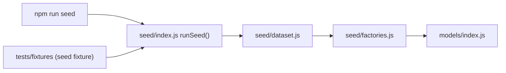

# Seeding fake data

The `seed/` directory generates realistic, deterministic fake data. It backs both local
development (`npm run seed`) and the test suite (the `seed` fixture), so the data you
debug by hand is exactly the data the tests run against.

Task/Compass dates are canonical civil-date markers; events remain instants. Seeded users
include an IANA timezone and minute-precision working hours. See `docs/DATE_AND_TIME.md`.

The dataset holds everything worth testing. If a shape is worth testing, it belongs in
the dataset — a single thing to understand and a single thing to keep correct.

## Quick start

```bash
npm run seed
```

Seeding **wipes** the users, tasks, events, roles, goals, and projects in your instance's
database first, so each run gives you a clean, known state.

Log in with:

| Username | Password |
| --- | --- |
| `testuser` | `testpassword` |
| `otheruser` | `testpassword` |

`otheruser` exists only to prove their data never leaks into `testuser`'s views.

## What the dataset contains

All of it belongs to `testuser` unless noted:

- **Named tasks** — a proposal, a code review, a chunked documentation task, and a backlog
  idea. Readable, hand-written, and referenced by tests via `data.named`.
- **20 active tasks** across four priority levels and ten due dates.
- **5 backlog tasks** with no due date.
- **A dependency chain** — research → draft → publish.
- **Repeating tasks** — one each of daily, weekly, and monthly, using the legacy `repeat`
  string so the on-the-fly migration path stays covered.
- **Recurrence series** — three rule-based templates (`data.named.weekdaysSeries` Mon+Tue,
  `fortnightlySeries` every 2 weeks, `monthlySeries` 1st and last day). The scheduler
  materialises their occurrences; the templates themselves never appear in the task list.
  See `docs/RECURRING_TASKS.md`.
- **70 completed tasks** spread over 90 days, kept as completion history and to prove the
  scheduler never schedules a completed task.
- **Edge cases** — a zero-duration task, one longer than the working day, one overdue by a
  month, unicode/emoji/HTML-looking titles, a 500-character title, a task blocked by an
  unschedulable dependency, and a task that starts next week.
- **19 calendar events** — a week of standups and lunches, two that overlap each other,
  two sitting exactly on the working-hours boundaries, and a day-long block.
- **A Compass hierarchy** (roles → goals → projects; see `docs/COMPASS.md`):
  - 3 active roles (Engineer, Father, Health) and 1 ended one (Volunteer board member).
  - 6 goals, including one ended and one — *Fix my sleep schedule* — deliberately left with
    no active tasks beneath it, so "stalled" states have something to render.
  - 8 projects, including one parked with no start date (*Rewrite the CLI*) and one ended.
  - End dates are spread across quarters so `completedFrom`/`completedTo` has something to
    slice.
  - Roughly half the named tasks are linked to projects; the rest stay unaligned on purpose.
- **A second user** with 5 tasks, 1 event, and a role/goal/project, all titled
  `OTHER USER SECRET ...`.

## Empty states

An empty account is a precondition a test sets up for itself:

```js
await seed.clearTasks();   // removes the primary user's tasks and events
```

## How it fits together



- **`seed/factories.js`** — `makeUser`, `makeTask`, `makeEvent`, `makeRole`, `makeGoal`,
  `makeProject`. Sensible defaults, every field overridable, powered by `@faker-js/faker`
  with a fixed seed so runs are reproducible.
- **`seed/dataset.js`** — the dataset itself, as one readable `build(b)` function.
- **`seed/index.js`** — `runSeed()`: connects, wipes, builds, and returns the created data.
- **`scripts/seed.js`** — the CLI wrapper.

### Dates are anchored, never absolute

Every date is expressed as an offset from an **anchor** (today at 00:00 local), so seeded
data is always relative to now and tests never depend on the wall clock:

```js
b.at(b.anchor, { days: 2, hours: 10 })   // 10:00 the day after tomorrow
b.endOfDay(b.anchor, 3)                  // civil-date marker, three days out
b.at(b.anchor, { days: -30 })            // 30 days ago
```

> Durations (`duration`, `breakUpTaskChunkDuration`) are in **minutes**, matching
> `controllers/scheduling.js`.

## Using seed data in a test

`seed()` returns everything it created, so you can assert against real ids without
re-querying:

```js
const data = await seed();

data.primary.user       // the testuser mongoose document
data.other.user         // the second user
data.named.research     // named tasks, by key
data.named.engineerRole // Compass roles, goals, and projects are named too
data.counts.completed   // 70 — prefer these over hard-coded numbers
data.tasks              // every task created
data.events             // every event created
data.roles              // every role created (likewise goals, projects)
data.anchor             // the moment all dates were derived from
```

Prefer `data.counts.*` and `data.named.*` over literal numbers and titles. Assertions
written that way keep passing when the dataset grows.

## Adding to the dataset

`seed/dataset.js` is a plain async function. The builder `b` persists as it goes, so a
task can reference a real ObjectId from the task before it:

```js
const blocker = await b.createTask(user, {
    title: 'Must happen first',
    dueDate: b.endOfDay(b.anchor, 2),
    duration: 60,
});

await b.createTask(user, {
    title: 'Waits for the blocker',
    dueDate: b.endOfDay(b.anchor, 3),
    duration: 30,
    dependsOn: [blocker._id],
});
```

Builder methods: `createUser`, `createTask`, `createTasks(user, count, fn)`, `createEvent`,
`createRole`, `createGoal(user, role, ...)`, `createProject(user, goal, ...)`,
`alignTasks(tasks, project)`, plus every factory helper (`at`, `endOfDay`, `makeTask`, ...).

Expose anything tests should reach under `named`, and any size tests care about under
`counts`.

**When you found a bug, add its shape here.** That is what stops it coming back.

**Check the count-sensitive tests when you change bulk sizes** — derive sizes from
`data.counts` rather than hard-coding them.

## Adding a field to the schema

When you add a field to `models/index.js`, add it to the matching factory in
`seed/factories.js` too. Otherwise seeded data silently lacks the field and tests pass
against data that no real user would ever have.
