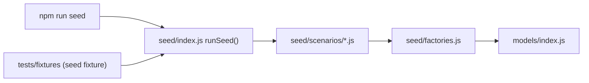

# Seeding fake data

The `seed/` directory generates realistic, deterministic fake data. It backs both local
development (`npm run seed`) and the test suite (the `seed` fixture), so the data you
debug by hand is exactly the data the tests run against.

## Quick start

```bash
npm run seed                          # the default "basic" scenario
npm run seed -- --scenario=full       # a realistic power user
npm run seed -- --scenario=edge       # deliberately hostile data
npm run seed -- --list                # show every scenario
```

Seeding **wipes** the users, tasks, and events in your instance's database first, so each
run gives you a clean, known state.

Every scenario logs in with the same credentials:

| Username | Password |
| --- | --- |
| `testuser` | `testpassword` |
| `otheruser` (in `full` only) | `testpassword` |

## The scenarios

| Scenario | Contents |
| --- | --- |
| `empty` | One user, nothing else. Empty states. |
| `basic` | 4 active tasks (one backlog, one broken into chunks), 35 completed tasks, 3 calendar events. The default. |
| `full` | ~40 active tasks across priorities, a 3-deep dependency chain, daily/weekly/monthly repeats, 6 backlog items, 70 completed tasks spread over 90 days, a week of events including overlaps and a day-long block, plus a second user whose data must never leak. |
| `edge` | Zero-duration task, a task longer than the working day, an overdue task, a task with no due date, unicode/emoji/HTML-looking titles, a 500-character title, a task blocked by an unschedulable dependency, a task starting next week, and events sitting exactly on the working-hours boundaries. |

Use `full` for anything involving pagination, search, statistics, scheduling, or
cross-user isolation. Use `edge` when you want to prove something does not crash.

## How it fits together



- **`seed/factories.js`** — `makeUser`, `makeTask`, `makeEvent`. Sensible defaults, every
  field overridable, powered by `@faker-js/faker` with a fixed seed so runs are
  reproducible.
- **`seed/scenarios/*.js`** — one file per scenario, each exporting
  `{ name, description, build(b) }`.
- **`seed/index.js`** — `runSeed()`: connects, wipes, builds, and returns the created data.
- **`scripts/seed.js`** — the CLI wrapper.

### Dates are anchored, never absolute

Every date is expressed as an offset from an **anchor** (today at 00:00 local), so seeded
data is always relative to now and tests never depend on the wall clock:

```js
b.at(b.anchor, { days: 2, hours: 10 })   // 10:00 the day after tomorrow
b.endOfDay(b.anchor, 3)                  // 23:59:59, three days out
b.at(b.anchor, { days: -30 })            // 30 days ago
```

> Durations (`duration`, `breakUpTaskChunkDuration`) are in **minutes**, matching
> `controllers/scheduling.js`.

## Using seed data in a test

`seed(...)` returns everything it created, so you can assert against real ids without
re-querying:

```js
const data = await seed('full');

data.primary.user       // the testuser mongoose document
data.other.user         // the second user (full only)
data.named.research     // scenario-specific named tasks
data.tasks              // every task created
data.events             // every event created
data.anchor             // the moment all dates were derived from
```

## Adding to a scenario

Scenarios are plain async functions. The builder `b` persists as it goes, so a task can
reference a real ObjectId from the task before it:

```js
// seed/scenarios/full.js
const blocker = await b.createTask(user, {
    title: 'Must happen first',
    dueDate: b.endOfDay(b.anchor, 2),
    duration: 60,
});

await b.createTask(user, {
    title: 'Waits for the blocker',
    dueDate: b.endOfDay(b.anchor, 3),
    duration: 30,
    dependsOn: [blocker._id],
});
```

Builder methods: `createUser`, `createTask`, `createTasks(user, count, fn)`, `createEvent`,
plus every factory helper (`at`, `endOfDay`, `makeTask`, ...).

Return anything you want tests to reach under `named`.

**When you change a scenario, check the tests that count things** — a few assert exact
counts (for example 70 completed tasks in `full` drives the pagination test).

## Adding a new scenario

1. Create `seed/scenarios/myscenario.js` exporting `{ name, description, build }`.
2. Register it in the `scenarios` map in `seed/index.js`.
3. Verify with `npm run seed -- --scenario=myscenario`.

Prefer extending an existing scenario over adding a new one; four well-understood datasets
are easier to maintain than a dozen near-duplicates.

## Adding a field to the schema

When you add a field to `models/index.js`, add it to the matching factory in
`seed/factories.js` too. Otherwise seeded data silently lacks the field and tests pass
against data that no real user would ever have.
