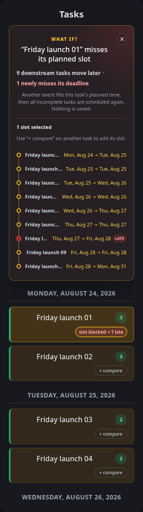
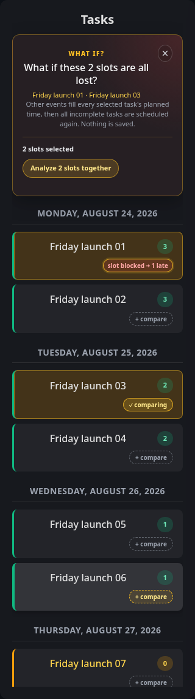
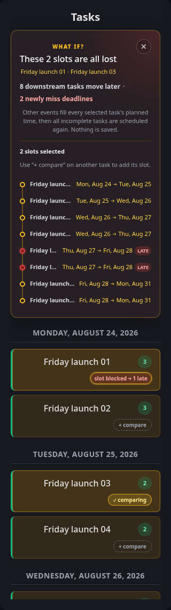
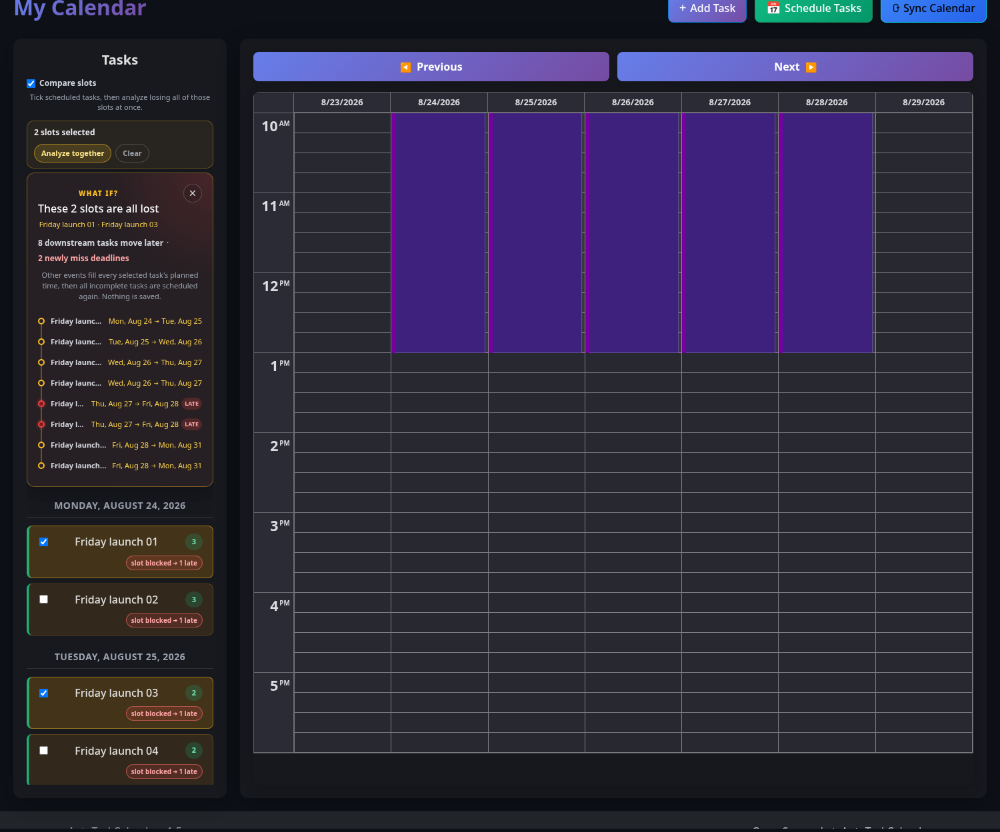

# Blocked-slot Task Reschedule Forecast

Use the blocked-slot forecast on Calendar to answer: **what would happen if this task were not done in its planned time, another event occupied that time, and I ran Schedule Tasks again?** The forecast is a read-only simulation of the last generated schedule.

## Read the indicators

Run **Schedule Tasks** first. Each task shows its normal schedule/deadline status on the primary row. The small number is the civil-calendar gap between its scheduled day and due day; its tooltip explicitly says this is **not spare capacity**.

When a valid cached forecast moves downstream work, a **`slot blocked → …`** control appears on a separate row. The selected task is the premise, so its own move or missed deadline is not counted:

- **`safe`** means downstream work moves, but no currently on-time downstream task newly misses its deadline.
- **`N late`** means that many currently on-time downstream tasks would newly miss deadlines.

No control is shown when the task has no valid scheduled date, has no cached forecast, or has no downstream movement or deadline impact. This absence does not claim that an unavailable calculation is safe.

Select a visible control to open **What if?**. The panel lists each moved downstream task as `current day → forecast day`, marks newly late rows, and highlights the selected, moved, and newly late tasks in the sidebar. The selected task is highlighted separately and is not a cascade row. Select the close button or the same control again to dismiss it.

## Analyze several slots together

One chip answers "what if I lose *this* slot?". To ask "what if I lose *all of these* slots?", start from that same answer: open any task's forecast, then use the **+ compare** button that appears in every other scheduled task's control slot to add its slot to the question.

The task you started from keeps its own `slot blocked → …` chip, so you never lose sight of its individual result and can select it again to close the panel. Added tasks show **✓ comparing** and can be removed the same way.

With more than one slot selected, the panel asks **What if these N slots are all lost?** and offers **Analyze N slots together**. Until you select it, no numbers are shown — a single-slot cascade under a multi-slot heading would answer a question you did not ask.

The result is the same **What if?** panel: the same moved/newly-late summary, the same `current day → forecast day` cascade, and the same sidebar highlighting. Every selected task is a premise, so all of them are highlighted and none of them appear as cascade rows.

Adding or removing a slot afterwards discards the displayed result, because it described the previous selection; select **Analyze** again for the new one. Closing the panel clears the whole selection and restores the ordinary chips.

### Combined impact is not the sum of the separate forecasts

Blocking several slots destroys more capacity than any one of them, so the cascade can cross deadlines that no individual forecast predicts. In a week with no slack, each of these slots alone costs one newly missed deadline, but losing both costs two:

| Blocked | Downstream moved | Newly late |
| --- | --- | --- |
| First slot alone | 9 | 1 |
| Second slot alone | 7 | 1 |
| **Both slots together** | **8** | **2** |

Reading two chips and combining them by eye understates the damage. Analyze the slots together whenever you expect to lose more than one.

### Why this one is calculated on demand

There is one cached forecast per task, but one result per *combination* of tasks, so combinations cannot be precomputed. **Analyze** calculates immediately through `POST /api/analyzeBlockedSlots` instead of reading a cached field.

That calculation replays the last **Schedule Tasks** run, using the `lastScheduleRunAt` instant saved beside the schedule it describes. Starting anywhere else would measure different capacity and produce a diff that answers no real question. Before the first scheduling run there is nothing to replay, and the panel says so rather than guessing.

A request accepts at most ten tasks, honours only your own scheduled tasks, and writes nothing. A single-task request through the endpoint returns exactly what that task's cached chip shows.

## Understand the assumption

For a scheduled task, the simulation performs the in-memory equivalent of these user actions:

1. Keep the selected tasks incomplete.
2. Add ordinary calendar events that exactly cover all of the selected tasks' generated placements. A chunked task blocks every generated chunk.
3. Remove generated task events and run the normal scheduler again over every incomplete task.
4. Compare the hypothetical placements with the saved baseline schedule.

This is not a blanket one-day delay. Capacity before and after the blocked slots remains available, and the scheduler may move a selected task or another eligible task into it. The hypothetical rerun uses the normal task queue, saved working days and hours, task eligibility, deadlines, priority, dependencies, chunking, recurrence behavior, calendar conflicts, timezone, and 60-day horizon.

Only synthetic conflicts and planner results exist during the calculation. The forecast does not create a calendar event or replace the visible generated schedule.

## How movement and deadline risk are counted

A task is on time when its final task event completes on or before its civil due date. For downstream work only, a **newly missed deadline** is a task that is on time in the generated baseline and whose final completion moves to a civil day after its due date in the hypothetical rerun.

A task is moved when its first placement or final completion changes, or when it becomes unplaceable. Comparing both ends ensures a chunked task is reported when a later chunk moves even if its first chunk does not. An unplaceable task remains in the cascade as **Unscheduled**, but it is not marked or counted as late because it has no completion after its due date.

Existing late work may move later and appears in the cascade, but it is not counted as newly late. Due dates and completion days are compared as civil dates in the user's saved IANA timezone.

The panel reports:

- **downstream tasks move later** — non-selected tasks whose placement changes or disappears;
- **newly miss deadlines** — the subset whose final completion crosses from on time to after its due date.

The selected task remains in the scheduler queue and consumes capacity in its new placement. Its own movement and deadline state are excluded from both totals because they are the premise rather than a downstream effect. A single isolated task therefore has no visible control when blocking its slot harms no other task. When several tasks are selected, every one of them is a premise and is excluded the same way.

## Data flow

**Schedule Tasks** owns the calculation lifecycle. After persisting the real schedule, the server calculates simulations for up to 100 scheduled, non-backlog tasks in Calendar's 21-day sidebar window and writes each nullable `slipForecast` beside that task's `scheduledDate`.

The candidate window controls which tasks receive a cached forecast; it does not truncate the planner queue. Every simulation replans the complete normal set of incomplete regular and backlog tasks.

Calendar receives the forecast through the normal `GET /api/getUserTasks` payload. There is no forecast endpoint, collection, synchronization query, or calculation during a reload. A non-null object renders a control only when it has downstream impact; missing and zero-impact results render nothing.

`scheduledDate`, generated task events, `slipForecast`, and `lastScheduleRunAt` are one snapshot of the last **Schedule Tasks** run. Editing tasks, preferences, or calendar events does not update or selectively clear one part of that snapshot; the next scheduling run replaces them together.

## Scheduling reuse and read-only guarantee

`controllers/schedulePlanner.js` is the pure placement engine. It receives tasks, conflicts, user work settings, a start instant, and a horizon, then returns placements without accessing MongoDB.

`controllers/scheduling.js` uses that same engine for the real schedule and blocked-slot simulations. `loadForecastContext()` reads the baseline once and `simulateBlockedSlots()` blocks every placement of every selected task before replanning, so the cached single-task chips and an on-demand combined analysis are the same calculation with a different premise size. `generateTaskEvents()` expands recurrence, replaces generated placements, persists `scheduledDate` and `lastScheduleRunAt`, calculates the visible-window simulations, and caches their summaries as one scheduling operation. Eligibility and recurrence-expiry calculations are cached only for that forecast operation and discarded afterward.

Opening, closing, or reloading a forecast only reads the task object already in Calendar. **Analyze** invokes the planner in memory but writes nothing. Press **Schedule Tasks** whenever inputs change and you want both the visible schedule and forecasts refreshed.

## Limits

- A forecast requires a generated schedule. Backlog and currently unscheduled tasks have no control and cannot be added to a comparison.
- **Schedule Tasks** calculates forecasts for the current 21-day sidebar window; run it again to refresh the schedule or bring a later window into the cache.
- A combined analysis accepts at most ten tasks at once, and one analysis runs at a time per user.
- A combined analysis reflects the schedule as it was generated. Tasks completed or deleted since that run are dropped from the comparison, so re-run **Schedule Tasks** after changing your work if you want the analysis to match what you see.
- It models the selected tasks as wholly uncompleted. It does not predict partial manual progress or future calendar changes beyond the synthetic blockers.
- The simulation uses the same 60-day placement horizon as normal scheduling.

## Verify the exact mixed-capacity example

The shared `slipuser` seed has ten 3½-hour tasks, all starting Monday and due Friday, plus a fixed 09:00–10:00 event each weekday. Events and tasks consume all 40 working hours exactly, and the generated baseline places two tasks per weekday after each event.

Blocking the first task's Monday 10:00–13:30 placement leaves Monday 13:30–17:00 available. The selected task moves there, each later task shifts one slot, and the final Friday task moves to the following Monday. The forecast therefore reports nine downstream tasks moving and **one** newly late task.

`tests/ui/calendar.spec.js` creates an actual calendar event over that exact slot, runs **Schedule Tasks** again, and compares the real generated placements and newly-late set with the cached forecast. It also verifies that merely opening and reloading the preview changes no task or event data.

## Verify the unplaced-is-not-late example

The shared `boundaryuser` seed has one six-hour selected task followed by five two-hour tasks, all eligible Monday and due Friday. They exactly fill Monday and Tuesday. A long ordinary event removes all capacity from Wednesday through the scheduler horizon.

Blocking the selected task's Monday 09:00–15:00 placement leaves one downstream task unchanged, moves the selected task and one downstream task to Tuesday, and leaves the final three downstream tasks unplaced. The forecast therefore reports four downstream tasks moving and **zero** late tasks. Its panel keeps all three missing placements visible as **Unscheduled** without a **Late** marker.

`tests/ui/calendar.spec.js` creates an actual event over that exact selected slot, runs **Schedule Tasks** again, and verifies the real placements and unplaced set match the cached forecast. It also independently verifies that no placed task completes after Friday.

## Verify the combined multi-slot example

On the same `slipuser` seed, blocking the first task's Monday 10:00–13:30 slot and the third task's Tuesday 10:00–13:30 slot removes seven hours from a week with no slack. Each slot alone reports one newly late task; together they report **eight** downstream tasks moving and **two** newly late.

`tests/ui/calendar.spec.js` opens the first task's forecast, adds the third task's slot with **+ compare**, records the combined forecast, then creates two real calendar events over exactly those baseline slots and runs **Schedule Tasks** again. The real rerun must agree on the moved task ids, every task's first and final placement, and the newly-late set, and no generated event may overlap either blocker. It also verifies that the origin keeps its own chip, that selecting slots shows no numbers until analyzed, and that analyzing changed no task or event data.

`tests/api/scheduling.spec.js` proves the two paths cannot drift: a one-id request to `POST /api/analyzeBlockedSlots` returns exactly that task's cached `slipForecast`, a two-id request reports strictly more newly late tasks, another user's task id is refused, an empty selection is refused, and a request before any scheduling run fails cleanly.

