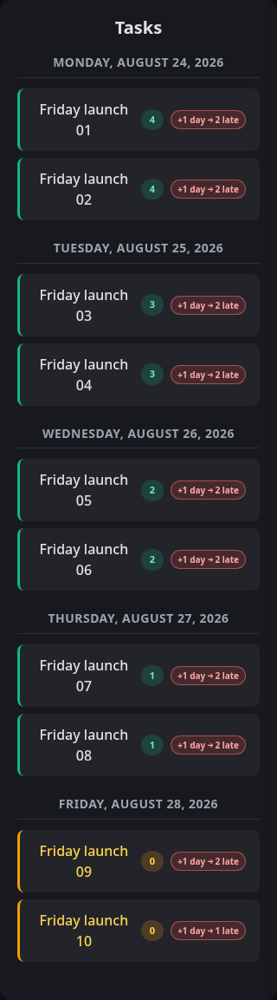
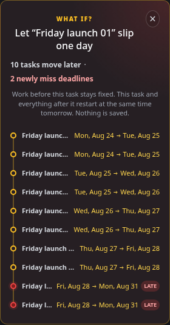

# One-day Task Slip Forecast

Use the one-day slip forecast on Calendar to see whether postponing one scheduled task consumes capacity that later deadlines need. The forecast is a read-only simulation of the last generated schedule, not a change to the task or calendar.

## Read the indicators

Run **Schedule Tasks** first. Every scheduled, non-backlog task in the sidebar then has two adjacent indicators:

- The small number is the civil-calendar gap between its scheduled day and due day. Its tooltip explicitly says this is **not spare capacity**.
- The **`+1 day → …`** chip reports the downstream effect of waiting one day:
  - **`safe`** means no currently on-time task newly misses its deadline.
  - **`N late`** means that many currently on-time tasks would newly miss deadlines.

A failed or unavailable forecast never appears as `safe`. Calendar displays a quiet retry status and leaves normal task and calendar actions available.

Select a chip to open **What if?**. The panel lists each moved task as `current day → forecast day`, marks newly late rows, and highlights the selected, moved, and newly late tasks in the sidebar. Select the close button or the same chip again to dismiss it.

## Understand the assumption

For a task scheduled at a particular wall time, “slip one day” means:

1. Work scheduled before that task stays fixed, as if it was completed.
2. The selected task and the remaining queue do not begin until the same local wall time on the next civil date.
3. The scheduler reflows that queue around saved working days, working hours, task eligibility, deadlines, priority, dependencies, chunking, recurrence behavior, and non-task calendar conflicts.

The forecast intentionally leaves the skipped capacity empty. Moving another task into the abandoned slot would model reprioritization, not the cost of waiting, and would hide the cascade this indicator is designed to reveal.

“Tomorrow” uses the user’s saved IANA timezone and civil-date arithmetic. It does not add 24 hours or invent an offset, so daylight-saving boundaries retain the same intended wall time.

## How deadline risk is counted

A task is on time when its final task event completes on or before its civil due date. A **newly missed deadline** is a task that is on time in the generated baseline but either:

- completes after its due date in the forecast; or
- cannot be placed within the scheduler’s 60-day horizon.

Existing late work may move later and appears in the cascade, but it is not counted as newly late. Chunked tasks use the end of their final chunk for deadline comparison.

The panel reports:

- **tasks move later** — affected tasks whose first placement changes or disappears;
- **newly miss deadlines** — the subset that crosses from on time to late/unplaceable.

## Data flow and endpoint

Calendar loads ordinary tasks and generated events as before. Once task records have `scheduledDate`, it sends the owned IDs visible in the sidebar’s 14-day window in one request:

```http
POST /api/forecastTaskSlips
Content-Type: application/json

{"taskIds":["…"]}
```

The authenticated endpoint accepts unique valid IDs, is tenant-scoped, and limits each batch to 100 tasks. It loads baseline generated task events and non-task conflicts once, then returns an impact summary for every requested task. Missing, foreign, malformed, duplicate, or unscheduled task IDs fail the request rather than yielding a false safe result.

Calendar refreshes forecasts after scheduling and after flows that replace its task list, including completion and editing. The page does not wait for forecasts before rendering its normal controls.

## Scheduling reuse and read-only guarantee

`controllers/schedulePlanner.js` is the pure placement engine. It receives tasks, conflicts, user work settings, a start instant, and a horizon, then returns placements without accessing MongoDB.

`controllers/scheduling.js` uses that same engine in two ways:

- `generateTaskEvents()` expands recurrence, clears old generated placements, runs the planner, then persists the returned task events and `scheduledDate` values.
- `forecastOneDaySlips()` loads the current baseline, runs suffix plans in memory, compares results, and returns summaries without calling any write operation.

Opening or closing a forecast does not alter task fields, recurrence occurrences, generated events, calendar events, or user settings. It also does not invoke the persisted scheduler.

## Limits

- A forecast requires a generated schedule. Backlog and currently unscheduled tasks have no chip.
- Calendar calculates chips for its existing 14-day sidebar window; later scheduled work appears when it enters that window.
- It evaluates one chosen task at a time; it does not combine several hypothetical delays.
- It assumes earlier scheduled tasks are completed and the later queue retains normal scheduler ordering. It does not predict interruptions, partial manual progress, or future calendar changes that are not recorded yet.
- The simulation uses the same 60-day placement horizon as normal scheduling.

## Verify the exact weekly-capacity example

`tests/ui/calendar.spec.js` has one scenario with ten four-hour tasks, all starting Monday and due Friday, against five eight-hour workdays. The generated baseline places two tasks per weekday. Letting the first task slip leaves Monday’s capacity unused, moves all ten tasks, and pushes the final two from Friday to the following Monday.

The test asserts **`+1 day → 2 late`**, expands all ten cascade rows, verifies the final two late states, checks that task dates/events did not change, and attaches screenshots of both the compact indicators and expanded panel.

### At-a-glance indicators



The old green badges still show each task’s scheduled-day gap, while the adjacent forecast chips
make the hidden capacity risk explicit. Friday’s final task reports only one newly late deadline
because it has no downstream task behind it.

### Expanded cascade



The connected list shows all ten tasks moving. The final two cross Friday’s due date and are
visually marked `Late` on the following Monday.
