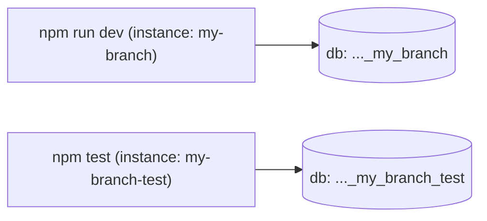

# Testing

AutoTaskCalendar has one test suite: **Playwright**, covering both the HTTP API and the
Vue UI. This file is the whole manual — how to run it, how to add to it, and how to debug
a failure.

**The rule: any behaviour change ships with a spec.** If you fix a bug, add the test that
would have caught it. If you add a feature, add the test that proves it works.

## Running the tests

```bash
npm test                      # the whole suite, headless
npm test -- --project=api     # API tests only (fast, ~35s)
npm test -- --project=ui      # browser tests only
npm test -- tests/api/tasks.spec.js          # one file
npm test -- -g "completes a task"            # one test by name
npm run test:ui               # Playwright UI mode: watch, step, time-travel
npm run test:report           # open the HTML report from the last run
```

First run on a new machine needs the browser binaries once:

```bash
npx playwright install chromium
```

`npm test` does everything else for you: starts the test database, builds the web bundle
if `dist/` is missing, then starts the app and runs the suite.

After changing front-end code, force a rebuild so the browser tests see your changes:

```bash
AUTOTASKCALENDAR_TEST_BUILD=1 npm test
```

## How isolation works

Tests never touch the database you develop against. `scripts/test.js` runs everything
under the instance name `<your-branch>-test`, and `instance.js` turns that name into its
own ports, database, MongoDB container, and session cookie.



So you can leave `npm run dev` running while the suite executes, and several agents can
test at once without colliding. Run `npm run db:status` to see your dev ports.

The suite runs the **built** bundle served by Express (one server on the API port), which
is closer to production and faster than the webpack dev server.

Tests share one database and therefore run serially (`workers: 1`). Each test reseeds
whatever it needs, so order never matters.

## Writing a test

Everything lives in `tests/`:

```
tests/
  fixtures/index.js     shared fixtures (seed, api, loggedInPage, ...)
  api/*.spec.js         HTTP-level tests
  ui/*.spec.js          browser tests
```

Always import `test` and `expect` from the fixtures, never from `@playwright/test`
directly — that is what gives you seeding and authentication.

### Fixtures

| Fixture | What it gives you |
| --- | --- |
| `seed(scenario)` | Wipes the database and builds a scenario. Returns the created data. |
| `api` | Request context authenticated as `testuser`. |
| `apiAnon` | Request context with no credentials, for auth-failure tests. |
| `loginAs(user, pass)` | Authenticated request context for any seeded user. |
| `loggedInPage` | A browser page already logged in as `testuser`. |

### API test template

```js
const { test, expect } = require('../fixtures');

test('rejects a task with no duration', async ({ seed, api }) => {
    await seed('empty');

    const res = await api.post('/api/createTask', { data: { title: 'No duration' } });
    const body = await res.json();

    // Remember: API errors are HTTP 200 with success: false.
    expect(body.success).toBe(false);
});
```

### UI test template

```js
const { test, expect } = require('../fixtures');

test('shows the seeded tasks', async ({ seed, loggedInPage: page }) => {
    const data = await seed('basic');

    await page.goto('/#/calendar');

    await expect(page.locator('.task-list')).toContainText(data.named.proposal.title);
});
```

Routes are hash-based, so URLs look like `/#/calendar`, `/#/completed`, `/#/statistics`.

### Choosing a scenario

| Scenario | Use it for |
| --- | --- |
| `empty` | Empty states, and tests that create all their own data. |
| `basic` | Default. A few readable tasks and events. |
| `full` | Pagination, search, statistics, scheduling, cross-user isolation. |
| `edge` | Hostile input: odd durations, unicode, blocked dependencies. |

See `docs/SEEDING.md` for exactly what each one contains and how to add data.

## Testing the scheduler

`controllers/scheduling.js` is the highest-risk code in the repo. Its tests
(`tests/api/scheduling.spec.js`) assert **invariants**, not exact timestamps, because the
result depends on the current time:

- nothing is scheduled outside working hours or on a non-working day
- nothing overlaps a calendar event or another scheduled task
- nothing is scheduled before its dependency or before its own start date
- broken-up tasks never exceed their total duration
- completed tasks are never scheduled
- re-running the scheduler is idempotent
- the hostile `edge` scenario completes rather than hanging

When you change the scheduler, add an invariant rather than pinning a timestamp. Pinned
timestamps break every time the clock moves, and everyone learns to ignore them.

## Where the output goes

Two directories, both gitignored, both overwritten by each run:

| Path | What it is |
| --- | --- |
| `playwright-report/index.html` | The HTML report for the whole run: every test, pass or fail, with timings. |
| `test-results/<test-name>/` | Per-failure artifacts. **Only written when a test fails.** |

A passing run leaves `test-results/` empty. That is deliberate — artifacts are captured
`on-failure` only, so green runs stay fast and cheap.

A failed test leaves four things behind:

```
test-results/calendar-calendar-page-renders-tasks-ui/
  test-failed-1.png     screenshot at the moment of failure
  video.webm            video of the whole test
  trace.zip             full time-travel recording (the useful one)
  error-context.md      the page's accessibility tree as text
```

### Looking at them

```bash
npm run test:report          # open the HTML report in your browser
```

The report is the best starting point: click any failed test and the screenshot, video,
and trace are all attached inline. It serves at `http://localhost:9323`.

For the trace specifically — a step-by-step recording where you can scrub through the
test and inspect the DOM at each step:

```bash
npx playwright show-trace test-results/<test-name>/trace.zip
```

You can also just open the files directly: `test-failed-1.png` and `video.webm` are an
ordinary PNG and WebM.

`error-context.md` is worth knowing about if you are an agent rather than a human — it is
plain text, so you can `cat` it without a browser. It contains the expected vs. received
values and a text rendering of the page, which is usually enough to diagnose a failure
without opening anything.

### Watching tests run live

```bash
npm run test:ui        # interactive: pick tests, watch, step, time-travel
npm test -- --headed   # run headless suite but show the browser window
```

UI mode is the nicest way to explore what the suite covers.

## Debugging a failure

On failure Playwright saves a trace, a screenshot, and a video under `test-results/`
(see "Where the output goes" above). The trace is the useful one — it is a full
time-travel recording of the run:

```bash
npx playwright show-trace test-results/<the-failing-test>/trace.zip
npm run test:report      # or browse the HTML report
```

Other useful flags:

```bash
npm test -- --headed             # watch the browser as it runs
npm test -- --debug              # step through with the inspector
npm test -- --repeat-each=5      # hunt for flakiness
```

To inspect the state a test left behind, point at the test database:

```bash
AUTOTASKCALENDAR_INSTANCE=$(git rev-parse --abbrev-ref HEAD)-test npm run db:status
```

## Troubleshooting

**Browser tests fail right after a front-end change.** The bundle is stale. Rerun with
`AUTOTASKCALENDAR_TEST_BUILD=1 npm test`.

**`browserType.launch: Executable doesn't exist`.** Run `npx playwright install chromium`.

**The suite cannot reach MongoDB.** `npm test` starts the container itself, but you can
check it with `AUTOTASKCALENDAR_INSTANCE=<branch>-test npm run db:status`.

**A test passes alone but fails in the suite.** It is depending on data another test left
behind. Call `seed(...)` at the top of the test so it owns its state.
