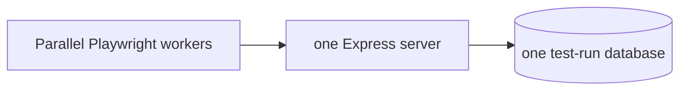

# Testing

AutoTaskCalendar has one test suite: **Playwright**, covering both the HTTP API and the
Vue UI. This file is the whole manual — how to run it, how to add to it, and how to debug
a failure.

**The rule: any behaviour change ships with a focused spec.** If you fix a bug, add the
smallest test that would have caught it. If you add a feature, add the test that proves
its contract.

This suite is intentionally lean and risk-based, not an endpoint-by-endpoint catalog.
Prefer one clear test for the behavior that matters over many near-duplicates.

Keep a test when it protects at least one of these:

- a primary user journey
- an auth or cross-tenant boundary
- scheduler invariants
- recurrence identity, idempotence, or completed-history preservation
- date, time, timezone, DST, or migration correctness
- destructive lifecycle behavior that could lose user data

Delete or avoid tests that are mainly:

- duplicate API and UI coverage of the same behavior
- one validation permutation among many equivalent ones
- routine CRUD already covered by a broader lifecycle
- payload-shape or implementation-detail assertions
- visual labels, badges, summaries, disabled states, or minor error states
- empty-state or trivial negative-path checks
- repeated auth or tenant checks on every endpoint
- old regression cases whose underlying invariant is already covered directly

When in doubt, keep the spec closest to the behavior and delete the duplicate.

## What to test when behavior changes

Most changes should add or update one focused spec, not several parallel ones.

- Choose the narrowest layer that proves the contract.
- Prefer API specs for business rules and data transitions.
- Keep UI specs for primary user-visible flows and route guards.
- Do not duplicate the same rule at endpoint, validation, and UI layers unless each layer
  has distinct behavior worth protecting.
- If one representative validation case proves the rule, do not add every permutation.
- If a broader lifecycle test already proves create/edit/delete/list behavior, do not add a
  separate CRUD micro-test.

The goal is confidence per test, not coverage theater.

## Running the tests

```bash
npm test                                     # whole suite, twelve local workers; four in CI
npm test -- tests/api                        # API tests only
npm test -- tests/api/tasks.spec.js          # one file
npm test -- -g "completes a task"            # one test by name, seconds
npm test -- --workers=1                      # force serial execution
npm test -- --ui                             # watch, step, time-travel
```

Everything after `--` goes straight to Playwright. The configuration uses twelve workers
locally and four on hosted CI; `--workers=<n>` overrides either value exactly as documented
by Playwright.

**Iterating on one thing? Do not run the whole suite.** File filters and `-g` still take
seconds; save the full run for just before you commit.

`npm test` handles the setup itself: it starts the database, downloads the Chromium
browser the first time, rebuilds the web bundle whenever `webinterface/src` is newer than
`dist/`, then starts the app and runs the suite. This is also the CI contract; workflows do
not need a separate MongoDB service. There is nothing to install or export beforehand.

## How isolation works

Tests never touch the database you develop against. Each `npm test` invocation gets one
run-specific database, API port, session cookie, artifact directory, and Express server.
Twelve local Playwright workers share that app stack; hosted CI uses four to leave headroom
for the shared Express and MongoDB processes.



The `seed` fixture does **not** wipe the database. It creates uniquely named primary,
secondary, and recurring users for the current test. Application queries are scoped by the
authenticated user's ID, so workers can schedule, mutate, and delete their own data without
touching another test. The fixture removes that tenant after the test; the runner drops the
entire run database when Playwright exits.

This is why parallel workers are safe here. The suite drives one **built** bundle served by
one Express process, which is both simple and close to production. You can leave
`npm run dev` running or start two test commands on the same branch without collisions.

## Writing a test

Before adding a test, ask two questions:

1. What behavior changed?
2. What is the smallest spec that would fail without that change?

If the answer is already covered by an existing journey, invariant, or boundary test,
update that test or delete the duplicate instead of adding another one.

Everything lives in `tests/`:

```
tests/
  fixtures/index.js     shared fixtures (seed, api, loggedInPage, withDb, ...)
  fixtures/db.js        database connection handling
  api/*.spec.js         HTTP-level tests, including tenant-isolation coverage
  ui/*.spec.js          browser tests
```

Always import `test` and `expect` from the fixtures, never from `@playwright/test`
directly — that is what gives you seeding and authentication.

### Fixtures

| Fixture | What it gives you |
| --- | --- |
| `seed()` | Rebuilds this test's tenant and returns everything it created. |
| `seed.clearTasks()` | Removes the primary user's tasks and events, for empty-state tests. |
| `api` | Request context authenticated as this test's primary user. |
| `apiAnon` | Request context with no credentials, for auth-failure tests. |
| `loginAs(user, pass)` | Authenticated request context for any seeded user. |
| `loggedInPage` | Browser page logged in as this test's primary user. |
| `withDb(fn)` | Run a query against the test database, connecting if needed. |

### API test template

```js
const { test, expect } = require('../fixtures');

test('rejects a task with no duration', async ({ seed, api }) => {
    await seed();

    const res = await api.post('/api/createTask', { data: { title: 'No duration' } });
    const body = await res.json();

    // Remember: API errors are HTTP 200 with success: false.
    expect(body.success).toBe(false);
});
```

### UI test template

```js
const { test, expect } = require('../fixtures');

test('shows the seeded tasks', async ({ seed, loggedInPage: page }) => {
    const data = await seed();

    await page.goto('/#/calendar');

    await expect(page.locator('.task-list')).toContainText(data.named.proposal.title);
});
```

Routes are hash-based, so URLs look like `/#/calendar` and `/#/about`.

### Using the data

The dataset contains everything worth testing — see `docs/SEEDING.md`. Reach for
`data.named.*` and `data.counts.*` rather than hard-coding titles and numbers, so your
assertions survive the dataset growing:

```js
const data = await seed();
expect(events).toHaveLength(data.counts.repeating);   // not: toBe(3)
```

If your test needs an empty account, set that up explicitly:

```js
await seed.clearTasks();
```

## Testing the scheduler

`controllers/scheduling.js` is the highest-risk code in the repo, so it keeps focused API
coverage. The scheduler tests assert a small set of **invariants**, not exact timestamps,
because results depend on the current time and available calendar space.

The suite protects these guarantees:

- scheduled work stays inside working windows and working days
- scheduled work does not overlap calendar events or other scheduled work
- tasks are not scheduled before their own eligibility or required dependencies
- broken-up tasks do not exceed their total duration
- completed tasks are not rescheduled
- re-running the scheduler stays idempotent
- dense, recurring, far-future, and hostile scenarios still respect the same invariants

What the suite does **not** promise is one exact placement for every task. The scheduler is
best-effort, so tests should protect constraints and stability, not pin a timestamp that
will drift as the clock moves.

When scheduler behavior changes, add or update the invariant that captures the contract.
Do not add duplicate endpoint, validation, or UI checks for the same placement rule.

## Debugging a failure

Artifacts are captured **on failure only**. Every invocation prints its run directory;
concurrent invocations therefore never overwrite one another:

```
.playwright/runs/<run-id>/
  test-results/<failing-test>/
    test-failed-1.png     screenshot at the moment of failure
    video.webm            video of the whole test
    trace.zip             full time-travel recording (the useful one)
    error-context.md      the page's accessibility tree as text
  playwright-report/      HTML report for the run
```

The trace is a step-by-step recording where you can scrub through the test and inspect the
DOM at each step:

```bash
npx playwright show-trace .playwright/runs/<run-id>/test-results/<test>/trace.zip
npx playwright show-report .playwright/runs/<run-id>/playwright-report
```

`error-context.md` is worth knowing about if you are an agent rather than a human — it is
plain text, so you can `cat` it without a browser. It contains the expected vs. received
values and a text rendering of the page, which is usually enough to diagnose a failure
without opening anything.

Useful flags:

```bash
npm test -- --headed             # watch the browser as it runs
npm test -- --debug              # step through with the inspector
npm test -- --repeat-each=5      # hunt for flakiness
```

The server's own stdout is hidden so a run shows only test results; anything it writes to
stderr still comes through.

## Troubleshooting

**A test passes alone but fails in the suite.** It is depending on data another test left
behind. Call `seed(...)` at the top of the test so it owns its state.

**The suite cannot reach MongoDB.** `npm test` starts the container itself; check it with
`docker logs autotaskcalendar-mongo`, or recreate it with
`docker rm -f autotaskcalendar-mongo`.

**Browser tests fail right after a front-end change.** `npm test` rebuilds when
`webinterface/src` is newer than `dist/`, but a file restored from git can carry an old
timestamp. Force it with `npm run build`.
