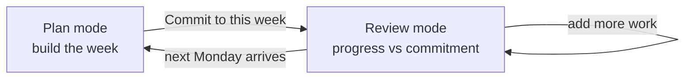

# Weekly Plan

Weekly Plan is the beginning-of-week workflow for turning Compass direction into tasks, and
the rest-of-week workflow for reviewing how that week is actually going. Open `/weekly-plan`,
review each active **Role → Goal → Project** branch, create the tasks you intend to do, and
commit to them.

The page has **two modes over one hierarchy**, and only the calendar moves between them:



There is no save, no close, no archive, and no "mark week done". **The only thing that ends a
week is time.** When the Monday boundary passes in your saved timezone there is no commitment
for the new week, so the page is back in Plan mode. Last week's record stays in the database
exactly as it was.

---

## The two sources of truth

Weekly Plan reads two different things and must not confuse them:

| | What it answers | Where it lives |
| --- | --- | --- |
| **The task** | What is true *now* — title, dates, duration, completion | `taskInfo` |
| **The commitment** | What you *said you would do* on Monday | `weeklyPlanInfo` |

The commitment is a **snapshot**. It is what makes the review honest: a task you promised and
then deleted still appears, because deleting the task does not un-promise the work. If the
page rendered only live tasks, a week could be "cleaned up" into looking successful.

Status is **derived, never stored** — the same rule Compass uses for active/ended. Completing
a task on Calendar is therefore immediately correct here, with nothing to keep in sync.

---

## Plan mode

Before this week has a commitment:

1. Read each role's description and its goals.
2. Review each started project and the tasks already due this week.
3. Open **Other active tasks** to avoid duplicating work due outside the week.
4. Open **Completed last week** for context from the previous Monday–Sunday.
5. Add the concrete tasks that should be due this week.
6. Uncheck anything you do not actually intend to commit to.
7. Choose **Commit to this week**.

Every in-week project task is checked by default. Unchecking excludes it from the commitment
and changes nothing about the task itself.

Committing records the snapshot and switches the page to Review mode without a reload.

## Review mode

Each project that had committed work shows a progress block above its live tasks. A project
that has only work added since the commit shows the same block with the committed half
omitted:

```text
     Migration plan                        3 of 5 done · 2h of 3h 30m
       ▓▓▓▓▓▓▓▓▓▓▓▓▓▓▓▓▓▓░░░░░░░░░░░░
       ✓ Draft migration plan              done Tue
       ● Write the cutover runbook         due Fri · 45m
       ↷ Book the maintenance window       moved to Apr 24
       ✗ Old spike task                    removed
       ─────────────────────────────────────────────────
       added since commit    [Update commitment]
       + Handle the rollback question      Thu · 30m
```

| Status | Meaning | Derived from |
| --- | --- | --- |
| `open` | Still due this week and not finished | live task inside the week |
| `done` | Completed | `completed` is true |
| `moved` | Due date now outside Monday–Sunday | live plan date outside the week |
| `removed` | The task no longer exists | no live task for `taskRef` |

A committed item is shown even when the live task is gone from the page entirely. A committed
task whose due date moved outside the week is reported once, as `moved` — it is deliberately
kept out of the project's **Other active tasks** list so the same work is never counted twice.

**Added since commit** lists this week's project-linked tasks that are not in the snapshot.
**Update commitment** folds them in; each item records its own `addedAt`, so the review can
always distinguish the original promise from work added later.

Quick add stays available in both modes. Adding a task after committing is normal.

The panel's right-hand label tracks whichever halves are shown, so the header can never
disagree with the body: `3 of 5 done` with a commitment, `2 added` when only later additions
exist, and `nothing committed` when the project has no work this week at all. Role headers
do the same.

### Amending is additive

Re-committing **only ever adds**. Existing items are kept exactly as snapshotted, and
re-sending an already-committed id is a no-op that neither duplicates the item nor rewrites
its `addedAt`. This is deliberate: a commitment is a promise, so amending the plan must not
be a way to quietly delete a promise you did not keep.

`committedAt` is preserved across amendments; `amendedAt` records the most recent change.

### Last week's review

The page opens with a review of the previous Monday–Sunday, because the first question a
planner has on Monday is not "what shall I do" but "what happened". It is **expanded while
this week is uncommitted** — exactly when you are planning — and **collapsed once you have
committed**, so Review mode leads with the current week. The toggle is per-visit, not stored.

It answers three questions, in this order, and every part of it is named work rather than a
number:

| Block | The question | Source |
| --- | --- | --- |
| Headline and bar | How did last week go? | `You kept 4 of 7 promises`, plus minutes done of minutes promised |
| **Unfinished** | What do I still owe? | Plan items whose status is not `done`, grouped by project |
| **Kept** | What did I actually land? | Plan items with status `done`, with the day each finished |
| **Also finished, never promised** | Where did the week really go? | `getProjectCompletions` for last week, minus anything in the snapshot |

The third block matters as much as the first two: unplanned work is usually *why* the
promises slipped, and a review that hides it makes the week look like a failure of will
rather than a failure of capacity. It is capped at four rows with the rest behind a
`+ N more` link — it is context, not a to-do list, and a long tail of it would bury the two
blocks you can actually act on. Project headers appear only when more than one project is
involved.

When no plan exists for last week the panel does not disappear silently — if anything was
finished it still says so (*No commitment last week. You finished 3 tasks anyway.*). Only a
week with neither a commitment nor a completion hides it.

This is distinct from the per-project **Completed last week** disclosure, which answers the
same "what got finished" question from inside a single project.

### Carrying work forward

Each unfinished row carries the action that resolves it. **Carry →** moves the live task into
this week; **Carry N into this week** at the block header does every carryable row.

The target date is the **same weekday in the current week**, or today when that day has
already passed — the intent of "Friday work" survives, and nothing is ever carried into a day
that is already gone. A row offers the action only when there is a live, incomplete,
non-repeating task to move:

| Last week's status | The row reads | Action |
| --- | --- | --- |
| `open` | `was due Fri · 45m` | **Carry →** |
| `moved` out past this week | `now due Apr 24` | **Carry →** |
| `moved` into this week already | `already in this week` | none — it is on the page below |
| `removed` | `deleted after committing` | none — there is nothing to move |
| a repeating occurrence | `repeats — next occurrence stands` | none — dates come from the rule |

**Carrying never touches last week's plan document.** Only `taskInfo` is written. The promise
stays exactly as snapshotted and simply resolves as `moved` on the next read — the same rule
that makes amending additive. A carried task then appears in its project below, ready to be
committed to this week; carrying is not committing.

---

## The layout

One column, capped at 1100px, with depth carried by rhythm and colour rather than nested
boxes:

- **Roles are sections**, introduced by their derived colour bar. Separation is spacing and a
  hairline rule, not a raised panel.
- **Goals are labelled dividers**, not containers.
- **Projects are the only panels**, and they are uniform — identical width, padding, and
  radius, so a column of them reads as one rhythm. This is the level you act on.
- **Tasks are dense rows** with right-aligned tabular due day and duration, so they line up
  vertically down the whole page.
- The header is a **sticky week bar** carrying the range, totals, a seven-segment Mon–Sun load
  strip, and the calendar link.
- The primary action is a **commit bar at the foot of the page**, below the loose-ends drawers,
  holding the commit button, its note, and any commit error.
- **Quick add is collapsed** to `+ Add a task` per project and expands in place.

Do not reintroduce a multi-column `auto-fit` grid. Role cards sized independently produce a
ragged staggered page whose column heights depend on how many goals each role happens to have.

The quick-add form uses seven day chips for the due date, backed by a visually hidden native
`type="date"` input that remains the accessible source of truth and enforces the week range.

---

## What counts as this week

A task belongs to the week when its civil plan date is inclusively between the current Monday
and Sunday. For an ordinary task that is `dueDate`; for a generated recurrence occurrence the
server uses `occurrenceDate` and the client uses its scheduled date.

The range is based on the user's persisted IANA timezone, not the browser's. The client first
derives today's strict `YYYY-MM-DD` date in that zone and then performs calendar-date
arithmetic.

`mondayWeekBounds()` exists in both temporal modules:

- `utils/temporal.js` returns civil bounds plus timezone-aware instants for the server.
- `webinterface/src/utils/temporal.js` returns civil bounds for the page.

| Field | Meaning |
| --- | --- |
| `startDate` | Monday, inclusive |
| `endDate` | Sunday, inclusive |
| `nextStartDate` | Following Monday, useful as an exclusive upper bound |

The backend's older `localWeekBounds()` keeps Sunday as its default because
`GET /api/getUserEvents/:date` and the Calendar week rely on that contract.

Never compare these dates by inventing UTC offsets or advance them with fixed milliseconds.

---

## Data model

One document per user per week, in `weeklyPlanInfo`, keyed on the Monday civil marker:

```js
WeeklyPlanDetail {
  userRef, weekStart, weekEnd, timeZone, committedAt, amendedAt,
  items: [{ taskRef, projectRef, title, duration, dueDate, seriesRef, addedAt }]
}
```

`WeeklyPlanDetail.index({ userRef: 1, weekStart: 1 }, { unique: true })` enforces one plan per
week. `weekStart`, `weekEnd`, and each item's `dueDate` are civil-date markers written through
`parseDateOnly()` and serialised back with `dateOnlyFromMarker()`, exactly like task dates.

No status field exists, and `taskInfo` gained no new field. Deleting a task never touches a
plan document.

---

## Endpoints

House conventions apply: mounted under `/api`, `authenticateSession`, failures are HTTP 200
with `{ success: false, log }`.

| Method | Endpoint | Purpose |
| --- | --- | --- |
| GET | `/api/getWeeklyPlans?from=&to=` | Plans in a bounded Monday range, items resolved to a live status. |
| POST | `/api/commitWeeklyPlan` | `{ weekStart, taskIds }` — create or additively amend the current week. |
| POST | `/api/carryTasksForward` | `{ taskIds, dueDate }` — move unfinished work into the current week. |

All three return the same `plans` shape, so the client applies one reducer to a read, to a
commit, and to a carry-forward.

`getWeeklyPlans` requires both bounds, requires each to be a Monday, and refuses a range wider
than 8 weeks — bounded like `getProjectCompletions`, because plans accumulate forever. The page
asks for the previous and current Monday in one call.

`commitWeeklyPlan` accepts **only the current week's Monday** for the caller's saved timezone.
Committing a past or future week is refused, which is what removes the need for week
navigation and makes last week's record permanent. Every new `taskId` must belong to the
caller and be due inside the week; anything else is refused with a clear `log` rather than
silently omitted. Omitting `taskIds` snapshots every project-linked task currently in the week.

`carryTasksForward` writes **only `taskInfo`** — it never reads or writes a plan document. Each
id must belong to the caller, exist, and be incomplete; a generated occurrence is refused
because its dates are owned by its rule. `dueDate` must be a civil date inside the caller's
current week and not before today in their timezone. A task's `startDate` is pulled back to
today when it would otherwise sit after the new due date, so the scheduler can place it.
Nothing is scheduled or reprioritised. The response carries the refreshed `taskList` *and* the
`plans` for the previous and current Monday, so one round trip leaves the page consistent.

The page also reads:

| Endpoint | Purpose |
| --- | --- |
| `GET /api/getCompass` | Live roles with goals and projects. |
| `GET /api/getUserTasks` | Incomplete tasks and materialised occurrences. |
| `GET /api/getProjectCompletions` | Previous-week completion history. |

and writes through `POST /api/createTask` and `POST /api/setTaskProject`.

A Compass or task read failure is shown with a full-page retry. A plan read failure gets its
own inline retry and **must not present a committed week as uncommitted**. A completion-history
failure is likewise non-blocking.

---

## Relationship to scheduling

Committing records intent. It does not reschedule, reprioritise, reserve capacity, rewrite
task dates, or run the scheduler. After creation a task behaves exactly like one created on
Calendar. Compass scheduling influence remains a separate, higher-risk feature.

---

## Work on Weekly Plan

| File | Role |
| --- | --- |
| `webinterface/src/views/WeeklyPlan.vue` | The page. Owns all state and every mutation. |
| `webinterface/src/components/WeeklyLastWeekReview.vue` | Last week's review and the carry-forward action. |
| `webinterface/src/components/WeeklyProjectCard.vue` | One project panel. Presentation only; emits events. |
| `webinterface/src/components/WeeklyCommitmentProgress.vue` | Committed items, progress bar, added-since list. |
| `webinterface/src/components/TaskEditor.vue` | The shared editor, used by Calendar too. |
| `controllers/weeklyPlanController.js` | Commit, status derivation, and carry-forward. |
| `routes/weeklyPlan.js` | The three endpoints. |

Page state stays local rather than expanding the auth-focused Vuex store. Quick-task form
state is keyed by project id so one draft cannot clear another; the child components never
mutate the form prop, they emit `update-field`.

The client sends **only additions** when committing. It never re-sends already-committed ids,
because a `removed` item has no live task and a `moved` item would fail the in-week check.

Tests:

- `tests/api/weeklyPlan.spec.js` — three specs covering what is unique to commitments: status
  derivation from the live task (including ownership), additive amendment, and carrying work
  forward without rewriting the promise.
- `tests/api/temporal.spec.js` — Monday bounds across DST and year boundaries.
- `tests/api/tasks.spec.js` — the bounded completion-history query.

Run a focused check while iterating:

```bash
npm test -- tests/api/weeklyPlan.spec.js
```

Run `npm test` before shipping.
