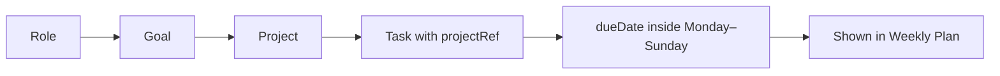

# Weekly Plan

Weekly Plan is the beginning-of-week workflow for turning Compass direction into tasks. Open
`/weekly-plan`, review each active **Role → Goal → Project** branch, and create ordinary tasks
for the current Monday–Sunday week.

It is deliberately a **stateless lens**. There is no weekly-plan collection, selected-task
flag, archived plan, or separate completion lifecycle. The existing task remains the source
of truth:



That makes task dates the history: if you want to know what work was created for a past
week, the task's normal dates provide that record without maintaining a second planning
system.

---

## Use the page

Choose **Weekly Plan** in the authenticated navigation, between Calendar and Compass.

The header shows the current Monday–Sunday range, number of incomplete tasks due during the
range, and their total duration. **Go to calendar** only navigates; opening or leaving Weekly
Plan never runs the scheduler.

Each card walks through the live Compass hierarchy:

1. Read the role description and dates.
2. Review each goal and its description.
3. Review each started project.
4. Check the tasks already due this week.
5. Open **Other active tasks** to avoid duplicating work that is due outside the week.
6. Add the concrete tasks that should be due this week.

Compass continues to own hierarchy changes. Empty branches link there rather than embedding
role, goal, or project editing in the planning page.

### Someday projects

A project with no `startDate` is parked. Parked projects appear in the collapsed **Someday**
section with their Role → Goal context, but they have no quick-task form. Existing tasks due
this week remain visible there, since Calendar may have linked work before the project was
parked. Start the project in Compass before planning new work beneath it.

Tasks linked to a project outside the active Compass payload, such as an archived project's
remaining task, appear in **Outside active Compass** so header totals never hide work.

### Unaligned tasks

Incomplete unaligned tasks due this week appear in a collapsed section at the bottom. You can
leave them unaligned or assign one to a started project. Assignment uses the existing
`POST /api/setTaskProject` ownership checks and immediately moves the task into its project on
the page.

Alignment remains optional. The page never blocks planning because unaligned work exists.

---

## Create a task quickly

Every started project has a compact form:

- **Task title** — required.
- **Minutes** — a positive duration, default 30.
- **Due date** — constrained to the displayed Monday–Sunday range, default Sunday.
- **Project** — shown by the surrounding project card and sent as `projectRef`.

The task's start date defaults to today in the user's saved timezone. Submitting calls the
normal `POST /api/createTask` endpoint with a one-off, non-backlog task. On success, the
endpoint's refreshed `taskList` updates the project list and page totals immediately.

If validation or the request fails, the message stays beside that form and its title,
duration, and due date remain available to correct and retry.

Use Calendar for recurrence, dependencies, notes, chunking, custom priority, backlog tasks,
or dates outside the current week. Weekly Plan does not duplicate the full task editor.

---

## What counts as this week

A task appears in the main weekly list when its civil `dueDate` is inclusively between the
current Monday and Sunday. Incomplete tasks outside that range, including backlog tasks with
no due date, remain under their project's **Other active tasks** disclosure.

The range is based on the user's persisted IANA timezone, not the browser's current timezone.
The client first derives today's strict `YYYY-MM-DD` date in that saved zone and then performs
calendar-date arithmetic.

`mondayWeekBounds()` exists in both temporal utility modules:

- `utils/temporal.js` returns civil bounds and timezone-aware start/end instants for server
  tests and future server consumers.
- `webinterface/src/utils/temporal.js` returns civil bounds for the page.

The returned civil bounds are:

| Field | Meaning |
| --- | --- |
| `startDate` | Monday, inclusive |
| `endDate` | Sunday, inclusive |
| `nextStartDate` | Following Monday, useful as an exclusive upper bound |

The backend's older `localWeekBounds()` keeps Sunday as its default because
`GET /api/getUserEvents/:date` and the Calendar week already rely on that contract. Passing a
Monday start, or using `mondayWeekBounds()`, does not alter event retrieval.

Never compare these dates by inventing UTC offsets or advance them with fixed milliseconds.
Use the temporal helpers so month ends, year ends, and daylight-saving transitions stay
correct.

---

## Data and endpoints

The page loads these reads in parallel:

| Endpoint | Purpose |
| --- | --- |
| `GET /api/getCompass` | Live roles with goals and projects nested beneath them. |
| `GET /api/getUserTasks` | Incomplete tasks and materialised recurrence occurrences. |

All grouping and totals are client-side derivations over those existing payloads. No Weekly
Plan endpoint or model exists.

Writes reuse:

| Endpoint | Purpose |
| --- | --- |
| `POST /api/createTask` | Create a normal task under the surrounding project. |
| `POST /api/setTaskProject` | Optionally align an existing unaligned task. |

A Compass or task read failure is shown explicitly with a retry. The page must not present a
failed task load as though every project has no work.

---

## Relationship to scheduling

Weekly Plan controls what tasks you author and what due dates you choose. It does not:

- select tasks into a separate commitment set;
- rewrite existing task dates;
- run the scheduler;
- weight roles, goals, or projects;
- reserve capacity per role;
- mark planning complete.

After creation, a task behaves exactly like one created on Calendar. The scheduler continues
to use normal start dates, due dates, priority, dependencies, working hours, and calendar
availability. Future Compass scheduling influence remains a separate, higher-risk feature.

---

## Work on Weekly Plan

The page is `webinterface/src/views/WeeklyPlan.vue`; its route and navigation live in
`webinterface/src/router/index.js` and `webinterface/src/App.vue`. Authentication remains in
the normal router guard, and page state stays local rather than expanding the auth-focused
Vuex store.

The UI intentionally uses project-keyed form state. A failed form under one project must not
clear a draft under another project.

Tests:

- `tests/api/temporal.spec.js` pins Monday bounds across DST and year boundaries while
  preserving Sunday-based event bounds.
- `tests/api/compass.spec.js` pins project-linked quick-create fields and ownership behavior.
- `tests/ui/weeklyPlan.spec.js` covers hierarchy review, task grouping, quick creation,
  failure recovery, Someday, unaligned work, saved-timezone behavior, and narrow screens.

Run a focused UI check while iterating:

```bash
npm test -- --project=ui tests/ui/weeklyPlan.spec.js
```

Run `npm run verify` before shipping.
