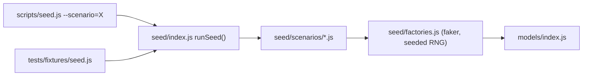

# Regression test suite (Playwright) + scenario-based fake data seeding

Give agents a single, low-maintenance way to prove they haven't broken existing behaviour:
one Playwright project that covers both the HTTP API and the Vue UI, backed by a
scenario-based seeding library that produces rich, deterministic fake data.

## Why Playwright (and nothing else)

- One runner for API + UI. `request` fixture does supertest-style API tests with no second
  framework; `page` does real browser flows. Agents learn one API.
- `webServer` config boots the whole stack (mongo + API + Vue) automatically, so `npm test`
  is the only command anybody has to remember.
- Auto-waiting + trace/screenshot/video on failure means agents can debug failures from
  artifacts instead of re-running by hand — the single biggest maintenance win.
- Built-in parallelism, retries, HTML report, and `--ui` mode. No Jest/Vitest/Cypress split.

Rejected: Cypress (no API-test story, heavier), Jest+supertest (no UI coverage, second
runner to maintain), unit tests on `controllers/scheduling.js` alone (doesn't catch the
integration breaks agents actually cause). We will still get scheduling coverage — via
API-level tests that call `/api/scheduletasks` and assert on resulting events, which is
both more honest and easier to keep green.

## Part 1 — Seeding: `seed/` scenario library

Replace the single hard-coded `seedDatabase.js` with a small library plus a CLI.



- `seed/factories.js` — `makeUser`, `makeTask`, `makeEvent`. Sensible defaults, every field
  overridable. Uses `@faker-js/faker` with a **fixed seed** so runs are reproducible.
  All dates are expressed as offsets from a passed-in `anchor` moment (default: today at
  00:00 local) so tests never depend on the wall clock.
- `seed/scenarios/` — one file per scenario, each exporting `{ name, description, build() }`:
  - `empty` — a user with no tasks/events (empty-state UI).
  - `basic` — today's parity with the current seed script: a handful of tasks, a backlog
    item, a broken-up task, 3 calendar events. Default scenario.
  - `full` — a "realistic power user": ~40 active tasks across priorities, dependency
    chains, repeats (daily/weekly/monthly), 60+ completed tasks spanning 90 days (drives
    pagination, search, and the statistics charts), a full week of calendar events
    including overlaps and all-day-ish blocks, plus a second user whose data must never
    leak (cross-tenant isolation assertions).
  - `edge` — deliberately nasty: zero-duration task, task longer than the working day,
    due date in the past, no due date, unicode/emoji/very long titles, task whose
    dependency is incomplete, event exactly on a working-hours boundary, DST-crossing week.
- `seed/index.js` — `runSeed({ scenario, mongoUrl, reset })`: connects, wipes the target
  db's `userInfo`/`taskInfo`/`eventInfo` collections, builds the scenario, returns the
  created ids/handles so tests can assert against them without re-querying.
- `scripts/seed.js` — CLI wrapper. `npm run seed` keeps working (defaults to `basic`,
  `testuser`/`testpassword` unchanged); `npm run seed -- --scenario=full --list` etc.
- Delete `seedDatabase.js`, repointing `npm run seed`.

Credentials stay `testuser` / `testpassword` for every scenario so `docs/TEST_CREDENTIALS.md`
remains true; second user in `full` is `otheruser` / `testpassword`.

## Part 2 — Test suite

```
tests/
  playwright.config.js      # at repo root actually; see below
  fixtures/
    index.js                # exports `test` extended with seed + auth fixtures
  api/
    auth.spec.js
    tasks.spec.js
    events.spec.js
    scheduling.spec.js
  ui/
    login.spec.js
    tasks.spec.js
    calendar.spec.js
    completed-tasks.spec.js
    statistics.spec.js
  README.md                 # how to add a test (agents read this first)
```

Fixtures (`tests/fixtures/index.js`) do the heavy lifting so specs stay ~10 lines:

- `seed` — worker-scoped-ish fixture: `await seed('full')` wipes + reseeds and returns the
  created data. Tests declare the scenario they need; no cross-test leakage.
- `api` — an authenticated `APIRequestContext` (logs in via `/api/login`, carries the JWT/
  cookie). Also `apiAnon` for auth-failure tests.
- `loggedInPage` — a `page` already authenticated, landing on the app.

Isolation: tests run against their own instance via
`AUTOTASKCALENDAR_INSTANCE=<branch>-test`, which `instance.js` already turns into distinct
ports + database + container. So `npm test` never touches the database you're developing
against, and parallel agents still don't collide. `playwright.config.js` `webServer` starts
`npm run db:up` + the API + a **built** Vue bundle served by Express (`npm run build` once,
Express already serves `dist/`) — one server, faster and closer to production than the dev
server. `fullyParallel: false` at first (shared db), `workers: 1`; revisit later if slow.

Coverage on day one (the "don't break this" baseline):

- Auth: register, login success/failure, `/api/user/:username` requires token, logout.
- Tasks: create, edit, delete, complete, complete-a-chunk, backlog toggle, list, completed
  list pagination, search, statistics endpoint shape, follow-up creation.
- Events: create/update/delete, `getUserEvents/:date` window correctness.
- Scheduling: run `/api/scheduletasks` on the `full` and `edge` scenarios and assert the
  invariants rather than exact timestamps — nothing scheduled outside working hours or on
  non-working days, no overlap with calendar events, no task scheduled before its
  dependency, broken-up tasks emit chunks summing to the duration, backlog items never
  scheduled, re-running is idempotent. These invariants are the real regression net for
  `controllers/scheduling.js`.
- UI smoke: login → task list renders seeded tasks; create a task in the UI and see it;
  complete a task; calendar renders scheduled blocks; completed-tasks pagination + search;
  statistics page renders charts without console errors.

## Part 3 — Making it stick for agents

- `npm test` (headless), `npm run test:ui` (Playwright UI mode), `npm run test:report`.
- `docs/TESTING.md` — standalone manual: how to run, how the instance isolation works, how
  to pick/add a scenario, how to write a new spec (copy-paste template), how to read a
  failure trace, and the rule: **any behaviour change ships with a spec**.
- `docs/SEEDING.md` — standalone manual for the seed library and each scenario.
- Update `AGENTS.md`: replace "There is no test suite" with `npm run build && npm test`,
  and point at the two new docs.
- Add `test-results/`, `playwright-report/`, `.playwright/` to `.gitignore`.

## Verification

- `npm run seed` still prints the same credentials and produces a usable app.
- `npm run seed -- --scenario=full` then `npm run dev` — app looks rich and correct.
- `npm test` green from a clean checkout; deliberately break a scheduling invariant and
  confirm a test goes red with a useful trace.
- `npm run build` succeeds.

## New dependencies

`@playwright/test` and `@faker-js/faker` as devDependencies (first entries in the currently
empty `devDependencies`).
