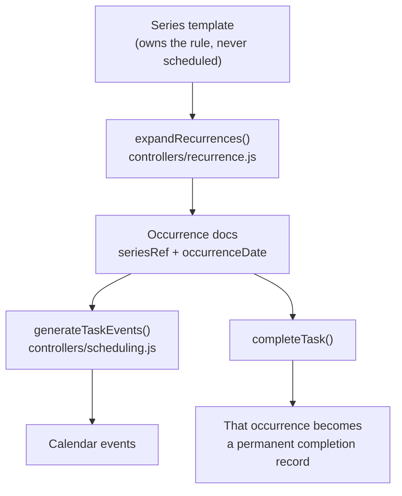

# Advanced recurring tasks: frequency, day-of-period selection, and repeating scheduling

All design decisions are settled (§3). This is ready to implement.

---

## 1. Where we are today

Recurrence is one string field and one code path.

| Piece | Location | What it does |
|---|---|---|
| Storage | `models/index.js:42` | `repeat: String` — `'daily' \| 'weekly' \| 'monthly' \| 'yearly'` or null |
| Behaviour | `controllers/taskController.js:53-86` | On **completion**, clone the task and push `startDate`/`dueDate` forward by one period |
| UI | `webinterface/src/views/Calendar.vue:166-180` | A single `<select>` in Advanced Options |
| Scheduler | `controllers/scheduling.js` | **Completely unaware of `repeat`.** Sees one task, emits one block |

So a weekly task shows **one** block; the next appears only after you tick it complete.
"Every Monday and Tuesday" is not expressible at all.

### Bug found while reading (fix as part of this work)

`routes/tasks.js:50` destructures **`taskRepeat`** from the request body, but
`Calendar.vue:541` posts **`repeat`**. Recurrence is silently discarded on **create**. It
only sticks via `editTask`, which does a whole-document `findByIdAndUpdate`. So today the
only way to get a repeating task is to create it, then edit it.

---

## 2. The design in one picture

**Split "the rule" from "the occurrences."** A repeating task becomes a *series*: one
template document owning the recurrence rule, from which the scheduler materialises concrete
occurrence documents over a rolling window.



Because each occurrence is a real task document, **each completion is its own completed-task
record** — which is exactly the semantics we want (§3.6). The scheduler already wipes and
regenerates every `task`/`task-chunk` event per run, so a materialisation pass in front of it
preserves the existing idempotence guarantee (`tests/api/scheduling.spec.js:191`).

---

## 3. Decisions (settled)

### 3.1 Data model

```js
// models/index.js — added to TaskDetail
recurrence: {
    freq:      String,   // 'daily' | 'weekly' | 'monthly' | 'yearly'
    interval:  Number,   // every N periods. default 1
    byWeekday: [Number], // 0=Sun..6=Sat. weekly (and daily) only
    byMonthDay:[Number], // 1..31, plus -1 for "last day". monthly only
    endsOn:    Date,     // null = never
    endsAfter: Number,   // occurrence count. null = never
},

seriesRef:        { type: Schema.Types.ObjectId, ref: 'taskInfo' }, // null on the template
occurrenceDate:   Date,     // the date this occurrence is FOR (local midnight)
isSeriesTemplate: Boolean,
```

| You asked for | Field | Example |
|---|---|---|
| How often it repeats | `freq` + `interval` | `{freq:'weekly', interval:2}` = fortnightly |
| Which days of that period | `byWeekday` / `byMonthDay` | `{freq:'weekly', byWeekday:[1,2]}` = every Mon **and** Tue |
| Repeated scheduling | `seriesRef` + `occurrenceDate` | Materialised occurrences, 60 days ahead |

`byWeekday` mirrors the iCalendar RRULE model, so a future `.ics` or Google Calendar
recurring-event mapping is mechanical. No RRULE dependency — a ~150-line generator covers it.

**The template is never scheduled and never completed.** It is a rule holder, not a work
item, so `isSeriesTemplate: {$ne: true}` must be added to the queries in
`getTaskListFromUsername` (`controllers/taskController.js:6`) and both task queries in
`buildSchedulingContext` (`controllers/scheduling.js:467,475`). **Miss this and every series
shows a phantom task in the sidebar and gets double-scheduled.**

**Legacy migration:** no script. `expandRecurrences()` translates a legacy `repeat` string on
the fly (`'weekly'` → `{freq:'weekly', interval:1}`) and the first save writes the new shape.

### 3.2 Horizon — 60 days

Monthly tasks are then always visible. **This has two consequences that must ship with it:**

**(a) The event-fetch horizon must move too.** `SCHEDULING_HORIZON_DAYS = 14`
(`scheduling.js:10`) bounds only the *existing events* query (`scheduling.js:482-486`) — the
scheduling loop itself is unbounded. So beyond day 14 the scheduler has **no knowledge of
the user's real calendar events** and will happily book on top of them. Today that is latent
(it needs a big backlog to reach day 15); with 60 days of daily occurrences it becomes
certain. Raise the constant to 60 so the events query covers everything the loop can reach.

**(b) The sidebar needs a window.** `Calendar.vue`'s task list renders *every* incomplete
task grouped by date. Sixty days of occurrences would make it enormous. The sidebar gets
capped at the next **14 days** (plus anything overdue/unscheduled); the calendar grid needs
no change, since it already loads week by week via `getUserEvents/:date`.

Also cap occurrences materialised per series per run, so a runaway rule cannot exhaust
`MAX_SCHEDULING_ITERATIONS` (10000).

### 3.3 Missed occurrences — remove them

Past-dated **incomplete** occurrences are deleted on each expansion, so recurring chores
never pile up. Two hard exclusions:

- **Completed occurrences are never pruned.** They are the completion history (§3.6).
- The series template is never pruned.

A `catchUpMissed` per-series flag can be layered on later without a schema change.

### 3.4 Occurrence due date — end of its own day

"Due that day." The scheduler's entire priority ordering is deadline-based
(`findBestTaskForSlot`, `scheduling.js:164`), so every occurrence needs a real `dueDate`.
Preserving a template's due-date offset can be added later without a schema change.

### 3.5 Non-working days — materialise, and warn in the UI

If you pick a weekday that isn't in `user.workingDays`, we still create the occurrences, and
the UI says so. **Where the warning materialises — three places:**

1. **The weekday pills themselves** (`RepeatEditor.vue`). Non-working days render muted with
   a dashed border *before* you click, so the constraint is visible up front. Source is
   `this.$store.state.user.workingDays` — already in the Vuex store as day names
   (`['Monday',...]`), no API call needed; `Calendar.vue:942` already reads the store's user
   this way.
2. **An inline warning directly beneath the pills**, live and reactive the moment a
   non-working day is selected: *"Saturday is not one of your working days — these
   occurrences will not be scheduled. Change your working days on your profile."* It is a
   **warning, not a validation error**: OK stays enabled and the rule saves.
3. **The sidebar**, where such occurrences land unscheduled — see the bug below.

**Bug this exposes (fix while we're here).** `Calendar.vue:847` `getTaskDate()` returns
`"Backlog"` only for backlog tasks with no `scheduledDate`. Any *non-backlog* task with no
`scheduledDate` falls through to `new Date(undefined).toLocaleDateString()` → the string
**`"Invalid Date"`**, which becomes a sidebar group header. This is already reachable today
(any task the scheduler can't fit, e.g. the seeded `longerThanWorkday` and `blocked`; or any
task before the first "Schedule Tasks" run). Deliberately allowing never-schedulable
occurrences makes it common, so `getTaskDate()` gains an **"Unscheduled"** group.

### 3.6 Completion — every completion is its own completed-task record

Today completion mutates the single task doc. Under the series model this falls out cleanly:

- Completing an occurrence sets `completed`/`completedDate` **on that occurrence document**.
  Tick the standup on Monday and again on Tuesday and you get **two** completed task records,
  each with its own true completion date — an accurate history instead of one row that keeps
  getting overwritten.
- The clone-forward block (`taskController.js:53-86`) is **removed** for rule-based tasks:
  the next occurrence already exists. Legacy `repeat`-string tasks not yet converted keep the
  old path so nothing breaks mid-migration.
- Completed occurrences are **immutable**: never pruned, never touched by rule edits, and
  never re-materialised. Expansion is keyed on `(seriesRef, occurrenceDate)`, so completing
  today's occurrence cannot regenerate it.
- **Deleting a series** removes the template and its *incomplete* occurrences, but **retains
  completed ones** as history (they keep `seriesRef` pointing at a now-deleted template,
  which is fine — nothing dereferences it).

### 3.7 Editing a series — series-only for v1

Editing any occurrence edits the whole series; deleting deletes the whole series. No
exception/override tracking. The edit modal shows a banner: *"Part of a repeating series —
changes apply to all occurrences."* The `seriesRef` schema already supports adding
*this / this-and-future / all* later.

### 3.8 Remove the Completed Tasks page

Dropped entirely, following the precedent of `tasks/00042-p2-done--remove-statistics-page.md`:

1. Delete `webinterface/src/views/CompletedTasks.vue`.
2. `webinterface/src/router/index.js:59-66` — remove the `/completed` route.
3. `webinterface/src/App.vue:12` — remove the "Completed Tasks" nav link.
4. `routes/tasks.js:257-310` — remove `GET /getCompletedTasks` and `GET /searchCompletedTasks`.
5. `controllers/taskController.js:16-43` — remove `getCompletedTasksFromUsername` and its export.
6. Delete `docs/completed-tasks-preview.html`.
7. Delete `tests/ui/completed-tasks.spec.js`; remove the two API specs at
   `tests/api/tasks.spec.js:196` (pagination) and `:216` (search).

**`completed` / `completedDate` stay on the task model** — they are the completion record
(§3.6), and `getTaskListFromUsername` plus the scheduler both depend on filtering completed
tasks out. We are removing the *view*, not the data. The seeded 70 completed tasks stay
(the "completed tasks are never scheduled" spec needs them), though the volume no longer
needs to drive pagination.

---

## 4. UI

New `webinterface/src/components/RepeatEditor.vue` — the task modal is already ~250 lines of
template. Collapsed state is a single select, identical to today, so nobody pays for
complexity they don't use.

```
Repeat  [ Weekly        ▾ ]        ← same control as today

  ── shown only when not "None" ──
  Every [ 1 ] week(s)

  On    [S][M][T][W][T][F][S]      ← freq=weekly. toggle pills, multi-select
        [Mon, Tue on] [Sat, Sun muted+dashed = non-working]

  On day [ 15 ] of the month       ← freq=monthly
         ( ) Last day of the month

  Ends   (•) Never
         ( ) On [ date ]
         ( ) After [ n ] occurrences

  ⓘ Repeats every week on Monday and Tuesday
  ⚠ Saturday is not one of your working days — these
    occurrences will not be scheduled.
```

The live plain-English summary is the only feedback that the rule means what you think it
means; it comes from the same `describeRecurrence()` the backend uses.

**Occurrences in the sidebar** appear as normal tasks in their date groups with a small `↻`
icon, mirroring the existing `🔗` dependency icon (`Calendar.vue:43`). Windowed to 14 days
per §3.2(b), with an "Unscheduled" group per §3.5. The calendar grid needs no change —
occurrences emit ordinary `task` events that already render and are clickable.

---

## 5. Backend

### New: `controllers/recurrence.js` (pure, unit-testable)

| Function | Responsibility |
|---|---|
| `describeRecurrence(rule)` | → `"Every week on Monday and Tuesday"`. Shared with the UI |
| `occurrenceDatesBetween(rule, from, to, anchor)` | The generator. Returns `Date[]` |
| `normaliseLegacyRepeat(task)` | `'weekly'` string → rule object |
| `expandRecurrences(user, horizonDays)` | Materialise + prune occurrences for one user |

`expandRecurrences` must be **idempotent**, via upsert keyed on
`(seriesRef, occurrenceDate)`. This is the highest-risk invariant in the feature and gets its
own spec.

### `controllers/scheduling.js`

- One call at the top of `generateTaskEvents`, before the event wipe:
  `await expandRecurrences(user, RECURRENCE_HORIZON_DAYS);`
- `SCHEDULING_HORIZON_DAYS` → 60 (§3.2a).
- Exclude series templates from both task queries (§3.1).
- The main loop is otherwise **untouched** — occurrences are ordinary task documents by the
  time `buildSchedulingContext` runs. Keeping the repo's highest-risk file out of scope is
  the main reason for materialising rather than expanding virtually.

### `controllers/taskController.js` / `routes/tasks.js`

- Remove clone-forward for rule-based tasks; keep it for legacy strings (§3.6).
- Fix the `taskRepeat`/`repeat` mismatch on `createTask`.
- Validate `recurrence` on create and edit: known `freq`, `1 <= interval <= 366`, `byWeekday`
  in 0-6, `byMonthDay` in 1-31 or -1, and reject `isBacklog` + recurrence (a backlog task has
  no due date to advance). Errors via `returnFailure()` (HTTP 200 + `{success:false}`).
- `deleteTask` on a template cascades to incomplete occurrences only (§3.6).

---

## 6. Timezones

The app has **no per-user timezone** — `UserDetail` has no such field, and the scheduler
builds working hours with server-local getters (`getWorkingHoursForDay`, `scheduling.js:96`).
Recurrence must match that convention rather than invent a parallel one: generate with
`moment` in **server-local** time, exactly as `seed/factories.js` does, and store
`occurrenceDate` at local midnight. A real per-user timezone is out of scope, and noted as a
known limitation in the docs.

Two concrete traps:

- **Never use UTC getters** (`getUTCDay`) or `moment.utc()` for weekday logic — "every
  Monday" silently becomes Sunday for users behind UTC.
- **Never advance days with `+ MS_PER_DAY`** — it drifts an hour across a DST boundary and
  eventually flips the date. Use `moment().add(n, 'days')`. `scheduling.js:370` and `:393`
  already do the unsafe arithmetic; at a 14-day horizon they rarely cross DST, but at 60 days
  they will for part of the year, so **fix both as part of this work**.

---

## 7. Risks

| Risk | Mitigation |
|---|---|
| Occurrence explosion floods the scheduler, which has no time bound — only a 10k iteration guard | Hard 60-day ceiling + per-series per-run cap |
| Duplicate occurrences on repeated runs | Upsert keyed on `(seriesRef, occurrenceDate)` + explicit idempotence spec |
| Series template leaks into the sidebar / gets double-scheduled | `isSeriesTemplate: {$ne: true}` on all three task queries; spec asserts it |
| Scheduling past day 14 ignores real calendar events | Raise `SCHEDULING_HORIZON_DAYS` to 60 (§3.2a) |
| DST drift flips occurrence weekdays | moment-based date math everywhere; dedicated DST-crossing spec |
| Orphaned occurrences after a rule edit | Prune future *incomplete* occurrences that no longer satisfy the rule; completed ones untouched |

---

## 8. Test plan

**Any behaviour change ships with a spec** (AGENTS.md).

`tests/api/recurrence.spec.js` (new):
- weekly + `byWeekday:[1,2]` materialises only Mondays and Tuesdays
- `interval:2` skips alternate periods; monthly `byMonthDay:[31]` handles short months;
  `byMonthDay:[-1]` = last day
- `endsOn` / `endsAfter` stop generation
- **expansion is idempotent** — schedule twice, occurrence count unchanged
- past incomplete occurrences are pruned; **completed ones survive** (§3.3)
- completing two occurrences yields **two** completed records with distinct dates (§3.6)
- completing an occurrence does not regenerate it on the next expansion
- the series template never appears in `getUserTasks` and is never scheduled
- editing a rule prunes now-invalid future occurrences but preserves completed history
- deleting a series removes incomplete occurrences and retains completed ones
- legacy `repeat:'weekly'` tasks still generate occurrences
- validation rejects bad `freq`, `interval:0`, `byWeekday:[9]`, backlog+recurrence
- DST: a weekly series spanning a DST boundary keeps its weekday

`tests/api/scheduling.spec.js` (extend):
- occurrences land on their intended weekday
- existing invariants (no overlap, working hours, dependencies) hold with recurring tasks
- **no scheduled block overlaps a calendar event beyond day 14** (the §3.2a regression)
- a daily series across the full horizon does not trip the iteration guard

`tests/api/tasks.spec.js`: rewrite the completion test per §3.6; delete the two completed-page
specs per §3.8.

`tests/ui/calendar.spec.js` (extend):
- create a Mon+Tue weekly task through the modal; summary line reads correctly; occurrences
  appear with the `↻` icon
- selecting a non-working day shows the inline warning and still saves
- no "Invalid Date" group header ever renders

`seed/dataset.js`: add a `byWeekday` series, a fortnightly series, a monthly-by-day series,
and one legacy `repeat`-string task.

---

## 9. Documentation

New `docs/RECURRING_TASKS.md` — rule model, expansion lifecycle, horizon and pruning policy,
completion-record semantics, the server-local timezone convention and its limitation, and how
to add a new frequency. One index line in `AGENTS.md`.

---

## 10. Sequencing

Each step leaves the suite green.

1. **Remove the Completed Tasks page** (§3.8). Self-contained, shrinks the surface first.
2. **Model + validation + the `taskRepeat` bug.** Schema, route validation, legacy normaliser.
3. **`controllers/recurrence.js`** — pure generator + `describeRecurrence`, with its own spec.
   No wiring yet. *The bulk of the logic and the risk.*
4. **Expansion + scheduler hook.** `expandRecurrences`, template exclusion, horizon bump to
   60, DST-safe date math, `completeTask` change.
5. **UI.** `RepeatEditor.vue`, non-working-day warning, sidebar `↻` + windowing +
   "Unscheduled" group, series banner.
6. **Seed data + `docs/RECURRING_TASKS.md`.**

## Verify

`npm run build` and `npm test` both pass.
