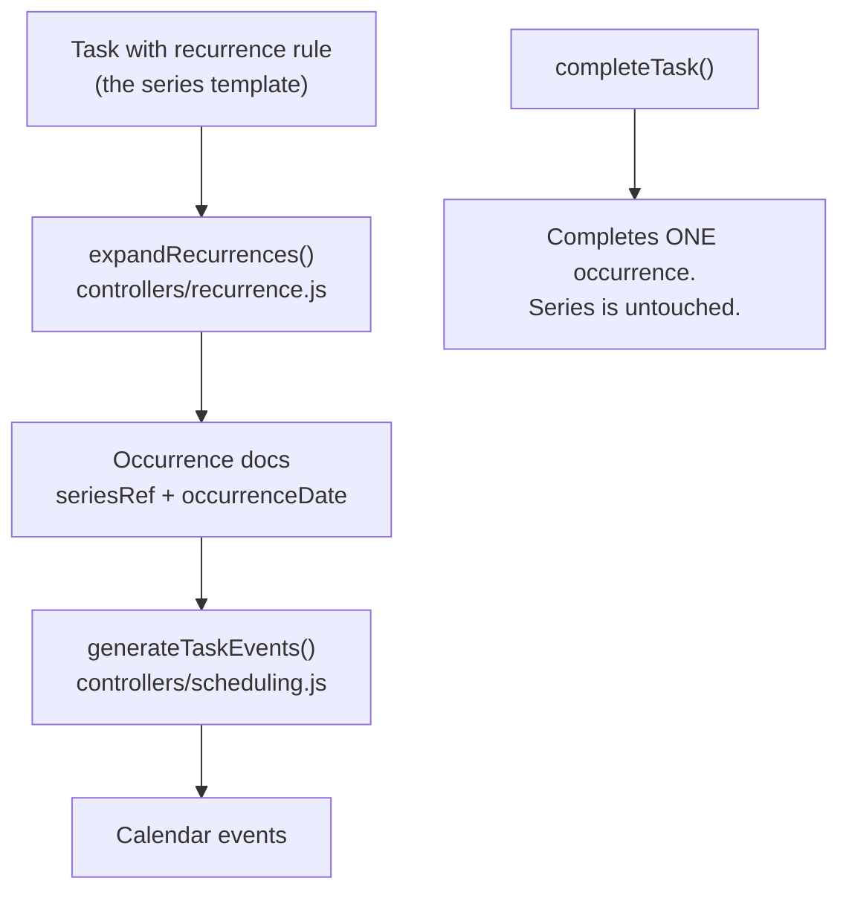

# Advanced recurring tasks: frequency, day-of-period selection, and repeating scheduling

**Status: design draft for review.** Section 4 lists the open decisions — please edit those
before this becomes an implementation plan.

---

## 1. Where we are today

Recurrence is one string field and one code path.

| Piece | Location | What it does |
|---|---|---|
| Storage | `models/index.js:42` | `repeat: String` — `'daily' \| 'weekly' \| 'monthly' \| 'yearly'` or null |
| Behaviour | `controllers/taskController.js:53-86` | On **completion**, clone the task and push `startDate`/`dueDate` forward by one period |
| UI (edit) | `webinterface/src/views/Calendar.vue:166-180` | A single `<select>` in Advanced Options |
| UI (badge) | `webinterface/src/views/CompletedTasks.vue:54-57` | Renders the raw string |
| Scheduler | `controllers/scheduling.js` | **Completely unaware of `repeat`.** Sees one task, emits one block |

Consequences:

- A weekly task shows **one** block on the calendar. The next one only appears after you
  tick the current one complete.
- "Every Monday and Tuesday" is not expressible at all.
- Nothing forces an occurrence onto a particular weekday — the scheduler places it wherever
  it fits.

### Bug found while reading (fix as part of this work)

`routes/tasks.js:50` destructures **`taskRepeat`** from the request body, but
`Calendar.vue:541` posts **`repeat`**. Recurrence is silently discarded on **create**. It
only sticks via `editTask`, which does a whole-document `findByIdAndUpdate`. So today the
only way to get a repeating task is to create it, then edit it.

---

## 2. The design in one picture

The central idea: **split "the rule" from "the occurrences."** A repeating task becomes a
*series* — one template document that owns the recurrence rule — and the scheduler
materialises concrete occurrence documents from it, a rolling window at a time.



The scheduler already deletes and regenerates every `task`/`task-chunk` event on each run,
so adding a materialisation pass in front of it keeps the existing idempotence guarantee
(`tests/api/scheduling.spec.js:191`).

---

## 3. Data model

Replace the `repeat` string with a `recurrence` sub-document, keeping the old field readable
for migration.

```js
// models/index.js — added to TaskDetail
recurrence: {
    freq:      String,   // 'daily' | 'weekly' | 'monthly' | 'yearly'
    interval:  Number,   // every N periods. default 1
    byWeekday: [Number], // 0=Sun..6=Sat. weekly (and daily) only
    byMonthDay:[Number], // 1..31, plus -1 for "last day". monthly only
    endsOn:    Date,     // null = never
    endsAfter: Number,   // occurrence count. null = never
},

// Occurrence bookkeeping
seriesRef:      { type: Schema.Types.ObjectId, ref: 'taskInfo' }, // null on the template
occurrenceDate: Date,     // the date this occurrence is FOR (local midnight)
isSeriesTemplate: Boolean,
```

### How the three requested capabilities map

| You asked for | Field | Example |
|---|---|---|
| How often it repeats | `freq` + `interval` | `{freq:'weekly', interval:2}` = fortnightly |
| Which days of that period | `byWeekday` / `byMonthDay` | `{freq:'weekly', byWeekday:[1,2]}` = every Mon **and** Tue |
| Repeated scheduling | `seriesRef` + `occurrenceDate` | Scheduler materialises N occurrences ahead |

`byWeekday` is deliberately close to the iCalendar RRULE model, so if you ever want to
import/export `.ics` or push recurring events to Google Calendar, the mapping is mechanical.
We are **not** taking an RRULE dependency — a ~150-line generator covers these cases.

### Legacy migration

No migration script. `expandRecurrences()` reads `recurrence` if present and otherwise
translates a legacy `repeat` string on the fly (`'weekly'` → `{freq:'weekly', interval:1}`);
the first save writes the new shape. Seed data and old rows keep working untouched.

---

## 4. Open decisions — **please edit these**

### D1. Occurrence horizon

How far ahead do we materialise? `SCHEDULING_HORIZON_DAYS` is currently `14`, but note it is
only used to *fetch existing events* — the scheduling loop itself is unbounded and runs
until the pending list empties. Unbounded expansion would therefore hang the scheduler, so
the horizon becomes a hard cap.

- **(a) 14 days**, matching the existing constant. Simple, cheap, but a monthly task is
  invisible most of the time.
- **(b) 60 days.** Monthly tasks always visible; ~2× the occurrence docs.
- **(c) 30 days, plus "always at least the next 3 occurrences."** Guarantees a monthly or
  yearly task is always on-screen. *Recommended.*

**Current pick: (c).**

### D2. Missed occurrences

Yesterday's "daily standup notes" was never completed. Today the scheduler runs.

- **(a) Skip.** Past-dated incomplete occurrences are deleted. Recurring chores never pile
  up. Matches how most habit trackers behave.
- **(b) Carry over.** They stay and become overdue, competing for today's time. Miss a week
  of dailies and your calendar is buried.
- **(c) Per-series flag** `catchUpMissed` (default off = skip).

**Current pick: (a)**, with (c) as a later addition if you want it.

### D3. Occurrence due date

Each occurrence needs a `dueDate` because the scheduler's whole priority ordering is
deadline-based (`findBestTaskForSlot`, `controllers/scheduling.js:164`).

- **(a) End of `occurrenceDate`.** "Due that day." Clean, matches the mental model of a
  recurring chore.
- **(b) Preserve the template's due-date offset** from its start date. Lets you say
  "repeats weekly, but each one has 3 days of slack."

**Current pick: (a)** for v1, since (b) can be layered on later without a schema change.

### D4. What if the occurrence day isn't a working day?

You ask for "every Saturday" but Saturday isn't in `user.workingDays`.

- **(a) Materialise it anyway.** The scheduler will not place it (it skips non-working days
  at `handleNonWorkingDay`), so it sits in the sidebar unscheduled and looks broken.
- **(b) Skip the occurrence entirely.**
- **(c) Materialise it, and warn in the UI** at rule-creation time: *"Saturday isn't one of
  your working days — these occurrences won't be scheduled."*

**Current pick: (c).** The rule is honest about what it will do, and the user can fix their
working days.

### D5. Editing and deleting a series

The classic recurring-event UX problem.

- **(a) v1: series-only.** Editing any occurrence edits the whole series; deleting deletes
  the whole series. Simple, no exception tracking.
- **(b) Full three-way** — *this occurrence / this and future / all* — needs an
  exceptions/overrides model.
- **(c) Middle ground:** editing an occurrence's **title/notes/duration** touches only that
  occurrence (a per-occurrence override flag); editing the **rule** touches the series.

**Current pick: (a)** for v1, with the schema (`seriesRef`) already able to support (b)
later. *This is the decision most worth pushing back on if you disagree.*

### D6. Completion semantics

Today, completing a repeating task clones it forward. Under the new model, completion just
completes **one occurrence** — the next one already exists.

This changes `tests/api/tasks.spec.js:142` ("completing a repeating task creates the next
occurrence"), which currently asserts exactly **one** successor. That test gets rewritten to
assert the *series* invariant instead: the horizon still contains future occurrences, and the
completed one is no longer among them.

---

## 5. UI design

### The repeat editor (`Calendar.vue`, Advanced Options)

Extract into a new `webinterface/src/components/RepeatEditor.vue` — the task modal is already
~250 lines of template and this would push it over.

Progressive disclosure: the collapsed state is a single select, exactly like today, so nobody
pays for complexity they don't use.

```
Repeat  [ Weekly        ▾ ]        ← same control as today

  ── shown only when not "None" ──
  Every [ 1 ] week(s)

  On    [S][M][T][W][T][F][S]      ← freq=weekly. toggle pills, multi-select
        [Mon and Tue selected]

  On day [ 15 ] of the month       ← freq=monthly
         ( ) Last day of the month

  Ends   (•) Never
         ( ) On [ date ]
         ( ) After [ n ] occurrences

  ⓘ Repeats every week on Monday and Tuesday
  ⚠ Saturday is not one of your working days      ← D4 warning
```

The live plain-English summary line is the thing that makes this usable — it is the only
feedback that the rule means what you think it means.

### Showing occurrences

- **Sidebar** (`Calendar.vue` task list): occurrences appear like normal tasks in their
  date groups, with a small `↻` icon next to the title — mirroring how the existing `🔗`
  dependency icon works (`Calendar.vue:43`). No new layout.
- **Calendar grid**: no change needed. Occurrences produce ordinary `task` events, so they
  render and are clickable already.
- **Clicking an occurrence** opens the edit modal with a banner: *"Part of a repeating
  series — changes apply to all occurrences"* (per D5a).
- **Completed page** (`CompletedTasks.vue:54`): the badge currently prints the raw `repeat`
  string. Swap for the same plain-English summary.

---

## 6. Backend changes

### New: `controllers/recurrence.js`

Pure, dependency-free, unit-testable. This is where the real logic lives.

| Function | Responsibility |
|---|---|
| `describeRecurrence(rule)` | → `"Every week on Monday and Tuesday"`. Shared with the UI |
| `occurrenceDatesBetween(rule, from, to, anchorDate)` | The generator. Returns `Date[]` |
| `normaliseLegacyRepeat(task)` | `'weekly'` string → rule object |
| `expandRecurrences(user, horizon)` | Materialise/prune occurrence docs for one user |

`expandRecurrences` must be **idempotent** — keyed on `(seriesRef, occurrenceDate)`, using
an upsert so a re-run never duplicates. This is the single highest-risk invariant in the
feature and gets its own spec.

### `controllers/scheduling.js`

One line at the top of `generateTaskEvents`, before the event wipe:

```js
await expandRecurrences(user, SCHEDULING_HORIZON_DAYS);
```

The main loop is **untouched**. Occurrences are ordinary task documents by the time
`buildSchedulingContext` queries them. Keeping the highest-risk file in the repo out of
scope is the main reason for choosing materialisation over virtual expansion.

### `controllers/taskController.js`

`completeTask` loses its clone-forward block (lines 53-86) for recurrence-rule tasks — the
next occurrence already exists. Legacy `repeat`-string tasks that have not yet been
converted keep the old path so nothing breaks mid-migration.

### `routes/tasks.js`

- Fix the `taskRepeat` / `repeat` mismatch on `createTask`.
- Accept and validate a `recurrence` object on create and edit: known `freq`, `interval >= 1`
  and sane upper bound, `byWeekday` values in 0-6, `byMonthDay` in 1-31 or -1. Reject via
  `returnFailure()` (HTTP 200 + `{success:false}`, per the house convention).
- `deleteTask` on a series template also deletes its occurrences (per D5a).

---

## 7. Risks

| Risk | Mitigation |
|---|---|
| **Occurrence explosion.** `daily` + `interval:1` over a long horizon floods the scheduler, which has no time bound — only a 10k iteration guard | Hard cap on occurrences materialised per series per run; horizon is a strict ceiling |
| **Duplicate occurrences** on repeated scheduler runs | Upsert keyed on `(seriesRef, occurrenceDate)`; explicit idempotence spec |
| **Timezone drift.** `occurrenceDate` is a local-midnight concept but stored as UTC. "Every Monday" must not slide to Sunday for a user behind UTC | Generate dates with `moment` in local time, matching `seed/factories.js`. Dedicated DST-crossing spec |
| **Orphaned occurrences** when a rule changes | Expansion prunes future incomplete occurrences whose date no longer satisfies the rule. Completed ones are never touched |
| **`isBacklog` + recurrence** is meaningless (no due date to advance) | Reject the combination at validation time |

---

## 8. Test plan

**Any behaviour change ships with a spec** (AGENTS.md).

`tests/api/recurrence.spec.js` (new):
- weekly + `byWeekday:[1,2]` materialises only Mondays and Tuesdays
- `interval:2` skips alternate periods
- monthly `byMonthDay:[31]` handles short months
- monthly `byMonthDay:[-1]` = last day
- `endsOn` / `endsAfter` stop generation
- **expansion is idempotent** — run the scheduler twice, occurrence count is unchanged
- editing a rule prunes now-invalid future occurrences but preserves completed history
- deleting the series deletes its occurrences
- legacy `repeat:'weekly'` tasks still generate occurrences
- validation rejects bad `freq`, `interval:0`, `byWeekday:[9]`, backlog+recurrence

`tests/api/scheduling.spec.js` (extend):
- occurrences land on their intended weekday
- all existing invariants (no overlap, working hours, dependencies) still hold with
  recurring tasks present
- a daily task over the full horizon does not blow the iteration guard

`tests/api/tasks.spec.js` (amend):
- rewrite the completion test per D6

`tests/ui/calendar.spec.js` (extend):
- create a Mon+Tue weekly task through the modal; the summary line reads correctly;
  occurrences appear in the sidebar with the `↻` icon

`seed/dataset.js`: add a `byWeekday` series, a fortnightly series, a monthly-by-day series,
and one legacy `repeat`-string task to keep the migration path covered.

---

## 9. Documentation

New `docs/RECURRING_TASKS.md` — the rule model, the expansion lifecycle, horizon and
missed-occurrence policy, and how to add a new frequency. `AGENTS.md` gains one index line.

---

## 10. Suggested sequencing

Each step leaves the suite green.

1. **Model + validation + the `taskRepeat` bug.** Schema, `routes/tasks.js`, legacy
   normaliser. Specs for validation.
2. **`controllers/recurrence.js`** — the pure generator and `describeRecurrence`, with its
   own spec file. No wiring yet. *The bulk of the logic and the bulk of the risk.*
3. **Expansion + scheduler hook.** `expandRecurrences`, one call in `generateTaskEvents`,
   `completeTask` change. Idempotence and scheduling specs.
4. **UI.** `RepeatEditor.vue`, sidebar `↻` icon, series banner, `CompletedTasks` badge.
   UI specs.
5. **Seed data + `docs/RECURRING_TASKS.md`.**

## Verify

`npm run build` and `npm test` both pass.
