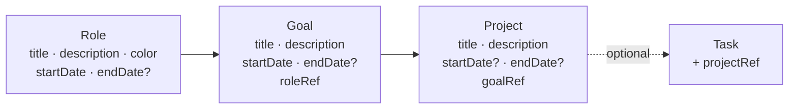

# Compass: roles, goals, and projects — product spec + phase 1 (backend & minimal CRUD)

This file is the **product spec** for the whole Compass feature: the model, the API, the
full UI across four phases, and the rules that keep it from becoming overbearing.

**Implement only Phase 1.** Phases 2–4 are specified here so the shape is agreed up front
and Phase 1 doesn't paint them into a corner; they ship as their own tasks.

Phase 1 also carries this spec forward into the repo as `docs/COMPASS.md` — including the
**UPCOMING WORK** section that spells out phases 2–4 — per the `AGENTS.md` rule that a
broad concept gets a standalone instruction manual in `docs/`.

---

# Part 1 — The product

## The problem

Today the app has exactly one noun: the task. It answers *"what do I do next?"* extremely
well and *"is any of this the right thing to do?"* not at all. A week of well-scheduled
tasks can be a week spent entirely on one role while three others quietly starve, and
nothing in the product would tell you.

## The thesis

Add a deliberate ladder — **Role → Goal → Project → Task** — and make the top three levels
**write-rarely, read-often**. You set them up in a 20-minute session once a quarter and
then barely touch them. The payoff shows up on the screens you already use every day.

## The two rules that keep it cheap

**1. Tasks attach to projects only.** Never to a goal, never to a role. One optional
dropdown on the task modal is the *entire* daily cost of the feature. Everything above is
derived by walking the chain. Want a task under a bare goal? Make a one-line project —
they're free.

**2. Nothing is ever required.** A task with no project behaves exactly as tasks behave
today, forever. The Unaligned bucket is a place to bulk-assign from, not a nag.

## Status is derived from dates, never stored

No `status` enum, nothing to keep in sync, nothing to forget to update.

| | no `endDate` | no `startDate` |
| --- | --- | --- |
| **Role** | Active | — (required) |
| **Goal** | Active | — (required) |
| **Project** | In flight | **Someday** — parked, not started |

Giving a Someday project a start date is what "starting" it means. Setting an end date is
what "finishing" it means. That's the whole state machine.

This table describes how the **client** reads the dates. The API stores and returns the
dates and nothing else — see Part 3.

---

# Part 2 — The data model



All three new schemas go in `models/index.js` (never redefined elsewhere), registered the
same way the existing ones are: `mongoose.model('roleInfo', RoleDetail, 'roleInfo')`, and
likewise `goalInfo` / `projectInfo`.

The child carries the parent ref and the parent exposes the children through a **virtual**
— exactly the pattern `models/index.js` already uses for `UserDetail.virtual('taskList')`.
That is what makes the nested read in Part 3 a `populate()` call rather than hand-rolled
assembly.

```js
const RoleDetail = new Schema({
    title: String,
    description: String,
    color: String,                 // hex; tints this role's work across the UI
    startDate: Date,               // required
    endDate: Date,                 // absent/null = active
    sortOrder: { type: Number, default: 0 },
    userRef: { type: Schema.Types.ObjectId, ref: 'userInfo', index: true },
}, { toJSON: { virtuals: true }, toObject: { virtuals: true } });

RoleDetail.virtual('goalList', {
    ref: 'goalInfo',
    localField: '_id',
    foreignField: 'roleRef',
});

const GoalDetail = new Schema({
    title: String,
    description: String,
    startDate: Date,               // required
    endDate: Date,
    sortOrder: { type: Number, default: 0 },
    roleRef: { type: Schema.Types.ObjectId, ref: 'roleInfo', index: true },
    userRef: { type: Schema.Types.ObjectId, ref: 'userInfo', index: true },
}, { toJSON: { virtuals: true }, toObject: { virtuals: true } });

GoalDetail.virtual('projectList', {
    ref: 'projectInfo',
    localField: '_id',
    foreignField: 'goalRef',
});

const ProjectDetail = new Schema({
    title: String,
    description: String,
    startDate: Date,               // optional; absent/null = Someday
    endDate: Date,
    sortOrder: { type: Number, default: 0 },
    goalRef: { type: Schema.Types.ObjectId, ref: 'goalInfo', index: true },
    userRef: { type: Schema.Types.ObjectId, ref: 'userInfo', index: true },
});
```

`toJSON: { virtuals: true }` is load-bearing: without it the populated children exist on the
document but vanish when Express serialises the response. `UserDetail`'s virtuals are only
ever read server-side, so the repo hasn't needed this before.

And one field on the existing task schema — the only change to it:

```js
projectRef: { type: Schema.Types.ObjectId, ref: 'projectInfo', default: null },
```

### Why `userRef` is denormalised onto goals and projects

Every ownership check in this codebase is `findOne({ _id, userRef: user._id })`. Carrying
`userRef` on all three levels keeps that pattern intact — one query, no joins, no way to
accidentally authorise a goal by forgetting to check its role's owner. It also makes the
seed wipe and the cross-tenant tests trivial.

### Migration

None needed. Every new field is optional or lives on a new collection; existing task
documents read back with `projectRef` undefined and behave exactly as before.

---

# Part 3 — The API

**Design rule for this layer: return the records as they are, and nothing more.** The
hierarchy is returned nested, because that is the shape of the data. But there are no
derived status flags, no partitioning into buckets, no rollups, and no opinions about what
"active" or "stalled" or "someday" means. Those are view concerns and they live in the
client, where they can change without a backend deploy.

All endpoints follow the house conventions: mounted under `/api`, `authenticateToken`,
failures are HTTP 200 + `returnFailure()`.

New files: `routes/compass.js` and `controllers/compassController.js`, wired in `app.js`
alongside the existing three route modules.

| Method | Endpoint | Notes |
| --- | --- | --- |
| GET | `/api/getCompass` | The nested hierarchy. The page's only read. |
| POST | `/api/createRole` · `/api/editRole` · `/api/deleteRole` | |
| POST | `/api/createGoal` · `/api/editGoal` · `/api/deleteGoal` | |
| POST | `/api/createProject` · `/api/editProject` · `/api/deleteProject` | |
| POST | `/api/setTaskProject` | `{ taskId, projectId }`; `null` unlinks. |

Mutations return the same payload as `getCompass`, mirroring how the task endpoints return
the refreshed `taskList` — the UI never has to re-fetch by hand.

### `GET /api/getCompass` response

Roles contain their goals, goals contain their projects — each record exactly as stored:

```jsonc
{
  "success": true,
  "roles": [{
    "_id": "...", "title": "Engineer", "description": "...", "color": "#667eea",
    "startDate": "...", "endDate": null, "sortOrder": 0,
    "goalList": [{
      "_id": "...", "title": "Ship v2 by June", "description": "...",
      "startDate": "...", "endDate": "...", "sortOrder": 0, "roleRef": "...",
      "projectList": [{
        "_id": "...", "title": "Migration plan", "description": "...",
        "startDate": "...", "endDate": null, "sortOrder": 0, "goalRef": "..."
      }]
    }]
  }],
  "completedCounts": { "roles": 2, "goals": 3, "projects": 5 },
  "unalignedTaskCount": 14
}
```

One query builds it, using the same mechanism `getTaskListFromUsername` already uses:

```js
RoleDetails.find({ userRef: user._id })
    .sort({ sortOrder: 1, startDate: 1 })
    .populate({
        path: 'goalList',
        options: { sort: { sortOrder: 1, startDate: 1 } },
        populate: { path: 'projectList', options: { sort: { sortOrder: 1, startDate: 1 } } },
    });
```

Every role, goal, and project the user owns is present — ended ones included, projects with
no `startDate` included, sitting under their real parent. The client decides what to show,
hide, grey out, or move into a Someday or Archive drawer.

**`completedCounts`** — how many roles / goals / projects are finished, where finished means
`endDate` is set and not in the future. Three `countDocuments` calls.

**`unalignedTaskCount`** — incomplete tasks with no `projectRef`. One `countDocuments`.

### Query parameters

| Param | Effect |
| --- | --- |
| `completedFrom` (ISO date) | Scopes `completedCounts` to items whose `endDate` is on or after this. |
| `completedTo` (ISO date) | Scopes `completedCounts` to items whose `endDate` is on or before this. |

Omit both for all-time totals. This is the historical query: *"how many goals did I actually
finish last quarter?"* is `?completedFrom=2024-01-01&completedTo=2024-03-31`.

The params affect **`completedCounts` only**. `roles` is never filtered — the client always
receives the whole hierarchy and slices it however the current view wants. An invalid or
unparseable date is ignored rather than erroring.

### What the API deliberately does *not* do

- No `someday` bucket, no `archive` bucket, no `stalled` flag, no "is active" booleans.
  Dates go out; meaning is assigned by the client.
- **No per-project task rollups.** The client already loads `/api/getUserTasks`, which now
  carries `projectRef` on every task, so per-project active counts and the next-due task
  are a `reduce` over data the page holds anyway. If a later phase needs
  *completed*-per-project counts (which can't be derived from the active list), that gets
  its own small endpoint then — it does not get baked in here now.

### Validation rules

- `title` required everywhere. `startDate` required on roles and goals, optional on projects.
- `endDate`, when present, must be `>= startDate`.
- `roleRef` / `goalRef` / `projectRef` must exist **and belong to the caller**. This is the
  cross-tenant boundary and gets explicit test coverage.
- Child date ranges are **not** forced inside their parent's. Real plans are messy; the UI
  can hint, the API doesn't police.

### Delete semantics

- Default: deleting something with children **fails** with a `returnFailure()` message along
  the lines of *"still has goals — end it instead, or delete with cascade"*. Ending is
  almost always what was meant.
- `{ cascade: true }` deletes the subtree and **unlinks** affected tasks (`projectRef =
  null`). **Deleting never deletes a task.** This is non-negotiable and gets a test.

### One piece of incidental hardening

`routes/tasks.js` → `/api/editTask` currently does
`TaskDetails.findByIdAndUpdate(task._id, task)` with no `userRef` check, so a caller can
edit another user's task by id. We're touching this handler anyway to validate
`projectRef`, so scope the update to the owner while we're in there
(`findOneAndUpdate({ _id: task._id, userRef: user._id }, ...)`) and ship the spec that
proves it.

---

# Part 4 — The UI

One route, `/compass`, one nav link (`Compass`, between Calendar and Completed Tasks).
Two lenses on the same data behind a segmented toggle.

The page receives the hierarchy already nested and does the *interpretation*: which items
are active, which are parked, which are archived, and what the task counts under each
project are. The server ships records; the page ships the opinions.

## Lens 1 — Focus (default; the daily/weekly driver)

```
┌ Compass ──────────────────────────────── [ Focus | Horizon ]  + Role ─┐
│  Balance · last 7 days                                    (phase 3)   │
│  ████████████ Engineer 12h   █████ Father 4h   ██ Health 2h   ░ Writer│
├───────────────────────────────────────────────────────────────────────┤
│ ▌ ENGINEER              since Jan 2024      2 goals · 4 projects   ⋯  │
│   ┌ Ship v2 by June ─────────────────────────────── ends Jun 30 ─┐    │
│   │   Migration plan      ●3 active   next: Draft plan · Thu     │    │
│   │   Perf pass           ●1 active   next: —                    │    │
│   │   + project                                                  │    │
│   └──────────────────────────────────────────────────────────────┘    │
│   ┌ Grow the team ───────────────────────────────────── ongoing ─┐    │
│   │   Hiring loop         ●2 active   next: Screen CVs · Mon     │    │
│   └──────────────────────────────────────────────────────────────┘    │
│   + goal                                                              │
│                                                                       │
│ ▌ FATHER                since 2019          1 goal · 2 projects    ⋯  │
│   ...                                                                 │
├─ Someday · 3 parked projects ──────────────────────────────────── ▸ ──┤
├─ Unaligned tasks · 14 ─────────────────────────────────────────── ▸ ──┤
└─ Archive · 2 ended roles ──────────────────────────────────────── ▸ ──┘
```

- **Only active things are on screen.** Items with a past `endDate` are lifted out into
  Archive; projects with no `startDate` are lifted into Someday. Both are client-side
  filters over the nested payload. A realistic screen — 4 roles × 2 goals — fits without
  scrolling.
- **The rollup line is the payoff.** `●3 active  next: Draft plan · Thu` is a `reduce` over
  the task list, grouped by `projectRef`. You never update status anywhere; a goal with
  three projects and zero active tasks is visibly, uncomfortably stalled — the page can
  grey it out on exactly that condition, with no server involvement.
- `▌` is the role's colour swatch. Clicking any card opens the drawer.

## Lens 2 — Horizon (the quarterly planning driver) · phase 3

Everything here is an interval, so the honest visualisation is a roadmap:

```
        │ 2024 Q1 │ Q2 │ Q3 │ Q4 │ 2025 Q1 │      ┌ Someday ──┐
ENGINEER│▓▓▓▓▓▓▓▓▓▓▓▓▓▓▓▓▓▓▓▓▓▓▓▓▓▓▓▓▓▓▓▓▓▒▒▒░░→  │ Rewrite   │
  Ship v2         ▓▓▓▓▓▓▓▓▓▓▓▓▓│                   │ the CLI   │
    Migration     ▓▓▓▓▓▓│                          │           │
    Perf pass           ▓▓▓▓▓▓▓│                   │ Learn Rust│
  Grow team             ▓▓▓▓▓▓▓▓▓▓▓▓▓▓▓▓▓▓▓▓▓░░→   └───────────┘
FATHER  │▓▓▓▓▓▓▓▓▓▓▓▓▓▓▓▓▓▓▓▓▓▓▓▓▓▓▓▓▓▓▓▓▓▓▓▓░░→
                                    ↑today
```

Open-ended (active) bars **fade off the right edge** instead of ending — that's the visual
grammar for "no end date means active". The Someday rail sits alongside; giving a parked
project a start date drops it onto the timeline. This is where you *see* that four goals
all end in June, or that a role has had nothing under it for eight months. Every bar comes
straight from the `startDate` / `endDate` pair already in the payload, and the nesting is
already the row order.

## One editor for all three levels

Role, goal, and project are nearly the same shape, so they share **one side drawer**:

```
┌ Edit goal ─────────────────────────── ✕ ┐
│ Title        [ Ship v2 by June        ] │
│ Description  [ ...                    ] │
│ Parent role  [ Engineer            ▾  ] │   (parent picker; goals/projects only)
│ Start date   [ 2024-01-15             ] │
│ End date     [            ] ☐ Active    │   (checkbox clears endDate)
│─────────────────────────────────────────│
│ [ End goal ]                 [ Delete ] │
│                        [ Cancel ][ Save]│
└─────────────────────────────────────────┘
```

Click anything anywhere → this drawer. Cheap to build, nothing new to learn. **"End" is the
primary lifecycle action, Delete is secondary** — ending preserves history for the Horizon
lens, and Delete never touches tasks.

## What this does to the screens you already use

This is what turns a one-time setup cost into daily value, and it's nearly free to build:

1. **Role colour everywhere** (phase 2). `role.color` tints the Calendar task sidebar and
   the scheduled blocks. Your week stops being an undifferentiated wall and becomes legible
   at a glance: *"that's a lot of purple and almost no green."*
2. **Filter the calendar by role** (phase 2). "Show me only Father."
3. **The Balance strip** (phase 3). Minutes completed per role over the last 7 days. It
   answers the only question that matters — *am I actually living the roles I chose?* — and
   you maintain nothing to get it.
4. **The task modal's project picker** (phase 1). A single grouped select, so the whole
   ladder is visible while you choose:

```
Project (optional)     [ ─ none ─                  ▾ ]
  Engineer → Ship v2      ▸ Migration plan
                          ▸ Perf pass
  Father   → Be present   ▸ Weekend adventures
```

## Guardrails, deliberately soft

- Past ~5 active roles or ~3 goals per role, a quiet hint appears: *"Focus is a subtraction
  game."* It never blocks you.
- Empty state on first visit: one sentence explaining the ladder and a single **+ Role**
  button. No wizard, no onboarding tour.
- No badge counts in the nav. Compass must never nag.

---

# Part 5 — Phasing (goes into `docs/COMPASS.md` as UPCOMING WORK)

Phase 1 ships the whole data model and API surface, so every later phase is front-end work
against an API that already returns what it needs.

`docs/COMPASS.md` ends with an **`## UPCOMING WORK`** section carrying phases 2–4 verbatim
from here, each with its own goal / scope / done-when, so the next agent can turn any one
of them into a task file without re-deriving the plan. When a phase ships, its spec moves
up into the body of the doc as description-of-what-exists and drops out of UPCOMING WORK.

---

## Phase 1 — Backend and minimal CRUD · **this task**

**Goal.** The model exists, is safe, is seeded, is documented, and can be managed through a
plain page. Nothing pretty.

**Scope.** Detailed in Part 6 below.

**Done when.** Every endpoint has API coverage, `/compass` can create/edit/end/delete all
three levels, a task can be assigned to a project from the Calendar modal, and
`docs/COMPASS.md` exists with UPCOMING WORK.

---

## Phase 2 — The Focus lens, and colour on the screens you already use

**Goal.** Turn the plain list into the board from Part 4, and make the hierarchy visible
where the work actually happens.

**Scope.**
- `Compass.vue`: role cards with colour swatch, goal cards nested inside, project rows with
  the `●N active · next: <task> · <day>` rollup line, derived client-side from
  `/api/getUserTasks`.
- Stalled styling: an active goal whose projects have zero active tasks renders muted with
  a quiet "nothing active" note. Client-side condition, no API change.
- Collapsed **Someday** / **Archive** / **Unaligned** sections, lifted out of the nested
  payload by date.
- `Calendar.vue`: tint sidebar task entries and DayPilot blocks with the owning role's
  colour (walk `projectRef → goalRef → roleRef` client-side); add a role filter control.
- Soft guardrail hints (>5 active roles, >3 goals per role).
- If completed-per-project counts are wanted on the cards, add a **separate** small endpoint
  for them then. Do not extend `getCompass`.

**Done when.** The Focus screenshot in Part 4 is real, and a week on the calendar is
legible by role at a glance.

---

## Phase 3 — Horizon timeline, Balance strip, bulk align

**Goal.** Make the quarterly review possible in one screen, and answer *am I living the
roles I chose?*

**Scope.**
- Horizon lens: SVG/CSS roadmap from the `startDate`/`endDate` pairs already in the payload;
  open-ended bars fade off the right edge; Someday rail alongside; today marker.
- `GET /api/getRoleBalance?from=&to=` — sums `duration` of completed tasks grouped by role
  over a window. One aggregate. This is a genuinely new fact, not a re-shaping of existing
  data, which is why it earns its own endpoint.
- Balance strip on the Focus lens, fed by that endpoint.
- Bulk-align drawer: list unaligned tasks, assign many at once via `/api/setTaskProject`.
- Historical review: use `completedFrom`/`completedTo` on `getCompass` to show "you finished
  N goals and M projects last quarter" alongside the Balance strip.

**Done when.** You can open Compass on the last day of a quarter and see what you set out to
do, what you finished, and where the hours actually went.

---

## Phase 4 — Scheduling influence · unscheduled, own risk review

**Goal.** Let the ladder affect what gets scheduled, not just what gets displayed.

**Scope (sketch — needs its own design pass).** Role time budgets ("at least 4h/week on
Health"), goal-weighted task priority, deprioritising tasks under ended goals.

**Why it's last.** `controllers/scheduling.js` is the highest-risk code in the repo. This
only gets designed once the hierarchy has proven itself against real data, and it ships
with heavy `tests/api/scheduling.spec.js` coverage.

---

# Part 6 — Phase 1 implementation plan

## Files

**Backend**
- `models/index.js` — add `RoleDetail`, `GoalDetail`, `ProjectDetail` with the `goalList` /
  `projectList` virtuals and `toJSON: { virtuals: true }`; add `projectRef` to `TaskDetail`;
  export the three new models.
- `controllers/compassController.js` — `getCompassPayload(user, { completedFrom,
  completedTo })` (one populated find + four counts, no assembly), the create/edit/delete
  helpers, and the shared validation/ownership helper.
- `routes/compass.js` — the 10 endpoints, exporting
  `createCompassRoutes(config, authenticateToken)` to match the existing route modules.
- `app.js` — require and `app.use('/api', compassRoutes)`.
- `routes/tasks.js` — validate `projectRef` on create/edit; scope `editTask` to `userRef`.

**Seeding**
- `seed/factories.js` — `makeRole`, `makeGoal`, `makeProject`, anchor-relative dates like
  the existing factories.
- `seed/index.js` — `createRole` / `createGoal` / `createProject` on the builder; add the
  three collections to `wipe()`.
- `seed/dataset.js` — 3 active roles + 1 ended role; 2 goals each, one of them ended;
  projects including one with no `startDate` and one ended; link roughly half the existing
  named tasks to projects and leave the rest unaligned; include a goal whose projects have
  no active tasks (so phase 2's stalled styling has something to render); give `otheruser`
  an `OTHER USER SECRET ROLE` for leak assertions. Space the `endDate`s across quarters so
  the `completedFrom`/`completedTo` query has something to slice. Return the new handles
  under `named` so tests can reference them.

**Front end**
- `webinterface/src/views/Compass.vue` — the page; renders the nested payload directly.
- `webinterface/src/components/CompassEditorDrawer.vue` — the shared editor.
- `webinterface/src/router/index.js` — `/compass`, `requiresAuth: true`.
- `webinterface/src/App.vue` — the nav link.
- `webinterface/src/views/Calendar.vue` — grouped project select in the task modal; send
  `projectRef` on create and edit.

**Docs**
- `docs/COMPASS.md` — Parts 1–4 as a standalone manual (concept, model, API reference, UI),
  ending with the **UPCOMING WORK** section from Part 5.
- `docs/SEEDING.md` — what the dataset now contains.
- `AGENTS.md` — one line in the layout index pointing at `docs/COMPASS.md`.

## Phase 1 page (deliberately plain)

The nested payload rendered as a nested list — no timeline, no colour tinting elsewhere, no
balance strip:

```
Compass                                     Finished: 2 roles · 3 goals · 5 projects
                                                                        [ + Role ]
▌ Engineer                          since Jan 2024   ✎        [+ Goal]
    Ship v2 by June                 Jan – Jun 2024   ✎     [+ Project]
        Migration plan              since Feb 2024   ✎        3 active
        Perf pass                   since Apr 2024   ✎        1 active
    Grow the team                   since Mar 2024   ✎     [+ Project]
        Hiring loop                 since Mar 2024   ✎        2 active

▸ Someday · 3 parked projects
▸ Archive · 1 ended role, 1 ended goal
   Unaligned tasks: 14
```

The active counts come from `/api/getUserTasks` grouped by `projectRef` in the page — the
cheapest possible proof the client-side derivation works. `completedCounts` renders in the
header. Colour is a swatch only. Everything else waits for Phase 2.

## Tests — `tests/api/compass.spec.js`

- create / edit / delete at each level, happy path.
- `getCompass` returns the seeded roles with their goals nested under `goalList` and
  projects under `projectList`, each record carrying its stored fields — and **no** derived
  or bucketed fields.
- ended items and projects with no `startDate` are present in the tree under their real
  parent, not filtered out or relocated by the server.
- validation: missing title; missing `startDate` on role and goal; `endDate` before
  `startDate`; unknown parent id.
- **cross-tenant**: `getCompass` never returns `otheruser`'s role; editing and deleting
  their role fails; parenting a goal to their role fails; setting a task's `projectRef` to
  their project fails.
- delete with children fails; `cascade: true` succeeds, removes the subtree, and leaves the
  affected **tasks alive with `projectRef` null**.
- `completedCounts` matches the seeded ended items; a `completedFrom`/`completedTo` window
  returns a smaller, correct subset; an out-of-range window returns zeroes; the `roles`
  tree is **unaffected** by those params.
- `unalignedTaskCount` matches the seeded unaligned tasks and drops by one after
  `/api/setTaskProject`.
- `projectRef` survives `createTask` and `editTask` round-trips.
- `editTask` cannot modify another user's task (the hardening regression).

## Tests — `tests/ui/compass.spec.js` (small, per the house rule)

- the page lists the seeded roles with their goals and projects nested beneath them;
- creating a role through the drawer makes it appear;
- the task modal's project select shows grouped options and saving links the task.

## Verify

- `npm run build` passes.
- `AUTOTASKCALENDAR_TEST_BUILD=1 npm test` passes (front-end changed, so force the rebuild).
- `npm run seed && npm run dev` → log in as `testuser`, open `/compass`, see the seeded
  ladder, create/edit/end/delete one of each, then assign a task to a project from the
  Calendar page and see that project's active count go up.

---

# Decisions locked

| Decision | Choice | Why |
| --- | --- | --- |
| Task attachment point | **Projects only** | One field, one place to look, one rollup path. Bare-goal work gets a one-line project. |
| Status | **Derived from dates, client-side** | Nothing to keep in sync, and the API stays free of view opinions. |
| `getCompass` shape | **Nested via Mongoose virtuals**, records as stored, + `completedCounts` + `unalignedTaskCount` | Matches the shape of the data; `populate()` does the nesting, so there's no assembly layer to maintain. |
| Historical data | **`completedFrom`/`completedTo` on `completedCounts` only** | Answers "what did I finish last quarter?" without filtering the tree. |
| Page name | **Compass** | Implies direction rather than bureaucracy. |
| Deleting | **Refuses by default; cascade never deletes tasks** | Ending is nearly always what was meant, and no hierarchy edit should ever lose work. |
| Scheduling impact | **None until phase 4** | `controllers/scheduling.js` is the highest-risk code here. |
