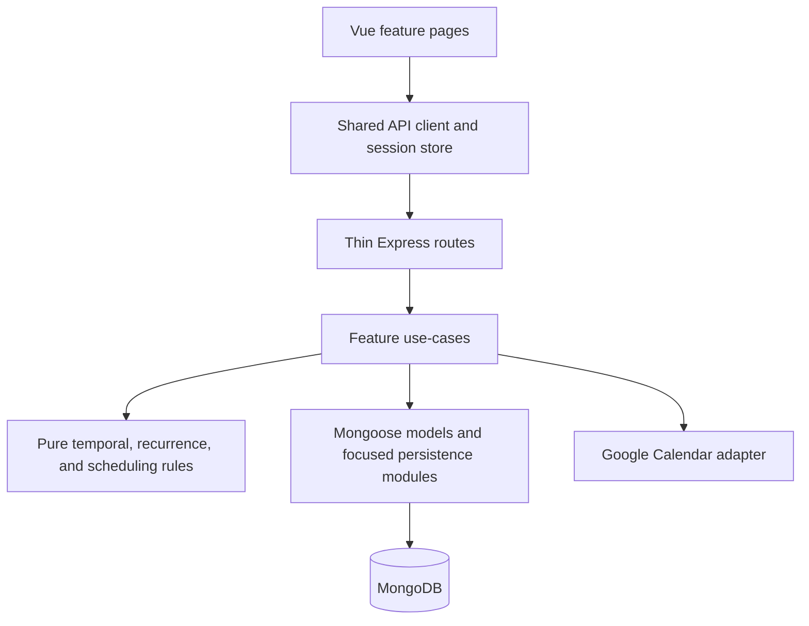

# Plan and characterize the AutoTaskCalendar refactor

## Scope

This task implements **Phase 0 only**: capture the architecture decisions, document the staged refactor, remove broken documentation references, and add only the characterization coverage needed to make later phases safe.

It does **not** implement the security, database, backend, frontend, or delivery refactors. Each later phase will have its own detailed plan in `docs/` and must be approved separately.

## Audit verdict

AutoTaskCalendar should remain a **single-deployable modular monolith**. A rewrite, microservice split, or immediate database migration would add more risk than value.

Foundations worth preserving:

- Per-instance ports and databases make local and agent development unusually reproducible (`instance.js`, `scripts/db.js`, `scripts/dev.js`, `scripts/test.js`).
- Playwright protects cross-tenant access, task lifecycle, recurrence identity, scheduler invariants, timezone/DST behavior, Compass, Calendar, and Weekly Plan.
- Civil dates, instants, wall times, and IANA timezones are handled deliberately in `utils/temporal.js`.
- Recurring series have an explicit template/occurrence model and completed-history semantics.
- Compass is already close to the desired thin-route/service boundary.
- The domain manuals are practical and useful.

The main architectural problem is **boundary leakage and insufficient enforcement**:

- Routes perform use-case and validation work.
- Mongoose schemas enforce few invariants.
- Multi-document projections are rebuilt non-atomically.
- Authentication and HTTP ownership are split across frontend files.
- Large Vue views own transport, orchestration, derivation, rendering, and errors together.
- Production startup, logging, health checks, and static gates are weaker than the local workflow.

## Confirmed findings to carry into the phase plans

### Security and correctness

1. Google OAuth uses the user's raw ObjectId as `state`, and the unauthenticated callback trusts it without a nonce, session binding, signature, expiry, or one-time use (`routes/events.js:163-220`).
2. Google access and refresh tokens are plaintext user fields, while provider error details are logged ad hoc (`models/index.js:38-39`; `routes/events.js:224-227`; `controllers/eventController.js:149-153`).
3. Authentication is duplicated across Passport sessions and a 28-day JWT stored in `localStorage` (`app.js:48-71`; `routes/auth.js:31-62`; `webinterface/src/store.js:4-74`). The Axios interceptor can leave requests permanently pending and assumes every error has a response (`webinterface/src/App.vue:70-93`). Logout leaves stale in-memory user data (`webinterface/src/store.js:24-28`).
4. `GET /api/user/:username` does not require the path username to match the authenticated identity (`routes/auth.js:72-94`).
5. Login and registration have no rate limiting, and server-side registration validation is minimal (`routes/auth.js:35-70`, `101-133`).
6. Recurrence expansion and scheduling use non-atomic read/delete/insert or delete/rebuild sequences (`controllers/recurrence.js:391-545`; `controllers/scheduling.js:597-679`). The occurrence identity index is not unique (`models/index.js:151-153`).
7. Task duration, chunk duration, priority, and chunk completion are not strictly validated by the API or schema (`routes/tasks.js:87-93`, `138-153`, `245-282`, `385-408`; `models/index.js:71-97`).
8. Deleting a task or series does not remove its generated task events or pull its ID from other tasks' dependencies (`routes/tasks.js:308-347`).
9. Google sync can return `{success:true}` after the controller absorbed a provider failure, and its 401 retry is recursive and unbounded (`controllers/eventController.js:157-255`; `routes/events.js:268-305`).
10. Express listens before awaiting MongoDB and has no readiness endpoint or centralized async error boundary (`app.js:41-43`, `84-108`).

### Maintainability and data integrity

1. `routes/tasks.js` is a 500+ line application service containing validation, authorization, dependency traversal, recurrence transitions, CRUD, completion, follow-up, and scheduling triggers (`routes/tasks.js:15-537`).
2. `controllers/recurrence.js` combines validation, normalization, presentation, pure generation, legacy compatibility, and persistence (`controllers/recurrence.js:40-545`). `controllers/taskController.js` mixes query shaping, completion, legacy cloning, and a scheduler re-export (`controllers/taskController.js:13-135`).
3. Schema constraints are sparse, update validation is inconsistent, and referential/cascade rules live only in selected code paths (`models/index.js:25-169`; `routes/tasks.js:278-282`).
4. Event hot paths have no indexes, and common task, scheduler, and archive queries are not fully covered by compound indexes (`models/index.js:151-169`; `controllers/scheduling.js:511-562`; `routes/events.js:106-125`; `controllers/compassController.js:300-377`).
5. Calendar synchronization does not persist the source calendar as part of provider-event identity (`controllers/eventController.js:177-223`).
6. Legacy `repeat` remains a live fallback after promotion (`controllers/recurrence.js:145-179`, `421-425`; `routes/tasks.js:264-299`). The future data-integrity phase will migrate any remaining values and then remove `repeat`, its compatibility request fields, fallback code, tests, seed data, and documentation completely.
7. Scheduler selection relies on implicit array order and nullable `dueDate` coercion; progress detection only observes task-count changes (`controllers/scheduling.js:202-258`, `466-490`, `540-577`).
8. Compass cascade, follow-up creation, completion cleanup, and series lifecycle writes span collections without atomicity (`controllers/compassController.js:197-239`; `routes/tasks.js:463-517`; `controllers/taskController.js:79-127`).
9. Login-time migration is pragmatic, but there is no general versioned migration and index deployment mechanism (`routes/auth.js:51-55`; `utils/temporalMigration.js:60-130`).

### Frontend architecture and UX

1. HTTP/auth ownership is split between global Axios defaults, Vuex, `App.vue`, and router guards (`webinterface/src/main.js:16-23`; `store.js:4-82`; `App.vue:70-93`; `router/index.js:83-120`).
2. Every view knows endpoint strings and the `{success:false}` contract; paths are inconsistently absolute or relative (`Calendar.vue:221-499`; `Compass.vue:262-392`; `User.vue:201-235`; `WeeklyPlan.vue:516-770`).
3. `Calendar.vue` combines DayPilot integration, task/event CRUD, Compass loading, task grouping, follow-ups, timezone adapters, and direct DOM work. Its initial requests are not awaited and its five-second interval is never cleared (`Calendar.vue:178-695`).
4. `WeeklyPlan.vue` and `Compass.vue` are page-level mini-apps, although Weekly Plan already demonstrates good loading, error, and request-race patterns.
5. Head management mixes `@vueuse/head` with legacy `metaInfo`; the active global description refers to GitHub issues (`App.vue:39-60`, `95-134`).
6. Login/Register lack proper form semantics, labels, busy state, and accessible error announcements (`Login.vue:1-85`; `Register.vue:1-150`).
7. Global Bootstrap overrides and repeated feature CSS make visual changes unnecessarily difficult (`App.vue:139-417` and large view style blocks).

### Delivery and operations

1. The existing CI trigger policy is intentional and will remain unchanged. Failure diagnostics and static gates may be improved in the later delivery phase without adding pull-request triggers.
2. There is no root lint, format, validation, or type-check gate. Frontend lint disables unused-variable checking (`package.json:22-28`; `webinterface/.eslintrc.js:14-19`).
3. CI uses `npm install`, manifests do not pin Node/npm, and `nodemon` is a runtime dependency (`package.json:5-32`; `.github/workflows/main_autotaskcalendar.yml:30-44`).
4. The deployment artifact copies all of `node_modules`, has no smoke test, and application logs are unstructured (`.github/workflows/main_autotaskcalendar.yml:54-114`).
5. Several dependencies appear unused: root Axios, `@google-cloud/local-auth`, `connect-ensure-login`, `es6-promise`, frontend `force-graph`, and `vue-debounce` beyond plugin installation. These must be verified before removal.
6. Active project guidance and manuals refer to a missing `docs/DATE_AND_TIME.md`. Those references should be removed; this task will not create that file.

## Decisions to record

The Phase 0 documentation must make these decisions explicit:

1. **Modular monolith:** keep one web application, one API process, and one primary database. Do not introduce microservices, an event bus, or a distributed scheduler.
2. **Incremental delivery:** every later phase is separately approved, implemented, verified, and deployable. Do not combine phases into one large rewrite.
3. **MongoDB for now:** harden the existing store before considering migration. The data-integrity plan must contain a clear MongoDB-versus-PostgreSQL decision gate based on transaction support, measured query behavior, reporting requirements, and integrity complexity.
4. **Complete legacy removal:** migrate remaining legacy recurrence data and remove `repeat` entirely during the data-integrity phase. Do not retain a permanent compatibility fallback.
5. **Preserve temporal behavior:** do not replace date/time libraries during structural work. Existing civil-date, instant, wall-time, timezone, DST, and all-day-event behavior remains protected by tests and the focused existing manuals.
6. **Authentication target:** the security phase should converge on one server-side, secure-cookie session lifecycle rather than retaining both browser-readable JWTs and Passport sessions.
7. **No framework rewrite:** do not require wholesale TypeScript, Composition API, Pinia, Vite, or visual redesign as a prerequisite for better boundaries.
8. **CI triggers unchanged:** later CI improvements must retain the current push/manual trigger policy unless the user separately requests a change.

## Phase 0 deliverables

### 1. Add a refactor overview

Create `docs/REFACTOR_OVERVIEW.md` as the short index for this program. It must include:

- the audit verdict and strengths to preserve;
- the target modular-monolith diagram;
- the decisions above;
- phase order, dependencies, and approval gates;
- explicit non-goals;
- links to each phase plan;
- a coverage matrix mapping preserved high-risk behavior to existing tests;
- a concise risk register for security, data migration, scheduling, recurrence, and frontend transport changes.

Target architecture:

### 2. Write separate implementation plans

Create these documents:

- `docs/REFACTOR_PHASE_1.md` — security, authentication, OAuth, HTTP errors, startup, readiness, and logging.
- `docs/REFACTOR_PHASE_2.md` — data validation, indexes, migrations, total legacy `repeat` removal, concurrency, transactions, recurrence materialization, and scheduling projection safety.
- `docs/REFACTOR_PHASE_3.md` — backend feature/use-case modularization and thin routes.
- `docs/REFACTOR_PHASE_4.md` — shared frontend API/session foundation and feature-page decomposition.
- `docs/REFACTOR_PHASE_5.md` — linting, dependency cleanup, reproducible install/build, existing-CI diagnostics, production artifact, smoke checks, and optional isolated build-tool evaluation.

Each phase plan must be an end-to-end implementation manual containing:

- purpose and user/system value;
- prerequisites and decisions already fixed;
- exact in-scope and out-of-scope work;
- requirements with stable IDs local to that phase;
- affected files and proposed boundaries;
- data/API compatibility and migration strategy;
- focused tests to add before each behavior change;
- rollout, observability, backup, rollback, and failure handling;
- measurable acceptance criteria;
- unresolved questions that truly require user or deployment information.

The documents must not claim that future work has shipped.

### 3. Characterize preserved behavior

Inventory the existing Playwright coverage before adding tests. Add only focused, passing characterization specs for high-risk behavior that:

- must remain unchanged through future phases; and
- is not already protected at the narrowest useful layer.

Prioritize ownership boundaries, completed recurrence history, scheduler invariants, temporal/DST behavior, and Google event transformation. Do not duplicate existing specs and do not add tests that bless a known defect as desired behavior.

Known defects should receive explicit future test cases in the relevant phase plan. Do not add skipped or permanently failing tests in Phase 0.

### 4. Remove broken temporal-document references

Remove references to the nonexistent `docs/DATE_AND_TIME.md` from active project guidance and manuals, including `AGENTS.md`, `docs/RECURRING_TASKS.md`, `docs/COMPASS.md`, and `docs/SEEDING.md` where present. Keep the useful local temporal guidance already contained in those files. Do not create a replacement temporal manual in this task.

### 5. Verify the planning baseline

- Check every cited source location and existing test name while writing the plans.
- Ensure phase requirements and acceptance criteria trace back to a confirmed audit finding.
- Run only focused tests if characterization specs change.
- Run the full suite only at finalization, as required by project guidance.

## Phase 0 requirements

- **REQ-RF0-001:** The refactor program shall preserve the current single-deployable architecture while making internal boundaries explicit.
- **REQ-RF0-002:** Every confirmed audit finding shall be assigned to exactly one future implementation phase or explicitly declined.
- **REQ-RF0-003:** Every future phase shall be independently approvable, deployable, verifiable, and reversible where data changes permit.
- **REQ-RF0-004:** Future plans shall define behavior and acceptance criteria before implementation details.
- **REQ-RF0-005:** Existing high-risk behavior shall be mapped to its current verification coverage before new tests are proposed.
- **REQ-RF0-006:** Phase 0 shall not encode known defects as accepted behavior.
- **REQ-RF0-007:** The data-integrity plan shall require complete removal of the legacy `repeat` field and runtime fallback after safe migration.
- **REQ-RF0-008:** Active project documentation shall not refer readers to the missing temporal manual.
- **REQ-RF0-009:** The delivery plan shall preserve the current CI trigger policy.

## Acceptance criteria

- `docs/REFACTOR_OVERVIEW.md` clearly explains the verdict, target architecture, decisions, sequencing, risks, test coverage, and non-goals.
- Five separate phase plans exist and each is actionable without pretending the work is complete.
- Every finding in this task is routed to a phase or explicitly declined.
- Phase 2 specifies safe migration followed by complete removal of legacy `repeat` schema, request, runtime, seed, test, and documentation support.
- No active guidance/manual points to `docs/DATE_AND_TIME.md`.
- No CI pull-request trigger is proposed.
- Any new characterization test is focused, passes, and protects behavior not already covered.
- No production behavior, API contract, data model, authentication flow, scheduler, recurrence implementation, or frontend architecture is changed in Phase 0.
- The existing test suite passes at finalization.

## Explicit non-goals for this task

- No authentication or OAuth changes.
- No schema, index, data, or migration changes.
- No removal of `repeat` yet; Phase 0 writes the exact removal plan.
- No scheduler or recurrence implementation changes.
- No route/controller or Vue component moves.
- No dependency removal or build-tool migration.
- No CI trigger changes.
- No microservices, event bus, distributed scheduler, or database migration.
- No broad test expansion.
