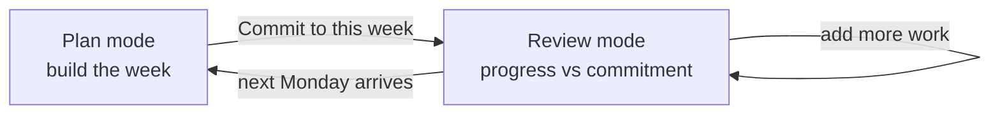

# Weekly Plan: commit to a week, then review progress against it

Two changes to `/weekly-plan`, shipped together because the second one changes what the page
is for and therefore how it should look.

1. **Replace the staggered card grid with a single-column, full-width layout.**
2. **Make the week a commitment that is recorded**, so that after committing, the same page
   becomes a progress review for what you said you would do — and rolls over on its own when
   the next Monday arrives.

---

## Part 1 — Fix the layout

### The defect

`WeeklyPlan.vue` renders roles into `repeat(auto-fit, minmax(min(100%, 520px), 1fr))` with
`align-items: start`. Above ~1100px that becomes two columns of independently-sized role
cards, so the page tears into a ragged staggered mess whose column heights depend on how many
goals each role happens to have. It also nests four visually-similar boxes (role → goal →
project → task list), each with its own border and background, which reads as clutter rather
than hierarchy.

### The replacement

**One column. Full width. Depth communicated by rhythm and colour, not by nested boxes.**

```text
┌──────────────────────────────────────────────────────────────────────────┐
│  WEEK OF                                                    ┌──────────┐ │  sticky bar
│  Mon Apr 13 – Sun Apr 19        5 tasks · 3h 30m            │  Commit  │ │
│  ▓▓▓▓▓▓▓▓▓▓▓▓░░░░░░░░░░░░░░░░░░  Mon Tue Wed Thu Fri Sat Sun└──────────┘ │
└──────────────────────────────────────────────────────────────────────────┘

 ▌ ENGINEER · 3 tasks · 2h                                    since Mar 2024
   Build and ship good software

   Ship v2 by June ─────────────────────────────────────────────────────────

     Migration plan                                    2 tasks · 1h 30m
       ● Draft migration plan                          Thu · 60m
       ● Review rollout                                Sun · 30m
       + Add a task                                                (inline)

     Perf pass                                         nothing planned
       + Add a task

 ▌ FATHER · 1 task · 45m
   ...

 ▸ Someday · 2 parked projects
 ▸ Unaligned · 1 task due this week
```

Requirements:

- **Single column**, centred, capped around `1100px` so lines stay readable on wide screens.
  No `auto-fit` multi-column grid anywhere in the page.
- **Roles are sections, not cards.** A role is a full-width band introduced by its colour bar
  (reuse `buildRoleColorMap()`), an uppercase title, its description, and its own task/time
  rollup. Separation comes from spacing and a hairline rule, not a raised panel.
- **Goals are dividers, not containers.** Render a goal as a labelled rule with its
  description beneath. Remove the nested-box treatment.
- **Projects are the only real panels**, and they are uniform: identical width, identical
  padding, identical corner radius, so a column of them reads as one rhythm. This is the
  level the user actually acts on.
- **Tasks are dense rows** — status dot, title, badges, then due day and duration right-
  aligned on a tabular baseline. They must line up vertically down the whole page.
- **The header is a sticky week bar**: range, totals, a small seven-segment strip showing how
  the week's committed minutes distribute across Mon–Sun, and the primary action.
- **Quick add is collapsed by default** to a single `+ Add a task` affordance per project that
  expands in place into the existing title/minutes/due-day form. Replace the raw date input
  with seven day chips (Mon–Sun, Friday preselected), keeping a native date input as the
  accessible control behind them. This removes the biggest source of visual noise: an
  always-open four-field form under every project.
- **Loose ends stay collapsed at the bottom**: Someday, Outside active Compass, Unaligned.
- Motion is limited to short opacity/transform transitions on disclosure and status change.
  No parallax, no card hover lift, no drag-and-drop.

Keep the existing dark palette and existing components. This is a layout and density fix, not
a new design system, and it must not touch `TaskEditor.vue`.

Responsive: the same single column at every width; below ~620px the task row meta wraps under
the title and the day chips wrap to two lines. The page must not scroll horizontally at
375px — `tests/ui/weeklyPlan.spec.js` already asserts this.

---

## Part 2 — Commit to the week, then review it

### The workflow



There is no save, no close, no archive, and no 'mark week done'. **The only thing that ends a
week is time.** When `mondayWeekBounds()` rolls to a new Monday in the user's saved timezone,
the page has no commitment for that week and is therefore back in Plan mode. Last week's
record stays in the database exactly as it was.

### Plan mode — before commitment

The page behaves as it does today: review the hierarchy, add tasks. Additionally:

- Each in-week task row carries a checkbox, checked by default. Unchecking excludes it from
  the commitment without changing the task.
- The sticky bar shows **Commit to this week · N tasks · Xh Ym**.
- Committing records the snapshot and switches the page to Review mode without a reload.

### Review mode — after commitment

The hierarchy stays. Every project that had committed work gains a progress block above its
live task list:

```text
     Migration plan                        3 of 5 done · 2h of 3h 30m
       ▓▓▓▓▓▓▓▓▓▓▓▓▓▓▓▓▓▓░░░░░░░░░░░░
       ✓ Draft migration plan              done Tue
       ✓ Review rollout                    done Wed
       ● Write the cutover runbook         due Fri · 45m
       ↷ Book the maintenance window       moved to Apr 24
       ✗ Old spike task                    removed
       ────────────────────────────────────────────────
       added since Monday
       ● Handle the rollback question      due Thu · 30m       [+ commit]
```

- **Committed items** render from the stored snapshot with a live status: `open`, `done`,
  `moved` (due date now outside the week), or `removed` (task deleted). A committed item is
  shown even when the live task no longer appears anywhere on the page. This is the point of
  storing it — the review must not quietly forget work that was dropped.
- **Added since commit** lists this week's project-linked tasks that are not in the snapshot,
  including ones already completed. `Update commitment` folds them in; the item records its
  own `addedAt`, so the review can always distinguish original commitment from later
  additions.
- The role band and sticky bar show committed-versus-done rollups instead of raw counts.
- Quick add stays available everywhere. Adding a task after committing is normal and lands
  under **Added since commit**.
- A project with no committed items and no added work shows its ordinary empty state.

### Previous-week recap

Because plans are now stored, Review mode opens with a one-line recap band when a plan exists
for the previous Monday–Sunday: **Last week: committed 7, finished 5, 2 slipped**. Selecting
it expands the same committed/status list, read-only. When no previous plan exists the band is
absent — never a zeroed-out placeholder.

Keep the existing per-project **Completed last week** disclosure unchanged; it answers a
different question (what actually got finished, whether or not it was planned).

---

## Data model

Add one collection to `models/index.js`. Do not add fields to `TaskDetail`.

```js
const WeeklyPlanItem = new Schema({
    taskRef:    { type: Schema.Types.ObjectId, ref: 'taskInfo' },
    projectRef: { type: Schema.Types.ObjectId, ref: 'projectInfo' },
    // Snapshot at commit time, so the review survives edits and deletion.
    title:      String,
    duration:   Number,
    dueDate:    Date,       // civil marker
    seriesRef:  { type: Schema.Types.ObjectId, ref: 'taskInfo', default: null },
    addedAt:    Date,       // distinguishes the original commitment from later additions
}, { _id: false });

const WeeklyPlanDetail = new Schema({
    userRef:     { type: Schema.Types.ObjectId, ref: 'userInfo', index: true },
    weekStart:   Date,      // Monday civil marker, the identity of the week
    weekEnd:     Date,      // Sunday civil marker
    timeZone:    String,    // the zone the bounds were derived in
    committedAt: Date,
    amendedAt:   Date,
    items:       [WeeklyPlanItem],
});

WeeklyPlanDetail.index({ userRef: 1, weekStart: 1 }, { unique: true });
```

Rules:

- `weekStart` is stored as a civil-date marker through the existing `parseDateOnly()` /
  `dateOnlyFromMarker()` path, exactly like `dueDate`. Serialise it with the same civil-date
  transform the other schemas use.
- **Status is never stored.** `open` / `done` / `moved` / `removed` is derived per request by
  resolving `taskRef`. This follows the Compass rule that state comes from dates, and it means
  completing a task on Calendar is immediately correct on Weekly Plan.
- One document per user per week. Committing twice amends the existing document; it never
  creates a second one and never rewrites `committedAt`.
- Deleting a task does not touch plan documents. The snapshot is the record that the work was
  promised.

---

## API

House conventions apply: mounted under `/api`, `authenticateSession`, failures are HTTP 200
with `{ success: false, log }` via `returnFailure()`.

| Method | Endpoint | Body / query | Purpose |
| --- | --- | --- | --- |
| GET | `/api/getWeeklyPlans` | `from`, `to` (inclusive civil Mondays) | Plans in a bounded range, each item resolved to a live status. |
| POST | `/api/commitWeeklyPlan` | `{ weekStart, taskIds }` | Create or amend the commitment for one week. |

Detail:

- `getWeeklyPlans` requires both bounds and rejects a range wider than 8 weeks, matching how
  `getProjectCompletions` is deliberately bounded. The page asks for the previous and current
  Monday in one call.
- Status resolution is a single `find({ _id: { $in: taskIds }, userRef })` per request. For
  each item return `status`, plus the live `completedDate` and `dueDate` when they exist.
  `moved` means the live task's civil due date is outside `[weekStart, weekEnd]`; a series
  occurrence uses its occurrence date, matching `weeklyPlanDate()` on the client.
- `commitWeeklyPlan` accepts only the **current** week's `weekStart` for the caller's saved
  timezone. Committing a past or future week is refused. This keeps the feature honestly
  time-based and removes any need for week navigation.
- Every `taskId` must belong to the caller, be incomplete or completed-this-week, and be due
  inside the week. Anything else is rejected with a clear `log`. Reuse the ownership pattern
  in `compassController.findOwned()` rather than inventing a new one.
- Omitting `taskIds` snapshots every project-linked task currently due in the week.
- Both endpoints return the same shape, so the client applies one reducer for the initial
  read and for the commit response — the pattern Compass mutations already use.

Put the logic in a new `controllers/weeklyPlanController.js` and the handlers in a new
`routes/weeklyPlan.js` mounted from `app.js`. Do not extend `getCompass` or `getUserTasks`;
`docs/COMPASS.md` explicitly forbids growing that payload with rollups.

---

## Client notes

- `WeeklyPlan.vue` is already 1361 lines. Extract the project panel (`WeeklyProjectCard.vue`)
  and the commitment progress block (`WeeklyCommitmentProgress.vue`) as it grows, per the
  "improve structure while changing behavior" rule in `docs/REFACTOR_OVERVIEW.md`. Do not
  reorganise the rest of the frontend.
- Page state stays local. Do not move it into the auth-focused Vuex store.
- Keep quick-task form state keyed by project id.
- The existing `visibilitychange` handler already detects a Monday rollover and refreshes.
  Extend it to refetch the plans so a tab left open over the weekend lands in Plan mode for
  the new week without a manual reload.
- A failed plan read must not present a committed week as uncommitted. Show an explicit
  inline retry, like the existing completion-history failure, and keep the hierarchy usable.
- Commit failures keep the checkbox selection intact and report `log` inline.

---

## Tests

Any behaviour change ships with a spec.

**`tests/api/weeklyPlan.spec.js`** (new):

1. Commit creates one document; committing again amends it, preserves `committedAt`, sets
   `amendedAt`, and does not duplicate items.
2. Item status resolves correctly for open, completed, moved-out-of-week, and deleted tasks.
3. A committed item whose task was deleted is still returned, as `removed`.
4. Ownership: another user's task id is rejected; another user's plan is never returned.
5. Committing a past or future `weekStart` is refused.
6. `getWeeklyPlans` validates its bounds and rejects an over-wide range.
7. Week identity is correct in a non-UTC saved timezone, including across a DST transition.

**`tests/ui/weeklyPlan.spec.js`** (extend): commit the week, assert the page switches to
Review mode with per-project progress; complete a task and assert it reads `done`; move a
task's due date out of the week via the editor and assert it reads `moved`; add a task after
committing and assert it appears under **Added since commit** and can be folded in.

The existing specs must keep passing. Preserve the current `data-test` hooks (`week-range`,
`weekly-overview`, `weekly-hierarchy`, `week-tasks-*`, `quick-task-*`, `quick-status-*`,
`completed-last-week-*`, `someday-projects`, `unaligned-tasks`, `outside-compass-tasks`,
`[data-project-id]`). Where a spec currently selects on presentational classes that the
redesign removes (`.role-card`, `.project-total`, `.other-tasks summary`), convert those
assertions to `data-test` hooks rather than preserving dead CSS.

Add the commitment records to `seed/dataset.js` so the seeded account demonstrates a
committed current week and a completed previous week, and document them in `docs/SEEDING.md`.

Iterate with `npm test -- --project=ui tests/ui/weeklyPlan.spec.js` and
`npm test -- tests/api/weeklyPlan.spec.js`; run the full `npm test` before finalising.

---

## Documentation

- Rewrite `docs/WEEKLY_PLAN.md`. It currently opens by calling the page "deliberately a
  **stateless lens**" with "no weekly-plan collection" and lists "mark planning complete" as
  a non-goal — all three become false. It must describe the commit workflow, the two page
  modes, the time-based rollover, the new model and endpoints, and the derived status table.
- Update `docs/COMPASS.md`: the **On the Weekly Plan page** section and the sentence in
  **What the API deliberately does not do** about Weekly Plan being a pure lens.
- Keep `AGENTS.md`'s one-line index entry accurate.
- Historical `tasks/*-done--*.md` files are records; leave them alone.

---

## Non-goals

- No week navigation, editable past plans, or plan deletion. Weeks are written once, amended
  during their own week, and then read-only forever.
- No 'close the week', 'archive', or completion nag. Time is the only transition.
- No scheduler change. Committing does not reschedule, reprioritise, or reserve capacity.
- No new task lifecycle field, and no `weeklyPlanRef` on `TaskDetail`.
- No notifications, streaks, or scoring.
- No redesign of `TaskEditor.vue`, Calendar, or Compass.
